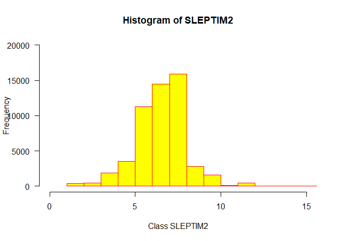
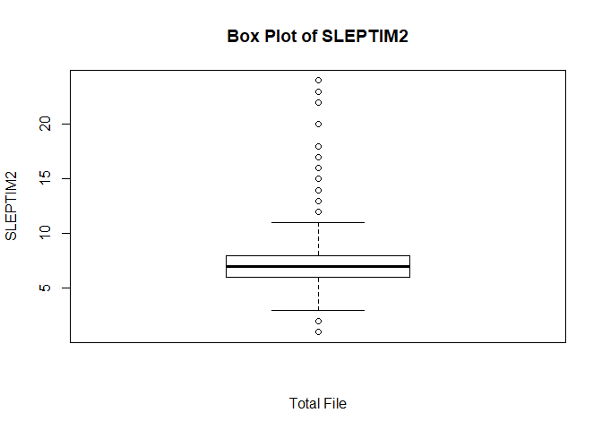
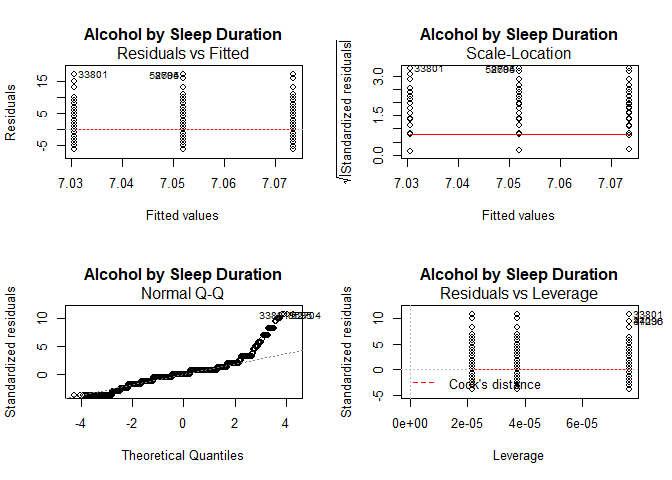
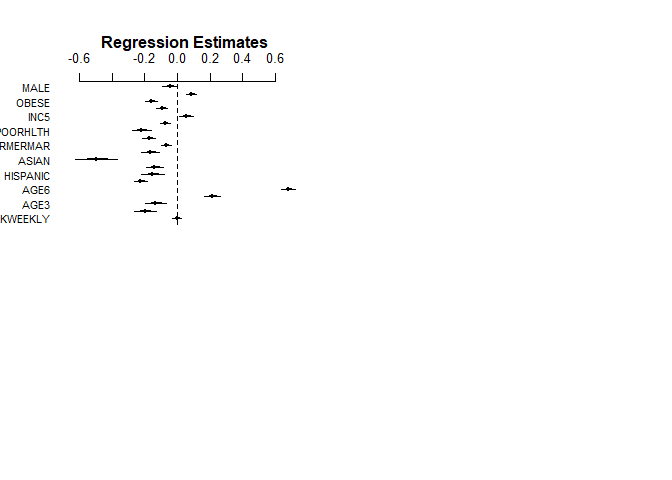
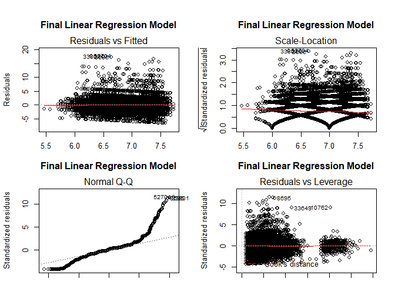
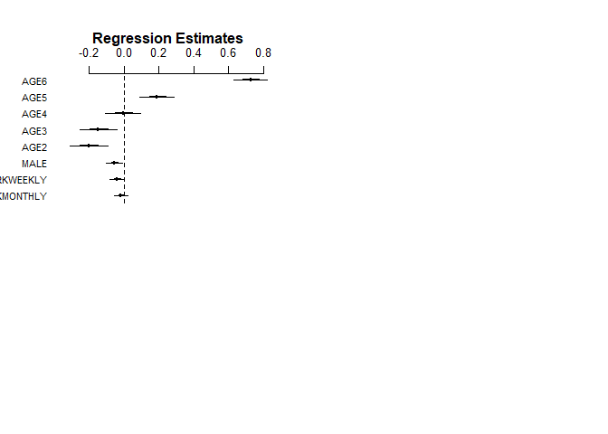
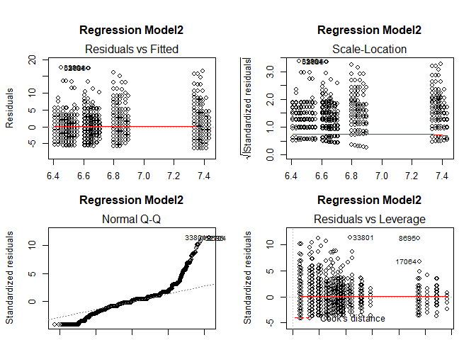

Descriptive Analysis of BRFSS Data - 2018 Veteran Data
================
Paul G. Smith
10/25/2019

## Descriptive Analysis

Overview goes here

### Step 1: Data Preparation

Load the “Foreign” library with tools needed to import the SAS version
of the BRFSS dataset from the CDC. Then look at the variable names
(colnames).

``` r
# Read in the inital downloaded BRFSS dataset in SAS XPT format
source("100_read in BRFSS XPT.R", echo = TRUE)
```

    ## 
    ## > library(foreign)
    ## 
    ## > BRFSS_a <- read.xport("./data/LLCP2018.xpt")
    ## 
    ## > colnames(BRFSS_a)
    ##   [1] "X_STATE"   "FMONTH"    "IDATE"     "IMONTH"    "IDAY"     
    ##   [6] "IYEAR"     "DISPCODE"  "SEQNO"     "X_PSU"     "CTELENM1" 
    ##  [11] "PVTRESD1"  "COLGHOUS"  "STATERE1"  "CELLFON4"  "LADULT"   
    ##  [16] "NUMADULT"  "NUMMEN"    "NUMWOMEN"  "SAFETIME"  "CTELNUM1" 
    ##  [21] "CELLFON5"  "CADULT"    "PVTRESD3"  "CCLGHOUS"  "CSTATE1"  
    ##  [26] "LANDLINE"  "HHADULT"   "GENHLTH"   "PHYSHLTH"  "MENTHLTH" 
    ##  [31] "POORHLTH"  "HLTHPLN1"  "PERSDOC2"  "MEDCOST"   "CHECKUP1" 
    ##  [36] "EXERANY2"  "SLEPTIM1"  "CVDINFR4"  "CVDCRHD4"  "CVDSTRK3" 
    ##  [41] "ASTHMA3"   "ASTHNOW"   "CHCSCNCR"  "CHCOCNCR"  "CHCCOPD1" 
    ##  [46] "HAVARTH3"  "ADDEPEV2"  "CHCKDNY1"  "DIABETE3"  "DIABAGE2" 
    ##  [51] "LASTDEN4"  "RMVTETH4"  "SEX1"      "MARITAL"   "EDUCA"    
    ##  [56] "RENTHOM1"  "NUMHHOL3"  "NUMPHON3"  "CPDEMO1B"  "VETERAN3" 
    ##  [61] "EMPLOY1"   "CHILDREN"  "INCOME2"   "WEIGHT2"   "HEIGHT3"  
    ##  [66] "PREGNANT"  "DEAF"      "BLIND"     "DECIDE"    "DIFFWALK" 
    ##  [71] "DIFFDRES"  "DIFFALON"  "SMOKE100"  "SMOKDAY2"  "STOPSMK2" 
    ##  [76] "LASTSMK2"  "USENOW3"   "ALCDAY5"   "AVEDRNK2"  "DRNK3GE5" 
    ##  [81] "MAXDRNKS"  "FLUSHOT6"  "FLSHTMY2"  "IMFVPLAC"  "PNEUVAC4" 
    ##  [86] "FALL12MN"  "FALLINJ3"  "SEATBELT"  "DRNKDRI2"  "HADMAM"   
    ##  [91] "HOWLONG"   "HADPAP2"   "LASTPAP2"  "HPVTEST"   "HPLSTTST" 
    ##  [96] "HADHYST2"  "PCPSAAD3"  "PCPSADI1"  "PCPSARE1"  "PSATEST1" 
    ## [101] "PSATIME"   "PCPSARS1"  "BLDSTOOL"  "LSTBLDS3"  "HADSIGM3" 
    ## [106] "HADSGCO1"  "LASTSIG3"  "HIVTST6"   "HIVTSTD3"  "HIVRISK5" 
    ## [111] "PDIABTST"  "PREDIAB1"  "INSULIN"   "BLDSUGAR"  "FEETCHK3" 
    ## [116] "DOCTDIAB"  "CHKHEMO3"  "FEETCHK"   "EYEEXAM1"  "DIABEYE"  
    ## [121] "DIABEDU"   "MEDICARE"  "HLTHCVR1"  "DELAYME1"  "DLYOTHER" 
    ## [126] "NOCOV121"  "LSTCOVRG"  "DRVISITS"  "MEDSCOS1"  "CARERCVD" 
    ## [131] "MEDBILL1"  "CIMEMLOS"  "CDHOUSE"   "CDASSIST"  "CDHELP"   
    ## [136] "CDSOCIAL"  "CDDISCUS"  "CAREGIV1"  "CRGVREL2"  "CRGVLNG1" 
    ## [141] "CRGVHRS1"  "CRGVPRB2"  "CRGVPERS"  "CRGVHOUS"  "CRGVMST3" 
    ## [146] "CRGVEXPT"  "ECIGARET"  "ECIGNOW"   "MARIJAN1"  "USEMRJN2" 
    ## [151] "RSNMRJN1"  "ADSLEEP"   "SLEPDAY1"  "SLEPSNO2"  "SLEPBRTH" 
    ## [156] "ADPLEAS1"  "ADDOWN1"   "FEELNERV"  "STOPWORY"  "COPDCOGH" 
    ## [161] "COPDFLEM"  "COPDBRTH"  "COPDBTST"  "COPDSMOK"  "INDORTAN" 
    ## [166] "NUMBURN3"  "SUNPRTCT"  "WKDAYOUT"  "WKENDOUT"  "LCSFIRST" 
    ## [171] "LCSLAST"   "LCSNUMCG"  "LCSCTSCN"  "CNCRDIFF"  "CNCRAGE"  
    ## [176] "CNCRTYP1"  "CSRVTRT2"  "CSRVDOC1"  "CSRVSUM"   "CSRVRTRN" 
    ## [181] "CSRVINST"  "CSRVINSR"  "CSRVDEIN"  "CSRVCLIN"  "CSRVPAIN" 
    ## [186] "CSRVCTL1"  "PCPSADE1"  "PCDMDEC1"  "PROFEXAM"  "LENGEXAM" 
    ## [191] "HPVADVC2"  "HPVADSHT"  "TETANUS1"  "SHINGLE2"  "SOMALE"   
    ## [196] "SOFEMALE"  "TRNSGNDR"  "RCSGENDR"  "RCSRLTN2"  "CASTHDX2" 
    ## [201] "CASTHNO2"  "QSTVER"    "QSTLANG"   "X_METSTAT" "X_URBSTAT"
    ## [206] "MSCODE"    "X_STSTR"   "X_STRWT"   "X_RAWRAKE" "X_WT2RAKE"
    ## [211] "X_IMPRACE" "X_CHISPNC" "X_CRACE1"  "X_CPRACE"  "X_CLLCPWT"
    ## [216] "X_DUALUSE" "X_DUALCOR" "X_LLCPWT2" "X_LLCPWT"  "X_RFHLTH" 
    ## [221] "X_PHYS14D" "X_MENT14D" "X_HCVU651" "X_TOTINDA" "X_MICHD"  
    ## [226] "X_LTASTH1" "X_CASTHM1" "X_ASTHMS1" "X_DRDXAR1" "X_EXTETH3"
    ## [231] "X_ALTETH3" "X_DENVST3" "X_PRACE1"  "X_MRACE1"  "X_HISPANC"
    ## [236] "X_RACE"    "X_RACEG21" "X_RACEGR3" "X_RACE_G1" "X_AGEG5YR"
    ## [241] "X_AGE65YR" "X_AGE80"   "X_AGE_G"   "HTIN4"     "HTM4"     
    ## [246] "WTKG3"     "X_BMI5"    "X_BMI5CAT" "X_RFBMI5"  "X_CHLDCNT"
    ## [251] "X_EDUCAG"  "X_INCOMG"  "X_SMOKER3" "X_RFSMOK3" "DRNKANY5" 
    ## [256] "DROCDY3_"  "X_RFBING5" "X_DRNKWEK" "X_RFDRHV6" "X_FLSHOT6"
    ## [261] "X_PNEUMO3" "X_RFSEAT2" "X_RFSEAT3" "X_DRNKDRV" "X_RFMAM21"
    ## [266] "X_MAM5022" "X_RFPAP34" "X_RFPSA22" "X_RFBLDS3" "X_COL10YR"
    ## [271] "X_HFOB3YR" "X_FS5YR"   "X_FOBTFS"  "X_CRCREC"  "X_AIDTST3"

Then select a subset of varables (17) to keep for these analyses. And
reduce the data set by elimnating cases that did not provide valid
responses to select questions. Before starting data reduction, look at
the number of records imported from the SAS file. There is data on
**437,436 cases or rows (nrow) in the initial dataset**.

Next apply exclusion to remove (1) non veterans, (2) cases with no
drinking data in ALCDAY5, (3) cases with no sleep data in SLEPTIM1, and
(4) no valid asthma data. There are **52,984 cases (rows) in the final
data set**.


``` r
# Keep data on all cases (rows) but only keep 17 variables
source("105_Keep vars.R", echo = TRUE)
```

    ## 
    ## > BRFSSVarList <- c("VETERAN3", "ALCDAY5", "SLEPTIM1", 
    ## +     "ASTHMA3", "X_AGE_G", "SMOKE100", "SMOKDAY2", "SEX1", "X_HISPANC", 
    ## +     "X_MRACE1", "M ..." ... [TRUNCATED] 
    ## 
    ## > BRFSS_b <- BRFSS_a[BRFSSVarList]
    ## 
    ## > colnames(BRFSS_b)
    ##  [1] "VETERAN3"  "ALCDAY5"   "SLEPTIM1"  "ASTHMA3"   "X_AGE_G"  
    ##  [6] "SMOKE100"  "SMOKDAY2"  "SEX1"      "X_HISPANC" "X_MRACE1" 
    ## [11] "MARITAL"   "GENHLTH"   "HLTHPLN1"  "EDUCA"     "INCOME2"  
    ## [16] "X_BMI5CAT" "EXERANY2" 
    ## 
    ## > nrow(BRFSS_b)
    ## [1] 437436

``` r
source("110_Apply exclusions.R", echo = TRUE)
```

    ## 
    ## > nrow(BRFSS_b)
    ## [1] 437436
    ## 
    ## > BRFSS_c <- subset(BRFSS_b, VETERAN3 == 1)
    ## 
    ## > nrow(BRFSS_c)
    ## [1] 56054
    ## 
    ## > BRFSS_d <- subset(BRFSS_c, ALCDAY5 < 777 | ALCDAY5 == 
    ## +     888)
    ## 
    ## > nrow(BRFSS_d)
    ## [1] 53662
    ## 
    ## > BRFSS_e <- subset(BRFSS_d, SLEPTIM1 < 77)
    ## 
    ## > nrow(BRFSS_e)
    ## [1] 53144
    ## 
    ## > BRFSS_f <- subset(BRFSS_e, ASTHMA3 < 7)
    ## 
    ## > nrow(BRFSS_f)
    ## [1] 52984

Next, create new variables from the base variables for the alcohol
variable (ALCGRP: No drinks reported, monthly drinker, weekly drinker),
and outcome (SLEPTIM2: recoded SLEPTIM1). These changes are documented
in the updated data dictionary found [**download data dictionary here
\[XLSX - 33KB\]**](documentation/Data_Dictionary_with_Confounders.xlsx)

``` r
source("115_Make alcohol variables.R", echo = TRUE)
```

    ## 
    ## > BRFSS_g <- BRFSS_f
    ## 
    ## > BRFSS_g$ALCGRP <- 9
    ## 
    ## > BRFSS_g$ALCGRP[BRFSS_g$ALCDAY5 < 200] <- 3
    ## 
    ## > BRFSS_g$ALCGRP[BRFSS_g$ALCDAY5 >= 200 & BRFSS_g$ALCDAY5 < 
    ## +     777] <- 2
    ## 
    ## > BRFSS_g$ALCGRP[BRFSS_g$ALCDAY5 == 888] <- 1
    ## 
    ## > table(BRFSS_g$ALCGRP, BRFSS_g$ALCDAY5)
    ##    
    ##       101   102   103   104   105   106   107   201   202   203   204
    ##   1     0     0     0     0     0     0     0     0     0     0     0
    ##   2     0     0     0     0     0     0     0  3996  2962  1622  1453
    ##   3  2373  1908  1359   668   660   236  1631     0     0     0     0
    ##    
    ##       205   206   207   208   209   210   211   212   213   214   215
    ##   1     0     0     0     0     0     0     0     0     0     0     0
    ##   2  1330   567   345   407    27  1070     6   231    12    83   961
    ##   3     0     0     0     0     0     0     0     0     0     0     0
    ##    
    ##       216   217   218   219   220   221   222   223   224   225   226
    ##   1     0     0     0     0     0     0     0     0     0     0     0
    ##   2    37    17    42     3   996    29    24    13    45   531    23
    ##   3     0     0     0     0     0     0     0     0     0     0     0
    ##    
    ##       227   228   229   230   888
    ##   1     0     0     0     0 23418
    ##   2    49   166    57  3627     0
    ##   3     0     0     0     0     0
    ## 
    ## > BRFSS_g$DRKMONTHLY <- 0
    ## 
    ## > BRFSS_g$DRKMONTHLY[BRFSS_g$ALCGRP == 2] <- 1
    ## 
    ## > table(BRFSS_g$ALCGRP, BRFSS_g$DRKMONTHLY)
    ##    
    ##         0     1
    ##   1 23418     0
    ##   2     0 20731
    ##   3  8835     0
    ## 
    ## > BRFSS_g$DRKWEEKLY <- 0
    ## 
    ## > BRFSS_g$DRKWEEKLY[BRFSS_g$ALCGRP == 1] <- 1
    ## 
    ## > table(BRFSS_g$ALCGRP, BRFSS_g$DRKWEEKLY)
    ##    
    ##         0     1
    ##   1     0 23418
    ##   2 20731     0
    ##   3  8835     0

``` r
source("120_Make outcome variables.R", echo = TRUE)
```

    ## 
    ## > BRFSS_h <- BRFSS_g
    ## 
    ## > BRFSS_h$SLEPTIM2 <- NA
    ## 
    ## > BRFSS_h$SLEPTIM2[!is.na(BRFSS_h$SLEPTIM1) & BRFSS_h$SLEPTIM1 != 
    ## +     77 & BRFSS_h$SLEPTIM1 != 99] <- BRFSS_h$SLEPTIM1
    ## 
    ## > table(BRFSS_h$SLEPTIM1, BRFSS_h$SLEPTIM2)
    ##     
    ##          1     2     3     4     5     6     7     8     9    10    11
    ##   1    144     0     0     0     0     0     0     0     0     0     0
    ##   2      0   226     0     0     0     0     0     0     0     0     0
    ##   3      0     0   477     0     0     0     0     0     0     0     0
    ##   4      0     0     0  1843     0     0     0     0     0     0     0
    ##   5      0     0     0     0  3518     0     0     0     0     0     0
    ##   6      0     0     0     0     0 11260     0     0     0     0     0
    ##   7      0     0     0     0     0     0 14470     0     0     0     0
    ##   8      0     0     0     0     0     0     0 15904     0     0     0
    ##   9      0     0     0     0     0     0     0     0  2804     0     0
    ##   10     0     0     0     0     0     0     0     0     0  1566     0
    ##   11     0     0     0     0     0     0     0     0     0     0   104
    ##   12     0     0     0     0     0     0     0     0     0     0     0
    ##   13     0     0     0     0     0     0     0     0     0     0     0
    ##   14     0     0     0     0     0     0     0     0     0     0     0
    ##   15     0     0     0     0     0     0     0     0     0     0     0
    ##   16     0     0     0     0     0     0     0     0     0     0     0
    ##   17     0     0     0     0     0     0     0     0     0     0     0
    ##   18     0     0     0     0     0     0     0     0     0     0     0
    ##   20     0     0     0     0     0     0     0     0     0     0     0
    ##   22     0     0     0     0     0     0     0     0     0     0     0
    ##   23     0     0     0     0     0     0     0     0     0     0     0
    ##   24     0     0     0     0     0     0     0     0     0     0     0
    ##     
    ##         12    13    14    15    16    17    18    20    22    23    24
    ##   1      0     0     0     0     0     0     0     0     0     0     0
    ##   2      0     0     0     0     0     0     0     0     0     0     0
    ##   3      0     0     0     0     0     0     0     0     0     0     0
    ##   4      0     0     0     0     0     0     0     0     0     0     0
    ##   5      0     0     0     0     0     0     0     0     0     0     0
    ##   6      0     0     0     0     0     0     0     0     0     0     0
    ##   7      0     0     0     0     0     0     0     0     0     0     0
    ##   8      0     0     0     0     0     0     0     0     0     0     0
    ##   9      0     0     0     0     0     0     0     0     0     0     0
    ##   10     0     0     0     0     0     0     0     0     0     0     0
    ##   11     0     0     0     0     0     0     0     0     0     0     0
    ##   12   467     0     0     0     0     0     0     0     0     0     0
    ##   13     0    18     0     0     0     0     0     0     0     0     0
    ##   14     0     0    39     0     0     0     0     0     0     0     0
    ##   15     0     0     0    41     0     0     0     0     0     0     0
    ##   16     0     0     0     0    41     0     0     0     0     0     0
    ##   17     0     0     0     0     0     7     0     0     0     0     0
    ##   18     0     0     0     0     0     0    29     0     0     0     0
    ##   20     0     0     0     0     0     0     0    16     0     0     0
    ##   22     0     0     0     0     0     0     0     0     2     0     0
    ##   23     0     0     0     0     0     0     0     0     0     4     0
    ##   24     0     0     0     0     0     0     0     0     0     0     4
    ## 
    ## > BRFSS_h$ASTHMA4 <- 9
    ## 
    ## > BRFSS_h$ASTHMA4[BRFSS_h$ASTHMA3 == 1] <- 1
    ## 
    ## > BRFSS_h$ASTHMA4[BRFSS_h$ASTHMA3 == 2] <- 0
    ## 
    ## > table(BRFSS_h$ASTHMA3, BRFSS_h$ASTHMA4)
    ##    
    ##         0     1
    ##   1     0  5298
    ##   2 47686     0

Create the categorical variables, that will be used to support
regression analyses once descriptive analysis is complete.

``` r
source("125_Make categorical variables.R", echo = TRUE)
```

    ## 
    ## > BRFSS_i <- BRFSS_h
    ## 
    ## > BRFSS_i$AGE2 <- 0
    ## 
    ## > BRFSS_i$AGE3 <- 0
    ## 
    ## > BRFSS_i$AGE4 <- 0
    ## 
    ## > BRFSS_i$AGE5 <- 0
    ## 
    ## > BRFSS_i$AGE6 <- 0
    ## 
    ## > BRFSS_i$AGE2[BRFSS_i$X_AGE_G == 2] <- 1
    ## 
    ## > table(BRFSS_i$X_AGE_G, BRFSS_i$AGE2)
    ##    
    ##         0     1
    ##   1  1090     0
    ##   2     0  2947
    ##   3  3560     0
    ##   4  6152     0
    ##   5  8783     0
    ##   6 30452     0
    ## 
    ## > BRFSS_i$AGE3[BRFSS_i$X_AGE_G == 3] <- 1
    ## 
    ## > table(BRFSS_i$X_AGE_G, BRFSS_i$AGE3)
    ##    
    ##         0     1
    ##   1  1090     0
    ##   2  2947     0
    ##   3     0  3560
    ##   4  6152     0
    ##   5  8783     0
    ##   6 30452     0
    ## 
    ## > BRFSS_i$AGE4[BRFSS_i$X_AGE_G == 4] <- 1
    ## 
    ## > table(BRFSS_i$X_AGE_G, BRFSS_i$AGE4)
    ##    
    ##         0     1
    ##   1  1090     0
    ##   2  2947     0
    ##   3  3560     0
    ##   4     0  6152
    ##   5  8783     0
    ##   6 30452     0
    ## 
    ## > BRFSS_i$AGE5[BRFSS_i$X_AGE_G == 5] <- 1
    ## 
    ## > table(BRFSS_i$X_AGE_G, BRFSS_i$AGE5)
    ##    
    ##         0     1
    ##   1  1090     0
    ##   2  2947     0
    ##   3  3560     0
    ##   4  6152     0
    ##   5     0  8783
    ##   6 30452     0
    ## 
    ## > BRFSS_i$AGE6[BRFSS_i$X_AGE_G == 6] <- 1
    ## 
    ## > table(BRFSS_i$X_AGE_G, BRFSS_i$AGE6)
    ##    
    ##         0     1
    ##   1  1090     0
    ##   2  2947     0
    ##   3  3560     0
    ##   4  6152     0
    ##   5  8783     0
    ##   6     0 30452
    ## 
    ## > BRFSS_i$NEVERSMK <- 0
    ## 
    ## > BRFSS_i$NEVERSMK[BRFSS_i$SMOKE100 == 2] <- 1
    ## 
    ## > table(BRFSS_i$SMOKE100, BRFSS_i$NEVERSMK)
    ##    
    ##         0     1
    ##   1 31298     0
    ##   2     0 21414
    ##   7   242     0
    ##   9    30     0
    ## 
    ## > BRFSS_i$SMOKGRP <- 9
    ## 
    ## > BRFSS_i$SMOKGRP[BRFSS_i$SMOKDAY2 == 1 | BRFSS_i$SMOKDAY2 == 
    ## +     2] <- 1
    ## 
    ## > BRFSS_i$SMOKGRP[BRFSS_i$SMOKDAY2 == 3 | BRFSS_i$NEVERSMK == 
    ## +     1] <- 2
    ## 
    ## > table(BRFSS_i$SMOKGRP, BRFSS_i$SMOKDAY2)
    ##    
    ##         1     2     3     7     9
    ##   1  5886  1968     0     0     0
    ##   2     0     0 23406     0     0
    ##   9     0     0     0    20    18
    ## 
    ## > table(BRFSS_i$SMOKGRP, BRFSS_i$SMOKE100)
    ##    
    ##         1     2     7     9
    ##   1  7854     0     0     0
    ##   2 23406 21414     0     0
    ##   9    38     0   242    30
    ## 
    ## > BRFSS_i$SMOKER <- 0
    ## 
    ## > BRFSS_i$SMOKER[BRFSS_i$SMOKGRP == 1] <- 1
    ## 
    ## > table(BRFSS_i$SMOKGRP, BRFSS_i$SMOKER)
    ##    
    ##         0     1
    ##   1     0  7854
    ##   2 44820     0
    ##   9   310     0
    ## 
    ## > BRFSS_i$SEX <- 9
    ## 
    ## > BRFSS_i$SEX[BRFSS_i$SEX1 == 1] <- 1
    ## 
    ## > BRFSS_i$SEX[BRFSS_i$SEX1 == 2] <- 2
    ## 
    ## > BRFSS_i$MALE <- 0
    ## 
    ## > BRFSS_i$MALE[BRFSS_i$SEX == 1] <- 1
    ## 
    ## > table(BRFSS_i$MALE, BRFSS_i$SEX)
    ##    
    ##         1     2     9
    ##   0     0  5075   104
    ##   1 47805     0     0
    ## 
    ## > BRFSS_i$HISPANIC <- 0
    ## 
    ## > BRFSS_i$HISPANIC[BRFSS_i$X_HISPANC == 1] <- 1
    ## 
    ## > table(BRFSS_i$HISPANIC, BRFSS_i$X_HISPANC)
    ##    
    ##         1     2     9
    ##   0     0 50162   589
    ##   1  2233     0     0
    ## 
    ## > BRFSS_i$RACEGRP <- 9
    ## 
    ## > BRFSS_i$RACEGRP[BRFSS_i$X_MRACE1 == 1] <- 1
    ## 
    ## > BRFSS_i$RACEGRP[BRFSS_i$X_MRACE1 == 2] <- 2
    ## 
    ## > BRFSS_i$RACEGRP[BRFSS_i$X_MRACE1 == 3] <- 3
    ## 
    ## > BRFSS_i$RACEGRP[BRFSS_i$X_MRACE1 == 4] <- 4
    ## 
    ## > BRFSS_i$RACEGRP[BRFSS_i$X_MRACE1 == 5] <- 5
    ## 
    ## > BRFSS_i$RACEGRP[BRFSS_i$X_MRACE1 == 6 | BRFSS_i$X_MRACE1 == 
    ## +     7] <- 6
    ## 
    ## > table(BRFSS_i$RACEGRP, BRFSS_i$X_MRACE1)
    ##    
    ##         1     2     3     4     5     6     7    77    99
    ##   1 43844     0     0     0     0     0     0     0     0
    ##   2     0  4019     0     0     0     0     0     0     0
    ##   3     0     0  1049     0     0     0     0     0     0
    ##   4     0     0     0   582     0     0     0     0     0
    ##   5     0     0     0     0   320     0     0     0     0
    ##   6     0     0     0     0     0   858  1304     0     0
    ##   9     0     0     0     0     0     0     0   195   813
    ## 
    ## > BRFSS_i$BLACK <- 0
    ## 
    ## > BRFSS_i$ASIAN <- 0
    ## 
    ## > BRFSS_i$OTHRACE <- 0
    ## 
    ## > BRFSS_i$BLACK[BRFSS_i$RACEGRP == 2] <- 1
    ## 
    ## > table(BRFSS_i$RACEGRP, BRFSS_i$BLACK)
    ##    
    ##         0     1
    ##   1 43844     0
    ##   2     0  4019
    ##   3  1049     0
    ##   4   582     0
    ##   5   320     0
    ##   6  2162     0
    ##   9  1008     0
    ## 
    ## > BRFSS_i$ASIAN[BRFSS_i$RACEGRP == 4] <- 1
    ## 
    ## > table(BRFSS_i$RACEGRP, BRFSS_i$ASIAN)
    ##    
    ##         0     1
    ##   1 43844     0
    ##   2  4019     0
    ##   3  1049     0
    ##   4     0   582
    ##   5   320     0
    ##   6  2162     0
    ##   9  1008     0
    ## 
    ## > BRFSS_i$OTHRACE[BRFSS_i$RACEGRP == 3 | BRFSS_i$RACEGRP == 
    ## +     5 | BRFSS_i$RACEGRP == 6 | BRFSS_i$RACEGRP == 7] <- 1
    ## 
    ## > table(BRFSS_i$RACEGRP, BRFSS_i$OTHRACE)
    ##    
    ##         0     1
    ##   1 43844     0
    ##   2  4019     0
    ##   3     0  1049
    ##   4   582     0
    ##   5     0   320
    ##   6     0  2162
    ##   9  1008     0
    ## 
    ## > BRFSS_i$MARGRP <- 9
    ## 
    ## > BRFSS_i$MARGRP[BRFSS_i$MARITAL == 1 | BRFSS_i$MARITAL == 
    ## +     5] <- 1
    ## 
    ## > BRFSS_i$MARGRP[BRFSS_i$MARITAL == 2 | BRFSS_i$MARITAL == 
    ## +     3] <- 2
    ## 
    ## > BRFSS_i$MARGRP[BRFSS_i$MARITAL == 4] <- 3
    ## 
    ## > table(BRFSS_i$MARGRP, BRFSS_i$MARITAL)
    ##    
    ##         1     2     3     4     5     6     9
    ##   1 31147     0     0     0  4929     0     0
    ##   2     0  8280  6461     0     0     0     0
    ##   3     0     0     0   941     0     0     0
    ##   9     0     0     0     0     0   984   242
    ## 
    ## > BRFSS_i$NEVERMAR <- 0
    ## 
    ## > BRFSS_i$FORMERMAR <- 0
    ## 
    ## > BRFSS_i$NEVERMAR[BRFSS_i$MARGRP == 3] <- 1
    ## 
    ## > table(BRFSS_i$MARGRP, BRFSS_i$NEVERMAR)
    ##    
    ##         0     1
    ##   1 36076     0
    ##   2 14741     0
    ##   3     0   941
    ##   9  1226     0
    ## 
    ## > BRFSS_i$FORMERMAR[BRFSS_i$MARGRP == 2] <- 1
    ## 
    ## > table(BRFSS_i$MARGRP, BRFSS_i$FORMERMAR)
    ##    
    ##         0     1
    ##   1 36076     0
    ##   2     0 14741
    ##   3   941     0
    ##   9  1226     0
    ## 
    ## > BRFSS_i$GENHLTH2 <- 9
    ## 
    ## > BRFSS_i$GENHLTH2[BRFSS_i$GENHLTH == 1] <- 1
    ## 
    ## > BRFSS_i$GENHLTH2[BRFSS_i$GENHLTH == 2] <- 2
    ## 
    ## > BRFSS_i$GENHLTH2[BRFSS_i$GENHLTH == 3] <- 3
    ## 
    ## > BRFSS_i$GENHLTH2[BRFSS_i$GENHLTH == 4] <- 4
    ## 
    ## > BRFSS_i$GENHLTH2[BRFSS_i$GENHLTH == 5] <- 5
    ## 
    ## > table(BRFSS_i$GENHLTH2, BRFSS_i$GENHLTH)
    ##    
    ##         1     2     3     4     5     7     9
    ##   1  7850     0     0     0     0     0     0
    ##   2     0 16288     0     0     0     0     0
    ##   3     0     0 17561     0     0     0     0
    ##   4     0     0     0  7943     0     0     0
    ##   5     0     0     0     0  3207     0     0
    ##   9     0     0     0     0     0    92    43
    ## 
    ## > BRFSS_i$FAIRHLTH <- 0
    ## 
    ## > BRFSS_i$POORHLTH <- 0
    ## 
    ## > BRFSS_i$FAIRHLTH[BRFSS_i$GENHLTH2 == 4] <- 1
    ## 
    ## > table(BRFSS_i$FAIRHLTH, BRFSS_i$GENHLTH2)
    ##    
    ##         1     2     3     4     5     9
    ##   0  7850 16288 17561     0  3207   135
    ##   1     0     0     0  7943     0     0
    ## 
    ## > BRFSS_i$POORHLTH[BRFSS_i$GENHLTH2 == 5] <- 1
    ## 
    ## > table(BRFSS_i$POORHLTH, BRFSS_i$GENHLTH2)
    ##    
    ##         1     2     3     4     5     9
    ##   0  7850 16288 17561  7943     0   135
    ##   1     0     0     0     0  3207     0
    ## 
    ## > BRFSS_i$HLTHPLN2 <- 9
    ## 
    ## > BRFSS_i$HLTHPLN2[BRFSS_i$HLTHPLN1 == 1] <- 1
    ## 
    ## > BRFSS_i$HLTHPLN2[BRFSS_i$HLTHPLN1 == 2] <- 2
    ## 
    ## > table(BRFSS_i$HLTHPLN1, BRFSS_i$HLTHPLN2)
    ##    
    ##         1     2     9
    ##   1 50609     0     0
    ##   2     0  2218     0
    ##   7     0     0    93
    ##   9     0     0    64
    ## 
    ## > BRFSS_i$NOPLAN <- 0
    ## 
    ## > BRFSS_i$NOPLAN[BRFSS_i$HLTHPLN2 == 2] <- 1
    ## 
    ## > table(BRFSS_i$NOPLAN, BRFSS_i$HLTHPLN2)
    ##    
    ##         1     2     9
    ##   0 50609     0   157
    ##   1     0  2218     0
    ## 
    ## > BRFSS_i$EDGROUP <- 9
    ## 
    ## > BRFSS_i$EDGROUP[BRFSS_i$EDUCA == 1 | BRFSS_i$EDUCA == 
    ## +     2 | BRFSS_i$EDUCA == 3] <- 1
    ## 
    ## > BRFSS_i$EDGROUP[BRFSS_i$EDUCA == 4] <- 2
    ## 
    ## > BRFSS_i$EDGROUP[BRFSS_i$EDUCA == 5] <- 3
    ## 
    ## > BRFSS_i$EDGROUP[BRFSS_i$EDUCA == 6] <- 4
    ## 
    ## > table(BRFSS_i$EDGROUP, BRFSS_i$EDUCA)
    ##    
    ##         1     2     3     4     5     6     9
    ##   1    24   514  1370     0     0     0     0
    ##   2     0     0     0 14025     0     0     0
    ##   3     0     0     0     0 16603     0     0
    ##   4     0     0     0     0     0 20339     0
    ##   9     0     0     0     0     0     0   109
    ## 
    ## > BRFSS_i$LOWED <- 0
    ## 
    ## > BRFSS_i$SOMECOLL <- 0
    ## 
    ## > BRFSS_i$LOWED[BRFSS_i$EDGROUP == 1 | BRFSS_i$EDGROUP == 
    ## +     2] <- 1
    ## 
    ## > table(BRFSS_i$LOWED, BRFSS_i$EDGROUP)
    ##    
    ##         1     2     3     4     9
    ##   0     0     0 16603 20339   109
    ##   1  1908 14025     0     0     0
    ## 
    ## > BRFSS_i$SOMECOLL[BRFSS_i$EDGROUP == 3] <- 1
    ## 
    ## > table(BRFSS_i$SOMECOLL, BRFSS_i$EDGROUP)
    ##    
    ##         1     2     3     4     9
    ##   0  1908 14025     0 20339   109
    ##   1     0     0 16603     0     0
    ## 
    ## > BRFSS_i$INCOME3 <- BRFSS_i$INCOME2
    ## 
    ## > BRFSS_i$INCOME3[BRFSS_i$INCOME2 >= 77] <- 9
    ## 
    ## > table(BRFSS_i$INCOME2, BRFSS_i$INCOME3)
    ##     
    ##          1     2     3     4     5     6     7     8     9
    ##   1    920     0     0     0     0     0     0     0     0
    ##   2      0  1720     0     0     0     0     0     0     0
    ##   3      0     0  2411     0     0     0     0     0     0
    ##   4      0     0     0  3776     0     0     0     0     0
    ##   5      0     0     0     0  5258     0     0     0     0
    ##   6      0     0     0     0     0  7560     0     0     0
    ##   7      0     0     0     0     0     0  8824     0     0
    ##   8      0     0     0     0     0     0     0 15935     0
    ##   77     0     0     0     0     0     0     0     0  2199
    ##   99     0     0     0     0     0     0     0     0  4377
    ## 
    ## > BRFSS_i$INC1 <- 0
    ## 
    ## > BRFSS_i$INC2 <- 0
    ## 
    ## > BRFSS_i$INC3 <- 0
    ## 
    ## > BRFSS_i$INC4 <- 0
    ## 
    ## > BRFSS_i$INC5 <- 0
    ## 
    ## > BRFSS_i$INC6 <- 0
    ## 
    ## > BRFSS_i$INC7 <- 0
    ## 
    ## > BRFSS_i$INC1[BRFSS_i$INCOME3 == 1] <- 1
    ## 
    ## > table(BRFSS_i$INC1, BRFSS_i$INCOME3)
    ##    
    ##         1     2     3     4     5     6     7     8     9
    ##   0     0  1720  2411  3776  5258  7560  8824 15935  6576
    ##   1   920     0     0     0     0     0     0     0     0
    ## 
    ## > BRFSS_i$INC2[BRFSS_i$INCOME3 == 2] <- 1
    ## 
    ## > table(BRFSS_i$INC2, BRFSS_i$INCOME3)
    ##    
    ##         1     2     3     4     5     6     7     8     9
    ##   0   920     0  2411  3776  5258  7560  8824 15935  6576
    ##   1     0  1720     0     0     0     0     0     0     0
    ## 
    ## > BRFSS_i$INC3[BRFSS_i$INCOME3 == 3] <- 1
    ## 
    ## > table(BRFSS_i$INC3, BRFSS_i$INCOME3)
    ##    
    ##         1     2     3     4     5     6     7     8     9
    ##   0   920  1720     0  3776  5258  7560  8824 15935  6576
    ##   1     0     0  2411     0     0     0     0     0     0
    ## 
    ## > BRFSS_i$INC4[BRFSS_i$INCOME3 == 4] <- 1
    ## 
    ## > table(BRFSS_i$INC4, BRFSS_i$INCOME3)
    ##    
    ##         1     2     3     4     5     6     7     8     9
    ##   0   920  1720  2411     0  5258  7560  8824 15935  6576
    ##   1     0     0     0  3776     0     0     0     0     0
    ## 
    ## > BRFSS_i$INC5[BRFSS_i$INCOME3 == 5] <- 1
    ## 
    ## > table(BRFSS_i$INC5, BRFSS_i$INCOME3)
    ##    
    ##         1     2     3     4     5     6     7     8     9
    ##   0   920  1720  2411  3776     0  7560  8824 15935  6576
    ##   1     0     0     0     0  5258     0     0     0     0
    ## 
    ## > BRFSS_i$INC6[BRFSS_i$INCOME3 == 6] <- 1
    ## 
    ## > table(BRFSS_i$INC6, BRFSS_i$INCOME3)
    ##    
    ##         1     2     3     4     5     6     7     8     9
    ##   0   920  1720  2411  3776  5258     0  8824 15935  6576
    ##   1     0     0     0     0     0  7560     0     0     0
    ## 
    ## > BRFSS_i$INC7[BRFSS_i$INCOME3 == 7] <- 1
    ## 
    ## > table(BRFSS_i$INC7, BRFSS_i$INCOME3)
    ##    
    ##         1     2     3     4     5     6     7     8     9
    ##   0   920  1720  2411  3776  5258  7560     0 15935  6576
    ##   1     0     0     0     0     0     0  8824     0     0
    ## 
    ## > BRFSS_i$BMICAT <- 9
    ## 
    ## > BRFSS_i$BMICAT[BRFSS_i$X_BMI5CAT == 1] <- 1
    ## 
    ## > BRFSS_i$BMICAT[BRFSS_i$X_BMI5CAT == 2] <- 2
    ## 
    ## > BRFSS_i$BMICAT[BRFSS_i$X_BMI5CAT == 3] <- 3
    ## 
    ## > BRFSS_i$BMICAT[BRFSS_i$X_BMI5CAT == 4] <- 4
    ## 
    ## > table(BRFSS_i$BMICAT, BRFSS_i$X_BMI5CAT)
    ##    
    ##         1     2     3     4
    ##   1   475     0     0     0
    ##   2     0 12493     0     0
    ##   3     0     0 22206     0
    ##   4     0     0     0 16669
    ##   9     0     0     0     0
    ## 
    ## > BRFSS_i$UNDWT <- 0
    ## 
    ## > BRFSS_i$OVWT <- 0
    ## 
    ## > BRFSS_i$OBESE <- 0
    ## 
    ## > BRFSS_i$UNDWT[BRFSS_i$BMICAT == 1] <- 1
    ## 
    ## > table(BRFSS_i$UNDWT, BRFSS_i$BMICAT)
    ##    
    ##         1     2     3     4     9
    ##   0     0 12493 22206 16669  1141
    ##   1   475     0     0     0     0
    ## 
    ## > BRFSS_i$OVWT[BRFSS_i$BMICAT == 3] <- 1
    ## 
    ## > table(BRFSS_i$OVWT, BRFSS_i$BMICAT)
    ##    
    ##         1     2     3     4     9
    ##   0   475 12493     0 16669  1141
    ##   1     0     0 22206     0     0
    ## 
    ## > BRFSS_i$OBESE[BRFSS_i$BMICAT == 4] <- 1
    ## 
    ## > table(BRFSS_i$OBESE, BRFSS_i$BMICAT)
    ##    
    ##         1     2     3     4     9
    ##   0   475 12493 22206     0  1141
    ##   1     0     0     0 16669     0
    ## 
    ## > BRFSS_i$EXERANY3 <- 9
    ## 
    ## > BRFSS_i$EXERANY3[BRFSS_i$EXERANY2 == 1] <- 1
    ## 
    ## > BRFSS_i$EXERANY3[BRFSS_i$EXERANY2 == 2] <- 2
    ## 
    ## > table(BRFSS_i$EXERANY3, BRFSS_i$EXERANY2)
    ##    
    ##         1     2     7     9
    ##   1 39839     0     0     0
    ##   2     0 13062     0     0
    ##   9     0     0    62    21
    ## 
    ## > BRFSS_i$NOEXER <- 0
    ## 
    ## > BRFSS_i$NOEXER[BRFSS_i$EXERANY3 == 2] <- 1
    ## 
    ## > table(BRFSS_i$NOEXER, BRFSS_i$EXERANY3)
    ##    
    ##         1     2     9
    ##   0 39839     0    83
    ##   1     0 13062     0
    ## 
    ## > nrow(BRFSS_i)
    ## [1] 52984

And finally, write out a CSV version of the dataset for remaining
analyses, so that the entire BFRSS dataset does not have to be processed
for remaining analyses.

``` r
source("190_Write out analytic.R", echo = TRUE)
```

    ## 
    ## > write.csv(BRFSS_i, file = "./data/analytic.csv")

### Step 2: Check Main Variables

``` r
# Check main variables
source("200_Check asthma.R", echo = TRUE)
```

    ## 
    ## > analytic <- read.csv(file = "./data/analytic.csv", 
    ## +     header = TRUE, sep = ",")
    ## 
    ## > AsthmaFreq <- table(analytic$ASTHMA4)
    ## 
    ## > AsthmaFreq
    ## 
    ##     0     1 
    ## 47686  5298 
    ## 
    ## > write.csv(AsthmaFreq, file = "./data/AsthmaFreq.csv")
    ## 
    ## > PropAsthma <- sum(analytic$ASTHMA4)/(length(analytic$ASTHMA4))
    ## 
    ## > PropAsthma
    ## [1] 0.09999245
    ## 
    ## > AsthmaAlcFreq <- table(analytic$ASTHMA4, analytic$ALCGRP)
    ## 
    ## > AsthmaAlcFreq
    ##    
    ##         1     2     3
    ##   0 20861 18778  8047
    ##   1  2557  1953   788
    ## 
    ## > write.csv(AsthmaAlcFreq, file = "./data/AsthmaAlcFreq.csv")

``` r
source("205_Check sleep duration.R", echo = TRUE)
```

    ## 
    ## > analytic <- read.csv(file = "./data/analytic.csv", 
    ## +     header = TRUE, sep = ",")
    ## 
    ## > summary(analytic$SLEPTIM2)
    ##    Min. 1st Qu.  Median    Mean 3rd Qu.    Max. 
    ##   1.000   6.000   7.000   7.058   8.000  24.000 
    ## 
    ## > hist(analytic$SLEPTIM2, main = "Histogram of SLEPTIM2", 
    ## +     xlab = "Class SLEPTIM2", ylab = "Frequency", xlim = c(0, 
    ## +         15), ylim = c(0,  .... [TRUNCATED]

<!-- -->

    ## 
    ## > boxplot(analytic$SLEPTIM2, main = "Box Plot of SLEPTIM2", 
    ## +     xlab = "Total File", ylab = "SLEPTIM2")

<!-- -->

    ## 
    ## > boxplot(SLEPTIM2 ~ ALCGRP, data = analytic, main = "Box Plot of SLEPTIM2 by ALCGRP", 
    ## +     xlab = "ALCGRP", ylab = "SLEPTIM2")

<!-- --> \#\#\# Step
3: Calculate Frequencies, Means, and Standard Deviations

``` r
# Produce data to fill in blank Table 1
source("210_Table 1 overall frequencies.R", echo = TRUE)
```

    ## 
    ## > analytic <- read.csv(file = "./data/analytic.csv", 
    ## +     header = TRUE, sep = ",")
    ## 
    ## > AsthmaFreq <- table(analytic$ASTHMA4)
    ## 
    ## > AsthmaFreq
    ## 
    ##     0     1 
    ## 47686  5298 
    ## 
    ## > write.csv(AsthmaFreq, file = "./data/overall/AsthmaFreq.csv")
    ## 
    ## > AlcFreq <- table(analytic$ALCGRP)
    ## 
    ## > AlcFreq
    ## 
    ##     1     2     3 
    ## 23418 20731  8835 
    ## 
    ## > write.csv(AlcFreq, file = "./data/overall/AlcFreq.csv")
    ## 
    ## > library(gtools)
    ## 
    ## > FreqTbl <- defmacro(OutputTable, InputVar, CSVTable, 
    ## +     expr = {
    ## +         OutputTable <- table(InputVar)
    ## +         write.csv(OutputTable, file  .... [TRUNCATED] 
    ## 
    ## > FreqTbl(AlcFreq, analytic$ALCGRP, "Alc")
    ## 
    ## > FreqTbl(AgeFreq, analytic$X_AGE_G, "Age")
    ## 
    ## > FreqTbl(SexFreq, analytic$SEX, "Sex")
    ## 
    ## > FreqTbl(HispFreq, analytic$X_HISPANC, "Hisp")
    ## 
    ## > FreqTbl(RaceFreq, analytic$RACEGRP, "Race")
    ## 
    ## > FreqTbl(MaritalFreq, analytic$MARGRP, "Mar")
    ## 
    ## > FreqTbl(EdFreq, analytic$EDGROUP, "Ed")
    ## 
    ## > FreqTbl(IncFreq, analytic$INCOME3, "Inc")
    ## 
    ## > FreqTbl(BMIFreq, analytic$BMICAT, "BMI")
    ## 
    ## > FreqTbl(SmokeFreq, analytic$SMOKGRP, "Smok")
    ## 
    ## > FreqTbl(ExerFreq, analytic$EXERANY3, "Exer")
    ## 
    ## > FreqTbl(HlthPlanFreq, analytic$HLTHPLN2, "HlthPln")
    ## 
    ## > FreqTbl(GenHlthFreq, analytic$GENHLTH2, "GenHlth")

``` r
source("215_Table 1 Asthma frequencies.R", echo = TRUE)
```

    ## 
    ## > analytic <- read.csv(file = "./data/analytic.csv", 
    ## +     header = TRUE, sep = ",")
    ## 
    ## > asthmaonly <- subset(analytic, ASTHMA4 == 1)
    ## 
    ## > table(asthmaonly$ASTHMA4)
    ## 
    ##    1 
    ## 5298 
    ## 
    ## > nrow(asthmaonly)
    ## [1] 5298
    ## 
    ## > AsthmaFreq <- table(asthmaonly$ASTHMA4)
    ## 
    ## > AsthmaFreq
    ## 
    ##    1 
    ## 5298 
    ## 
    ## > write.csv(AsthmaFreq, file = "./data/asthma/Asthma.csv")
    ## 
    ## > library(gtools)
    ## 
    ## > FreqTbl <- defmacro(OutputTable, InputVar, CSVTable, 
    ## +     expr = {
    ## +         OutputTable <- table(InputVar)
    ## +         write.csv(OutputTable, file  .... [TRUNCATED] 
    ## 
    ## > FreqTbl(AlcGrpFreq, asthmaonly$ALCGRP, "Alc")
    ## 
    ## > FreqTbl(AgeGrpFreq, asthmaonly$X_AGE_G, "Age")
    ## 
    ## > FreqTbl(SexFreq, asthmaonly$SEX, "Sex")
    ## 
    ## > FreqTbl(HispFreq, asthmaonly$X_HISPANC, "Hisp")
    ## 
    ## > FreqTbl(RaceFreq, asthmaonly$RACEGRP, "Race")
    ## 
    ## > FreqTbl(MaritalFreq, asthmaonly$MARGRP, "Mar")
    ## 
    ## > FreqTbl(EdFreq, asthmaonly$EDGROUP, "Ed")
    ## 
    ## > FreqTbl(IncFreq, asthmaonly$INCOME3, "Inc")
    ## 
    ## > FreqTbl(BMIFreq, asthmaonly$BMICAT, "BMI")
    ## 
    ## > FreqTbl(SmokeFreq, asthmaonly$SMOKGRP, "Smok")
    ## 
    ## > FreqTbl(ExerFreq, asthmaonly$EXERANY3, "Exer")
    ## 
    ## > FreqTbl(HlthPlanFreq, asthmaonly$HLTHPLN2, "HlthPln")
    ## 
    ## > FreqTbl(GenHlthFreq, asthmaonly$GENHLTH2, "GenHlth")

``` r
source("220_Table 1 No asthma frequencies.R", echo = TRUE)
```

    ## 
    ## > analytic <- read.csv(file = "./data/analytic.csv", 
    ## +     header = TRUE, sep = ",")
    ## 
    ## > noasthmaonly <- subset(analytic, ASTHMA4 != 1)
    ## 
    ## > table(noasthmaonly$ASTHMA4)
    ## 
    ##     0 
    ## 47686 
    ## 
    ## > nrow(noasthmaonly)
    ## [1] 47686
    ## 
    ## > AsthmaFreq <- table(noasthmaonly$ASTHMA4)
    ## 
    ## > AsthmaFreq
    ## 
    ##     0 
    ## 47686 
    ## 
    ## > write.csv(AsthmaFreq, file = "./data/noasthma/Asthma.csv")
    ## 
    ## > library(gtools)
    ## 
    ## > FreqTbl <- defmacro(OutputTable, InputVar, CSVTable, 
    ## +     expr = {
    ## +         OutputTable <- table(InputVar)
    ## +         write.csv(OutputTable, file  .... [TRUNCATED] 
    ## 
    ## > FreqTbl(AlcGrpFreq, noasthmaonly$ALCGRP, "Alc")
    ## 
    ## > FreqTbl(AgeGrpFreq, noasthmaonly$X_AGE_G, "Age")
    ## 
    ## > FreqTbl(SexFreq, noasthmaonly$SEX, "Sex")
    ## 
    ## > FreqTbl(HispFreq, noasthmaonly$X_HISPANC, "Hisp")
    ## 
    ## > FreqTbl(RaceFreq, noasthmaonly$RACEGRP, "Race")
    ## 
    ## > FreqTbl(MaritalFreq, noasthmaonly$MARGRP, "Mar")
    ## 
    ## > FreqTbl(EdFreq, noasthmaonly$EDGROUP, "Ed")
    ## 
    ## > FreqTbl(IncFreq, noasthmaonly$INCOME3, "Inc")
    ## 
    ## > FreqTbl(BMIFreq, noasthmaonly$BMICAT, "BMI")
    ## 
    ## > FreqTbl(SmokeFreq, noasthmaonly$SMOKGRP, "Smok")
    ## 
    ## > FreqTbl(ExerFreq, noasthmaonly$EXERANY3, "Exer")
    ## 
    ## > FreqTbl(HlthPlanFreq, noasthmaonly$HLTHPLN2, "HlthPln")
    ## 
    ## > FreqTbl(GenHlthFreq, noasthmaonly$GENHLTH2, "GenHlth")

``` r
source("225_Table 1 means and sds.R", echo = TRUE)
```

    ## 
    ## > analytic <- read.csv(file = "./data/analytic.csv", 
    ## +     header = TRUE, sep = ",")
    ## 
    ## > mean(analytic$SLEPTIM2)
    ## [1] 7.057961
    ## 
    ## > sd(analytic$SLEPTIM2)
    ## [1] 1.583223
    ## 
    ## > library(plyr)
    ## 
    ## > ddply(analytic, ~ALCGRP, summarise, mean = mean(SLEPTIM2), 
    ## +     sd = sd(SLEPTIM2))
    ##   ALCGRP     mean       sd
    ## 1      1 7.087241 1.715748
    ## 2      2 7.021080 1.473709
    ## 3      3 7.066893 1.458872
    ## 
    ## > library(gtools)
    ## 
    ## > SumTbl <- defmacro(OutputTable, GroupVar, CSVTable, 
    ## +     expr = {
    ## +         OutputTable <- ddply(analytic, ~GroupVar, summarise, 
    ## +             me .... [TRUNCATED] 
    ## 
    ## > SumTbl(AstGrpSum, analytic$ASTHMA4, "Ast")
    ## 
    ## > SumTbl(AlcGrpSum, analytic$ALCGRP, "Alc")
    ## 
    ## > SumTbl(AgeGrpSum, analytic$X_AGE_G, "Age")
    ## 
    ## > SumTbl(SexSum, analytic$SEX, "Sex")
    ## 
    ## > SumTbl(HispSum, analytic$X_HISPANC, "Hisp")
    ## 
    ## > SumTbl(RaceSum, analytic$RACEGRP, "Race")
    ## 
    ## > SumTbl(MaritalSum, analytic$MARGRP, "Mar")
    ## 
    ## > SumTbl(EdSum, analytic$EDGROUP, "Ed")
    ## 
    ## > SumTbl(IncSum, analytic$INCOME3, "Inc")
    ## 
    ## > SumTbl(BMISum, analytic$BMICAT, "BMI")
    ## 
    ## > SumTbl(SmokeSum, analytic$SMOKGRP, "Smok")
    ## 
    ## > SumTbl(ExerSum, analytic$EXERANY3, "Exer")
    ## 
    ## > SumTbl(HlthPlanSum, analytic$HLTHPLN2, "HlthPln")
    ## 
    ## > SumTbl(GenHlthSum, analytic$GENHLTH2, "GenHlth")

### Step 4: Significance Testing: Chi Squares, ANOVAs, and T-Tests

``` r
# Significance Testing for All Table 1 Variables
source("230_Table 1 chisq.R", echo = TRUE)
```

    ## 
    ## > analytic <- read.csv(file = "./data/analytic.csv", 
    ## +     header = TRUE, sep = ",")
    ## 
    ## > library(MASS)
    ## 
    ## > AlcTbl = table(analytic$ASTHMA4, analytic$ALCGRP)
    ## 
    ## > chisq.test(AlcTbl)
    ## 
    ##  Pearson's Chi-squared test
    ## 
    ## data:  AlcTbl
    ## X-squared = 41.177, df = 2, p-value = 1.145e-09
    ## 
    ## 
    ## > library(gtools)
    ## 
    ## > ChiTest <- defmacro(VarName, TblName, expr = {
    ## +     TblName = table(analytic$ASTHMA4, analytic$VarName)
    ## +     chisq.test(TblName)
    ## + })
    ## 
    ## > ChiTest(ALCGRP, AlcTbl)
    ## 
    ##  Pearson's Chi-squared test
    ## 
    ## data:  AlcTbl
    ## X-squared = 41.177, df = 2, p-value = 1.145e-09
    ## 
    ## 
    ## > ChiTest(X_AGE_G, AgeTbl)
    ## 
    ##  Pearson's Chi-squared test
    ## 
    ## data:  AgeTbl
    ## X-squared = 127.35, df = 5, p-value < 2.2e-16
    ## 
    ## 
    ## > ChiTest(SEX, SexTbl)
    ## 
    ##  Pearson's Chi-squared test
    ## 
    ## data:  SexTbl
    ## X-squared = 230.57, df = 2, p-value < 2.2e-16
    ## 
    ## 
    ## > ChiTest(X_HISPANC, HispTbl)
    ## 
    ##  Pearson's Chi-squared test
    ## 
    ## data:  HispTbl
    ## X-squared = 22.593, df = 2, p-value = 1.241e-05
    ## 
    ## 
    ## > ChiTest(RACEGRP, RaceTbl)
    ## 
    ##  Pearson's Chi-squared test
    ## 
    ## data:  RaceTbl
    ## X-squared = 132.99, df = 6, p-value < 2.2e-16
    ## 
    ## 
    ## > ChiTest(MARGRP, MarTbl)
    ## 
    ##  Pearson's Chi-squared test
    ## 
    ## data:  MarTbl
    ## X-squared = 76.711, df = 3, p-value < 2.2e-16
    ## 
    ## 
    ## > ChiTest(EDGROUP, EdTbl)
    ## 
    ##  Pearson's Chi-squared test
    ## 
    ## data:  EdTbl
    ## X-squared = 49.911, df = 4, p-value = 3.768e-10
    ## 
    ## 
    ## > ChiTest(INCOME3, IncTbl)
    ## 
    ##  Pearson's Chi-squared test
    ## 
    ## data:  IncTbl
    ## X-squared = 162.21, df = 8, p-value < 2.2e-16
    ## 
    ## 
    ## > ChiTest(BMICAT, BMITbl)
    ## 
    ##  Pearson's Chi-squared test
    ## 
    ## data:  BMITbl
    ## X-squared = 223.18, df = 4, p-value < 2.2e-16
    ## 
    ## 
    ## > ChiTest(SMOKGRP, SmokTbl)
    ## 
    ##  Pearson's Chi-squared test
    ## 
    ## data:  SmokTbl
    ## X-squared = 42.948, df = 2, p-value = 4.721e-10
    ## 
    ## 
    ## > ChiTest(EXERANY3, ExerTbl)
    ## 
    ##  Pearson's Chi-squared test
    ## 
    ## data:  ExerTbl
    ## X-squared = 75.838, df = 2, p-value < 2.2e-16
    ## 
    ## 
    ## > ChiTest(HLTHPLN2, HlthPlnTbl)
    ## 
    ##  Pearson's Chi-squared test
    ## 
    ## data:  HlthPlnTbl
    ## X-squared = 0.90767, df = 2, p-value = 0.6352
    ## 
    ## 
    ## > ChiTest(GENHLTH2, GenHlthTbl)
    ## 
    ##  Pearson's Chi-squared test
    ## 
    ## data:  GenHlthTbl
    ## X-squared = 826.09, df = 5, p-value < 2.2e-16

``` r
source("235_Table 1 ANOVAS.R", echo = TRUE)
```

    ## 
    ## > analytic <- read.csv(file = "./data/analytic.csv", 
    ## +     header = TRUE, sep = ",")
    ## 
    ## > AlcANOVA <- lm(formula = SLEPTIM2 ~ ALCGRP, data = analytic)
    ## 
    ## > summary(AlcANOVA)
    ## 
    ## Call:
    ## lm(formula = SLEPTIM2 ~ ALCGRP, data = analytic)
    ## 
    ## Residuals:
    ##    Min     1Q Median     3Q    Max 
    ## -6.074 -1.052 -0.052  0.948 16.969 
    ## 
    ## Coefficients:
    ##              Estimate Std. Error t value Pr(>|t|)    
    ## (Intercept)  7.095020   0.017645 402.104   <2e-16 ***
    ## ALCGRP      -0.021486   0.009421  -2.281   0.0226 *  
    ## ---
    ## Signif. codes:  0 '***' 0.001 '**' 0.01 '*' 0.05 '.' 0.1 ' ' 1
    ## 
    ## Residual standard error: 1.583 on 52982 degrees of freedom
    ## Multiple R-squared:  9.816e-05,  Adjusted R-squared:  7.929e-05 
    ## F-statistic: 5.201 on 1 and 52982 DF,  p-value: 0.02257
    ## 
    ## 
    ## > library(gtools)
    ## 
    ## > ANOVATest <- defmacro(VarName, TblName, expr = {
    ## +     TblName <- lm(formula = SLEPTIM2 ~ VarName, data = analytic)
    ## +     summary(TblName)
    ## + })
    ## 
    ## > ANOVATest(ALCGRP, AlcANOVA)
    ## 
    ## Call:
    ## lm(formula = SLEPTIM2 ~ ALCGRP, data = analytic)
    ## 
    ## Residuals:
    ##    Min     1Q Median     3Q    Max 
    ## -6.074 -1.052 -0.052  0.948 16.969 
    ## 
    ## Coefficients:
    ##              Estimate Std. Error t value Pr(>|t|)    
    ## (Intercept)  7.095020   0.017645 402.104   <2e-16 ***
    ## ALCGRP      -0.021486   0.009421  -2.281   0.0226 *  
    ## ---
    ## Signif. codes:  0 '***' 0.001 '**' 0.01 '*' 0.05 '.' 0.1 ' ' 1
    ## 
    ## Residual standard error: 1.583 on 52982 degrees of freedom
    ## Multiple R-squared:  9.816e-05,  Adjusted R-squared:  7.929e-05 
    ## F-statistic: 5.201 on 1 and 52982 DF,  p-value: 0.02257
    ## 
    ## 
    ## > ANOVATest(ASTHMA4, AstANOVA)
    ## 
    ## Call:
    ## lm(formula = SLEPTIM2 ~ ASTHMA4, data = analytic)
    ## 
    ## Residuals:
    ##     Min      1Q  Median      3Q     Max 
    ## -6.0818 -1.0818 -0.0818  0.9182 16.9182 
    ## 
    ## Coefficients:
    ##              Estimate Std. Error t value Pr(>|t|)    
    ## (Intercept)  7.081764   0.007243  977.76   <2e-16 ***
    ## ASTHMA4     -0.238049   0.022905  -10.39   <2e-16 ***
    ## ---
    ## Signif. codes:  0 '***' 0.001 '**' 0.01 '*' 0.05 '.' 0.1 ' ' 1
    ## 
    ## Residual standard error: 1.582 on 52982 degrees of freedom
    ## Multiple R-squared:  0.002035,   Adjusted R-squared:  0.002016 
    ## F-statistic:   108 on 1 and 52982 DF,  p-value: < 2.2e-16
    ## 
    ## 
    ## > ANOVATest(X_AGE_G, AgeANOVA)
    ## 
    ## Call:
    ## lm(formula = SLEPTIM2 ~ X_AGE_G, data = analytic)
    ## 
    ## Residuals:
    ##     Min      1Q  Median      3Q     Max 
    ## -6.2830 -1.0397 -0.0397  0.7170 17.9335 
    ## 
    ## Coefficients:
    ##             Estimate Std. Error t value Pr(>|t|)    
    ## (Intercept)  5.82316    0.02645  220.15   <2e-16 ***
    ## X_AGE_G      0.24331    0.00504   48.27   <2e-16 ***
    ## ---
    ## Signif. codes:  0 '***' 0.001 '**' 0.01 '*' 0.05 '.' 0.1 ' ' 1
    ## 
    ## Residual standard error: 1.55 on 52982 degrees of freedom
    ## Multiple R-squared:  0.04213,    Adjusted R-squared:  0.04211 
    ## F-statistic:  2330 on 1 and 52982 DF,  p-value: < 2.2e-16
    ## 
    ## 
    ## > ANOVATest(SEX, SexANOVA)
    ## 
    ## Call:
    ## lm(formula = SLEPTIM2 ~ SEX, data = analytic)
    ## 
    ## Residuals:
    ##     Min      1Q  Median      3Q     Max 
    ## -6.0636 -1.0636 -0.0636  0.9364 16.9873 
    ## 
    ## Coefficients:
    ##             Estimate Std. Error t value Pr(>|t|)    
    ## (Intercept)  7.11461    0.01808 393.490  < 2e-16 ***
    ## SEX         -0.05097    0.01504  -3.388 0.000704 ***
    ## ---
    ## Signif. codes:  0 '***' 0.001 '**' 0.01 '*' 0.05 '.' 0.1 ' ' 1
    ## 
    ## Residual standard error: 1.583 on 52982 degrees of freedom
    ## Multiple R-squared:  0.0002166,  Adjusted R-squared:  0.0001977 
    ## F-statistic: 11.48 on 1 and 52982 DF,  p-value: 0.0007045
    ## 
    ## 
    ## > ANOVATest(X_HISPANC, HispANOVA)
    ## 
    ## Call:
    ## lm(formula = SLEPTIM2 ~ X_HISPANC, data = analytic)
    ## 
    ## Residuals:
    ##     Min      1Q  Median      3Q     Max 
    ## -6.0571 -1.0571 -0.0571  0.9429 16.9659 
    ## 
    ## Coefficients:
    ##             Estimate Std. Error t value Pr(>|t|)    
    ## (Intercept) 7.011085   0.019546 358.693   <2e-16 ***
    ## X_HISPANC   0.023027   0.008988   2.562   0.0104 *  
    ## ---
    ## Signif. codes:  0 '***' 0.001 '**' 0.01 '*' 0.05 '.' 0.1 ' ' 1
    ## 
    ## Residual standard error: 1.583 on 52982 degrees of freedom
    ## Multiple R-squared:  0.0001239,  Adjusted R-squared:  0.000105 
    ## F-statistic: 6.564 on 1 and 52982 DF,  p-value: 0.01041
    ## 
    ## 
    ## > ANOVATest(RACEGRP, RaceANOVA)
    ## 
    ## Call:
    ## lm(formula = SLEPTIM2 ~ RACEGRP, data = analytic)
    ## 
    ## Residuals:
    ##     Min      1Q  Median      3Q     Max 
    ## -6.0861 -1.0861 -0.0861  0.9139 17.3390 
    ## 
    ## Coefficients:
    ##              Estimate Std. Error t value Pr(>|t|)    
    ## (Intercept)  7.139198   0.009745  732.63   <2e-16 ***
    ## RACEGRP     -0.053138   0.004521  -11.75   <2e-16 ***
    ## ---
    ## Signif. codes:  0 '***' 0.001 '**' 0.01 '*' 0.05 '.' 0.1 ' ' 1
    ## 
    ## Residual standard error: 1.581 on 52982 degrees of freedom
    ## Multiple R-squared:  0.002601,   Adjusted R-squared:  0.002582 
    ## F-statistic: 138.2 on 1 and 52982 DF,  p-value: < 2.2e-16
    ## 
    ## 
    ## > ANOVATest(MARGRP, MarANOVA)
    ## 
    ## Call:
    ## lm(formula = SLEPTIM2 ~ MARGRP, data = analytic)
    ## 
    ## Residuals:
    ##     Min      1Q  Median      3Q     Max 
    ## -6.0724 -1.0724 -0.0724  0.9276 16.9565 
    ## 
    ## Coefficients:
    ##              Estimate Std. Error t value Pr(>|t|)    
    ## (Intercept)  7.101360   0.010699 663.763  < 2e-16 ***
    ## MARGRP      -0.028955   0.005468  -5.295 1.19e-07 ***
    ## ---
    ## Signif. codes:  0 '***' 0.001 '**' 0.01 '*' 0.05 '.' 0.1 ' ' 1
    ## 
    ## Residual standard error: 1.583 on 52982 degrees of freedom
    ## Multiple R-squared:  0.0005289,  Adjusted R-squared:  0.0005101 
    ## F-statistic: 28.04 on 1 and 52982 DF,  p-value: 1.194e-07
    ## 
    ## 
    ## > ANOVATest(EDGROUP, EdANOVA)
    ## 
    ## Call:
    ## lm(formula = SLEPTIM2 ~ EDGROUP, data = analytic)
    ## 
    ## Residuals:
    ##     Min      1Q  Median      3Q     Max 
    ## -6.1229 -1.0573 -0.0573  0.9427 16.9646 
    ## 
    ## Coefficients:
    ##             Estimate Std. Error t value Pr(>|t|)    
    ## (Intercept) 7.024490   0.023672 296.748   <2e-16 ***
    ## EDGROUP     0.010940   0.007403   1.478    0.139    
    ## ---
    ## Signif. codes:  0 '***' 0.001 '**' 0.01 '*' 0.05 '.' 0.1 ' ' 1
    ## 
    ## Residual standard error: 1.583 on 52982 degrees of freedom
    ## Multiple R-squared:  4.121e-05,  Adjusted R-squared:  2.234e-05 
    ## F-statistic: 2.184 on 1 and 52982 DF,  p-value: 0.1395
    ## 
    ## 
    ## > ANOVATest(INCOME3, IncANOVA)
    ## 
    ## Call:
    ## lm(formula = SLEPTIM2 ~ INCOME3, data = analytic)
    ## 
    ## Residuals:
    ##     Min      1Q  Median      3Q     Max 
    ## -6.0891 -1.0511 -0.0638  0.9362 16.9997 
    ## 
    ## Coefficients:
    ##             Estimate Std. Error t value Pr(>|t|)    
    ## (Intercept) 6.974970   0.023708  294.21  < 2e-16 ***
    ## INCOME3     0.012686   0.003466    3.66 0.000253 ***
    ## ---
    ## Signif. codes:  0 '***' 0.001 '**' 0.01 '*' 0.05 '.' 0.1 ' ' 1
    ## 
    ## Residual standard error: 1.583 on 52978 degrees of freedom
    ##   (4 observations deleted due to missingness)
    ## Multiple R-squared:  0.0002528,  Adjusted R-squared:  0.0002339 
    ## F-statistic: 13.39 on 1 and 52978 DF,  p-value: 0.0002527
    ## 
    ## 
    ## > ANOVATest(BMICAT, BMIANOVA)
    ## 
    ## Call:
    ## lm(formula = SLEPTIM2 ~ BMICAT, data = analytic)
    ## 
    ## Residuals:
    ##    Min     1Q Median     3Q    Max 
    ## -6.185 -1.069 -0.069  0.931 17.280 
    ## 
    ## Coefficients:
    ##              Estimate Std. Error t value Pr(>|t|)    
    ## (Intercept)  7.243478   0.020244 357.802   <2e-16 ***
    ## BMICAT      -0.058154   0.005969  -9.742   <2e-16 ***
    ## ---
    ## Signif. codes:  0 '***' 0.001 '**' 0.01 '*' 0.05 '.' 0.1 ' ' 1
    ## 
    ## Residual standard error: 1.582 on 52982 degrees of freedom
    ## Multiple R-squared:  0.001788,   Adjusted R-squared:  0.001769 
    ## F-statistic: 94.91 on 1 and 52982 DF,  p-value: < 2.2e-16
    ## 
    ## 
    ## > ANOVATest(SMOKGRP, SmokANOVA)
    ## 
    ## Call:
    ## lm(formula = SLEPTIM2 ~ SMOKGRP, data = analytic)
    ## 
    ## Residuals:
    ##     Min      1Q  Median      3Q     Max 
    ## -6.0715 -1.0715 -0.0715  0.9285 16.9285 
    ## 
    ## Coefficients:
    ##             Estimate Std. Error t value Pr(>|t|)    
    ## (Intercept)  6.81975    0.02113  322.79   <2e-16 ***
    ## SMOKGRP      0.12585    0.01056   11.92   <2e-16 ***
    ## ---
    ## Signif. codes:  0 '***' 0.001 '**' 0.01 '*' 0.05 '.' 0.1 ' ' 1
    ## 
    ## Residual standard error: 1.581 on 52982 degrees of freedom
    ## Multiple R-squared:  0.002676,   Adjusted R-squared:  0.002657 
    ## F-statistic: 142.1 on 1 and 52982 DF,  p-value: < 2.2e-16
    ## 
    ## 
    ## > ANOVATest(EXERANY3, ExerANOVA)
    ## 
    ## Call:
    ## lm(formula = SLEPTIM2 ~ EXERANY3, data = analytic)
    ## 
    ## Residuals:
    ##     Min      1Q  Median      3Q     Max 
    ## -6.5581 -1.0412 -0.0412  0.9588 16.9588 
    ## 
    ## Coefficients:
    ##             Estimate Std. Error t value Pr(>|t|)    
    ## (Intercept)  6.97661    0.01776 392.888  < 2e-16 ***
    ## EXERANY3     0.06461    0.01300   4.969 6.75e-07 ***
    ## ---
    ## Signif. codes:  0 '***' 0.001 '**' 0.01 '*' 0.05 '.' 0.1 ' ' 1
    ## 
    ## Residual standard error: 1.583 on 52982 degrees of freedom
    ## Multiple R-squared:  0.0004658,  Adjusted R-squared:  0.0004469 
    ## F-statistic: 24.69 on 1 and 52982 DF,  p-value: 6.753e-07
    ## 
    ## 
    ## > ANOVATest(HLTHPLN2, HlthPlnANOVA)
    ## 
    ## Call:
    ## lm(formula = SLEPTIM2 ~ HLTHPLN2, data = analytic)
    ## 
    ## Residuals:
    ##     Min      1Q  Median      3Q     Max 
    ## -6.0611 -1.0611 -0.0611  0.9389 16.9864 
    ## 
    ## Coefficients:
    ##             Estimate Std. Error t value Pr(>|t|)    
    ## (Intercept)  7.10853    0.01684 422.055   <2e-16 ***
    ## HLTHPLN2    -0.04746    0.01443  -3.289    0.001 ** 
    ## ---
    ## Signif. codes:  0 '***' 0.001 '**' 0.01 '*' 0.05 '.' 0.1 ' ' 1
    ## 
    ## Residual standard error: 1.583 on 52982 degrees of freedom
    ## Multiple R-squared:  0.0002042,  Adjusted R-squared:  0.0001853 
    ## F-statistic: 10.82 on 1 and 52982 DF,  p-value: 0.001004
    ## 
    ## 
    ## > ANOVATest(GENHLTH2, GenHlthANOVA)
    ## 
    ## Call:
    ## lm(formula = SLEPTIM2 ~ GENHLTH2, data = analytic)
    ## 
    ## Residuals:
    ##     Min      1Q  Median      3Q     Max 
    ## -6.1275 -1.0448 -0.0448  0.9552 16.9965 
    ## 
    ## Coefficients:
    ##             Estimate Std. Error t value Pr(>|t|)    
    ## (Intercept)  7.16881    0.01767 405.608   <2e-16 ***
    ## GENHLTH2    -0.04132    0.00607  -6.808    1e-11 ***
    ## ---
    ## Signif. codes:  0 '***' 0.001 '**' 0.01 '*' 0.05 '.' 0.1 ' ' 1
    ## 
    ## Residual standard error: 1.583 on 52982 degrees of freedom
    ## Multiple R-squared:  0.000874,   Adjusted R-squared:  0.0008552 
    ## F-statistic: 46.35 on 1 and 52982 DF,  p-value: 1.001e-11

``` r
source("240_Table 1 ttests.R", echo = TRUE)
```

    ## 
    ## > analytic <- read.csv(file = "./data/analytic.csv", 
    ## +     header = TRUE, sep = ",")
    ## 
    ## > t.test(analytic$SLEPTIM2 ~ analytic$ASTHMA4)
    ## 
    ##  Welch Two Sample t-test
    ## 
    ## data:  analytic$SLEPTIM2 by analytic$ASTHMA4
    ## t = 9.2114, df = 6197.8, p-value < 2.2e-16
    ## alternative hypothesis: true difference in means is not equal to 0
    ## 95 percent confidence interval:
    ##  0.1873881 0.2887107
    ## sample estimates:
    ## mean in group 0 mean in group 1 
    ##        7.081764        6.843715

## Regression Analysis

``` r
# Significance Testing for All Table 1 Variables
source("245_Diagnostic Plots.R", echo = TRUE)
```

    ## 
    ## > analytic <- read.csv(file = "./data/analytic.csv", 
    ## +     header = TRUE, sep = ",")
    ## 
    ## > AlcSleepTimeRegression = lm(SLEPTIM2 ~ ALCGRP, data = analytic)
    ## 
    ## > AlcSleepTimeRegression
    ## 
    ## Call:
    ## lm(formula = SLEPTIM2 ~ ALCGRP, data = analytic)
    ## 
    ## Coefficients:
    ## (Intercept)       ALCGRP  
    ##     7.09502     -0.02149  
    ## 
    ## 
    ## > summary(AlcSleepTimeRegression)
    ## 
    ## Call:
    ## lm(formula = SLEPTIM2 ~ ALCGRP, data = analytic)
    ## 
    ## Residuals:
    ##    Min     1Q Median     3Q    Max 
    ## -6.074 -1.052 -0.052  0.948 16.969 
    ## 
    ## Coefficients:
    ##              Estimate Std. Error t value Pr(>|t|)    
    ## (Intercept)  7.095020   0.017645 402.104   <2e-16 ***
    ## ALCGRP      -0.021486   0.009421  -2.281   0.0226 *  
    ## ---
    ## Signif. codes:  0 '***' 0.001 '**' 0.01 '*' 0.05 '.' 0.1 ' ' 1
    ## 
    ## Residual standard error: 1.583 on 52982 degrees of freedom
    ## Multiple R-squared:  9.816e-05,  Adjusted R-squared:  7.929e-05 
    ## F-statistic: 5.201 on 1 and 52982 DF,  p-value: 0.02257
    ## 
    ## 
    ## > layout(matrix(c(1, 2, 3, 4), 2, 2))
    ## 
    ## > plot(AlcSleepTimeRegression, main = "Alcohol by Sleep Duration")

``` r
source("250_Models 1 and 2 linear regression.R", echo = TRUE)
```

    ## 
    ## > analytic <- read.csv(file = "./data/analytic.csv", 
    ## +     header = TRUE, sep = ",")
    ## 
    ## > Model1 = lm(SLEPTIM2 ~ DRKMONTHLY + DRKWEEKLY, data = analytic)
    ## 
    ## > summary(Model1)
    ## 
    ## Call:
    ## lm(formula = SLEPTIM2 ~ DRKMONTHLY + DRKWEEKLY, data = analytic)
    ## 
    ## Residuals:
    ##     Min      1Q  Median      3Q     Max 
    ## -6.0872 -1.0211 -0.0211  0.9331 16.9789 
    ## 
    ## Coefficients:
    ##             Estimate Std. Error t value Pr(>|t|)    
    ## (Intercept)  7.06689    0.01684 419.625   <2e-16 ***
    ## DRKMONTHLY  -0.04581    0.02011  -2.278   0.0227 *  
    ## DRKWEEKLY    0.02035    0.01976   1.030   0.3032    
    ## ---
    ## Signif. codes:  0 '***' 0.001 '**' 0.01 '*' 0.05 '.' 0.1 ' ' 1
    ## 
    ## Residual standard error: 1.583 on 52981 degrees of freedom
    ## Multiple R-squared:  0.0003688,  Adjusted R-squared:  0.0003311 
    ## F-statistic: 9.773 on 2 and 52981 DF,  p-value: 5.704e-05
    ## 
    ## 
    ## > library(devtools)

    ## Loading required package: usethis

<!-- -->

    ## 
    ## > library(broom)
    ## 
    ## > Tidy_Model1 <- tidy(Model1)
    ## 
    ## > write.csv(Tidy_Model1, file = "./data/models/LinearRegressionModel1.csv")
    ## 
    ## > Model2 = lm(SLEPTIM2 ~ DRKMONTHLY + DRKWEEKLY + MALE + 
    ## +     AGE2 + AGE3 + AGE4 + AGE5 + AGE6, data = analytic)
    ## 
    ## > summary(Model2)
    ## 
    ## Call:
    ## lm(formula = SLEPTIM2 ~ DRKMONTHLY + DRKWEEKLY + MALE + AGE2 + 
    ##     AGE3 + AGE4 + AGE5 + AGE6, data = analytic)
    ## 
    ## Residuals:
    ##     Min      1Q  Median      3Q     Max 
    ## -6.4157 -0.7979  0.1790  0.6640 17.5522 
    ## 
    ## Coefficients:
    ##             Estimate Std. Error t value Pr(>|t|)    
    ## (Intercept)  6.70784    0.05265 127.405  < 2e-16 ***
    ## DRKMONTHLY  -0.01869    0.01961  -0.953 0.340535    
    ## DRKWEEKLY   -0.04181    0.01932  -2.164 0.030438 *  
    ## MALE        -0.05656    0.02308  -2.451 0.014252 *  
    ## AGE2        -0.20347    0.05470  -3.720 0.000199 ***
    ## AGE3        -0.14780    0.05340  -2.768 0.005647 ** 
    ## AGE4        -0.00522    0.05069  -0.103 0.917994    
    ## AGE5         0.18841    0.04955   3.802 0.000143 ***
    ## AGE6         0.72653    0.04769  15.235  < 2e-16 ***
    ## ---
    ## Signif. codes:  0 '***' 0.001 '**' 0.01 '*' 0.05 '.' 0.1 ' ' 1
    ## 
    ## Residual standard error: 1.542 on 52975 degrees of freedom
    ## Multiple R-squared:  0.05099,    Adjusted R-squared:  0.05085 
    ## F-statistic: 355.8 on 8 and 52975 DF,  p-value: < 2.2e-16
    ## 
    ## 
    ## > Tidy_Model2 <- tidy(Model2)
    ## 
    ## > write.csv(Tidy_Model2, file = "./data/models/LinearRegressionModel2.csv")

``` r
source("255_Linear regression models.R", echo = TRUE)
```

    ## 
    ## > analytic <- read.csv(file = "./data/analytic.csv", 
    ## +     header = TRUE, sep = ",")
    ## 
    ## > summary(Model2)
    ## 
    ## Call:
    ## lm(formula = SLEPTIM2 ~ DRKMONTHLY + DRKWEEKLY + MALE + AGE2 + 
    ##     AGE3 + AGE4 + AGE5 + AGE6, data = analytic)
    ## 
    ## Residuals:
    ##     Min      1Q  Median      3Q     Max 
    ## -6.4157 -0.7979  0.1790  0.6640 17.5522 
    ## 
    ## Coefficients:
    ##             Estimate Std. Error t value Pr(>|t|)    
    ## (Intercept)  6.70784    0.05265 127.405  < 2e-16 ***
    ## DRKMONTHLY  -0.01869    0.01961  -0.953 0.340535    
    ## DRKWEEKLY   -0.04181    0.01932  -2.164 0.030438 *  
    ## MALE        -0.05656    0.02308  -2.451 0.014252 *  
    ## AGE2        -0.20347    0.05470  -3.720 0.000199 ***
    ## AGE3        -0.14780    0.05340  -2.768 0.005647 ** 
    ## AGE4        -0.00522    0.05069  -0.103 0.917994    
    ## AGE5         0.18841    0.04955   3.802 0.000143 ***
    ## AGE6         0.72653    0.04769  15.235  < 2e-16 ***
    ## ---
    ## Signif. codes:  0 '***' 0.001 '**' 0.01 '*' 0.05 '.' 0.1 ' ' 1
    ## 
    ## Residual standard error: 1.542 on 52975 degrees of freedom
    ## Multiple R-squared:  0.05099,    Adjusted R-squared:  0.05085 
    ## F-statistic: 355.8 on 8 and 52975 DF,  p-value: < 2.2e-16
    ## 
    ## 
    ## > Model3 = lm(SLEPTIM2 ~ DRKWEEKLY + AGE2 + AGE3 + AGE5 + 
    ## +     AGE6, data = analytic)
    ## 
    ## > summary(Model3)
    ## 
    ## Call:
    ## lm(formula = SLEPTIM2 ~ DRKWEEKLY + AGE2 + AGE3 + AGE5 + AGE6, 
    ##     data = analytic)
    ## 
    ## Residuals:
    ##     Min      1Q  Median      3Q     Max 
    ## -6.3667 -0.8073  0.1655  0.6605 17.5562 
    ## 
    ## Coefficients:
    ##             Estimate Std. Error t value Pr(>|t|)    
    ## (Intercept)  6.64227    0.01882 352.976  < 2e-16 ***
    ## DRKWEEKLY   -0.02721    0.01359  -2.002   0.0453 *  
    ## AGE2        -0.19849    0.03372  -5.887 3.96e-09 ***
    ## AGE3        -0.14139    0.03158  -4.478 7.57e-06 ***
    ## AGE5         0.19227    0.02451   7.845 4.42e-15 ***
    ## AGE6         0.72448    0.02022  35.827  < 2e-16 ***
    ## ---
    ## Signif. codes:  0 '***' 0.001 '**' 0.01 '*' 0.05 '.' 0.1 ' ' 1
    ## 
    ## Residual standard error: 1.543 on 52978 degrees of freedom
    ## Multiple R-squared:  0.05087,    Adjusted R-squared:  0.05078 
    ## F-statistic: 567.8 on 5 and 52978 DF,  p-value: < 2.2e-16
    ## 
    ## 
    ## > Model4 = lm(SLEPTIM2 ~ DRKWEEKLY + AGE2 + AGE3 + AGE5 + 
    ## +     AGE6 + SMOKER, data = analytic)
    ## 
    ## > summary(Model4)
    ## 
    ## Call:
    ## lm(formula = SLEPTIM2 ~ DRKWEEKLY + AGE2 + AGE3 + AGE5 + AGE6 + 
    ##     SMOKER, data = analytic)
    ## 
    ## Residuals:
    ##     Min      1Q  Median      3Q     Max 
    ## -6.3888 -0.6893  0.1071  0.6379 17.5006 
    ## 
    ## Coefficients:
    ##             Estimate Std. Error t value Pr(>|t|)    
    ## (Intercept)  6.68928    0.01916 349.114  < 2e-16 ***
    ## DRKWEEKLY   -0.02670    0.01357  -1.967   0.0492 *  
    ## AGE2        -0.18990    0.03368  -5.639 1.72e-08 ***
    ## AGE3        -0.13635    0.03153  -4.324 1.54e-05 ***
    ## AGE5         0.20358    0.02449   8.313  < 2e-16 ***
    ## AGE6         0.69956    0.02029  34.480  < 2e-16 ***
    ## SMOKER      -0.24021    0.01916 -12.537  < 2e-16 ***
    ## ---
    ## Signif. codes:  0 '***' 0.001 '**' 0.01 '*' 0.05 '.' 0.1 ' ' 1
    ## 
    ## Residual standard error: 1.54 on 52977 degrees of freedom
    ## Multiple R-squared:  0.05367,    Adjusted R-squared:  0.05357 
    ## F-statistic: 500.8 on 6 and 52977 DF,  p-value: < 2.2e-16
    ## 
    ## 
    ## > Model5 = lm(SLEPTIM2 ~ DRKWEEKLY + AGE2 + AGE3 + AGE5 + 
    ## +     AGE6 + SMOKER + HISPANIC, data = analytic)
    ## 
    ## > summary(Model5)
    ## 
    ## Call:
    ## lm(formula = SLEPTIM2 ~ DRKWEEKLY + AGE2 + AGE3 + AGE5 + AGE6 + 
    ##     SMOKER + HISPANIC, data = analytic)
    ## 
    ## Residuals:
    ##     Min      1Q  Median      3Q     Max 
    ## -6.3928 -0.7015  0.0997  0.6333 17.4813 
    ## 
    ## Coefficients:
    ##             Estimate Std. Error t value Pr(>|t|)    
    ## (Intercept)  6.70145    0.01929 347.368  < 2e-16 ***
    ## DRKWEEKLY   -0.02608    0.01357  -1.922   0.0547 .  
    ## AGE2        -0.18271    0.03369  -5.423 5.90e-08 ***
    ## AGE3        -0.13279    0.03153  -4.211 2.55e-05 ***
    ## AGE5         0.19888    0.02450   8.118 4.85e-16 ***
    ## AGE6         0.69134    0.02034  33.984  < 2e-16 ***
    ## SMOKER      -0.24058    0.01916 -12.559  < 2e-16 ***
    ## HISPANIC    -0.17865    0.03359  -5.319 1.05e-07 ***
    ## ---
    ## Signif. codes:  0 '***' 0.001 '**' 0.01 '*' 0.05 '.' 0.1 ' ' 1
    ## 
    ## Residual standard error: 1.54 on 52976 degrees of freedom
    ## Multiple R-squared:  0.05418,    Adjusted R-squared:  0.05405 
    ## F-statistic: 433.5 on 7 and 52976 DF,  p-value: < 2.2e-16
    ## 
    ## 
    ## > Model6 = lm(SLEPTIM2 ~ DRKWEEKLY + AGE2 + AGE3 + AGE5 + 
    ## +     AGE6 + SMOKER + HISPANIC + BLACK + ASIAN + OTHRACE, data = analytic)
    ## 
    ## > summary(Model6)
    ## 
    ## Call:
    ## lm(formula = SLEPTIM2 ~ DRKWEEKLY + AGE2 + AGE3 + AGE5 + AGE6 + 
    ##     SMOKER + HISPANIC + BLACK + ASIAN + OTHRACE, data = analytic)
    ## 
    ## Residuals:
    ##     Min      1Q  Median      3Q     Max 
    ## -6.4068 -0.7351  0.0685  0.6109 17.6250 
    ## 
    ## Coefficients:
    ##             Estimate Std. Error t value Pr(>|t|)    
    ## (Intercept)  6.73505    0.01957 344.203  < 2e-16 ***
    ## DRKWEEKLY   -0.01766    0.01358  -1.300    0.193    
    ## AGE2        -0.17640    0.03367  -5.239 1.62e-07 ***
    ## AGE3        -0.12709    0.03150  -4.034 5.48e-05 ***
    ## AGE5         0.19642    0.02448   8.024 1.04e-15 ***
    ## AGE6         0.67175    0.02042  32.897  < 2e-16 ***
    ## SMOKER      -0.23397    0.01917 -12.206  < 2e-16 ***
    ## HISPANIC    -0.14853    0.03405  -4.362 1.29e-05 ***
    ## BLACK       -0.14798    0.02558  -5.785 7.31e-09 ***
    ## ASIAN       -0.47022    0.06431  -7.312 2.66e-13 ***
    ## OTHRACE     -0.18370    0.02750  -6.681 2.40e-11 ***
    ## ---
    ## Signif. codes:  0 '***' 0.001 '**' 0.01 '*' 0.05 '.' 0.1 ' ' 1
    ## 
    ## Residual standard error: 1.538 on 52973 degrees of freedom
    ## Multiple R-squared:  0.05631,    Adjusted R-squared:  0.05613 
    ## F-statistic: 316.1 on 10 and 52973 DF,  p-value: < 2.2e-16
    ## 
    ## 
    ## > Model7 = lm(SLEPTIM2 ~ DRKWEEKLY + AGE2 + AGE3 + AGE5 + 
    ## +     AGE6 + SMOKER + HISPANIC + BLACK + ASIAN + OTHRACE + NEVERMAR + 
    ## +     FORMERMAR, dat .... [TRUNCATED] 
    ## 
    ## > summary(Model7)
    ## 
    ## Call:
    ## lm(formula = SLEPTIM2 ~ DRKWEEKLY + AGE2 + AGE3 + AGE5 + AGE6 + 
    ##     SMOKER + HISPANIC + BLACK + ASIAN + OTHRACE + NEVERMAR + 
    ##     FORMERMAR, data = analytic)
    ## 
    ## Residuals:
    ##     Min      1Q  Median      3Q     Max 
    ## -6.4279 -0.7465  0.0668  0.6582 17.6158 
    ## 
    ## Coefficients:
    ##             Estimate Std. Error t value Pr(>|t|)    
    ## (Intercept)  6.74654    0.01972 342.175  < 2e-16 ***
    ## DRKWEEKLY   -0.01490    0.01359  -1.096    0.273    
    ## AGE2        -0.18168    0.03368  -5.394 6.92e-08 ***
    ## AGE3        -0.12856    0.03150  -4.081 4.49e-05 ***
    ## AGE5         0.20157    0.02450   8.228  < 2e-16 ***
    ## AGE6         0.68136    0.02054  33.179  < 2e-16 ***
    ## SMOKER      -0.22267    0.01932 -11.526  < 2e-16 ***
    ## HISPANIC    -0.14898    0.03405  -4.376 1.21e-05 ***
    ## BLACK       -0.14217    0.02564  -5.545 2.96e-08 ***
    ## ASIAN       -0.47422    0.06430  -7.375 1.66e-13 ***
    ## OTHRACE     -0.18066    0.02750  -6.569 5.12e-11 ***
    ## NEVERMAR    -0.06356    0.05105  -1.245    0.213    
    ## FORMERMAR   -0.07124    0.01526  -4.670 3.02e-06 ***
    ## ---
    ## Signif. codes:  0 '***' 0.001 '**' 0.01 '*' 0.05 '.' 0.1 ' ' 1
    ## 
    ## Residual standard error: 1.538 on 52971 degrees of freedom
    ## Multiple R-squared:  0.05671,    Adjusted R-squared:  0.0565 
    ## F-statistic: 265.4 on 12 and 52971 DF,  p-value: < 2.2e-16
    ## 
    ## 
    ## > Model8 = lm(SLEPTIM2 ~ DRKWEEKLY + AGE2 + AGE3 + AGE5 + 
    ## +     AGE6 + SMOKER + HISPANIC + BLACK + ASIAN + OTHRACE + FORMERMAR + 
    ## +     FAIRHLTH + PO .... [TRUNCATED] 
    ## 
    ## > summary(Model8)
    ## 
    ## Call:
    ## lm(formula = SLEPTIM2 ~ DRKWEEKLY + AGE2 + AGE3 + AGE5 + AGE6 + 
    ##     SMOKER + HISPANIC + BLACK + ASIAN + OTHRACE + FORMERMAR + 
    ##     FAIRHLTH + POORHLTH, data = analytic)
    ## 
    ## Residuals:
    ##     Min      1Q  Median      3Q     Max 
    ## -6.4562 -0.7568  0.0295  0.7115 17.6019 
    ## 
    ## Coefficients:
    ##             Estimate Std. Error t value Pr(>|t|)    
    ## (Intercept)  6.75680    0.01971 342.895  < 2e-16 ***
    ## DRKWEEKLY    0.00504    0.01372   0.367 0.713355    
    ## AGE2        -0.19252    0.03367  -5.719 1.08e-08 ***
    ## AGE3        -0.13493    0.03148  -4.287 1.81e-05 ***
    ## AGE5         0.21372    0.02450   8.722  < 2e-16 ***
    ## AGE6         0.69439    0.02055  33.793  < 2e-16 ***
    ## SMOKER      -0.20187    0.01939 -10.413  < 2e-16 ***
    ## HISPANIC    -0.14451    0.03402  -4.248 2.16e-05 ***
    ## BLACK       -0.13813    0.02558  -5.401 6.66e-08 ***
    ## ASIAN       -0.47053    0.06424  -7.325 2.42e-13 ***
    ## OTHRACE     -0.16619    0.02751  -6.041 1.54e-09 ***
    ## FORMERMAR   -0.05795    0.01523  -3.805 0.000142 ***
    ## FAIRHLTH    -0.16775    0.01912  -8.775  < 2e-16 ***
    ## POORHLTH    -0.19500    0.02865  -6.806 1.02e-11 ***
    ## ---
    ## Signif. codes:  0 '***' 0.001 '**' 0.01 '*' 0.05 '.' 0.1 ' ' 1
    ## 
    ## Residual standard error: 1.536 on 52970 degrees of freedom
    ## Multiple R-squared:  0.05862,    Adjusted R-squared:  0.05839 
    ## F-statistic: 253.7 on 13 and 52970 DF,  p-value: < 2.2e-16
    ## 
    ## 
    ## > Model9 = lm(SLEPTIM2 ~ DRKWEEKLY + AGE2 + AGE3 + AGE5 + 
    ## +     AGE6 + SMOKER + HISPANIC + BLACK + ASIAN + OTHRACE + NEVERMAR + 
    ## +     FORMERMAR + FA .... [TRUNCATED] 
    ## 
    ## > summary(Model9)
    ## 
    ## Call:
    ## lm(formula = SLEPTIM2 ~ DRKWEEKLY + AGE2 + AGE3 + AGE5 + AGE6 + 
    ##     SMOKER + HISPANIC + BLACK + ASIAN + OTHRACE + NEVERMAR + 
    ##     FORMERMAR + FAIRHLTH + POORHLTH + NOPLAN, data = analytic)
    ## 
    ## Residuals:
    ##     Min      1Q  Median      3Q     Max 
    ## -6.4885 -0.7556  0.0302  0.7111 17.6036 
    ## 
    ## Coefficients:
    ##             Estimate Std. Error t value Pr(>|t|)    
    ## (Intercept)  6.75559    0.01982 340.795  < 2e-16 ***
    ## DRKWEEKLY    0.00487    0.01372   0.355    0.723    
    ## AGE2        -0.19312    0.03367  -5.736 9.77e-09 ***
    ## AGE3        -0.13439    0.03148  -4.269 1.96e-05 ***
    ## AGE5         0.21421    0.02450   8.741  < 2e-16 ***
    ## AGE6         0.69608    0.02064  33.730  < 2e-16 ***
    ## SMOKER      -0.20243    0.01947 -10.399  < 2e-16 ***
    ## HISPANIC    -0.14483    0.03403  -4.256 2.08e-05 ***
    ## BLACK       -0.13728    0.02563  -5.356 8.55e-08 ***
    ## ASIAN       -0.47084    0.06424  -7.330 2.34e-13 ***
    ## OTHRACE     -0.16607    0.02752  -6.036 1.59e-09 ***
    ## NEVERMAR    -0.04673    0.05104  -0.916    0.360    
    ## FORMERMAR   -0.05976    0.01530  -3.906 9.38e-05 ***
    ## FAIRHLTH    -0.16761    0.01912  -8.764  < 2e-16 ***
    ## POORHLTH    -0.19468    0.02866  -6.792 1.12e-11 ***
    ## NOPLAN       0.03686    0.03384   1.089    0.276    
    ## ---
    ## Signif. codes:  0 '***' 0.001 '**' 0.01 '*' 0.05 '.' 0.1 ' ' 1
    ## 
    ## Residual standard error: 1.536 on 52968 degrees of freedom
    ## Multiple R-squared:  0.05866,    Adjusted R-squared:  0.05839 
    ## F-statistic:   220 on 15 and 52968 DF,  p-value: < 2.2e-16
    ## 
    ## 
    ## > Model10 = lm(SLEPTIM2 ~ DRKWEEKLY + AGE2 + AGE3 + 
    ## +     AGE5 + AGE6 + SMOKER + HISPANIC + BLACK + ASIAN + OTHRACE + 
    ## +     FORMERMAR + FAIRHLTH + P .... [TRUNCATED] 
    ## 
    ## > summary(Model10)
    ## 
    ## Call:
    ## lm(formula = SLEPTIM2 ~ DRKWEEKLY + AGE2 + AGE3 + AGE5 + AGE6 + 
    ##     SMOKER + HISPANIC + BLACK + ASIAN + OTHRACE + FORMERMAR + 
    ##     FAIRHLTH + POORHLTH, data = analytic)
    ## 
    ## Residuals:
    ##     Min      1Q  Median      3Q     Max 
    ## -6.4562 -0.7568  0.0295  0.7115 17.6019 
    ## 
    ## Coefficients:
    ##             Estimate Std. Error t value Pr(>|t|)    
    ## (Intercept)  6.75680    0.01971 342.895  < 2e-16 ***
    ## DRKWEEKLY    0.00504    0.01372   0.367 0.713355    
    ## AGE2        -0.19252    0.03367  -5.719 1.08e-08 ***
    ## AGE3        -0.13493    0.03148  -4.287 1.81e-05 ***
    ## AGE5         0.21372    0.02450   8.722  < 2e-16 ***
    ## AGE6         0.69439    0.02055  33.793  < 2e-16 ***
    ## SMOKER      -0.20187    0.01939 -10.413  < 2e-16 ***
    ## HISPANIC    -0.14451    0.03402  -4.248 2.16e-05 ***
    ## BLACK       -0.13813    0.02558  -5.401 6.66e-08 ***
    ## ASIAN       -0.47053    0.06424  -7.325 2.42e-13 ***
    ## OTHRACE     -0.16619    0.02751  -6.041 1.54e-09 ***
    ## FORMERMAR   -0.05795    0.01523  -3.805 0.000142 ***
    ## FAIRHLTH    -0.16775    0.01912  -8.775  < 2e-16 ***
    ## POORHLTH    -0.19500    0.02865  -6.806 1.02e-11 ***
    ## ---
    ## Signif. codes:  0 '***' 0.001 '**' 0.01 '*' 0.05 '.' 0.1 ' ' 1
    ## 
    ## Residual standard error: 1.536 on 52970 degrees of freedom
    ## Multiple R-squared:  0.05862,    Adjusted R-squared:  0.05839 
    ## F-statistic: 253.7 on 13 and 52970 DF,  p-value: < 2.2e-16
    ## 
    ## 
    ## > Model11 = lm(SLEPTIM2 ~ DRKWEEKLY + AGE2 + AGE3 + 
    ## +     AGE5 + AGE6 + SMOKER + HISPANIC + BLACK + ASIAN + OTHRACE + 
    ## +     FORMERMAR + FAIRHLTH + P .... [TRUNCATED] 
    ## 
    ## > summary(Model11)
    ## 
    ## Call:
    ## lm(formula = SLEPTIM2 ~ DRKWEEKLY + AGE2 + AGE3 + AGE5 + AGE6 + 
    ##     SMOKER + HISPANIC + BLACK + ASIAN + OTHRACE + FORMERMAR + 
    ##     FAIRHLTH + POORHLTH + LOWED + SOMECOLL, data = analytic)
    ## 
    ## Residuals:
    ##     Min      1Q  Median      3Q     Max 
    ## -6.4969 -0.7677  0.0621  0.7014 17.6283 
    ## 
    ## Coefficients:
    ##              Estimate Std. Error t value Pr(>|t|)    
    ## (Intercept)  6.767737   0.021019 321.982  < 2e-16 ***
    ## DRKWEEKLY    0.003133   0.013793   0.227 0.820319    
    ## AGE2        -0.187693   0.033671  -5.574 2.50e-08 ***
    ## AGE3        -0.129763   0.031498  -4.120 3.80e-05 ***
    ## AGE5         0.213399   0.024495   8.712  < 2e-16 ***
    ## AGE6         0.692084   0.020551  33.676  < 2e-16 ***
    ## SMOKER      -0.202794   0.019577 -10.359  < 2e-16 ***
    ## HISPANIC    -0.144845   0.034011  -4.259 2.06e-05 ***
    ## BLACK       -0.135452   0.025576  -5.296 1.19e-07 ***
    ## ASIAN       -0.471574   0.064233  -7.342 2.14e-13 ***
    ## OTHRACE     -0.164386   0.027508  -5.976 2.30e-09 ***
    ## FORMERMAR   -0.057804   0.015258  -3.789 0.000152 ***
    ## FAIRHLTH    -0.170559   0.019181  -8.892  < 2e-16 ***
    ## POORHLTH    -0.197709   0.028710  -6.887 5.78e-12 ***
    ## LOWED        0.033909   0.016723   2.028 0.042591 *  
    ## SOMECOLL    -0.061107   0.016291  -3.751 0.000176 ***
    ## ---
    ## Signif. codes:  0 '***' 0.001 '**' 0.01 '*' 0.05 '.' 0.1 ' ' 1
    ## 
    ## Residual standard error: 1.536 on 52968 degrees of freedom
    ## Multiple R-squared:  0.05919,    Adjusted R-squared:  0.05892 
    ## F-statistic: 222.2 on 15 and 52968 DF,  p-value: < 2.2e-16
    ## 
    ## 
    ## > Model12 = lm(SLEPTIM2 ~ DRKWEEKLY + AGE2 + AGE3 + 
    ## +     AGE5 + AGE6 + SMOKER + HISPANIC + BLACK + ASIAN + OTHRACE + 
    ## +     FORMERMAR + FAIRHLTH + P .... [TRUNCATED] 
    ## 
    ## > summary(Model12)
    ## 
    ## Call:
    ## lm(formula = SLEPTIM2 ~ DRKWEEKLY + AGE2 + AGE3 + AGE5 + AGE6 + 
    ##     SMOKER + HISPANIC + BLACK + ASIAN + OTHRACE + FORMERMAR + 
    ##     FAIRHLTH + POORHLTH + LOWED + SOMECOLL + INC1 + INC2 + INC3 + 
    ##     INC4 + INC5 + INC6 + INC7, data = analytic)
    ## 
    ## Residuals:
    ##     Min      1Q  Median      3Q     Max 
    ## -6.4930 -0.7695  0.0564  0.6986 17.6388 
    ## 
    ## Coefficients:
    ##              Estimate Std. Error t value Pr(>|t|)    
    ## (Intercept)  6.770701   0.021404 316.323  < 2e-16 ***
    ## DRKWEEKLY    0.001962   0.013877   0.141 0.887567    
    ## AGE2        -0.189779   0.033749  -5.623 1.88e-08 ***
    ## AGE3        -0.129998   0.031499  -4.127 3.68e-05 ***
    ## AGE5         0.213435   0.024524   8.703  < 2e-16 ***
    ## AGE6         0.688395   0.020652  33.333  < 2e-16 ***
    ## SMOKER      -0.201529   0.019723 -10.218  < 2e-16 ***
    ## HISPANIC    -0.144506   0.034034  -4.246 2.18e-05 ***
    ## BLACK       -0.134231   0.025613  -5.241 1.61e-07 ***
    ## ASIAN       -0.470684   0.064230  -7.328 2.37e-13 ***
    ## OTHRACE     -0.162481   0.027549  -5.898 3.71e-09 ***
    ## FORMERMAR   -0.059275   0.015600  -3.800 0.000145 ***
    ## FAIRHLTH    -0.170912   0.019290  -8.860  < 2e-16 ***
    ## POORHLTH    -0.195470   0.028962  -6.749 1.50e-11 ***
    ## LOWED        0.031900   0.017293   1.845 0.065086 .  
    ## SOMECOLL    -0.062914   0.016578  -3.795 0.000148 ***
    ## INC1        -0.165128   0.052865  -3.124 0.001788 ** 
    ## INC2         0.051163   0.039939   1.281 0.200183    
    ## INC3        -0.004143   0.034210  -0.121 0.903601    
    ## INC4        -0.003084   0.028089  -0.110 0.912581    
    ## INC5         0.048809   0.024423   1.999 0.045667 *  
    ## INC6        -0.001193   0.020935  -0.057 0.954546    
    ## INC7        -0.013172   0.019450  -0.677 0.498258    
    ## ---
    ## Signif. codes:  0 '***' 0.001 '**' 0.01 '*' 0.05 '.' 0.1 ' ' 1
    ## 
    ## Residual standard error: 1.536 on 52961 degrees of freedom
    ## Multiple R-squared:  0.05952,    Adjusted R-squared:  0.05913 
    ## F-statistic: 152.3 on 22 and 52961 DF,  p-value: < 2.2e-16
    ## 
    ## 
    ## > Model13 = lm(SLEPTIM2 ~ DRKWEEKLY + AGE2 + AGE3 + 
    ## +     AGE5 + AGE6 + SMOKER + HISPANIC + BLACK + ASIAN + OTHRACE + 
    ## +     FORMERMAR + FAIRHLTH + P .... [TRUNCATED] 
    ## 
    ## > summary(Model13)
    ## 
    ## Call:
    ## lm(formula = SLEPTIM2 ~ DRKWEEKLY + AGE2 + AGE3 + AGE5 + AGE6 + 
    ##     SMOKER + HISPANIC + BLACK + ASIAN + OTHRACE + FORMERMAR + 
    ##     FAIRHLTH + POORHLTH + LOWED + SOMECOLL + INC5, data = analytic)
    ## 
    ## Residuals:
    ##     Min      1Q  Median      3Q     Max 
    ## -6.4893 -0.7673  0.0491  0.6923 17.6326 
    ## 
    ## Coefficients:
    ##              Estimate Std. Error t value Pr(>|t|)    
    ## (Intercept)  6.767336   0.021019 321.966  < 2e-16 ***
    ## DRKWEEKLY    0.001924   0.013801   0.139   0.8891    
    ## AGE2        -0.189824   0.033682  -5.636 1.75e-08 ***
    ## AGE3        -0.129954   0.031497  -4.126 3.70e-05 ***
    ## AGE5         0.213272   0.024494   8.707  < 2e-16 ***
    ## AGE6         0.689900   0.020571  33.537  < 2e-16 ***
    ## SMOKER      -0.203936   0.019582 -10.414  < 2e-16 ***
    ## HISPANIC    -0.145849   0.034012  -4.288 1.80e-05 ***
    ## BLACK       -0.136065   0.025576  -5.320 1.04e-07 ***
    ## ASIAN       -0.472180   0.064231  -7.351 1.99e-13 ***
    ## OTHRACE     -0.164541   0.027506  -5.982 2.22e-09 ***
    ## FORMERMAR   -0.059922   0.015283  -3.921 8.84e-05 ***
    ## FAIRHLTH    -0.171561   0.019185  -8.943  < 2e-16 ***
    ## POORHLTH    -0.197678   0.028708  -6.886 5.81e-12 ***
    ## LOWED        0.030176   0.016796   1.797   0.0724 .  
    ## SOMECOLL    -0.063806   0.016330  -3.907 9.34e-05 ***
    ## INC5         0.053642   0.022598   2.374   0.0176 *  
    ## ---
    ## Signif. codes:  0 '***' 0.001 '**' 0.01 '*' 0.05 '.' 0.1 ' ' 1
    ## 
    ## Residual standard error: 1.536 on 52967 degrees of freedom
    ## Multiple R-squared:  0.05929,    Adjusted R-squared:  0.05901 
    ## F-statistic: 208.6 on 16 and 52967 DF,  p-value: < 2.2e-16
    ## 
    ## 
    ## > Model14 = lm(SLEPTIM2 ~ DRKWEEKLY + AGE2 + AGE3 + 
    ## +     AGE5 + AGE6 + SMOKER + HISPANIC + BLACK + ASIAN + OTHRACE + 
    ## +     FORMERMAR + FAIRHLTH + P .... [TRUNCATED] 
    ## 
    ## > summary(Model14)
    ## 
    ## Call:
    ## lm(formula = SLEPTIM2 ~ DRKWEEKLY + AGE2 + AGE3 + AGE5 + AGE6 + 
    ##     SMOKER + HISPANIC + BLACK + ASIAN + OTHRACE + FORMERMAR + 
    ##     FAIRHLTH + POORHLTH + LOWED + SOMECOLL + INC5 + UNDWT + OVWT + 
    ##     OBESE, data = analytic)
    ## 
    ## Residuals:
    ##     Min      1Q  Median      3Q     Max 
    ## -6.6171 -0.7436  0.0750  0.6870 17.6772 
    ## 
    ## Coefficients:
    ##              Estimate Std. Error t value Pr(>|t|)    
    ## (Intercept)  6.858605   0.024059 285.080  < 2e-16 ***
    ## DRKWEEKLY    0.001707   0.013805   0.124 0.901617    
    ## AGE2        -0.201357   0.033692  -5.976 2.30e-09 ***
    ## AGE3        -0.128053   0.031476  -4.068 4.74e-05 ***
    ## AGE5         0.215904   0.024479   8.820  < 2e-16 ***
    ## AGE6         0.680359   0.020608  33.014  < 2e-16 ***
    ## SMOKER      -0.222524   0.019682 -11.306  < 2e-16 ***
    ## HISPANIC    -0.150814   0.033992  -4.437 9.15e-06 ***
    ## BLACK       -0.134158   0.025560  -5.249 1.54e-07 ***
    ## ASIAN       -0.493564   0.064230  -7.684 1.56e-14 ***
    ## OTHRACE     -0.164607   0.027487  -5.989 2.13e-09 ***
    ## FORMERMAR   -0.065244   0.015285  -4.268 1.97e-05 ***
    ## FAIRHLTH    -0.161860   0.019248  -8.409  < 2e-16 ***
    ## POORHLTH    -0.193860   0.028751  -6.743 1.57e-11 ***
    ## LOWED        0.035838   0.016800   2.133 0.032918 *  
    ## SOMECOLL    -0.055722   0.016347  -3.409 0.000653 ***
    ## INC5         0.052851   0.022582   2.340 0.019267 *  
    ## UNDWT        0.078104   0.071803   1.088 0.276707    
    ## OVWT        -0.093756   0.016762  -5.593 2.24e-08 ***
    ## OBESE       -0.153593   0.017964  -8.550  < 2e-16 ***
    ## ---
    ## Signif. codes:  0 '***' 0.001 '**' 0.01 '*' 0.05 '.' 0.1 ' ' 1
    ## 
    ## Residual standard error: 1.535 on 52964 degrees of freedom
    ## Multiple R-squared:  0.06069,    Adjusted R-squared:  0.06036 
    ## F-statistic: 180.1 on 19 and 52964 DF,  p-value: < 2.2e-16
    ## 
    ## 
    ## > Model15 = lm(SLEPTIM2 ~ DRKWEEKLY + AGE2 + AGE3 + 
    ## +     AGE5 + AGE6 + SMOKER + HISPANIC + BLACK + ASIAN + OTHRACE + 
    ## +     FORMERMAR + FAIRHLTH + P .... [TRUNCATED] 
    ## 
    ## > summary(Model15)
    ## 
    ## Call:
    ## lm(formula = SLEPTIM2 ~ DRKWEEKLY + AGE2 + AGE3 + AGE5 + AGE6 + 
    ##     SMOKER + HISPANIC + BLACK + ASIAN + OTHRACE + FORMERMAR + 
    ##     FAIRHLTH + POORHLTH + LOWED + SOMECOLL + INC5 + OVWT + OBESE, 
    ##     data = analytic)
    ## 
    ## Residuals:
    ##     Min      1Q  Median      3Q     Max 
    ## -6.5429 -0.7429  0.0753  0.6858 17.6771 
    ## 
    ## Coefficients:
    ##              Estimate Std. Error t value Pr(>|t|)    
    ## (Intercept)  6.860639   0.023986 286.029  < 2e-16 ***
    ## DRKWEEKLY    0.001892   0.013804   0.137 0.890957    
    ## AGE2        -0.201137   0.033692  -5.970 2.39e-09 ***
    ## AGE3        -0.128042   0.031476  -4.068 4.75e-05 ***
    ## AGE5         0.215976   0.024479   8.823  < 2e-16 ***
    ## AGE6         0.680406   0.020608  33.017  < 2e-16 ***
    ## SMOKER      -0.221930   0.019675 -11.280  < 2e-16 ***
    ## HISPANIC    -0.150645   0.033992  -4.432 9.36e-06 ***
    ## BLACK       -0.134016   0.025560  -5.243 1.58e-07 ***
    ## ASIAN       -0.493177   0.064229  -7.678 1.64e-14 ***
    ## OTHRACE     -0.164573   0.027487  -5.987 2.15e-09 ***
    ## FORMERMAR   -0.065064   0.015284  -4.257 2.08e-05 ***
    ## FAIRHLTH    -0.161392   0.019243  -8.387  < 2e-16 ***
    ## POORHLTH    -0.192505   0.028724  -6.702 2.08e-11 ***
    ## LOWED        0.036077   0.016799   2.148 0.031750 *  
    ## SOMECOLL    -0.055593   0.016346  -3.401 0.000672 ***
    ## INC5         0.052787   0.022582   2.338 0.019412 *  
    ## OVWT        -0.096299   0.016599  -5.802 6.61e-09 ***
    ## OBESE       -0.156211   0.017802  -8.775  < 2e-16 ***
    ## ---
    ## Signif. codes:  0 '***' 0.001 '**' 0.01 '*' 0.05 '.' 0.1 ' ' 1
    ## 
    ## Residual standard error: 1.535 on 52965 degrees of freedom
    ## Multiple R-squared:  0.06067,    Adjusted R-squared:  0.06035 
    ## F-statistic: 190.1 on 18 and 52965 DF,  p-value: < 2.2e-16
    ## 
    ## 
    ## > Model16 = lm(SLEPTIM2 ~ DRKWEEKLY + AGE2 + AGE3 + 
    ## +     AGE5 + AGE6 + SMOKER + HISPANIC + BLACK + ASIAN + OTHRACE + 
    ## +     FORMERMAR + FAIRHLTH + P .... [TRUNCATED] 
    ## 
    ## > summary(Model16)
    ## 
    ## Call:
    ## lm(formula = SLEPTIM2 ~ DRKWEEKLY + AGE2 + AGE3 + AGE5 + AGE6 + 
    ##     SMOKER + HISPANIC + BLACK + ASIAN + OTHRACE + FORMERMAR + 
    ##     FAIRHLTH + POORHLTH + LOWED + SOMECOLL + INC5 + OVWT + OBESE + 
    ##     NOEXER, data = analytic)
    ## 
    ## Residuals:
    ##     Min      1Q  Median      3Q     Max 
    ## -6.5520 -0.7533  0.0705  0.6979 17.7015 
    ## 
    ## Coefficients:
    ##              Estimate Std. Error t value Pr(>|t|)    
    ## (Intercept)  6.858036   0.023986 285.919  < 2e-16 ***
    ## DRKWEEKLY   -0.002687   0.013831  -0.194 0.845950    
    ## AGE2        -0.197265   0.033693  -5.855 4.80e-09 ***
    ## AGE3        -0.127302   0.031469  -4.045 5.23e-05 ***
    ## AGE5         0.212165   0.024485   8.665  < 2e-16 ***
    ## AGE6         0.674146   0.020641  32.661  < 2e-16 ***
    ## SMOKER      -0.228770   0.019717 -11.603  < 2e-16 ***
    ## HISPANIC    -0.150022   0.033984  -4.414 1.01e-05 ***
    ## BLACK       -0.134950   0.025554  -5.281 1.29e-07 ***
    ## ASIAN       -0.491521   0.064215  -7.654 1.98e-14 ***
    ## OTHRACE     -0.162443   0.027484  -5.910 3.43e-09 ***
    ## FORMERMAR   -0.067990   0.015292  -4.446 8.76e-06 ***
    ## FAIRHLTH    -0.174967   0.019428  -9.006  < 2e-16 ***
    ## POORHLTH    -0.220849   0.029267  -7.546 4.56e-14 ***
    ## LOWED        0.026521   0.016903   1.569 0.116650    
    ## SOMECOLL    -0.060033   0.016366  -3.668 0.000245 ***
    ## INC5         0.051737   0.022578   2.292 0.021937 *  
    ## OVWT        -0.096443   0.016595  -5.812 6.22e-09 ***
    ## OBESE       -0.162140   0.017837  -9.090  < 2e-16 ***
    ## NOEXER       0.082554   0.016442   5.021 5.16e-07 ***
    ## ---
    ## Signif. codes:  0 '***' 0.001 '**' 0.01 '*' 0.05 '.' 0.1 ' ' 1
    ## 
    ## Residual standard error: 1.534 on 52964 degrees of freedom
    ## Multiple R-squared:  0.06112,    Adjusted R-squared:  0.06078 
    ## F-statistic: 181.5 on 19 and 52964 DF,  p-value: < 2.2e-16
    ## 
    ## 
    ## > Model17 = lm(SLEPTIM2 ~ DRKWEEKLY + AGE2 + AGE3 + 
    ## +     AGE5 + AGE6 + SMOKER + HISPANIC + BLACK + ASIAN + OTHRACE + 
    ## +     FORMERMAR + FAIRHLTH + P .... [TRUNCATED] 
    ## 
    ## > summary(Model17)
    ## 
    ## Call:
    ## lm(formula = SLEPTIM2 ~ DRKWEEKLY + AGE2 + AGE3 + AGE5 + AGE6 + 
    ##     SMOKER + HISPANIC + BLACK + ASIAN + OTHRACE + FORMERMAR + 
    ##     FAIRHLTH + POORHLTH + SOMECOLL + INC5 + OVWT + OBESE + NOEXER, 
    ##     data = analytic)
    ## 
    ## Residuals:
    ##     Min      1Q  Median      3Q     Max 
    ## -6.5527 -0.7556  0.0826  0.6955 17.7016 
    ## 
    ## Coefficients:
    ##               Estimate Std. Error t value Pr(>|t|)    
    ## (Intercept)  6.8665292  0.0233674 293.851  < 2e-16 ***
    ## DRKWEEKLY   -0.0006902  0.0137722  -0.050   0.9600    
    ## AGE2        -0.1968220  0.0336920  -5.842 5.19e-09 ***
    ## AGE3        -0.1293699  0.0314422  -4.115 3.89e-05 ***
    ## AGE5         0.2120761  0.0244853   8.661  < 2e-16 ***
    ## AGE6         0.6734679  0.0206367  32.634  < 2e-16 ***
    ## SMOKER      -0.2248816  0.0195610 -11.496  < 2e-16 ***
    ## HISPANIC    -0.1492782  0.0339816  -4.393 1.12e-05 ***
    ## BLACK       -0.1347349  0.0255544  -5.272 1.35e-07 ***
    ## ASIAN       -0.4932885  0.0642065  -7.683 1.58e-14 ***
    ## OTHRACE     -0.1618337  0.0274818  -5.889 3.91e-09 ***
    ## FORMERMAR   -0.0667261  0.0152706  -4.370 1.25e-05 ***
    ## FAIRHLTH    -0.1730638  0.0193905  -8.925  < 2e-16 ***
    ## POORHLTH    -0.2189368  0.0292418  -7.487 7.15e-14 ***
    ## SOMECOLL    -0.0720680  0.0144580  -4.985 6.23e-07 ***
    ## INC5         0.0549986  0.0224822   2.446   0.0144 *  
    ## OVWT        -0.0960702  0.0165933  -5.790 7.09e-09 ***
    ## OBESE       -0.1612056  0.0178272  -9.043  < 2e-16 ***
    ## NOEXER       0.0854592  0.0163377   5.231 1.69e-07 ***
    ## ---
    ## Signif. codes:  0 '***' 0.001 '**' 0.01 '*' 0.05 '.' 0.1 ' ' 1
    ## 
    ## Residual standard error: 1.534 on 52965 degrees of freedom
    ## Multiple R-squared:  0.06107,    Adjusted R-squared:  0.06076 
    ## F-statistic: 191.4 on 18 and 52965 DF,  p-value: < 2.2e-16
    ## 
    ## 
    ## > Model18 = lm(SLEPTIM2 ~ DRKWEEKLY + AGE2 + AGE3 + 
    ## +     AGE5 + AGE6 + SMOKER + HISPANIC + BLACK + ASIAN + OTHRACE + 
    ## +     FORMERMAR + FAIRHLTH + P .... [TRUNCATED] 
    ## 
    ## > summary(Model18)
    ## 
    ## Call:
    ## lm(formula = SLEPTIM2 ~ DRKWEEKLY + AGE2 + AGE3 + AGE5 + AGE6 + 
    ##     SMOKER + HISPANIC + BLACK + ASIAN + OTHRACE + FORMERMAR + 
    ##     FAIRHLTH + POORHLTH + SOMECOLL + INC5 + OVWT + OBESE + NOEXER + 
    ##     MALE, data = analytic)
    ## 
    ## Residuals:
    ##     Min      1Q  Median      3Q     Max 
    ## -6.5820 -0.7541  0.0874  0.6969 17.7077 
    ## 
    ## Coefficients:
    ##              Estimate Std. Error t value Pr(>|t|)    
    ## (Intercept)  6.902920   0.029902 230.848  < 2e-16 ***
    ## DRKWEEKLY   -0.001763   0.013783  -0.128   0.8982    
    ## AGE2        -0.197287   0.033692  -5.856 4.78e-09 ***
    ## AGE3        -0.131118   0.031454  -4.169 3.07e-05 ***
    ## AGE5         0.212645   0.024486   8.684  < 2e-16 ***
    ## AGE6         0.679095   0.020837  32.591  < 2e-16 ***
    ## SMOKER      -0.223571   0.019572 -11.423  < 2e-16 ***
    ## HISPANIC    -0.149803   0.033982  -4.408 1.04e-05 ***
    ## BLACK       -0.137527   0.025594  -5.373 7.76e-08 ***
    ## ASIAN       -0.493478   0.064205  -7.686 1.54e-14 ***
    ## OTHRACE     -0.162119   0.027481  -5.899 3.67e-09 ***
    ## FORMERMAR   -0.068510   0.015298  -4.478 7.53e-06 ***
    ## FAIRHLTH    -0.172479   0.019392  -8.894  < 2e-16 ***
    ## POORHLTH    -0.217999   0.029245  -7.454 9.18e-14 ***
    ## SOMECOLL    -0.072452   0.014459  -5.011 5.43e-07 ***
    ## INC5         0.054893   0.022482   2.442   0.0146 *  
    ## OVWT        -0.092715   0.016682  -5.558 2.74e-08 ***
    ## OBESE       -0.158383   0.017885  -8.855  < 2e-16 ***
    ## NOEXER       0.085187   0.016338   5.214 1.85e-07 ***
    ## MALE        -0.045204   0.023178  -1.950   0.0511 .  
    ## ---
    ## Signif. codes:  0 '***' 0.001 '**' 0.01 '*' 0.05 '.' 0.1 ' ' 1
    ## 
    ## Residual standard error: 1.534 on 52964 degrees of freedom
    ## Multiple R-squared:  0.06114,    Adjusted R-squared:  0.06081 
    ## F-statistic: 181.5 on 19 and 52964 DF,  p-value: < 2.2e-16
    ## 
    ## 
    ## > Model19 = lm(SLEPTIM2 ~ DRKWEEKLY + AGE2 + AGE3 + 
    ## +     AGE5 + AGE6 + SMOKER + HISPANIC + BLACK + ASIAN + OTHRACE + 
    ## +     FORMERMAR + FAIRHLTH + P .... [TRUNCATED] 
    ## 
    ## > summary(Model19)
    ## 
    ## Call:
    ## lm(formula = SLEPTIM2 ~ DRKWEEKLY + AGE2 + AGE3 + AGE5 + AGE6 + 
    ##     SMOKER + HISPANIC + BLACK + ASIAN + OTHRACE + FORMERMAR + 
    ##     FAIRHLTH + POORHLTH + SOMECOLL + INC5 + OVWT + OBESE + NOEXER + 
    ##     MALE + NEVERMAR, data = analytic)
    ## 
    ## Residuals:
    ##     Min      1Q  Median      3Q     Max 
    ## -6.5829 -0.7545  0.0861  0.6977 17.7056 
    ## 
    ## Coefficients:
    ##              Estimate Std. Error t value Pr(>|t|)    
    ## (Intercept)  6.904204   0.029927 230.699  < 2e-16 ***
    ## DRKWEEKLY   -0.001738   0.013783  -0.126   0.8997    
    ## AGE2        -0.197247   0.033692  -5.854 4.81e-09 ***
    ## AGE3        -0.130729   0.031456  -4.156 3.25e-05 ***
    ## AGE5         0.212712   0.024486   8.687  < 2e-16 ***
    ## AGE6         0.678693   0.020840  32.566  < 2e-16 ***
    ## SMOKER      -0.222528   0.019597 -11.355  < 2e-16 ***
    ## HISPANIC    -0.149348   0.033984  -4.395 1.11e-05 ***
    ## BLACK       -0.135870   0.025642  -5.299 1.17e-07 ***
    ## ASIAN       -0.493891   0.064206  -7.692 1.47e-14 ***
    ## OTHRACE     -0.161612   0.027486  -5.880 4.13e-09 ***
    ## FORMERMAR   -0.069978   0.015361  -4.556 5.24e-06 ***
    ## FAIRHLTH    -0.172030   0.019397  -8.869  < 2e-16 ***
    ## POORHLTH    -0.217421   0.029250  -7.433 1.08e-13 ***
    ## SOMECOLL    -0.072213   0.014461  -4.994 5.94e-07 ***
    ## INC5         0.055200   0.022483   2.455   0.0141 *  
    ## OVWT        -0.092960   0.016683  -5.572 2.53e-08 ***
    ## OBESE       -0.158513   0.017886  -8.862  < 2e-16 ***
    ## NOEXER       0.085567   0.016342   5.236 1.65e-07 ***
    ## MALE        -0.045457   0.023179  -1.961   0.0499 *  
    ## NEVERMAR    -0.053718   0.050999  -1.053   0.2922    
    ## ---
    ## Signif. codes:  0 '***' 0.001 '**' 0.01 '*' 0.05 '.' 0.1 ' ' 1
    ## 
    ## Residual standard error: 1.534 on 52963 degrees of freedom
    ## Multiple R-squared:  0.06116,    Adjusted R-squared:  0.06081 
    ## F-statistic: 172.5 on 20 and 52963 DF,  p-value: < 2.2e-16
    ## 
    ## 
    ## > Model20 = lm(SLEPTIM2 ~ DRKWEEKLY + AGE2 + AGE3 + 
    ## +     AGE5 + AGE6 + SMOKER + HISPANIC + BLACK + ASIAN + OTHRACE + 
    ## +     FORMERMAR + FAIRHLTH + P .... [TRUNCATED] 
    ## 
    ## > summary(Model20)
    ## 
    ## Call:
    ## lm(formula = SLEPTIM2 ~ DRKWEEKLY + AGE2 + AGE3 + AGE5 + AGE6 + 
    ##     SMOKER + HISPANIC + BLACK + ASIAN + OTHRACE + FORMERMAR + 
    ##     FAIRHLTH + POORHLTH + SOMECOLL + INC5 + OVWT + OBESE + NOEXER + 
    ##     MALE + NOPLAN, data = analytic)
    ## 
    ## Residuals:
    ##     Min      1Q  Median      3Q     Max 
    ## -6.5821 -0.7541  0.0800  0.6972 17.7094 
    ## 
    ## Coefficients:
    ##              Estimate Std. Error t value Pr(>|t|)    
    ## (Intercept)  6.901602   0.029958 230.377  < 2e-16 ***
    ## DRKWEEKLY   -0.001888   0.013784  -0.137   0.8910    
    ## AGE2        -0.197707   0.033697  -5.867 4.46e-09 ***
    ## AGE3        -0.131010   0.031455  -4.165 3.12e-05 ***
    ## AGE5         0.212945   0.024490   8.695  < 2e-16 ***
    ## AGE6         0.680540   0.020932  32.512  < 2e-16 ***
    ## SMOKER      -0.224493   0.019613 -11.446  < 2e-16 ***
    ## HISPANIC    -0.150273   0.033988  -4.421 9.83e-06 ***
    ## BLACK       -0.137947   0.025601  -5.388 7.14e-08 ***
    ## ASIAN       -0.493418   0.064205  -7.685 1.56e-14 ***
    ## OTHRACE     -0.162341   0.027483  -5.907 3.51e-09 ***
    ## FORMERMAR   -0.068864   0.015305  -4.499 6.83e-06 ***
    ## FAIRHLTH    -0.172625   0.019393  -8.901  < 2e-16 ***
    ## POORHLTH    -0.218059   0.029245  -7.456 9.04e-14 ***
    ## SOMECOLL    -0.072523   0.014459  -5.016 5.30e-07 ***
    ## INC5         0.054602   0.022485   2.428   0.0152 *  
    ## OVWT        -0.092461   0.016686  -5.541 3.02e-08 ***
    ## OBESE       -0.158061   0.017891  -8.835  < 2e-16 ***
    ## NOEXER       0.084784   0.016347   5.186 2.15e-07 ***
    ## MALE        -0.045479   0.023181  -1.962   0.0498 *  
    ## NOPLAN       0.024513   0.033834   0.725   0.4688    
    ## ---
    ## Signif. codes:  0 '***' 0.001 '**' 0.01 '*' 0.05 '.' 0.1 ' ' 1
    ## 
    ## Residual standard error: 1.534 on 52963 degrees of freedom
    ## Multiple R-squared:  0.06115,    Adjusted R-squared:  0.0608 
    ## F-statistic: 172.5 on 20 and 52963 DF,  p-value: < 2.2e-16
    ## 
    ## 
    ## > Model21 = lm(SLEPTIM2 ~ DRKWEEKLY + AGE2 + AGE3 + 
    ## +     AGE5 + AGE6 + SMOKER + HISPANIC + BLACK + ASIAN + OTHRACE + 
    ## +     FORMERMAR + FAIRHLTH + S .... [TRUNCATED] 
    ## 
    ## > summary(Model21)
    ## 
    ## Call:
    ## lm(formula = SLEPTIM2 ~ DRKWEEKLY + AGE2 + AGE3 + AGE5 + AGE6 + 
    ##     SMOKER + HISPANIC + BLACK + ASIAN + OTHRACE + FORMERMAR + 
    ##     FAIRHLTH + SOMECOLL + INC5 + OVWT + OBESE + NOEXER + MALE + 
    ##     DRKMONTHLY, data = analytic)
    ## 
    ## Residuals:
    ##     Min      1Q  Median      3Q     Max 
    ## -6.5771 -0.7479  0.0885  0.7062 17.6992 
    ## 
    ## Coefficients:
    ##             Estimate Std. Error t value Pr(>|t|)    
    ## (Intercept)  6.91179    0.03297 209.632  < 2e-16 ***
    ## DRKWEEKLY   -0.01873    0.01939  -0.966 0.334249    
    ## AGE2        -0.19301    0.03370  -5.726 1.03e-08 ***
    ## AGE3        -0.12715    0.03147  -4.041 5.34e-05 ***
    ## AGE5         0.20757    0.02449   8.476  < 2e-16 ***
    ## AGE6         0.67581    0.02085  32.420  < 2e-16 ***
    ## SMOKER      -0.23367    0.01954 -11.961  < 2e-16 ***
    ## HISPANIC    -0.15019    0.03400  -4.417 1.00e-05 ***
    ## BLACK       -0.13698    0.02561  -5.349 8.86e-08 ***
    ## ASIAN       -0.49369    0.06424  -7.685 1.55e-14 ***
    ## OTHRACE     -0.17102    0.02747  -6.226 4.82e-10 ***
    ## FORMERMAR   -0.07437    0.01529  -4.865 1.15e-06 ***
    ## FAIRHLTH    -0.14852    0.01914  -7.760 8.66e-15 ***
    ## SOMECOLL    -0.07305    0.01447  -5.050 4.44e-07 ***
    ## INC5         0.05459    0.02249   2.427 0.015235 *  
    ## OVWT        -0.08989    0.01669  -5.387 7.20e-08 ***
    ## OBESE       -0.15966    0.01790  -8.918  < 2e-16 ***
    ## NOEXER       0.06096    0.01602   3.806 0.000142 ***
    ## MALE        -0.04823    0.02319  -2.080 0.037557 *  
    ## DRKMONTHLY  -0.01048    0.01953  -0.537 0.591454    
    ## ---
    ## Signif. codes:  0 '***' 0.001 '**' 0.01 '*' 0.05 '.' 0.1 ' ' 1
    ## 
    ## Residual standard error: 1.535 on 52964 degrees of freedom
    ## Multiple R-squared:  0.06016,    Adjusted R-squared:  0.05983 
    ## F-statistic: 178.4 on 19 and 52964 DF,  p-value: < 2.2e-16
    ## 
    ## 
    ## > FinalLinearRegressionModel = lm(SLEPTIM2 ~ DRKWEEKLY + 
    ## +     AGE2 + AGE3 + AGE5 + AGE6 + SMOKER + HISPANIC + BLACK + ASIAN + 
    ## +     OTHRACE + FORME .... [TRUNCATED] 
    ## 
    ## > summary(FinalLinearRegressionModel)
    ## 
    ## Call:
    ## lm(formula = SLEPTIM2 ~ DRKWEEKLY + AGE2 + AGE3 + AGE5 + AGE6 + 
    ##     SMOKER + HISPANIC + BLACK + ASIAN + OTHRACE + FORMERMAR + 
    ##     FAIRHLTH + POORHLTH + SOMECOLL + INC5 + OVWT + OBESE + NOEXER + 
    ##     MALE, data = analytic)
    ## 
    ## Residuals:
    ##     Min      1Q  Median      3Q     Max 
    ## -6.5820 -0.7541  0.0874  0.6969 17.7077 
    ## 
    ## Coefficients:
    ##              Estimate Std. Error t value Pr(>|t|)    
    ## (Intercept)  6.902920   0.029902 230.848  < 2e-16 ***
    ## DRKWEEKLY   -0.001763   0.013783  -0.128   0.8982    
    ## AGE2        -0.197287   0.033692  -5.856 4.78e-09 ***
    ## AGE3        -0.131118   0.031454  -4.169 3.07e-05 ***
    ## AGE5         0.212645   0.024486   8.684  < 2e-16 ***
    ## AGE6         0.679095   0.020837  32.591  < 2e-16 ***
    ## SMOKER      -0.223571   0.019572 -11.423  < 2e-16 ***
    ## HISPANIC    -0.149803   0.033982  -4.408 1.04e-05 ***
    ## BLACK       -0.137527   0.025594  -5.373 7.76e-08 ***
    ## ASIAN       -0.493478   0.064205  -7.686 1.54e-14 ***
    ## OTHRACE     -0.162119   0.027481  -5.899 3.67e-09 ***
    ## FORMERMAR   -0.068510   0.015298  -4.478 7.53e-06 ***
    ## FAIRHLTH    -0.172479   0.019392  -8.894  < 2e-16 ***
    ## POORHLTH    -0.217999   0.029245  -7.454 9.18e-14 ***
    ## SOMECOLL    -0.072452   0.014459  -5.011 5.43e-07 ***
    ## INC5         0.054893   0.022482   2.442   0.0146 *  
    ## OVWT        -0.092715   0.016682  -5.558 2.74e-08 ***
    ## OBESE       -0.158383   0.017885  -8.855  < 2e-16 ***
    ## NOEXER       0.085187   0.016338   5.214 1.85e-07 ***
    ## MALE        -0.045204   0.023178  -1.950   0.0511 .  
    ## ---
    ## Signif. codes:  0 '***' 0.001 '**' 0.01 '*' 0.05 '.' 0.1 ' ' 1
    ## 
    ## Residual standard error: 1.534 on 52964 degrees of freedom
    ## Multiple R-squared:  0.06114,    Adjusted R-squared:  0.06081 
    ## F-statistic: 181.5 on 19 and 52964 DF,  p-value: < 2.2e-16
    ## 
    ## 
    ## > library(devtools)
    ## 
    ## > library(broom)
    ## 
    ## > Tidy_FinalModel <- tidy(FinalLinearRegressionModel)
    ## 
    ## > write.csv(Tidy_FinalModel, file = "./data/models/FinalLinearRegressionModel.csv")
    ## 
    ## > library(arm)

    ## Loading required package: Matrix

    ## Loading required package: lme4

    ## 
    ## arm (Version 1.10-1, built: 2018-4-12)

    ## Working directory is D:/RProjects/github/BRFSS

    ## 
    ## Attaching package: 'arm'

    ## The following object is masked from 'package:gtools':
    ## 
    ##     logit

    ## 
    ## > coefplot(FinalLinearRegressionModel)

<!-- -->

    ## 
    ## > layout(matrix(c(1, 2, 3, 4), 2, 2))
    ## 
    ## > plot(FinalLinearRegressionModel, main = "Final Linear Regression Model")

<!-- -->

    ## 
    ## > library(gvlma)
    ## 
    ## > gvmodel <- gvlma(FinalLinearRegressionModel)
    ## 
    ## > summary(gvmodel)
    ## 
    ## Call:
    ## lm(formula = SLEPTIM2 ~ DRKWEEKLY + AGE2 + AGE3 + AGE5 + AGE6 + 
    ##     SMOKER + HISPANIC + BLACK + ASIAN + OTHRACE + FORMERMAR + 
    ##     FAIRHLTH + POORHLTH + SOMECOLL + INC5 + OVWT + OBESE + NOEXER + 
    ##     MALE, data = analytic)
    ## 
    ## Residuals:
    ##     Min      1Q  Median      3Q     Max 
    ## -6.5820 -0.7541  0.0874  0.6969 17.7077 
    ## 
    ## Coefficients:
    ##              Estimate Std. Error t value Pr(>|t|)    
    ## (Intercept)  6.902920   0.029902 230.848  < 2e-16 ***
    ## DRKWEEKLY   -0.001763   0.013783  -0.128   0.8982    
    ## AGE2        -0.197287   0.033692  -5.856 4.78e-09 ***
    ## AGE3        -0.131118   0.031454  -4.169 3.07e-05 ***
    ## AGE5         0.212645   0.024486   8.684  < 2e-16 ***
    ## AGE6         0.679095   0.020837  32.591  < 2e-16 ***
    ## SMOKER      -0.223571   0.019572 -11.423  < 2e-16 ***
    ## HISPANIC    -0.149803   0.033982  -4.408 1.04e-05 ***
    ## BLACK       -0.137527   0.025594  -5.373 7.76e-08 ***
    ## ASIAN       -0.493478   0.064205  -7.686 1.54e-14 ***
    ## OTHRACE     -0.162119   0.027481  -5.899 3.67e-09 ***
    ## FORMERMAR   -0.068510   0.015298  -4.478 7.53e-06 ***
    ## FAIRHLTH    -0.172479   0.019392  -8.894  < 2e-16 ***
    ## POORHLTH    -0.217999   0.029245  -7.454 9.18e-14 ***
    ## SOMECOLL    -0.072452   0.014459  -5.011 5.43e-07 ***
    ## INC5         0.054893   0.022482   2.442   0.0146 *  
    ## OVWT        -0.092715   0.016682  -5.558 2.74e-08 ***
    ## OBESE       -0.158383   0.017885  -8.855  < 2e-16 ***
    ## NOEXER       0.085187   0.016338   5.214 1.85e-07 ***
    ## MALE        -0.045204   0.023178  -1.950   0.0511 .  
    ## ---
    ## Signif. codes:  0 '***' 0.001 '**' 0.01 '*' 0.05 '.' 0.1 ' ' 1
    ## 
    ## Residual standard error: 1.534 on 52964 degrees of freedom
    ## Multiple R-squared:  0.06114,    Adjusted R-squared:  0.06081 
    ## F-statistic: 181.5 on 19 and 52964 DF,  p-value: < 2.2e-16
    ## 
    ## 
    ## ASSESSMENT OF THE LINEAR MODEL ASSUMPTIONS
    ## USING THE GLOBAL TEST ON 4 DEGREES-OF-FREEDOM:
    ## Level of Significance =  0.05 
    ## 
    ## Call:
    ##  gvlma(x = FinalLinearRegressionModel) 
    ## 
    ##                        Value   p-value                   Decision
    ## Global Stat        1.578e+05 0.000e+00 Assumptions NOT satisfied!
    ## Skewness           5.581e+03 0.000e+00 Assumptions NOT satisfied!
    ## Kurtosis           1.522e+05 0.000e+00 Assumptions NOT satisfied!
    ## Link Function      3.910e+01 4.022e-10 Assumptions NOT satisfied!
    ## Heteroscedasticity 2.853e-03 9.574e-01    Assumptions acceptable.
    ## 
    ## > coefplot(Model2)

<!-- -->

    ## 
    ## > layout(matrix(c(1, 2, 3, 4), 2, 2))
    ## 
    ## > plot(Model2, main = "Regression Model2")

<!-- -->

    ## 
    ## > gvmodel <- gvlma(Model2)
    ## 
    ## > summary(gvmodel)
    ## 
    ## Call:
    ## lm(formula = SLEPTIM2 ~ DRKMONTHLY + DRKWEEKLY + MALE + AGE2 + 
    ##     AGE3 + AGE4 + AGE5 + AGE6, data = analytic)
    ## 
    ## Residuals:
    ##     Min      1Q  Median      3Q     Max 
    ## -6.4157 -0.7979  0.1790  0.6640 17.5522 
    ## 
    ## Coefficients:
    ##             Estimate Std. Error t value Pr(>|t|)    
    ## (Intercept)  6.70784    0.05265 127.405  < 2e-16 ***
    ## DRKMONTHLY  -0.01869    0.01961  -0.953 0.340535    
    ## DRKWEEKLY   -0.04181    0.01932  -2.164 0.030438 *  
    ## MALE        -0.05656    0.02308  -2.451 0.014252 *  
    ## AGE2        -0.20347    0.05470  -3.720 0.000199 ***
    ## AGE3        -0.14780    0.05340  -2.768 0.005647 ** 
    ## AGE4        -0.00522    0.05069  -0.103 0.917994    
    ## AGE5         0.18841    0.04955   3.802 0.000143 ***
    ## AGE6         0.72653    0.04769  15.235  < 2e-16 ***
    ## ---
    ## Signif. codes:  0 '***' 0.001 '**' 0.01 '*' 0.05 '.' 0.1 ' ' 1
    ## 
    ## Residual standard error: 1.542 on 52975 degrees of freedom
    ## Multiple R-squared:  0.05099,    Adjusted R-squared:  0.05085 
    ## F-statistic: 355.8 on 8 and 52975 DF,  p-value: < 2.2e-16
    ## 
    ## 
    ## ASSESSMENT OF THE LINEAR MODEL ASSUMPTIONS
    ## USING THE GLOBAL TEST ON 4 DEGREES-OF-FREEDOM:
    ## Level of Significance =  0.05 
    ## 
    ## Call:
    ##  gvlma(x = Model2) 
    ## 
    ##                        Value   p-value                   Decision
    ## Global Stat        1.416e+05 0.000e+00 Assumptions NOT satisfied!
    ## Skewness           4.244e+03 0.000e+00 Assumptions NOT satisfied!
    ## Kurtosis           1.374e+05 0.000e+00 Assumptions NOT satisfied!
    ## Link Function      2.306e+01 1.567e-06 Assumptions NOT satisfied!
    ## Heteroscedasticity 1.536e-02 9.014e-01    Assumptions acceptable.

End of Document
