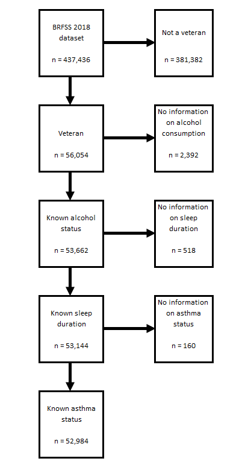

```{r setup, include=FALSE}
knitr::opts_chunk$set(echo = TRUE)
```

# Sample Descriptive Analysis Using Publicly Available Healthcare Data

## Purpose of this Analysis

The purpose of this analysis is to demonstrate the decisions, documentation, and R code necessary to perform a **Descriptive Analysis** in R using a publically and freely available dataset.

The initial dataset selected is the **Behavioral Risk Factor Surveillance System (BRFSS) Survey for 2018.** This is the most recent results dataset available at the time of this analysis.

## What is the Behavioral Risk Factor Surveillance System (BRFSS): 

The BRFSS is the nation's premier system of health-related telephone surveys that collect state data about U.S. residents regarding their health-related risk behaviors, chronic health conditions, and use of preventive services.

The [**BRFSS Survey**](https://www.cdc.gov/brfss/data_documentation/index.htm) ia a large anonymous phone  survey conducted **every year** through a state and federal collaboration and with [**NHANES**](https://www.cdc.gov/nchs/nhanes/index.htm) represents the main US risk factor Surveillance. 

**The objective of the BRFSS is to collect uniform state-specific data on health risk behaviors, chronic diseases and conditions, access to health care, and use of preventive health services related to the leading causes of death and disability in the United States.** Factors assessed by the BRFSS include tobacco use, health care coverage, HIV/AIDS knowledge or prevention, physical activity, and fruit and vegetable consumption. Data are collected from a random sample of adults (one per household) through a telephone survey.

This analysis makes use of the 2018 BRFSS core data set. Key documentation from the CDC, used to document, understand, and interpret these data include the following:

- [**2018 BRFSS Overview CDC [PDF – 298 KB]**](https://www.cdc.gov/brfss/annual_data/2018/pdf/overview-2018-508.pdf) 
Provides information on the background, design, data collection and processing, and the statistical and analytical issues for the combined landline and cell phone data set.

- [**BRFSS LLCP 2018 Codebook [PDF – 10 MB]**](https://www.cdc.gov/brfss/annual_data/2018/pdf/codebook18_llcp-v2-508.pdf) 
Codebook for the file showing variable name, location, and frequency of values for all reporting areas combined for the combined landline and cell phone data set.

- [**Calculated Variables in Data Files CDC [PDF – 1.91 MB]**](https://www.cdc.gov/brfss/annual_data/2018/pdf/2018-calculated-variables-version4-508.pdf)

- [**2018 Summary Data Quality Report with Response Rates CDC [PDF – 2.19 MB]**](https://www.cdc.gov/brfss/annual_data/2018/pdf/2018-sdqr-508.pdf)

- [**Complex Sampling Weights and Preparing Module Data for Analysis CDC [PDF – 564 KB]**](https://www.cdc.gov/brfss/annual_data/2018/pdf/Complex-Smple-Weights-Prep-Module-Data-Analysis-2018-508.pdf)
An explanation of the need to use complex sampling weights and instructions for preparing a module data set for analysis.


## Hypotheses Used as Foundation for Descriptive Analysis

Two hypotheses were formulated to demonstate using R to conduct a descriptive analyis using both a categorical and continuous outcome variable. A descriptive analysis typically takes a single dataset and provides the documentation and description of a set of variables, usually in preparation for a subsequent analysis of that data set (the actual hypothesis testing). A hypothesis is not actually **required** for the descriptive analyis, but in this case the reason for a hypothesis is to aid in the selection of a subset of variables from the BRFSS survey. The initial dataset includes information on **274 variables collected for over 400,000 individuals.** A hypothesis in this case allows us to develop a **smaller dataset containing only those selection, exposure, and potential confounding variables**.

### Hypothesis to Demonstrate Continuous Outcome Variable

To demonstrate a descriptive analysis with a categorical outcome variable the following hypothesis was tested: **Increased drinking behavior leads to reduced sleep time in veterans.**

### Hypothesis to Demonstrate Categorical Outcome Variable

To demonstrate a descriptive analysis with a categorical outcome variable the following hypothesis was tested: **Increased drinking behavior leads to greater likelihood of athsma in veterans.**

## Products Used and Produced in this Sample Descriptive Analysis

1. **BRFSS LLCP 2018 Codebook** - this is the CDC codebook for the 2018 survey downloaded from the CDC (see link above).
2. **Data Dictionary** - for this analysis I developed a data dictionary to document the coding of the CDC variables, and recoding required for additional variables that I added to this analyis.
3. **BRFSS Dataset** - the dataset used in this analysis was downloaded from the link above in SAS EPT format. It was stored in the /data subdirectory. However, the data set is large and could not be stored in this github repository. If the reader chooses to download and run the R code for this analysis. The dataset will have to be downloaded and stored in the correct subfolder.
4. **Descriptive Analysis in R**
5. **Final Table 1 for Categorical Outcome Variable**
6. **Final Table 1 for Continuous Outcome Variable**

## Data Import and Prepartion in R

To build my initial dataset for these analyses, I selected and downloaded the BRFF data in SAS XPT format. This format is more compact and also contains additional variables calculated by the CDC. For more information, please see my [**Data Dictionary with Confounders [XLSX - 33KB]**](documentation/Data_Dictionary_with_Confounders.xlsx) for this project and note the values in the source field and values (BRFSS, SAS).

```{r importData, echo=TRUE, message=TRUE, warning=TRUE}
# Read in the inital downloaded BRFSS dataset in SAS XPT format
source("100_read in BRFSS XPT.R", echo = TRUE)
```

## Data Reduction in R

Then select a subset of varables (17) to keep for these analyses. And reduce the data set by elimnating cases that did not provide valid responses to select questions. Before starting data reduction, look at the number of records imported from the SAS file. There is data on **437,436 cases or rows (nrow) in the initial dataset**.

Next apply exclusions to remove (1) non veterans, (2) cases with no drinking data in ALCDAY5, (3) cases with no sleep data in SLEPTIM1, and (4) no valid asthma data. There are **52,984 cases (rows) in the final data set**.

The figure below illustrates the data reduction process used in this analysis (with the number of cases/rows for each step).



```{r keepDataApplyExclusionx, echo=TRUE, message=TRUE, warning=TRUE}
# Keep data on all cases (rows) but only keep 17 variables
source("105_Keep vars.R", echo = TRUE)
source("110_Apply exclusions.R", echo = TRUE)
```
Note in the code results above that the data file at this point has been reduced.

- FROM initial set: **437,436 records and 275 variables**
- TO BRFSS_f: **52,984 records and 17 variables**

## Create Additional Variables

Next, additional variables were created and coded in R for the population subset (veterans), the exposure variables, and outcome variables. 

- The variable used to subset the veteran population (VETERAN3) exists in the BRFSS dataset. This variable was used in the data reduction code above.

- Three new outcome variables (ALCGRP, DRKWEEKLY, and DRKMONTHLY) were derived from one in the original BRFSS dataset (ALCDAY5). 

Recall, that we are demonstrating techniques and procedures in R for both a categorical and continuous variable using two separate hypotheses. 

- As a result, there are two main outcome variables (categorical - ASTHMA3, continuous - SLEPTIM1).

Potential confounding variables were also identified, created, and coded. These variables were selected and derived after a review of the BRFSS codebook.

- 15 potential cofounders were selected from the initial BRFSS data set.

These variables were created in three distinct steps in the R code.

1. First, the alcohol (exposure variables) were created.
2. Next, the outcome variables were created.
3. Finally, all of the categorical variables were created

R **table** commands were used to verify proper derivation and coding of the variables.

```{r makeNewVariables, echo=TRUE, message=TRUE, warning=TRUE}
source("115_Make alcohol variables.R", echo = TRUE)
source("120_Make outcome variables.R", echo = TRUE)
source("125_Make categorical variables.R", echo = TRUE)
```
At this point the dataset has been finalized for the Descriptive Analysis. To facilitate these subsequent analyses, the dataset is saved in CSV format. The subsequent analyses, will only need to load this final version of the data. 

```{r saveData, echo=TRUE, message=TRUE, warning=TRUE}
source("190_Write out analytic.R", echo = TRUE)
```

## Initial Check of Key Exposure and Outcome Variables in R

```{r ckOutcomeVariables, echo=TRUE, message=TRUE, warning=TRUE}
source("200_Check asthma.R", echo = TRUE)
source("205_Check sleep duration.R", echo = TRUE)

```

## Calculation of Frequencies (Categorical Variables)

Next, frequencies for the exposure and categorical outcome variables were produced in R code. 

These calculations were processed in three distinct steps in the R code.

1. First, the overall frequencies for the exposure and confounders were run.
2. Next, the frequencies for the categorical outcomes ASTHMA were run.
3. Finally, the frequencies for the categorical outcome NOASTHMA were run.

Macros were created in the R code to produce CVS files for most of the frequency outcome data. These CSV files aided in the final assembly of an MS EXCEL Table 1. 

Note: These CSV files appear in separate subdirectories within the main data directory **(./data)**.

```{r calculateFrequences, echo=TRUE, message=TRUE, warning=TRUE}
source("210_Table 1 overall frequencies.R", echo = TRUE)
source("215_Table 1 asthma frequencies.R", echo = TRUE)
source("220_Table 1 no asthma frequencies.R", echo = TRUE)

```

## Calculation of Means, and Standard Deviations (Continuous Variables)

Means and Standard Deviations were calculated for all continuous variables,

```{r calculateMeansSDs, echo=TRUE, message=TRUE, warning=TRUE}
source("225_Table 1 means and sds.R", echo = TRUE)

```

## Chi Square Significance Testing of Categorical Variables With More Than Two Values

Significance Testing for the categorical variables (categorical exposures and outcomes). Chi square testing was required for cases where the categorical exposure variable had more than two values.

```{r calculateChiSquares, echo=TRUE, message=TRUE, warning=TRUE}
source("230_Table 1 chi squares.R", echo = TRUE)

```

## T Tests for Categorical Variables with Only Two Values

Significance Testing for the categorical variables (categorical exposures and outcomes). T-tests were required for cases where the categorical exposure variable had only two values.

```{r calculateTtests, echo=TRUE, message=TRUE, warning=TRUE}
source("235_Table 1 ttests.R", echo = TRUE)

```

## ANOVA Testing of Continuous Variables

Significance Testing for the continuous variables (categorical exposures and outcomes).

```{r calculateANOVAs, echo=TRUE, message=TRUE, warning=TRUE}
source("240_Table 1 ANOVAs.R", echo = TRUE)

```


## Final Table 1 for Categorical Hypothesis

## Final Table 1 for Continuous Hypothesis


