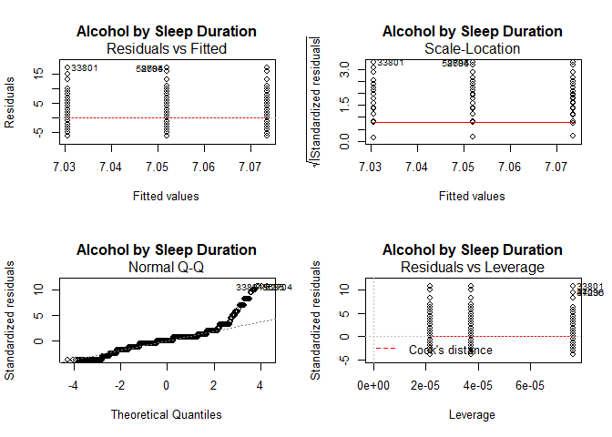
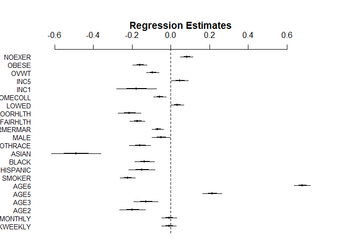
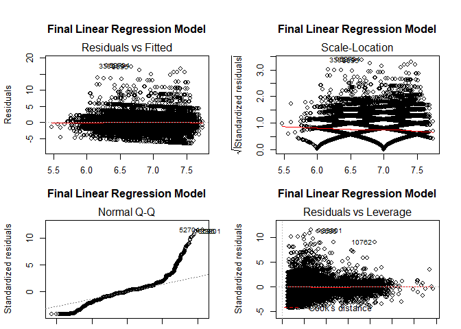
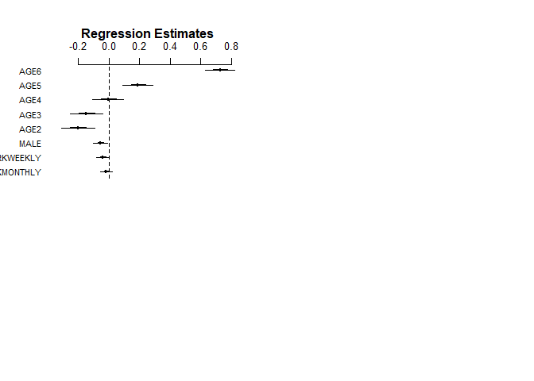
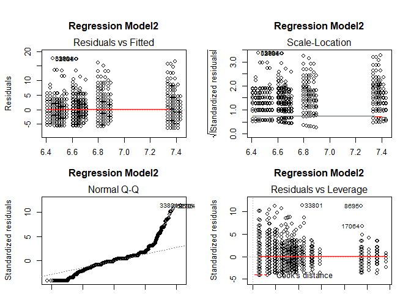

Sample Descriptive Analysis Using Publicly Available Healthcare Data
================
Paul G. Smith
10/29/2019

  - [Sample Descriptive Analysis Using Publicly Available Healthcare
    Data](#sample-descriptive-analysis-using-publicly-available-healthcare-data)
      - [Purpose of this Analysis](#purpose-of-this-analysis)
      - [What is the Behavioral Risk Factor Surveillance System
        (BRFSS):](#what-is-the-behavioral-risk-factor-surveillance-system-brfss)
      - [Hypotheses Used as Foundation for Descriptive
        Analysis](#hypotheses-used-as-foundation-for-descriptive-analysis)
          - [Hypothesis to Demonstrate Continuous Outcome
            Variable](#hypothesis-to-demonstrate-continuous-outcome-variable)
          - [Hypothesis to Demonstrate Categorical Outcome
            Variable](#hypothesis-to-demonstrate-categorical-outcome-variable)
      - [Products Used and Produced in this Sample Descriptive
        Analysis](#products-used-and-produced-in-this-sample-descriptive-analysis)
      - [Data Import and Prepartion in
        R](#data-import-and-prepartion-in-r)
      - [Data Reduction in R](#data-reduction-in-r)
      - [Create Additional Variables](#create-additional-variables)
      - [Initial Check of Key Exposure and Outcome Variables in
        R](#initial-check-of-key-exposure-and-outcome-variables-in-r)
      - [Calculation of Frequencies (Categorical
        Variables)](#calculation-of-frequencies-categorical-variables)
      - [Calculation of Means, and Standard Deviations (Continuous
        Variables)](#calculation-of-means-and-standard-deviations-continuous-variables)
      - [Chi Square Significance Testing of Categorical Variables With
        More Than Two
        Values](#chi-square-significance-testing-of-categorical-variables-with-more-than-two-values)
      - [T Tests for Categorical Variables with Only Two
        Values](#t-tests-for-categorical-variables-with-only-two-values)
      - [ANOVA Testing of Continuous
        Variables](#anova-testing-of-continuous-variables)
      - [Final Table 1 for Categorical
        Hypothesis](#final-table-1-for-categorical-hypothesis)
      - [Final Table 1 for Continuous
        Hypothesis](#final-table-1-for-continuous-hypothesis)
      - [Regression Analyses](#regression-analyses)
          - [Regression of Hours Slept (SLEPTIM3) and Alcohol Grouping
            (ALCGRP)](#regression-of-hours-slept-sleptim3-and-alcohol-grouping-alcgrp)
          - [Development and Testing of Regression Models 1 and
            2](#development-and-testing-of-regression-models-1-and-2)
          - [Stepwise Regression of Candidates for Model
            3](#stepwise-regression-of-candidates-for-model-3)

# Sample Descriptive Analysis Using Publicly Available Healthcare Data

## Purpose of this Analysis

The purpose of this analysis is to demonstrate the decisions,
documentation, and R code necessary to perform a **Descriptive
Analysis** in R using a publically and freely available dataset.

The initial dataset selected is the **Behavioral Risk Factor
Surveillance System (BRFSS) Survey for 2018.** This is the most recent
results dataset available at the time of this analysis.

## What is the Behavioral Risk Factor Surveillance System (BRFSS):

The BRFSS is the nation’s premier system of health-related telephone
surveys that collect state data about U.S. residents regarding their
health-related risk behaviors, chronic health conditions, and use of
preventive services.

The [**BRFSS
Survey**](https://www.cdc.gov/brfss/data_documentation/index.htm) ia a
large anonymous phone survey conducted **every year** through a state
and federal collaboration and with
[**NHANES**](https://www.cdc.gov/nchs/nhanes/index.htm) represents the
main US risk factor Surveillance.

**The objective of the BRFSS is to collect uniform state-specific data
on health risk behaviors, chronic diseases and conditions, access to
health care, and use of preventive health services related to the
leading causes of death and disability in the United States.** Factors
assessed by the BRFSS include tobacco use, health care coverage,
HIV/AIDS knowledge or prevention, physical activity, and fruit and
vegetable consumption. Data are collected from a random sample of adults
(one per household) through a telephone survey.

This analysis makes use of the 2018 BRFSS core data set. Key
documentation from the CDC, used to document, understand, and interpret
these data include the following:

  - [**2018 BRFSS Overview CDC \[PDF – 298
    KB\]**](https://www.cdc.gov/brfss/annual_data/2018/pdf/overview-2018-508.pdf)
    Provides information on the background, design, data collection and
    processing, and the statistical and analytical issues for the
    combined landline and cell phone data set.

  - [**BRFSS LLCP 2018 Codebook \[PDF – 10
    MB\]**](https://www.cdc.gov/brfss/annual_data/2018/pdf/codebook18_llcp-v2-508.pdf)
    Codebook for the file showing variable name, location, and frequency
    of values for all reporting areas combined for the combined landline
    and cell phone data set.

  - [**Calculated Variables in Data Files CDC \[PDF – 1.91
    MB\]**](https://www.cdc.gov/brfss/annual_data/2018/pdf/2018-calculated-variables-version4-508.pdf)

  - [**2018 Summary Data Quality Report with Response Rates CDC \[PDF
    – 2.19
    MB\]**](https://www.cdc.gov/brfss/annual_data/2018/pdf/2018-sdqr-508.pdf)

  - [**Complex Sampling Weights and Preparing Module Data for Analysis
    CDC \[PDF – 564
    KB\]**](https://www.cdc.gov/brfss/annual_data/2018/pdf/Complex-Smple-Weights-Prep-Module-Data-Analysis-2018-508.pdf)
    An explanation of the need to use complex sampling weights and
    instructions for preparing a module data set for analysis.

## Hypotheses Used as Foundation for Descriptive Analysis

Two hypotheses were formulated to demonstate using R to conduct a
descriptive analyis using both a categorical and continuous outcome
variable. A descriptive analysis typically takes a single dataset and
provides the documentation and description of a set of variables,
usually in preparation for a subsequent analysis of that data set (the
actual hypothesis testing). A hypothesis is not actually **required**
for the descriptive analyis, but in this case the reason for a
hypothesis is to aid in the selection of a subset of variables from the
BRFSS survey. The initial dataset includes information on **274
variables collected for over 400,000 individuals.** A hypothesis in this
case allows us to develop a **smaller dataset containing only those
selection, exposure, and potential confounding variables**.

### Hypothesis to Demonstrate Continuous Outcome Variable

To demonstrate a descriptive analysis with a categorical outcome
variable the following hypothesis was tested: **Increased drinking
behavior leads to reduced sleep time in veterans.**

### Hypothesis to Demonstrate Categorical Outcome Variable

To demonstrate a descriptive analysis with a categorical outcome
variable the following hypothesis was tested: **Increased drinking
behavior leads to greater likelihood of athsma in veterans.**

## Products Used and Produced in this Sample Descriptive Analysis

1.  **BRFSS LLCP 2018 Codebook** - this is the CDC codebook for the 2018
    survey downloaded from the CDC (see link above).
2.  **Data Dictionary** - for this analysis I developed a data
    dictionary to document the coding of the CDC variables, and recoding
    required for additional variables that I added to this analysis.
    [**Data\_Dictionary\_2018 \[EXCEL – 33
    KB\]**](./documentation/Data_Dictionary_2018.xlsx.) 
3.  **BRFSS Dataset** - the dataset used in this analysis was downloaded
    from the link above in SAS EPT format. It was stored in the /data
    subdirectory. However, the data set is large and could not be stored
    in this github repository. If the reader chooses to download and run
    the R code for this analysis. The dataset will have to be downloaded
    and stored in the correct subfolder.
4.  **Descriptive Analysis in R** - The list below details the
    individual R code modules used in this analysis. I have found that
    breaking my code into a series of separate relatively small modules
    is useful for development and testing. It also makes the code a
    little easier to understand.

<!-- end list -->

  - [100\_Read in BRFSS XPT.R](./100_Read%20in%20BRFSS%20XPT.R)
  - [105\_Keep vars.R](./105_Keep%20vars.R)
  - [110\_Apply exclusions.R](./110_Apply%20exclusions.R)
  - [115\_Make alcohol variables.R](./115_Make%20alcohol%20variables.R)
  - [120\_Make outcome variables.R](./120_Make%20outcome%20variables.R)
  - [125\_Make categorical
    variables.R](./125_Make%20categorical%20variables.R)
  - [190\_Write out analytic.R](./190_Write%20out%20analytic.R)
  - [200\_Check asthma.R](./200_Check%20asthma.R%5D)
  - [205\_Check sleep duration.R](./205_Check%20sleep%20duration.R)
  - [210\_Table 1 overall
    frequencies.R](./210_Table%201%20overall%20frequencies.R)
  - [215\_Table 1 asthma
    frequencies.R](./215_Table%201%20asthma%20frequencies.R)
  - [220\_Table 1 no asthma
    frequencies.R](./220_Table%201%20no%20asthma%20frequencies.R)
  - [225\_Table 1 means and
    sds.R](./225_Table%201%20means%20and%20sds.R)
  - [230\_Table 1 chi squares.R](./230_Table%201%20chi%20squares.R)
  - [235\_Table 1 ttests.R](./235_Table%201%20ttests.R)
  - [240\_Table 1 ANOVAs.R](./240_Table%201%20ANOVAs.R)

<!-- end list -->

5.  **Final Table 1 for Categorical Outcome Variable**
6.  **Final Table 1 for Continuous Outcome Variable**

## Data Import and Prepartion in R

To build my initial dataset for these analyses, I selected and
downloaded the BRFF data in SAS XPT format. This format is more compact
and also contains additional variables calculated by the CDC. For more
information, please see my [**Data Dictionary with Confounders \[XLSX -
33KB\]**](./documentation/Data_Dictionary_with_Confounders.xlsx) for
this project and note the values in the source field and values (BRFSS,
SAS).

``` r
# Read in the inital downloaded BRFSS dataset in SAS XPT format
source("100_read in BRFSS XPT.R", echo = TRUE)
```

    ## 
    ## > library(foreign)
    ## 
    ## > BRFSS_a <- read.xport("./data/LLCP2018.xpt")
    ## 
    ## > colnames(BRFSS_a)
    ##   [1] "X_STATE"   "FMONTH"    "IDATE"     "IMONTH"    "IDAY"     
    ##   [6] "IYEAR"     "DISPCODE"  "SEQNO"     "X_PSU"     "CTELENM1" 
    ##  [11] "PVTRESD1"  "COLGHOUS"  "STATERE1"  "CELLFON4"  "LADULT"   
    ##  [16] "NUMADULT"  "NUMMEN"    "NUMWOMEN"  "SAFETIME"  "CTELNUM1" 
    ##  [21] "CELLFON5"  "CADULT"    "PVTRESD3"  "CCLGHOUS"  "CSTATE1"  
    ##  [26] "LANDLINE"  "HHADULT"   "GENHLTH"   "PHYSHLTH"  "MENTHLTH" 
    ##  [31] "POORHLTH"  "HLTHPLN1"  "PERSDOC2"  "MEDCOST"   "CHECKUP1" 
    ##  [36] "EXERANY2"  "SLEPTIM1"  "CVDINFR4"  "CVDCRHD4"  "CVDSTRK3" 
    ##  [41] "ASTHMA3"   "ASTHNOW"   "CHCSCNCR"  "CHCOCNCR"  "CHCCOPD1" 
    ##  [46] "HAVARTH3"  "ADDEPEV2"  "CHCKDNY1"  "DIABETE3"  "DIABAGE2" 
    ##  [51] "LASTDEN4"  "RMVTETH4"  "SEX1"      "MARITAL"   "EDUCA"    
    ##  [56] "RENTHOM1"  "NUMHHOL3"  "NUMPHON3"  "CPDEMO1B"  "VETERAN3" 
    ##  [61] "EMPLOY1"   "CHILDREN"  "INCOME2"   "WEIGHT2"   "HEIGHT3"  
    ##  [66] "PREGNANT"  "DEAF"      "BLIND"     "DECIDE"    "DIFFWALK" 
    ##  [71] "DIFFDRES"  "DIFFALON"  "SMOKE100"  "SMOKDAY2"  "STOPSMK2" 
    ##  [76] "LASTSMK2"  "USENOW3"   "ALCDAY5"   "AVEDRNK2"  "DRNK3GE5" 
    ##  [81] "MAXDRNKS"  "FLUSHOT6"  "FLSHTMY2"  "IMFVPLAC"  "PNEUVAC4" 
    ##  [86] "FALL12MN"  "FALLINJ3"  "SEATBELT"  "DRNKDRI2"  "HADMAM"   
    ##  [91] "HOWLONG"   "HADPAP2"   "LASTPAP2"  "HPVTEST"   "HPLSTTST" 
    ##  [96] "HADHYST2"  "PCPSAAD3"  "PCPSADI1"  "PCPSARE1"  "PSATEST1" 
    ## [101] "PSATIME"   "PCPSARS1"  "BLDSTOOL"  "LSTBLDS3"  "HADSIGM3" 
    ## [106] "HADSGCO1"  "LASTSIG3"  "HIVTST6"   "HIVTSTD3"  "HIVRISK5" 
    ## [111] "PDIABTST"  "PREDIAB1"  "INSULIN"   "BLDSUGAR"  "FEETCHK3" 
    ## [116] "DOCTDIAB"  "CHKHEMO3"  "FEETCHK"   "EYEEXAM1"  "DIABEYE"  
    ## [121] "DIABEDU"   "MEDICARE"  "HLTHCVR1"  "DELAYME1"  "DLYOTHER" 
    ## [126] "NOCOV121"  "LSTCOVRG"  "DRVISITS"  "MEDSCOS1"  "CARERCVD" 
    ## [131] "MEDBILL1"  "CIMEMLOS"  "CDHOUSE"   "CDASSIST"  "CDHELP"   
    ## [136] "CDSOCIAL"  "CDDISCUS"  "CAREGIV1"  "CRGVREL2"  "CRGVLNG1" 
    ## [141] "CRGVHRS1"  "CRGVPRB2"  "CRGVPERS"  "CRGVHOUS"  "CRGVMST3" 
    ## [146] "CRGVEXPT"  "ECIGARET"  "ECIGNOW"   "MARIJAN1"  "USEMRJN2" 
    ## [151] "RSNMRJN1"  "ADSLEEP"   "SLEPDAY1"  "SLEPSNO2"  "SLEPBRTH" 
    ## [156] "ADPLEAS1"  "ADDOWN1"   "FEELNERV"  "STOPWORY"  "COPDCOGH" 
    ## [161] "COPDFLEM"  "COPDBRTH"  "COPDBTST"  "COPDSMOK"  "INDORTAN" 
    ## [166] "NUMBURN3"  "SUNPRTCT"  "WKDAYOUT"  "WKENDOUT"  "LCSFIRST" 
    ## [171] "LCSLAST"   "LCSNUMCG"  "LCSCTSCN"  "CNCRDIFF"  "CNCRAGE"  
    ## [176] "CNCRTYP1"  "CSRVTRT2"  "CSRVDOC1"  "CSRVSUM"   "CSRVRTRN" 
    ## [181] "CSRVINST"  "CSRVINSR"  "CSRVDEIN"  "CSRVCLIN"  "CSRVPAIN" 
    ## [186] "CSRVCTL1"  "PCPSADE1"  "PCDMDEC1"  "PROFEXAM"  "LENGEXAM" 
    ## [191] "HPVADVC2"  "HPVADSHT"  "TETANUS1"  "SHINGLE2"  "SOMALE"   
    ## [196] "SOFEMALE"  "TRNSGNDR"  "RCSGENDR"  "RCSRLTN2"  "CASTHDX2" 
    ## [201] "CASTHNO2"  "QSTVER"    "QSTLANG"   "X_METSTAT" "X_URBSTAT"
    ## [206] "MSCODE"    "X_STSTR"   "X_STRWT"   "X_RAWRAKE" "X_WT2RAKE"
    ## [211] "X_IMPRACE" "X_CHISPNC" "X_CRACE1"  "X_CPRACE"  "X_CLLCPWT"
    ## [216] "X_DUALUSE" "X_DUALCOR" "X_LLCPWT2" "X_LLCPWT"  "X_RFHLTH" 
    ## [221] "X_PHYS14D" "X_MENT14D" "X_HCVU651" "X_TOTINDA" "X_MICHD"  
    ## [226] "X_LTASTH1" "X_CASTHM1" "X_ASTHMS1" "X_DRDXAR1" "X_EXTETH3"
    ## [231] "X_ALTETH3" "X_DENVST3" "X_PRACE1"  "X_MRACE1"  "X_HISPANC"
    ## [236] "X_RACE"    "X_RACEG21" "X_RACEGR3" "X_RACE_G1" "X_AGEG5YR"
    ## [241] "X_AGE65YR" "X_AGE80"   "X_AGE_G"   "HTIN4"     "HTM4"     
    ## [246] "WTKG3"     "X_BMI5"    "X_BMI5CAT" "X_RFBMI5"  "X_CHLDCNT"
    ## [251] "X_EDUCAG"  "X_INCOMG"  "X_SMOKER3" "X_RFSMOK3" "DRNKANY5" 
    ## [256] "DROCDY3_"  "X_RFBING5" "X_DRNKWEK" "X_RFDRHV6" "X_FLSHOT6"
    ## [261] "X_PNEUMO3" "X_RFSEAT2" "X_RFSEAT3" "X_DRNKDRV" "X_RFMAM21"
    ## [266] "X_MAM5022" "X_RFPAP34" "X_RFPSA22" "X_RFBLDS3" "X_COL10YR"
    ## [271] "X_HFOB3YR" "X_FS5YR"   "X_FOBTFS"  "X_CRCREC"  "X_AIDTST3"

## Data Reduction in R

Then select a subset of varables (17) to keep for these analyses. And
reduce the data set by elimnating cases that did not provide valid
responses to select questions. Before starting data reduction, look at
the number of records imported from the SAS file. There is data on
**437,436 cases or rows (nrow) in the initial dataset**.

Next apply exclusions to remove (1) non veterans, (2) cases with no
drinking data in ALCDAY5, (3) cases with no sleep data in SLEPTIM1, and
(4) no valid asthma data. There are **52,984 cases (rows) in the final
data set**.

The figure below illustrates the data reduction process used in this
analysis (with the number of cases/rows for each step).


``` r
# Keep data on all cases (rows) but only keep 17 variables
source("105_Keep vars.R", echo = TRUE)
```

    ## 
    ## > BRFSSVarList <- c("VETERAN3", "ALCDAY5", "SLEPTIM1", 
    ## +     "ASTHMA3", "X_AGE_G", "SMOKE100", "SMOKDAY2", "SEX1", "X_HISPANC", 
    ## +     "X_MRACE1", "M ..." ... [TRUNCATED] 
    ## 
    ## > BRFSS_b <- BRFSS_a[BRFSSVarList]
    ## 
    ## > colnames(BRFSS_b)
    ##  [1] "VETERAN3"  "ALCDAY5"   "SLEPTIM1"  "ASTHMA3"   "X_AGE_G"  
    ##  [6] "SMOKE100"  "SMOKDAY2"  "SEX1"      "X_HISPANC" "X_MRACE1" 
    ## [11] "MARITAL"   "GENHLTH"   "HLTHPLN1"  "EDUCA"     "INCOME2"  
    ## [16] "X_BMI5CAT" "EXERANY2" 
    ## 
    ## > nrow(BRFSS_b)
    ## [1] 437436

``` r
source("110_Apply exclusions.R", echo = TRUE)
```

    ## 
    ## > nrow(BRFSS_b)
    ## [1] 437436
    ## 
    ## > BRFSS_c <- subset(BRFSS_b, VETERAN3 == 1)
    ## 
    ## > nrow(BRFSS_c)
    ## [1] 56054
    ## 
    ## > BRFSS_d <- subset(BRFSS_c, ALCDAY5 < 777 | ALCDAY5 == 
    ## +     888)
    ## 
    ## > nrow(BRFSS_d)
    ## [1] 53662
    ## 
    ## > BRFSS_e <- subset(BRFSS_d, SLEPTIM1 < 77)
    ## 
    ## > nrow(BRFSS_e)
    ## [1] 53144
    ## 
    ## > BRFSS_f <- subset(BRFSS_e, ASTHMA3 < 7)
    ## 
    ## > nrow(BRFSS_f)
    ## [1] 52984

Note in the code results above that the data file at this point has been
reduced.

  - FROM initial set: **437,436 records and 275 variables**
  - TO BRFSS\_f: **52,984 records and 17 variables**

## Create Additional Variables

Next, additional variables were created and coded in R for the
population subset (veterans), the exposure variables, and outcome
variables.

  - The variable used to subset the veteran population (VETERAN3) exists
    in the BRFSS dataset. This variable was used in the data reduction
    code above.

  - Three new outcome variables (ALCGRP, DRKWEEKLY, and DRKMONTHLY) were
    derived from one in the original BRFSS dataset (ALCDAY5).

Recall, that we are demonstrating techniques and procedures in R for
both a categorical and continuous variable using two separate
hypotheses.

  - As a result, there are two main outcome variables (categorical -
    ASTHMA3, continuous - SLEPTIM1).

Potential confounding variables were also identified, created, and
coded. These variables were selected and derived after a review of the
BRFSS codebook.

  - 15 potential cofounders were selected from the initial BRFSS data
    set.

These variables were created in three distinct steps in the R code.

1.  First, the alcohol (exposure variables) were created.
2.  Next, the outcome variables were created.
3.  Finally, all of the categorical variables were created

R **table** commands were used to verify proper derivation and coding of
the variables.

``` r
source("115_Make alcohol variables.R", echo = TRUE)
```

    ## 
    ## > BRFSS_g <- BRFSS_f
    ## 
    ## > BRFSS_g$ALCGRP <- 9
    ## 
    ## > BRFSS_g$ALCGRP[BRFSS_g$ALCDAY5 < 200] <- 3
    ## 
    ## > BRFSS_g$ALCGRP[BRFSS_g$ALCDAY5 >= 200 & BRFSS_g$ALCDAY5 < 
    ## +     777] <- 2
    ## 
    ## > BRFSS_g$ALCGRP[BRFSS_g$ALCDAY5 == 888] <- 1
    ## 
    ## > table(BRFSS_g$ALCGRP, BRFSS_g$ALCDAY5)
    ##    
    ##       101   102   103   104   105   106   107   201   202   203   204
    ##   1     0     0     0     0     0     0     0     0     0     0     0
    ##   2     0     0     0     0     0     0     0  3996  2962  1622  1453
    ##   3  2373  1908  1359   668   660   236  1631     0     0     0     0
    ##    
    ##       205   206   207   208   209   210   211   212   213   214   215
    ##   1     0     0     0     0     0     0     0     0     0     0     0
    ##   2  1330   567   345   407    27  1070     6   231    12    83   961
    ##   3     0     0     0     0     0     0     0     0     0     0     0
    ##    
    ##       216   217   218   219   220   221   222   223   224   225   226
    ##   1     0     0     0     0     0     0     0     0     0     0     0
    ##   2    37    17    42     3   996    29    24    13    45   531    23
    ##   3     0     0     0     0     0     0     0     0     0     0     0
    ##    
    ##       227   228   229   230   888
    ##   1     0     0     0     0 23418
    ##   2    49   166    57  3627     0
    ##   3     0     0     0     0     0
    ## 
    ## > BRFSS_g$DRKMONTHLY <- 0
    ## 
    ## > BRFSS_g$DRKMONTHLY[BRFSS_g$ALCGRP == 2] <- 1
    ## 
    ## > table(BRFSS_g$ALCGRP, BRFSS_g$DRKMONTHLY)
    ##    
    ##         0     1
    ##   1 23418     0
    ##   2     0 20731
    ##   3  8835     0
    ## 
    ## > BRFSS_g$DRKWEEKLY <- 0
    ## 
    ## > BRFSS_g$DRKWEEKLY[BRFSS_g$ALCGRP == 1] <- 1
    ## 
    ## > table(BRFSS_g$ALCGRP, BRFSS_g$DRKWEEKLY)
    ##    
    ##         0     1
    ##   1     0 23418
    ##   2 20731     0
    ##   3  8835     0

``` r
source("120_Make outcome variables.R", echo = TRUE)
```

    ## 
    ## > BRFSS_h <- BRFSS_g
    ## 
    ## > BRFSS_h$SLEPTIM2 <- NA
    ## 
    ## > BRFSS_h$SLEPTIM2[!is.na(BRFSS_h$SLEPTIM1) & BRFSS_h$SLEPTIM1 != 
    ## +     77 & BRFSS_h$SLEPTIM1 != 99] <- BRFSS_h$SLEPTIM1
    ## 
    ## > table(BRFSS_h$SLEPTIM1, BRFSS_h$SLEPTIM2)
    ##     
    ##          1     2     3     4     5     6     7     8     9    10    11
    ##   1    144     0     0     0     0     0     0     0     0     0     0
    ##   2      0   226     0     0     0     0     0     0     0     0     0
    ##   3      0     0   477     0     0     0     0     0     0     0     0
    ##   4      0     0     0  1843     0     0     0     0     0     0     0
    ##   5      0     0     0     0  3518     0     0     0     0     0     0
    ##   6      0     0     0     0     0 11260     0     0     0     0     0
    ##   7      0     0     0     0     0     0 14470     0     0     0     0
    ##   8      0     0     0     0     0     0     0 15904     0     0     0
    ##   9      0     0     0     0     0     0     0     0  2804     0     0
    ##   10     0     0     0     0     0     0     0     0     0  1566     0
    ##   11     0     0     0     0     0     0     0     0     0     0   104
    ##   12     0     0     0     0     0     0     0     0     0     0     0
    ##   13     0     0     0     0     0     0     0     0     0     0     0
    ##   14     0     0     0     0     0     0     0     0     0     0     0
    ##   15     0     0     0     0     0     0     0     0     0     0     0
    ##   16     0     0     0     0     0     0     0     0     0     0     0
    ##   17     0     0     0     0     0     0     0     0     0     0     0
    ##   18     0     0     0     0     0     0     0     0     0     0     0
    ##   20     0     0     0     0     0     0     0     0     0     0     0
    ##   22     0     0     0     0     0     0     0     0     0     0     0
    ##   23     0     0     0     0     0     0     0     0     0     0     0
    ##   24     0     0     0     0     0     0     0     0     0     0     0
    ##     
    ##         12    13    14    15    16    17    18    20    22    23    24
    ##   1      0     0     0     0     0     0     0     0     0     0     0
    ##   2      0     0     0     0     0     0     0     0     0     0     0
    ##   3      0     0     0     0     0     0     0     0     0     0     0
    ##   4      0     0     0     0     0     0     0     0     0     0     0
    ##   5      0     0     0     0     0     0     0     0     0     0     0
    ##   6      0     0     0     0     0     0     0     0     0     0     0
    ##   7      0     0     0     0     0     0     0     0     0     0     0
    ##   8      0     0     0     0     0     0     0     0     0     0     0
    ##   9      0     0     0     0     0     0     0     0     0     0     0
    ##   10     0     0     0     0     0     0     0     0     0     0     0
    ##   11     0     0     0     0     0     0     0     0     0     0     0
    ##   12   467     0     0     0     0     0     0     0     0     0     0
    ##   13     0    18     0     0     0     0     0     0     0     0     0
    ##   14     0     0    39     0     0     0     0     0     0     0     0
    ##   15     0     0     0    41     0     0     0     0     0     0     0
    ##   16     0     0     0     0    41     0     0     0     0     0     0
    ##   17     0     0     0     0     0     7     0     0     0     0     0
    ##   18     0     0     0     0     0     0    29     0     0     0     0
    ##   20     0     0     0     0     0     0     0    16     0     0     0
    ##   22     0     0     0     0     0     0     0     0     2     0     0
    ##   23     0     0     0     0     0     0     0     0     0     4     0
    ##   24     0     0     0     0     0     0     0     0     0     0     4
    ## 
    ## > BRFSS_h$ASTHMA4 <- 9
    ## 
    ## > BRFSS_h$ASTHMA4[BRFSS_h$ASTHMA3 == 1] <- 1
    ## 
    ## > BRFSS_h$ASTHMA4[BRFSS_h$ASTHMA3 == 2] <- 0
    ## 
    ## > table(BRFSS_h$ASTHMA3, BRFSS_h$ASTHMA4)
    ##    
    ##         0     1
    ##   1     0  5298
    ##   2 47686     0

``` r
source("125_Make categorical variables.R", echo = TRUE)
```

    ## 
    ## > BRFSS_i <- BRFSS_h
    ## 
    ## > BRFSS_i$AGE2 <- 0
    ## 
    ## > BRFSS_i$AGE3 <- 0
    ## 
    ## > BRFSS_i$AGE4 <- 0
    ## 
    ## > BRFSS_i$AGE5 <- 0
    ## 
    ## > BRFSS_i$AGE6 <- 0
    ## 
    ## > BRFSS_i$AGE2[BRFSS_i$X_AGE_G == 2] <- 1
    ## 
    ## > table(BRFSS_i$X_AGE_G, BRFSS_i$AGE2)
    ##    
    ##         0     1
    ##   1  1090     0
    ##   2     0  2947
    ##   3  3560     0
    ##   4  6152     0
    ##   5  8783     0
    ##   6 30452     0
    ## 
    ## > BRFSS_i$AGE3[BRFSS_i$X_AGE_G == 3] <- 1
    ## 
    ## > table(BRFSS_i$X_AGE_G, BRFSS_i$AGE3)
    ##    
    ##         0     1
    ##   1  1090     0
    ##   2  2947     0
    ##   3     0  3560
    ##   4  6152     0
    ##   5  8783     0
    ##   6 30452     0
    ## 
    ## > BRFSS_i$AGE4[BRFSS_i$X_AGE_G == 4] <- 1
    ## 
    ## > table(BRFSS_i$X_AGE_G, BRFSS_i$AGE4)
    ##    
    ##         0     1
    ##   1  1090     0
    ##   2  2947     0
    ##   3  3560     0
    ##   4     0  6152
    ##   5  8783     0
    ##   6 30452     0
    ## 
    ## > BRFSS_i$AGE5[BRFSS_i$X_AGE_G == 5] <- 1
    ## 
    ## > table(BRFSS_i$X_AGE_G, BRFSS_i$AGE5)
    ##    
    ##         0     1
    ##   1  1090     0
    ##   2  2947     0
    ##   3  3560     0
    ##   4  6152     0
    ##   5     0  8783
    ##   6 30452     0
    ## 
    ## > BRFSS_i$AGE6[BRFSS_i$X_AGE_G == 6] <- 1
    ## 
    ## > table(BRFSS_i$X_AGE_G, BRFSS_i$AGE6)
    ##    
    ##         0     1
    ##   1  1090     0
    ##   2  2947     0
    ##   3  3560     0
    ##   4  6152     0
    ##   5  8783     0
    ##   6     0 30452
    ## 
    ## > BRFSS_i$NEVERSMK <- 0
    ## 
    ## > BRFSS_i$NEVERSMK[BRFSS_i$SMOKE100 == 2] <- 1
    ## 
    ## > table(BRFSS_i$SMOKE100, BRFSS_i$NEVERSMK)
    ##    
    ##         0     1
    ##   1 31298     0
    ##   2     0 21414
    ##   7   242     0
    ##   9    30     0
    ## 
    ## > BRFSS_i$SMOKGRP <- 9
    ## 
    ## > BRFSS_i$SMOKGRP[BRFSS_i$SMOKDAY2 == 1 | BRFSS_i$SMOKDAY2 == 
    ## +     2] <- 1
    ## 
    ## > BRFSS_i$SMOKGRP[BRFSS_i$SMOKDAY2 == 3 | BRFSS_i$NEVERSMK == 
    ## +     1] <- 2
    ## 
    ## > table(BRFSS_i$SMOKGRP, BRFSS_i$SMOKDAY2)
    ##    
    ##         1     2     3     7     9
    ##   1  5886  1968     0     0     0
    ##   2     0     0 23406     0     0
    ##   9     0     0     0    20    18
    ## 
    ## > table(BRFSS_i$SMOKGRP, BRFSS_i$SMOKE100)
    ##    
    ##         1     2     7     9
    ##   1  7854     0     0     0
    ##   2 23406 21414     0     0
    ##   9    38     0   242    30
    ## 
    ## > BRFSS_i$SMOKER <- 0
    ## 
    ## > BRFSS_i$SMOKER[BRFSS_i$SMOKGRP == 1] <- 1
    ## 
    ## > table(BRFSS_i$SMOKGRP, BRFSS_i$SMOKER)
    ##    
    ##         0     1
    ##   1     0  7854
    ##   2 44820     0
    ##   9   310     0
    ## 
    ## > BRFSS_i$SEX <- 9
    ## 
    ## > BRFSS_i$SEX[BRFSS_i$SEX1 == 1] <- 1
    ## 
    ## > BRFSS_i$SEX[BRFSS_i$SEX1 == 2] <- 2
    ## 
    ## > BRFSS_i$MALE <- 0
    ## 
    ## > BRFSS_i$MALE[BRFSS_i$SEX == 1] <- 1
    ## 
    ## > table(BRFSS_i$MALE, BRFSS_i$SEX)
    ##    
    ##         1     2     9
    ##   0     0  5075   104
    ##   1 47805     0     0
    ## 
    ## > BRFSS_i$HISPANIC <- 0
    ## 
    ## > BRFSS_i$HISPANIC[BRFSS_i$X_HISPANC == 1] <- 1
    ## 
    ## > table(BRFSS_i$HISPANIC, BRFSS_i$X_HISPANC)
    ##    
    ##         1     2     9
    ##   0     0 50162   589
    ##   1  2233     0     0
    ## 
    ## > BRFSS_i$RACEGRP <- 9
    ## 
    ## > BRFSS_i$RACEGRP[BRFSS_i$X_MRACE1 == 1] <- 1
    ## 
    ## > BRFSS_i$RACEGRP[BRFSS_i$X_MRACE1 == 2] <- 2
    ## 
    ## > BRFSS_i$RACEGRP[BRFSS_i$X_MRACE1 == 3] <- 3
    ## 
    ## > BRFSS_i$RACEGRP[BRFSS_i$X_MRACE1 == 4] <- 4
    ## 
    ## > BRFSS_i$RACEGRP[BRFSS_i$X_MRACE1 == 5] <- 5
    ## 
    ## > BRFSS_i$RACEGRP[BRFSS_i$X_MRACE1 == 6 | BRFSS_i$X_MRACE1 == 
    ## +     7] <- 6
    ## 
    ## > table(BRFSS_i$RACEGRP, BRFSS_i$X_MRACE1)
    ##    
    ##         1     2     3     4     5     6     7    77    99
    ##   1 43844     0     0     0     0     0     0     0     0
    ##   2     0  4019     0     0     0     0     0     0     0
    ##   3     0     0  1049     0     0     0     0     0     0
    ##   4     0     0     0   582     0     0     0     0     0
    ##   5     0     0     0     0   320     0     0     0     0
    ##   6     0     0     0     0     0   858  1304     0     0
    ##   9     0     0     0     0     0     0     0   195   813
    ## 
    ## > BRFSS_i$BLACK <- 0
    ## 
    ## > BRFSS_i$ASIAN <- 0
    ## 
    ## > BRFSS_i$OTHRACE <- 0
    ## 
    ## > BRFSS_i$BLACK[BRFSS_i$RACEGRP == 2] <- 1
    ## 
    ## > table(BRFSS_i$RACEGRP, BRFSS_i$BLACK)
    ##    
    ##         0     1
    ##   1 43844     0
    ##   2     0  4019
    ##   3  1049     0
    ##   4   582     0
    ##   5   320     0
    ##   6  2162     0
    ##   9  1008     0
    ## 
    ## > BRFSS_i$ASIAN[BRFSS_i$RACEGRP == 4] <- 1
    ## 
    ## > table(BRFSS_i$RACEGRP, BRFSS_i$ASIAN)
    ##    
    ##         0     1
    ##   1 43844     0
    ##   2  4019     0
    ##   3  1049     0
    ##   4     0   582
    ##   5   320     0
    ##   6  2162     0
    ##   9  1008     0
    ## 
    ## > BRFSS_i$OTHRACE[BRFSS_i$RACEGRP == 3 | BRFSS_i$RACEGRP == 
    ## +     5 | BRFSS_i$RACEGRP == 6 | BRFSS_i$RACEGRP == 7] <- 1
    ## 
    ## > table(BRFSS_i$RACEGRP, BRFSS_i$OTHRACE)
    ##    
    ##         0     1
    ##   1 43844     0
    ##   2  4019     0
    ##   3     0  1049
    ##   4   582     0
    ##   5     0   320
    ##   6     0  2162
    ##   9  1008     0
    ## 
    ## > BRFSS_i$MARGRP <- 9
    ## 
    ## > BRFSS_i$MARGRP[BRFSS_i$MARITAL == 1 | BRFSS_i$MARITAL == 
    ## +     5] <- 1
    ## 
    ## > BRFSS_i$MARGRP[BRFSS_i$MARITAL == 2 | BRFSS_i$MARITAL == 
    ## +     3] <- 2
    ## 
    ## > BRFSS_i$MARGRP[BRFSS_i$MARITAL == 4] <- 3
    ## 
    ## > table(BRFSS_i$MARGRP, BRFSS_i$MARITAL)
    ##    
    ##         1     2     3     4     5     6     9
    ##   1 31147     0     0     0  4929     0     0
    ##   2     0  8280  6461     0     0     0     0
    ##   3     0     0     0   941     0     0     0
    ##   9     0     0     0     0     0   984   242
    ## 
    ## > BRFSS_i$NEVERMAR <- 0
    ## 
    ## > BRFSS_i$FORMERMAR <- 0
    ## 
    ## > BRFSS_i$NEVERMAR[BRFSS_i$MARGRP == 3] <- 1
    ## 
    ## > table(BRFSS_i$MARGRP, BRFSS_i$NEVERMAR)
    ##    
    ##         0     1
    ##   1 36076     0
    ##   2 14741     0
    ##   3     0   941
    ##   9  1226     0
    ## 
    ## > BRFSS_i$FORMERMAR[BRFSS_i$MARGRP == 2] <- 1
    ## 
    ## > table(BRFSS_i$MARGRP, BRFSS_i$FORMERMAR)
    ##    
    ##         0     1
    ##   1 36076     0
    ##   2     0 14741
    ##   3   941     0
    ##   9  1226     0
    ## 
    ## > BRFSS_i$GENHLTH2 <- 9
    ## 
    ## > BRFSS_i$GENHLTH2[BRFSS_i$GENHLTH == 1] <- 1
    ## 
    ## > BRFSS_i$GENHLTH2[BRFSS_i$GENHLTH == 2] <- 2
    ## 
    ## > BRFSS_i$GENHLTH2[BRFSS_i$GENHLTH == 3] <- 3
    ## 
    ## > BRFSS_i$GENHLTH2[BRFSS_i$GENHLTH == 4] <- 4
    ## 
    ## > BRFSS_i$GENHLTH2[BRFSS_i$GENHLTH == 5] <- 5
    ## 
    ## > table(BRFSS_i$GENHLTH2, BRFSS_i$GENHLTH)
    ##    
    ##         1     2     3     4     5     7     9
    ##   1  7850     0     0     0     0     0     0
    ##   2     0 16288     0     0     0     0     0
    ##   3     0     0 17561     0     0     0     0
    ##   4     0     0     0  7943     0     0     0
    ##   5     0     0     0     0  3207     0     0
    ##   9     0     0     0     0     0    92    43
    ## 
    ## > BRFSS_i$FAIRHLTH <- 0
    ## 
    ## > BRFSS_i$POORHLTH <- 0
    ## 
    ## > BRFSS_i$FAIRHLTH[BRFSS_i$GENHLTH2 == 4] <- 1
    ## 
    ## > table(BRFSS_i$FAIRHLTH, BRFSS_i$GENHLTH2)
    ##    
    ##         1     2     3     4     5     9
    ##   0  7850 16288 17561     0  3207   135
    ##   1     0     0     0  7943     0     0
    ## 
    ## > BRFSS_i$POORHLTH[BRFSS_i$GENHLTH2 == 5] <- 1
    ## 
    ## > table(BRFSS_i$POORHLTH, BRFSS_i$GENHLTH2)
    ##    
    ##         1     2     3     4     5     9
    ##   0  7850 16288 17561  7943     0   135
    ##   1     0     0     0     0  3207     0
    ## 
    ## > BRFSS_i$HLTHPLN2 <- 9
    ## 
    ## > BRFSS_i$HLTHPLN2[BRFSS_i$HLTHPLN1 == 1] <- 1
    ## 
    ## > BRFSS_i$HLTHPLN2[BRFSS_i$HLTHPLN1 == 2] <- 2
    ## 
    ## > table(BRFSS_i$HLTHPLN1, BRFSS_i$HLTHPLN2)
    ##    
    ##         1     2     9
    ##   1 50609     0     0
    ##   2     0  2218     0
    ##   7     0     0    93
    ##   9     0     0    64
    ## 
    ## > BRFSS_i$NOPLAN <- 0
    ## 
    ## > BRFSS_i$NOPLAN[BRFSS_i$HLTHPLN2 == 2] <- 1
    ## 
    ## > table(BRFSS_i$NOPLAN, BRFSS_i$HLTHPLN2)
    ##    
    ##         1     2     9
    ##   0 50609     0   157
    ##   1     0  2218     0
    ## 
    ## > BRFSS_i$EDGROUP <- 9
    ## 
    ## > BRFSS_i$EDGROUP[BRFSS_i$EDUCA == 1 | BRFSS_i$EDUCA == 
    ## +     2 | BRFSS_i$EDUCA == 3] <- 1
    ## 
    ## > BRFSS_i$EDGROUP[BRFSS_i$EDUCA == 4] <- 2
    ## 
    ## > BRFSS_i$EDGROUP[BRFSS_i$EDUCA == 5] <- 3
    ## 
    ## > BRFSS_i$EDGROUP[BRFSS_i$EDUCA == 6] <- 4
    ## 
    ## > table(BRFSS_i$EDGROUP, BRFSS_i$EDUCA)
    ##    
    ##         1     2     3     4     5     6     9
    ##   1    24   514  1370     0     0     0     0
    ##   2     0     0     0 14025     0     0     0
    ##   3     0     0     0     0 16603     0     0
    ##   4     0     0     0     0     0 20339     0
    ##   9     0     0     0     0     0     0   109
    ## 
    ## > BRFSS_i$LOWED <- 0
    ## 
    ## > BRFSS_i$SOMECOLL <- 0
    ## 
    ## > BRFSS_i$LOWED[BRFSS_i$EDGROUP == 1 | BRFSS_i$EDGROUP == 
    ## +     2] <- 1
    ## 
    ## > table(BRFSS_i$LOWED, BRFSS_i$EDGROUP)
    ##    
    ##         1     2     3     4     9
    ##   0     0     0 16603 20339   109
    ##   1  1908 14025     0     0     0
    ## 
    ## > BRFSS_i$SOMECOLL[BRFSS_i$EDGROUP == 3] <- 1
    ## 
    ## > table(BRFSS_i$SOMECOLL, BRFSS_i$EDGROUP)
    ##    
    ##         1     2     3     4     9
    ##   0  1908 14025     0 20339   109
    ##   1     0     0 16603     0     0
    ## 
    ## > BRFSS_i$INCOME3 <- BRFSS_i$INCOME2
    ## 
    ## > BRFSS_i$INCOME3[BRFSS_i$INCOME2 >= 77] <- 9
    ## 
    ## > table(BRFSS_i$INCOME2, BRFSS_i$INCOME3)
    ##     
    ##          1     2     3     4     5     6     7     8     9
    ##   1    920     0     0     0     0     0     0     0     0
    ##   2      0  1720     0     0     0     0     0     0     0
    ##   3      0     0  2411     0     0     0     0     0     0
    ##   4      0     0     0  3776     0     0     0     0     0
    ##   5      0     0     0     0  5258     0     0     0     0
    ##   6      0     0     0     0     0  7560     0     0     0
    ##   7      0     0     0     0     0     0  8824     0     0
    ##   8      0     0     0     0     0     0     0 15935     0
    ##   77     0     0     0     0     0     0     0     0  2199
    ##   99     0     0     0     0     0     0     0     0  4377
    ## 
    ## > BRFSS_i$INC1 <- 0
    ## 
    ## > BRFSS_i$INC2 <- 0
    ## 
    ## > BRFSS_i$INC3 <- 0
    ## 
    ## > BRFSS_i$INC4 <- 0
    ## 
    ## > BRFSS_i$INC5 <- 0
    ## 
    ## > BRFSS_i$INC6 <- 0
    ## 
    ## > BRFSS_i$INC7 <- 0
    ## 
    ## > BRFSS_i$INC1[BRFSS_i$INCOME3 == 1] <- 1
    ## 
    ## > table(BRFSS_i$INC1, BRFSS_i$INCOME3)
    ##    
    ##         1     2     3     4     5     6     7     8     9
    ##   0     0  1720  2411  3776  5258  7560  8824 15935  6576
    ##   1   920     0     0     0     0     0     0     0     0
    ## 
    ## > BRFSS_i$INC2[BRFSS_i$INCOME3 == 2] <- 1
    ## 
    ## > table(BRFSS_i$INC2, BRFSS_i$INCOME3)
    ##    
    ##         1     2     3     4     5     6     7     8     9
    ##   0   920     0  2411  3776  5258  7560  8824 15935  6576
    ##   1     0  1720     0     0     0     0     0     0     0
    ## 
    ## > BRFSS_i$INC3[BRFSS_i$INCOME3 == 3] <- 1
    ## 
    ## > table(BRFSS_i$INC3, BRFSS_i$INCOME3)
    ##    
    ##         1     2     3     4     5     6     7     8     9
    ##   0   920  1720     0  3776  5258  7560  8824 15935  6576
    ##   1     0     0  2411     0     0     0     0     0     0
    ## 
    ## > BRFSS_i$INC4[BRFSS_i$INCOME3 == 4] <- 1
    ## 
    ## > table(BRFSS_i$INC4, BRFSS_i$INCOME3)
    ##    
    ##         1     2     3     4     5     6     7     8     9
    ##   0   920  1720  2411     0  5258  7560  8824 15935  6576
    ##   1     0     0     0  3776     0     0     0     0     0
    ## 
    ## > BRFSS_i$INC5[BRFSS_i$INCOME3 == 5] <- 1
    ## 
    ## > table(BRFSS_i$INC5, BRFSS_i$INCOME3)
    ##    
    ##         1     2     3     4     5     6     7     8     9
    ##   0   920  1720  2411  3776     0  7560  8824 15935  6576
    ##   1     0     0     0     0  5258     0     0     0     0
    ## 
    ## > BRFSS_i$INC6[BRFSS_i$INCOME3 == 6] <- 1
    ## 
    ## > table(BRFSS_i$INC6, BRFSS_i$INCOME3)
    ##    
    ##         1     2     3     4     5     6     7     8     9
    ##   0   920  1720  2411  3776  5258     0  8824 15935  6576
    ##   1     0     0     0     0     0  7560     0     0     0
    ## 
    ## > BRFSS_i$INC7[BRFSS_i$INCOME3 == 7] <- 1
    ## 
    ## > table(BRFSS_i$INC7, BRFSS_i$INCOME3)
    ##    
    ##         1     2     3     4     5     6     7     8     9
    ##   0   920  1720  2411  3776  5258  7560     0 15935  6576
    ##   1     0     0     0     0     0     0  8824     0     0
    ## 
    ## > BRFSS_i$BMICAT <- 9
    ## 
    ## > BRFSS_i$BMICAT[BRFSS_i$X_BMI5CAT == 1] <- 1
    ## 
    ## > BRFSS_i$BMICAT[BRFSS_i$X_BMI5CAT == 2] <- 2
    ## 
    ## > BRFSS_i$BMICAT[BRFSS_i$X_BMI5CAT == 3] <- 3
    ## 
    ## > BRFSS_i$BMICAT[BRFSS_i$X_BMI5CAT == 4] <- 4
    ## 
    ## > table(BRFSS_i$BMICAT, BRFSS_i$X_BMI5CAT)
    ##    
    ##         1     2     3     4
    ##   1   475     0     0     0
    ##   2     0 12493     0     0
    ##   3     0     0 22206     0
    ##   4     0     0     0 16669
    ##   9     0     0     0     0
    ## 
    ## > BRFSS_i$UNDWT <- 0
    ## 
    ## > BRFSS_i$OVWT <- 0
    ## 
    ## > BRFSS_i$OBESE <- 0
    ## 
    ## > BRFSS_i$UNDWT[BRFSS_i$BMICAT == 1] <- 1
    ## 
    ## > table(BRFSS_i$UNDWT, BRFSS_i$BMICAT)
    ##    
    ##         1     2     3     4     9
    ##   0     0 12493 22206 16669  1141
    ##   1   475     0     0     0     0
    ## 
    ## > BRFSS_i$OVWT[BRFSS_i$BMICAT == 3] <- 1
    ## 
    ## > table(BRFSS_i$OVWT, BRFSS_i$BMICAT)
    ##    
    ##         1     2     3     4     9
    ##   0   475 12493     0 16669  1141
    ##   1     0     0 22206     0     0
    ## 
    ## > BRFSS_i$OBESE[BRFSS_i$BMICAT == 4] <- 1
    ## 
    ## > table(BRFSS_i$OBESE, BRFSS_i$BMICAT)
    ##    
    ##         1     2     3     4     9
    ##   0   475 12493 22206     0  1141
    ##   1     0     0     0 16669     0
    ## 
    ## > BRFSS_i$EXERANY3 <- 9
    ## 
    ## > BRFSS_i$EXERANY3[BRFSS_i$EXERANY2 == 1] <- 1
    ## 
    ## > BRFSS_i$EXERANY3[BRFSS_i$EXERANY2 == 2] <- 2
    ## 
    ## > table(BRFSS_i$EXERANY3, BRFSS_i$EXERANY2)
    ##    
    ##         1     2     7     9
    ##   1 39839     0     0     0
    ##   2     0 13062     0     0
    ##   9     0     0    62    21
    ## 
    ## > BRFSS_i$NOEXER <- 0
    ## 
    ## > BRFSS_i$NOEXER[BRFSS_i$EXERANY3 == 2] <- 1
    ## 
    ## > table(BRFSS_i$NOEXER, BRFSS_i$EXERANY3)
    ##    
    ##         1     2     9
    ##   0 39839     0    83
    ##   1     0 13062     0
    ## 
    ## > nrow(BRFSS_i)
    ## [1] 52984

At this point the dataset has been finalized for the Descriptive
Analysis. To facilitate these subsequent analyses, the dataset is saved
in CSV format. The subsequent analyses, will only need to load this
final version of the data.

``` r
source("190_Write out analytic.R", echo = TRUE)
```

    ## 
    ## > write.csv(BRFSS_i, file = "./data/analytic.csv")
    ## 
    ## > dim(BRFSS_i)
    ## [1] 52984    62
    ## 
    ## > colnames(BRFSS_i)
    ##  [1] "VETERAN3"   "ALCDAY5"    "SLEPTIM1"   "ASTHMA3"    "X_AGE_G"   
    ##  [6] "SMOKE100"   "SMOKDAY2"   "SEX1"       "X_HISPANC"  "X_MRACE1"  
    ## [11] "MARITAL"    "GENHLTH"    "HLTHPLN1"   "EDUCA"      "INCOME2"   
    ## [16] "X_BMI5CAT"  "EXERANY2"   "ALCGRP"     "DRKMONTHLY" "DRKWEEKLY" 
    ## [21] "SLEPTIM2"   "ASTHMA4"    "AGE2"       "AGE3"       "AGE4"      
    ## [26] "AGE5"       "AGE6"       "NEVERSMK"   "SMOKGRP"    "SMOKER"    
    ## [31] "SEX"        "MALE"       "HISPANIC"   "RACEGRP"    "BLACK"     
    ## [36] "ASIAN"      "OTHRACE"    "MARGRP"     "NEVERMAR"   "FORMERMAR" 
    ## [41] "GENHLTH2"   "FAIRHLTH"   "POORHLTH"   "HLTHPLN2"   "NOPLAN"    
    ## [46] "EDGROUP"    "LOWED"      "SOMECOLL"   "INCOME3"    "INC1"      
    ## [51] "INC2"       "INC3"       "INC4"       "INC5"       "INC6"      
    ## [56] "INC7"       "BMICAT"     "UNDWT"      "OVWT"       "OBESE"     
    ## [61] "EXERANY3"   "NOEXER"

Note: the final data set includes 62 variables (columns) and 52,984
cases (rows). This dataset will be used in all subsequent analyses.

## Initial Check of Key Exposure and Outcome Variables in R

``` r
source("200_Check asthma.R", echo = TRUE)
```

    ## 
    ## > analytic <- read.csv(file = "./data/analytic.csv", 
    ## +     header = TRUE, sep = ",")
    ## 
    ## > AsthmaFreq <- table(analytic$ASTHMA4)
    ## 
    ## > AsthmaFreq
    ## 
    ##     0     1 
    ## 47686  5298 
    ## 
    ## > write.csv(AsthmaFreq, file = "./data/AsthmaFreq.csv")
    ## 
    ## > PropAsthma <- sum(analytic$ASTHMA4)/(length(analytic$ASTHMA4))
    ## 
    ## > PropAsthma
    ## [1] 0.09999245
    ## 
    ## > AsthmaAlcFreq <- table(analytic$ASTHMA4, analytic$ALCGRP)
    ## 
    ## > AsthmaAlcFreq
    ##    
    ##         1     2     3
    ##   0 20861 18778  8047
    ##   1  2557  1953   788
    ## 
    ## > write.csv(AsthmaAlcFreq, file = "./data/AsthmaAlcFreq.csv")

``` r
source("205_Check sleep duration.R", echo = TRUE)
```

    ## 
    ## > library(ggplot2)
    ## 
    ## > library(gridExtra)
    ## 
    ## > analytic <- read.csv(file = "./data/analytic.csv", 
    ## +     header = TRUE, sep = ",")
    ## 
    ## > summary(analytic$SLEPTIM2)
    ##    Min. 1st Qu.  Median    Mean 3rd Qu.    Max. 
    ##   1.000   6.000   7.000   7.058   8.000  24.000 
    ## 
    ## > hist1 <- ggplot(analytic, aes(x = SLEPTIM2))
    ## 
    ## > hist1 <- hist1 + geom_histogram(binwidth = 1, color = "black", 
    ## +     fill = "lightblue") + labs(title = "Histogram of SLEPTIM2", 
    ## +     x = "Report ..." ... [TRUNCATED] 
    ## 
    ## > analytic_b <- analytic
    ## 
    ## > analytic_b$ALCGRP <- as.factor(analytic_b$ALCGRP)
    ## 
    ## > boxplot1 <- ggplot(analytic_b, aes(x = ALCGRP, y = SLEPTIM2))
    ## 
    ## > boxplot1 <- boxplot1 + geom_boxplot(aes(color = ALCGRP)) + 
    ## +     labs(title = "Boxplot of SLEPTIM2 by ALCGRP", y = "Reported Hours Slept", 
    ## +       .... [TRUNCATED] 
    ## 
    ## > grid.arrange(hist1, boxplot1, ncol = 2)

<!-- -->

The preliminary “peek” at the data for the two outcome variables above
shows, 10% of the veterans in this study reported having asthma. This
should be sufficient for correlational analyses.

The ALCGRP variable was coded such that 1=No drinks in the past 30 days,
2=Drink monthly, and 3=Drink weekly. The AsthmaAlcFreq table above shows
the number of cases reporting asthma or no asthma for each of the three
groups.

Average number of hours slept reported by all subjects was 7.1 hours,
ranging from 1 to 24 hours in this data set.

The distribution of hours slept (SLEPTIM2) appears normal (see histogram
and boxplot of SLEPTIM2 above).

Breaking this boxplot out into separate boxplots for each of the alcohol
groups (ALCGRP) appears to show similar and overlapping results for all
three values of the variable. This probably does not bode well for the
significance of the differences in this outcome variable that will
follow later in this analysis.

## Calculation of Frequencies (Categorical Variables)

Next, frequencies for the exposure and categorical outcome variables
were produced in R code.

These calculations were processed in three distinct steps in the R code.

1.  First, the overall frequencies for the exposure and confounders were
    run.
2.  Next, the frequencies for the categorical outcomes ASTHMA were run.
3.  Finally, the frequencies for the categorical outcome NOASTHMA were
    run.

Macros were created in the R code to produce CVS files for most of the
frequency outcome data. These CSV files aided in the final assembly of
an MS EXCEL Table 1.

Note: These CSV files appear in separate subdirectories within the main
data directory **(./data)**.

``` r
source("210_Table 1 overall frequencies.R", echo = TRUE)
```

    ## 
    ## > analytic <- read.csv(file = "./data/analytic.csv", 
    ## +     header = TRUE, sep = ",")
    ## 
    ## > AsthmaFreq <- table(analytic$ASTHMA4)
    ## 
    ## > AsthmaFreq
    ## 
    ##     0     1 
    ## 47686  5298 
    ## 
    ## > write.csv(AsthmaFreq, file = "./data/overall/AsthmaFreq.csv")
    ## 
    ## > AlcFreq <- table(analytic$ALCGRP)
    ## 
    ## > AlcFreq
    ## 
    ##     1     2     3 
    ## 23418 20731  8835 
    ## 
    ## > write.csv(AlcFreq, file = "./data/overall/AlcFreq.csv")
    ## 
    ## > library(gtools)
    ## 
    ## > FreqTbl <- defmacro(OutputTable, InputVar, CSVTable, 
    ## +     expr = {
    ## +         OutputTable <- table(InputVar)
    ## +         write.csv(OutputTable, file  .... [TRUNCATED] 
    ## 
    ## > FreqTbl(AlcFreq, analytic$ALCGRP, "Alc")
    ## 
    ## > FreqTbl(AgeFreq, analytic$X_AGE_G, "Age")
    ## 
    ## > FreqTbl(SexFreq, analytic$SEX, "Sex")
    ## 
    ## > FreqTbl(HispFreq, analytic$X_HISPANC, "Hisp")
    ## 
    ## > FreqTbl(RaceFreq, analytic$RACEGRP, "Race")
    ## 
    ## > FreqTbl(MaritalFreq, analytic$MARGRP, "Mar")
    ## 
    ## > FreqTbl(EdFreq, analytic$EDGROUP, "Ed")
    ## 
    ## > FreqTbl(IncFreq, analytic$INCOME3, "Inc")
    ## 
    ## > FreqTbl(BMIFreq, analytic$BMICAT, "BMI")
    ## 
    ## > FreqTbl(SmokeFreq, analytic$SMOKGRP, "Smok")
    ## 
    ## > FreqTbl(ExerFreq, analytic$EXERANY3, "Exer")
    ## 
    ## > FreqTbl(HlthPlanFreq, analytic$HLTHPLN2, "HlthPln")
    ## 
    ## > FreqTbl(GenHlthFreq, analytic$GENHLTH2, "GenHlth")

``` r
source("215_Table 1 asthma frequencies.R", echo = TRUE)
```

    ## 
    ## > analytic <- read.csv(file = "./data/analytic.csv", 
    ## +     header = TRUE, sep = ",")
    ## 
    ## > asthmaonly <- subset(analytic, ASTHMA4 == 1)
    ## 
    ## > table(asthmaonly$ASTHMA4)
    ## 
    ##    1 
    ## 5298 
    ## 
    ## > nrow(asthmaonly)
    ## [1] 5298
    ## 
    ## > AsthmaFreq <- table(asthmaonly$ASTHMA4)
    ## 
    ## > AsthmaFreq
    ## 
    ##    1 
    ## 5298 
    ## 
    ## > write.csv(AsthmaFreq, file = "./data/asthma/Asthma.csv")
    ## 
    ## > library(gtools)
    ## 
    ## > FreqTbl <- defmacro(OutputTable, InputVar, CSVTable, 
    ## +     expr = {
    ## +         OutputTable <- table(InputVar)
    ## +         write.csv(OutputTable, file  .... [TRUNCATED] 
    ## 
    ## > FreqTbl(AlcGrpFreq, asthmaonly$ALCGRP, "Alc")
    ## 
    ## > FreqTbl(AgeGrpFreq, asthmaonly$X_AGE_G, "Age")
    ## 
    ## > FreqTbl(SexFreq, asthmaonly$SEX, "Sex")
    ## 
    ## > FreqTbl(HispFreq, asthmaonly$X_HISPANC, "Hisp")
    ## 
    ## > FreqTbl(RaceFreq, asthmaonly$RACEGRP, "Race")
    ## 
    ## > FreqTbl(MaritalFreq, asthmaonly$MARGRP, "Mar")
    ## 
    ## > FreqTbl(EdFreq, asthmaonly$EDGROUP, "Ed")
    ## 
    ## > FreqTbl(IncFreq, asthmaonly$INCOME3, "Inc")
    ## 
    ## > FreqTbl(BMIFreq, asthmaonly$BMICAT, "BMI")
    ## 
    ## > FreqTbl(SmokeFreq, asthmaonly$SMOKGRP, "Smok")
    ## 
    ## > FreqTbl(ExerFreq, asthmaonly$EXERANY3, "Exer")
    ## 
    ## > FreqTbl(HlthPlanFreq, asthmaonly$HLTHPLN2, "HlthPln")
    ## 
    ## > FreqTbl(GenHlthFreq, asthmaonly$GENHLTH2, "GenHlth")

``` r
source("220_Table 1 no asthma frequencies.R", echo = TRUE)
```

    ## 
    ## > analytic <- read.csv(file = "./data/analytic.csv", 
    ## +     header = TRUE, sep = ",")
    ## 
    ## > noasthmaonly <- subset(analytic, ASTHMA4 != 1)
    ## 
    ## > table(noasthmaonly$ASTHMA4)
    ## 
    ##     0 
    ## 47686 
    ## 
    ## > nrow(noasthmaonly)
    ## [1] 47686
    ## 
    ## > AsthmaFreq <- table(noasthmaonly$ASTHMA4)
    ## 
    ## > AsthmaFreq
    ## 
    ##     0 
    ## 47686 
    ## 
    ## > write.csv(AsthmaFreq, file = "./data/noasthma/Asthma.csv")
    ## 
    ## > library(gtools)
    ## 
    ## > FreqTbl <- defmacro(OutputTable, InputVar, CSVTable, 
    ## +     expr = {
    ## +         OutputTable <- table(InputVar)
    ## +         write.csv(OutputTable, file  .... [TRUNCATED] 
    ## 
    ## > FreqTbl(AlcGrpFreq, noasthmaonly$ALCGRP, "Alc")
    ## 
    ## > FreqTbl(AgeGrpFreq, noasthmaonly$X_AGE_G, "Age")
    ## 
    ## > FreqTbl(SexFreq, noasthmaonly$SEX, "Sex")
    ## 
    ## > FreqTbl(HispFreq, noasthmaonly$X_HISPANC, "Hisp")
    ## 
    ## > FreqTbl(RaceFreq, noasthmaonly$RACEGRP, "Race")
    ## 
    ## > FreqTbl(MaritalFreq, noasthmaonly$MARGRP, "Mar")
    ## 
    ## > FreqTbl(EdFreq, noasthmaonly$EDGROUP, "Ed")
    ## 
    ## > FreqTbl(IncFreq, noasthmaonly$INCOME3, "Inc")
    ## 
    ## > FreqTbl(BMIFreq, noasthmaonly$BMICAT, "BMI")
    ## 
    ## > FreqTbl(SmokeFreq, noasthmaonly$SMOKGRP, "Smok")
    ## 
    ## > FreqTbl(ExerFreq, noasthmaonly$EXERANY3, "Exer")
    ## 
    ## > FreqTbl(HlthPlanFreq, noasthmaonly$HLTHPLN2, "HlthPln")
    ## 
    ## > FreqTbl(GenHlthFreq, noasthmaonly$GENHLTH2, "GenHlth")

## Calculation of Means, and Standard Deviations (Continuous Variables)

Means and Standard Deviations were calculated for all continuous
variables,

``` r
source("225_Table 1 means and sds.R", echo = TRUE)
```

    ## 
    ## > analytic <- read.csv(file = "./data/analytic.csv", 
    ## +     header = TRUE, sep = ",")
    ## 
    ## > mean(analytic$SLEPTIM2)
    ## [1] 7.057961
    ## 
    ## > sd(analytic$SLEPTIM2)
    ## [1] 1.583223
    ## 
    ## > library(plyr)
    ## 
    ## > ddply(analytic, ~ALCGRP, summarise, mean = mean(SLEPTIM2), 
    ## +     sd = sd(SLEPTIM2))
    ##   ALCGRP     mean       sd
    ## 1      1 7.087241 1.715748
    ## 2      2 7.021080 1.473709
    ## 3      3 7.066893 1.458872
    ## 
    ## > library(gtools)
    ## 
    ## > SumTbl <- defmacro(OutputTable, GroupVar, CSVTable, 
    ## +     expr = {
    ## +         OutputTable <- ddply(analytic, ~GroupVar, summarise, 
    ## +             me .... [TRUNCATED] 
    ## 
    ## > SumTbl(AstGrpSum, analytic$ASTHMA4, "Ast")
    ## 
    ## > SumTbl(AlcGrpSum, analytic$ALCGRP, "Alc")
    ## 
    ## > SumTbl(AgeGrpSum, analytic$X_AGE_G, "Age")
    ## 
    ## > SumTbl(SexSum, analytic$SEX, "Sex")
    ## 
    ## > SumTbl(HispSum, analytic$X_HISPANC, "Hisp")
    ## 
    ## > SumTbl(RaceSum, analytic$RACEGRP, "Race")
    ## 
    ## > SumTbl(MaritalSum, analytic$MARGRP, "Mar")
    ## 
    ## > SumTbl(EdSum, analytic$EDGROUP, "Ed")
    ## 
    ## > SumTbl(IncSum, analytic$INCOME3, "Inc")
    ## 
    ## > SumTbl(BMISum, analytic$BMICAT, "BMI")
    ## 
    ## > SumTbl(SmokeSum, analytic$SMOKGRP, "Smok")
    ## 
    ## > SumTbl(ExerSum, analytic$EXERANY3, "Exer")
    ## 
    ## > SumTbl(HlthPlanSum, analytic$HLTHPLN2, "HlthPln")
    ## 
    ## > SumTbl(GenHlthSum, analytic$GENHLTH2, "GenHlth")

## Chi Square Significance Testing of Categorical Variables With More Than Two Values

Significance Testing for the categorical variables (categorical
exposures and outcomes). Chi square testing was required for cases where
the categorical exposure variable had more than two values.

``` r
source("230_Table 1 chi squares.R", echo = TRUE)
```

    ## 
    ## > analytic <- read.csv(file = "./data/analytic.csv", 
    ## +     header = TRUE, sep = ",")
    ## 
    ## > library(MASS)
    ## 
    ## > AlcTbl = table(analytic$ASTHMA4, analytic$ALCGRP)
    ## 
    ## > chisq.test(AlcTbl)
    ## 
    ##  Pearson's Chi-squared test
    ## 
    ## data:  AlcTbl
    ## X-squared = 41.177, df = 2, p-value = 1.145e-09
    ## 
    ## 
    ## > library(gtools)
    ## 
    ## > ChiTest <- defmacro(VarName, TblName, expr = {
    ## +     TblName = table(analytic$ASTHMA4, analytic$VarName)
    ## +     chisq.test(TblName)
    ## + })
    ## 
    ## > ChiTest(ALCGRP, AlcTbl)
    ## 
    ##  Pearson's Chi-squared test
    ## 
    ## data:  AlcTbl
    ## X-squared = 41.177, df = 2, p-value = 1.145e-09
    ## 
    ## 
    ## > ChiTest(X_AGE_G, AgeTbl)
    ## 
    ##  Pearson's Chi-squared test
    ## 
    ## data:  AgeTbl
    ## X-squared = 127.35, df = 5, p-value < 2.2e-16
    ## 
    ## 
    ## > ChiTest(SEX, SexTbl)
    ## 
    ##  Pearson's Chi-squared test
    ## 
    ## data:  SexTbl
    ## X-squared = 230.57, df = 2, p-value < 2.2e-16
    ## 
    ## 
    ## > ChiTest(X_HISPANC, HispTbl)
    ## 
    ##  Pearson's Chi-squared test
    ## 
    ## data:  HispTbl
    ## X-squared = 22.593, df = 2, p-value = 1.241e-05
    ## 
    ## 
    ## > ChiTest(RACEGRP, RaceTbl)
    ## 
    ##  Pearson's Chi-squared test
    ## 
    ## data:  RaceTbl
    ## X-squared = 132.99, df = 6, p-value < 2.2e-16
    ## 
    ## 
    ## > ChiTest(MARGRP, MarTbl)
    ## 
    ##  Pearson's Chi-squared test
    ## 
    ## data:  MarTbl
    ## X-squared = 76.711, df = 3, p-value < 2.2e-16
    ## 
    ## 
    ## > ChiTest(EDGROUP, EdTbl)
    ## 
    ##  Pearson's Chi-squared test
    ## 
    ## data:  EdTbl
    ## X-squared = 49.911, df = 4, p-value = 3.768e-10
    ## 
    ## 
    ## > ChiTest(INCOME3, IncTbl)
    ## 
    ##  Pearson's Chi-squared test
    ## 
    ## data:  IncTbl
    ## X-squared = 162.21, df = 8, p-value < 2.2e-16
    ## 
    ## 
    ## > ChiTest(BMICAT, BMITbl)
    ## 
    ##  Pearson's Chi-squared test
    ## 
    ## data:  BMITbl
    ## X-squared = 223.18, df = 4, p-value < 2.2e-16
    ## 
    ## 
    ## > ChiTest(SMOKGRP, SmokTbl)
    ## 
    ##  Pearson's Chi-squared test
    ## 
    ## data:  SmokTbl
    ## X-squared = 42.948, df = 2, p-value = 4.721e-10
    ## 
    ## 
    ## > ChiTest(EXERANY3, ExerTbl)
    ## 
    ##  Pearson's Chi-squared test
    ## 
    ## data:  ExerTbl
    ## X-squared = 75.838, df = 2, p-value < 2.2e-16
    ## 
    ## 
    ## > ChiTest(HLTHPLN2, HlthPlnTbl)
    ## 
    ##  Pearson's Chi-squared test
    ## 
    ## data:  HlthPlnTbl
    ## X-squared = 0.90767, df = 2, p-value = 0.6352
    ## 
    ## 
    ## > ChiTest(GENHLTH2, GenHlthTbl)
    ## 
    ##  Pearson's Chi-squared test
    ## 
    ## data:  GenHlthTbl
    ## X-squared = 826.09, df = 5, p-value < 2.2e-16

## T Tests for Categorical Variables with Only Two Values

Significance Testing for the categorical variables (categorical
exposures and outcomes). T-tests were required for cases where the
categorical exposure variable had only two values.

``` r
source("235_Table 1 ttests.R", echo = TRUE)
```

    ## 
    ## > analytic <- read.csv(file = "./data/analytic.csv", 
    ## +     header = TRUE, sep = ",")
    ## 
    ## > t.test(analytic$SLEPTIM2 ~ analytic$ASTHMA4)
    ## 
    ##  Welch Two Sample t-test
    ## 
    ## data:  analytic$SLEPTIM2 by analytic$ASTHMA4
    ## t = 9.2114, df = 6197.8, p-value < 2.2e-16
    ## alternative hypothesis: true difference in means is not equal to 0
    ## 95 percent confidence interval:
    ##  0.1873881 0.2887107
    ## sample estimates:
    ## mean in group 0 mean in group 1 
    ##        7.081764        6.843715

## ANOVA Testing of Continuous Variables

Significance Testing for the continuous variables (categorical exposures
and outcomes).

``` r
source("240_Table 1 ANOVAs.R", echo = TRUE)
```

    ## 
    ## > analytic <- read.csv(file = "./data/analytic.csv", 
    ## +     header = TRUE, sep = ",")
    ## 
    ## > AlcANOVA <- lm(formula = SLEPTIM2 ~ ALCGRP, data = analytic)
    ## 
    ## > summary(AlcANOVA)
    ## 
    ## Call:
    ## lm(formula = SLEPTIM2 ~ ALCGRP, data = analytic)
    ## 
    ## Residuals:
    ##    Min     1Q Median     3Q    Max 
    ## -6.074 -1.052 -0.052  0.948 16.969 
    ## 
    ## Coefficients:
    ##              Estimate Std. Error t value Pr(>|t|)    
    ## (Intercept)  7.095020   0.017645 402.104   <2e-16 ***
    ## ALCGRP      -0.021486   0.009421  -2.281   0.0226 *  
    ## ---
    ## Signif. codes:  0 '***' 0.001 '**' 0.01 '*' 0.05 '.' 0.1 ' ' 1
    ## 
    ## Residual standard error: 1.583 on 52982 degrees of freedom
    ## Multiple R-squared:  9.816e-05,  Adjusted R-squared:  7.929e-05 
    ## F-statistic: 5.201 on 1 and 52982 DF,  p-value: 0.02257
    ## 
    ## 
    ## > library(gtools)
    ## 
    ## > ANOVATest <- defmacro(VarName, TblName, expr = {
    ## +     TblName <- lm(formula = SLEPTIM2 ~ VarName, data = analytic)
    ## +     summary(TblName)
    ## + })
    ## 
    ## > ANOVATest(ALCGRP, AlcANOVA)
    ## 
    ## Call:
    ## lm(formula = SLEPTIM2 ~ ALCGRP, data = analytic)
    ## 
    ## Residuals:
    ##    Min     1Q Median     3Q    Max 
    ## -6.074 -1.052 -0.052  0.948 16.969 
    ## 
    ## Coefficients:
    ##              Estimate Std. Error t value Pr(>|t|)    
    ## (Intercept)  7.095020   0.017645 402.104   <2e-16 ***
    ## ALCGRP      -0.021486   0.009421  -2.281   0.0226 *  
    ## ---
    ## Signif. codes:  0 '***' 0.001 '**' 0.01 '*' 0.05 '.' 0.1 ' ' 1
    ## 
    ## Residual standard error: 1.583 on 52982 degrees of freedom
    ## Multiple R-squared:  9.816e-05,  Adjusted R-squared:  7.929e-05 
    ## F-statistic: 5.201 on 1 and 52982 DF,  p-value: 0.02257
    ## 
    ## 
    ## > ANOVATest(ASTHMA4, AstANOVA)
    ## 
    ## Call:
    ## lm(formula = SLEPTIM2 ~ ASTHMA4, data = analytic)
    ## 
    ## Residuals:
    ##     Min      1Q  Median      3Q     Max 
    ## -6.0818 -1.0818 -0.0818  0.9182 16.9182 
    ## 
    ## Coefficients:
    ##              Estimate Std. Error t value Pr(>|t|)    
    ## (Intercept)  7.081764   0.007243  977.76   <2e-16 ***
    ## ASTHMA4     -0.238049   0.022905  -10.39   <2e-16 ***
    ## ---
    ## Signif. codes:  0 '***' 0.001 '**' 0.01 '*' 0.05 '.' 0.1 ' ' 1
    ## 
    ## Residual standard error: 1.582 on 52982 degrees of freedom
    ## Multiple R-squared:  0.002035,   Adjusted R-squared:  0.002016 
    ## F-statistic:   108 on 1 and 52982 DF,  p-value: < 2.2e-16
    ## 
    ## 
    ## > ANOVATest(X_AGE_G, AgeANOVA)
    ## 
    ## Call:
    ## lm(formula = SLEPTIM2 ~ X_AGE_G, data = analytic)
    ## 
    ## Residuals:
    ##     Min      1Q  Median      3Q     Max 
    ## -6.2830 -1.0397 -0.0397  0.7170 17.9335 
    ## 
    ## Coefficients:
    ##             Estimate Std. Error t value Pr(>|t|)    
    ## (Intercept)  5.82316    0.02645  220.15   <2e-16 ***
    ## X_AGE_G      0.24331    0.00504   48.27   <2e-16 ***
    ## ---
    ## Signif. codes:  0 '***' 0.001 '**' 0.01 '*' 0.05 '.' 0.1 ' ' 1
    ## 
    ## Residual standard error: 1.55 on 52982 degrees of freedom
    ## Multiple R-squared:  0.04213,    Adjusted R-squared:  0.04211 
    ## F-statistic:  2330 on 1 and 52982 DF,  p-value: < 2.2e-16
    ## 
    ## 
    ## > ANOVATest(SEX, SexANOVA)
    ## 
    ## Call:
    ## lm(formula = SLEPTIM2 ~ SEX, data = analytic)
    ## 
    ## Residuals:
    ##     Min      1Q  Median      3Q     Max 
    ## -6.0636 -1.0636 -0.0636  0.9364 16.9873 
    ## 
    ## Coefficients:
    ##             Estimate Std. Error t value Pr(>|t|)    
    ## (Intercept)  7.11461    0.01808 393.490  < 2e-16 ***
    ## SEX         -0.05097    0.01504  -3.388 0.000704 ***
    ## ---
    ## Signif. codes:  0 '***' 0.001 '**' 0.01 '*' 0.05 '.' 0.1 ' ' 1
    ## 
    ## Residual standard error: 1.583 on 52982 degrees of freedom
    ## Multiple R-squared:  0.0002166,  Adjusted R-squared:  0.0001977 
    ## F-statistic: 11.48 on 1 and 52982 DF,  p-value: 0.0007045
    ## 
    ## 
    ## > ANOVATest(X_HISPANC, HispANOVA)
    ## 
    ## Call:
    ## lm(formula = SLEPTIM2 ~ X_HISPANC, data = analytic)
    ## 
    ## Residuals:
    ##     Min      1Q  Median      3Q     Max 
    ## -6.0571 -1.0571 -0.0571  0.9429 16.9659 
    ## 
    ## Coefficients:
    ##             Estimate Std. Error t value Pr(>|t|)    
    ## (Intercept) 7.011085   0.019546 358.693   <2e-16 ***
    ## X_HISPANC   0.023027   0.008988   2.562   0.0104 *  
    ## ---
    ## Signif. codes:  0 '***' 0.001 '**' 0.01 '*' 0.05 '.' 0.1 ' ' 1
    ## 
    ## Residual standard error: 1.583 on 52982 degrees of freedom
    ## Multiple R-squared:  0.0001239,  Adjusted R-squared:  0.000105 
    ## F-statistic: 6.564 on 1 and 52982 DF,  p-value: 0.01041
    ## 
    ## 
    ## > ANOVATest(RACEGRP, RaceANOVA)
    ## 
    ## Call:
    ## lm(formula = SLEPTIM2 ~ RACEGRP, data = analytic)
    ## 
    ## Residuals:
    ##     Min      1Q  Median      3Q     Max 
    ## -6.0861 -1.0861 -0.0861  0.9139 17.3390 
    ## 
    ## Coefficients:
    ##              Estimate Std. Error t value Pr(>|t|)    
    ## (Intercept)  7.139198   0.009745  732.63   <2e-16 ***
    ## RACEGRP     -0.053138   0.004521  -11.75   <2e-16 ***
    ## ---
    ## Signif. codes:  0 '***' 0.001 '**' 0.01 '*' 0.05 '.' 0.1 ' ' 1
    ## 
    ## Residual standard error: 1.581 on 52982 degrees of freedom
    ## Multiple R-squared:  0.002601,   Adjusted R-squared:  0.002582 
    ## F-statistic: 138.2 on 1 and 52982 DF,  p-value: < 2.2e-16
    ## 
    ## 
    ## > ANOVATest(MARGRP, MarANOVA)
    ## 
    ## Call:
    ## lm(formula = SLEPTIM2 ~ MARGRP, data = analytic)
    ## 
    ## Residuals:
    ##     Min      1Q  Median      3Q     Max 
    ## -6.0724 -1.0724 -0.0724  0.9276 16.9565 
    ## 
    ## Coefficients:
    ##              Estimate Std. Error t value Pr(>|t|)    
    ## (Intercept)  7.101360   0.010699 663.763  < 2e-16 ***
    ## MARGRP      -0.028955   0.005468  -5.295 1.19e-07 ***
    ## ---
    ## Signif. codes:  0 '***' 0.001 '**' 0.01 '*' 0.05 '.' 0.1 ' ' 1
    ## 
    ## Residual standard error: 1.583 on 52982 degrees of freedom
    ## Multiple R-squared:  0.0005289,  Adjusted R-squared:  0.0005101 
    ## F-statistic: 28.04 on 1 and 52982 DF,  p-value: 1.194e-07
    ## 
    ## 
    ## > ANOVATest(EDGROUP, EdANOVA)
    ## 
    ## Call:
    ## lm(formula = SLEPTIM2 ~ EDGROUP, data = analytic)
    ## 
    ## Residuals:
    ##     Min      1Q  Median      3Q     Max 
    ## -6.1229 -1.0573 -0.0573  0.9427 16.9646 
    ## 
    ## Coefficients:
    ##             Estimate Std. Error t value Pr(>|t|)    
    ## (Intercept) 7.024490   0.023672 296.748   <2e-16 ***
    ## EDGROUP     0.010940   0.007403   1.478    0.139    
    ## ---
    ## Signif. codes:  0 '***' 0.001 '**' 0.01 '*' 0.05 '.' 0.1 ' ' 1
    ## 
    ## Residual standard error: 1.583 on 52982 degrees of freedom
    ## Multiple R-squared:  4.121e-05,  Adjusted R-squared:  2.234e-05 
    ## F-statistic: 2.184 on 1 and 52982 DF,  p-value: 0.1395
    ## 
    ## 
    ## > ANOVATest(INCOME3, IncANOVA)
    ## 
    ## Call:
    ## lm(formula = SLEPTIM2 ~ INCOME3, data = analytic)
    ## 
    ## Residuals:
    ##     Min      1Q  Median      3Q     Max 
    ## -6.0891 -1.0511 -0.0638  0.9362 16.9997 
    ## 
    ## Coefficients:
    ##             Estimate Std. Error t value Pr(>|t|)    
    ## (Intercept) 6.974970   0.023708  294.21  < 2e-16 ***
    ## INCOME3     0.012686   0.003466    3.66 0.000253 ***
    ## ---
    ## Signif. codes:  0 '***' 0.001 '**' 0.01 '*' 0.05 '.' 0.1 ' ' 1
    ## 
    ## Residual standard error: 1.583 on 52978 degrees of freedom
    ##   (4 observations deleted due to missingness)
    ## Multiple R-squared:  0.0002528,  Adjusted R-squared:  0.0002339 
    ## F-statistic: 13.39 on 1 and 52978 DF,  p-value: 0.0002527
    ## 
    ## 
    ## > ANOVATest(BMICAT, BMIANOVA)
    ## 
    ## Call:
    ## lm(formula = SLEPTIM2 ~ BMICAT, data = analytic)
    ## 
    ## Residuals:
    ##    Min     1Q Median     3Q    Max 
    ## -6.185 -1.069 -0.069  0.931 17.280 
    ## 
    ## Coefficients:
    ##              Estimate Std. Error t value Pr(>|t|)    
    ## (Intercept)  7.243478   0.020244 357.802   <2e-16 ***
    ## BMICAT      -0.058154   0.005969  -9.742   <2e-16 ***
    ## ---
    ## Signif. codes:  0 '***' 0.001 '**' 0.01 '*' 0.05 '.' 0.1 ' ' 1
    ## 
    ## Residual standard error: 1.582 on 52982 degrees of freedom
    ## Multiple R-squared:  0.001788,   Adjusted R-squared:  0.001769 
    ## F-statistic: 94.91 on 1 and 52982 DF,  p-value: < 2.2e-16
    ## 
    ## 
    ## > ANOVATest(SMOKGRP, SmokANOVA)
    ## 
    ## Call:
    ## lm(formula = SLEPTIM2 ~ SMOKGRP, data = analytic)
    ## 
    ## Residuals:
    ##     Min      1Q  Median      3Q     Max 
    ## -6.0715 -1.0715 -0.0715  0.9285 16.9285 
    ## 
    ## Coefficients:
    ##             Estimate Std. Error t value Pr(>|t|)    
    ## (Intercept)  6.81975    0.02113  322.79   <2e-16 ***
    ## SMOKGRP      0.12585    0.01056   11.92   <2e-16 ***
    ## ---
    ## Signif. codes:  0 '***' 0.001 '**' 0.01 '*' 0.05 '.' 0.1 ' ' 1
    ## 
    ## Residual standard error: 1.581 on 52982 degrees of freedom
    ## Multiple R-squared:  0.002676,   Adjusted R-squared:  0.002657 
    ## F-statistic: 142.1 on 1 and 52982 DF,  p-value: < 2.2e-16
    ## 
    ## 
    ## > ANOVATest(EXERANY3, ExerANOVA)
    ## 
    ## Call:
    ## lm(formula = SLEPTIM2 ~ EXERANY3, data = analytic)
    ## 
    ## Residuals:
    ##     Min      1Q  Median      3Q     Max 
    ## -6.5581 -1.0412 -0.0412  0.9588 16.9588 
    ## 
    ## Coefficients:
    ##             Estimate Std. Error t value Pr(>|t|)    
    ## (Intercept)  6.97661    0.01776 392.888  < 2e-16 ***
    ## EXERANY3     0.06461    0.01300   4.969 6.75e-07 ***
    ## ---
    ## Signif. codes:  0 '***' 0.001 '**' 0.01 '*' 0.05 '.' 0.1 ' ' 1
    ## 
    ## Residual standard error: 1.583 on 52982 degrees of freedom
    ## Multiple R-squared:  0.0004658,  Adjusted R-squared:  0.0004469 
    ## F-statistic: 24.69 on 1 and 52982 DF,  p-value: 6.753e-07
    ## 
    ## 
    ## > ANOVATest(HLTHPLN2, HlthPlnANOVA)
    ## 
    ## Call:
    ## lm(formula = SLEPTIM2 ~ HLTHPLN2, data = analytic)
    ## 
    ## Residuals:
    ##     Min      1Q  Median      3Q     Max 
    ## -6.0611 -1.0611 -0.0611  0.9389 16.9864 
    ## 
    ## Coefficients:
    ##             Estimate Std. Error t value Pr(>|t|)    
    ## (Intercept)  7.10853    0.01684 422.055   <2e-16 ***
    ## HLTHPLN2    -0.04746    0.01443  -3.289    0.001 ** 
    ## ---
    ## Signif. codes:  0 '***' 0.001 '**' 0.01 '*' 0.05 '.' 0.1 ' ' 1
    ## 
    ## Residual standard error: 1.583 on 52982 degrees of freedom
    ## Multiple R-squared:  0.0002042,  Adjusted R-squared:  0.0001853 
    ## F-statistic: 10.82 on 1 and 52982 DF,  p-value: 0.001004
    ## 
    ## 
    ## > ANOVATest(GENHLTH2, GenHlthANOVA)
    ## 
    ## Call:
    ## lm(formula = SLEPTIM2 ~ GENHLTH2, data = analytic)
    ## 
    ## Residuals:
    ##     Min      1Q  Median      3Q     Max 
    ## -6.1275 -1.0448 -0.0448  0.9552 16.9965 
    ## 
    ## Coefficients:
    ##             Estimate Std. Error t value Pr(>|t|)    
    ## (Intercept)  7.16881    0.01767 405.608   <2e-16 ***
    ## GENHLTH2    -0.04132    0.00607  -6.808    1e-11 ***
    ## ---
    ## Signif. codes:  0 '***' 0.001 '**' 0.01 '*' 0.05 '.' 0.1 ' ' 1
    ## 
    ## Residual standard error: 1.583 on 52982 degrees of freedom
    ## Multiple R-squared:  0.000874,   Adjusted R-squared:  0.0008552 
    ## F-statistic: 46.35 on 1 and 52982 DF,  p-value: 1.001e-11

## Final Table 1 for Categorical Hypothesis

  - [**Categorical Table 1 \[EXCEL – 22
    KB\]**](./documentation/Categorical_Tbl_1_2018.xlsx.) You can
    download the Categorical Table 1 in Microsoft Excel Format.


## Final Table 1 for Continuous Hypothesis

  - [**Continuous Table 1 \[EXCEL – 20
    KB\]**](./documentation/Continuous_Tbl_1_2018.xlsx.) You can
    download the Continuous Table 1 in Microsoft Excel Format.


## Regression Analyses

### Regression of Hours Slept (SLEPTIM3) and Alcohol Grouping (ALCGRP)

``` r
source("245_Diagnostic plots.R", echo = TRUE)
```

    ## 
    ## > analytic <- read.csv(file = "./data/analytic.csv", 
    ## +     header = TRUE, sep = ",")
    ## 
    ## > AlcSleepTimeRegression = lm(SLEPTIM2 ~ ALCGRP, data = analytic)
    ## 
    ## > AlcSleepTimeRegression
    ## 
    ## Call:
    ## lm(formula = SLEPTIM2 ~ ALCGRP, data = analytic)
    ## 
    ## Coefficients:
    ## (Intercept)       ALCGRP  
    ##     7.09502     -0.02149  
    ## 
    ## 
    ## > summary(AlcSleepTimeRegression)
    ## 
    ## Call:
    ## lm(formula = SLEPTIM2 ~ ALCGRP, data = analytic)
    ## 
    ## Residuals:
    ##    Min     1Q Median     3Q    Max 
    ## -6.074 -1.052 -0.052  0.948 16.969 
    ## 
    ## Coefficients:
    ##              Estimate Std. Error t value Pr(>|t|)    
    ## (Intercept)  7.095020   0.017645 402.104   <2e-16 ***
    ## ALCGRP      -0.021486   0.009421  -2.281   0.0226 *  
    ## ---
    ## Signif. codes:  0 '***' 0.001 '**' 0.01 '*' 0.05 '.' 0.1 ' ' 1
    ## 
    ## Residual standard error: 1.583 on 52982 degrees of freedom
    ## Multiple R-squared:  9.816e-05,  Adjusted R-squared:  7.929e-05 
    ## F-statistic: 5.201 on 1 and 52982 DF,  p-value: 0.02257
    ## 
    ## 
    ## > layout(matrix(c(1, 2, 3, 4), 2, 2))
    ## 
    ## > plot(AlcSleepTimeRegression, main = "Alcohol by Sleep Duration")

<!-- -->

### Development and Testing of Regression Models 1 and 2

``` r
source("250_Models 1 and 2 linear regression.R", echo = TRUE)
```

    ## 
    ## > analytic <- read.csv(file = "./data/analytic.csv", 
    ## +     header = TRUE, sep = ",")
    ## 
    ## > Model1 = lm(SLEPTIM2 ~ DRKMONTHLY + DRKWEEKLY, data = analytic)
    ## 
    ## > summary(Model1)
    ## 
    ## Call:
    ## lm(formula = SLEPTIM2 ~ DRKMONTHLY + DRKWEEKLY, data = analytic)
    ## 
    ## Residuals:
    ##     Min      1Q  Median      3Q     Max 
    ## -6.0872 -1.0211 -0.0211  0.9331 16.9789 
    ## 
    ## Coefficients:
    ##             Estimate Std. Error t value Pr(>|t|)    
    ## (Intercept)  7.06689    0.01684 419.625   <2e-16 ***
    ## DRKMONTHLY  -0.04581    0.02011  -2.278   0.0227 *  
    ## DRKWEEKLY    0.02035    0.01976   1.030   0.3032    
    ## ---
    ## Signif. codes:  0 '***' 0.001 '**' 0.01 '*' 0.05 '.' 0.1 ' ' 1
    ## 
    ## Residual standard error: 1.583 on 52981 degrees of freedom
    ## Multiple R-squared:  0.0003688,  Adjusted R-squared:  0.0003311 
    ## F-statistic: 9.773 on 2 and 52981 DF,  p-value: 5.704e-05
    ## 
    ## 
    ## > library(devtools)

    ## Loading required package: usethis

    ## 
    ## > library(broom)
    ## 
    ## > Tidy_Model1 <- tidy(Model1)
    ## 
    ## > write.csv(Tidy_Model1, file = "./data/models/LinearRegressionModel1.csv")
    ## 
    ## > Model2 = lm(SLEPTIM2 ~ DRKMONTHLY + DRKWEEKLY + MALE + 
    ## +     AGE2 + AGE3 + AGE4 + AGE5 + AGE6, data = analytic)
    ## 
    ## > summary(Model2)
    ## 
    ## Call:
    ## lm(formula = SLEPTIM2 ~ DRKMONTHLY + DRKWEEKLY + MALE + AGE2 + 
    ##     AGE3 + AGE4 + AGE5 + AGE6, data = analytic)
    ## 
    ## Residuals:
    ##     Min      1Q  Median      3Q     Max 
    ## -6.4157 -0.7979  0.1790  0.6640 17.5522 
    ## 
    ## Coefficients:
    ##             Estimate Std. Error t value Pr(>|t|)    
    ## (Intercept)  6.70784    0.05265 127.405  < 2e-16 ***
    ## DRKMONTHLY  -0.01869    0.01961  -0.953 0.340535    
    ## DRKWEEKLY   -0.04181    0.01932  -2.164 0.030438 *  
    ## MALE        -0.05656    0.02308  -2.451 0.014252 *  
    ## AGE2        -0.20347    0.05470  -3.720 0.000199 ***
    ## AGE3        -0.14780    0.05340  -2.768 0.005647 ** 
    ## AGE4        -0.00522    0.05069  -0.103 0.917994    
    ## AGE5         0.18841    0.04955   3.802 0.000143 ***
    ## AGE6         0.72653    0.04769  15.235  < 2e-16 ***
    ## ---
    ## Signif. codes:  0 '***' 0.001 '**' 0.01 '*' 0.05 '.' 0.1 ' ' 1
    ## 
    ## Residual standard error: 1.542 on 52975 degrees of freedom
    ## Multiple R-squared:  0.05099,    Adjusted R-squared:  0.05085 
    ## F-statistic: 355.8 on 8 and 52975 DF,  p-value: < 2.2e-16
    ## 
    ## 
    ## > Tidy_Model2 <- tidy(Model2)
    ## 
    ## > write.csv(Tidy_Model2, file = "./data/models/LinearRegressionModel2.csv")

### Stepwise Regression of Candidates for Model 3

``` r
source("255_Linear regression models.R", echo = TRUE)
```

    ## 
    ## > analytic <- read.csv(file = "./data/analytic.csv", 
    ## +     header = TRUE, sep = ",")
    ## 
    ## > Model3 = lm(SLEPTIM2 ~ DRKWEEKLY + AGE2 + AGE3 + AGE5 + 
    ## +     AGE6, data = analytic)
    ## 
    ## > summary(Model3)
    ## 
    ## Call:
    ## lm(formula = SLEPTIM2 ~ DRKWEEKLY + AGE2 + AGE3 + AGE5 + AGE6, 
    ##     data = analytic)
    ## 
    ## Residuals:
    ##     Min      1Q  Median      3Q     Max 
    ## -6.3667 -0.8073  0.1655  0.6605 17.5562 
    ## 
    ## Coefficients:
    ##             Estimate Std. Error t value Pr(>|t|)    
    ## (Intercept)  6.64227    0.01882 352.976  < 2e-16 ***
    ## DRKWEEKLY   -0.02721    0.01359  -2.002   0.0453 *  
    ## AGE2        -0.19849    0.03372  -5.887 3.96e-09 ***
    ## AGE3        -0.14139    0.03158  -4.478 7.57e-06 ***
    ## AGE5         0.19227    0.02451   7.845 4.42e-15 ***
    ## AGE6         0.72448    0.02022  35.827  < 2e-16 ***
    ## ---
    ## Signif. codes:  0 '***' 0.001 '**' 0.01 '*' 0.05 '.' 0.1 ' ' 1
    ## 
    ## Residual standard error: 1.543 on 52978 degrees of freedom
    ## Multiple R-squared:  0.05087,    Adjusted R-squared:  0.05078 
    ## F-statistic: 567.8 on 5 and 52978 DF,  p-value: < 2.2e-16
    ## 
    ## 
    ## > Model4 = lm(SLEPTIM2 ~ DRKWEEKLY + AGE2 + AGE3 + AGE5 + 
    ## +     AGE6 + SMOKER, data = analytic)
    ## 
    ## > summary(Model4)
    ## 
    ## Call:
    ## lm(formula = SLEPTIM2 ~ DRKWEEKLY + AGE2 + AGE3 + AGE5 + AGE6 + 
    ##     SMOKER, data = analytic)
    ## 
    ## Residuals:
    ##     Min      1Q  Median      3Q     Max 
    ## -6.3888 -0.6893  0.1071  0.6379 17.5006 
    ## 
    ## Coefficients:
    ##             Estimate Std. Error t value Pr(>|t|)    
    ## (Intercept)  6.68928    0.01916 349.114  < 2e-16 ***
    ## DRKWEEKLY   -0.02670    0.01357  -1.967   0.0492 *  
    ## AGE2        -0.18990    0.03368  -5.639 1.72e-08 ***
    ## AGE3        -0.13635    0.03153  -4.324 1.54e-05 ***
    ## AGE5         0.20358    0.02449   8.313  < 2e-16 ***
    ## AGE6         0.69956    0.02029  34.480  < 2e-16 ***
    ## SMOKER      -0.24021    0.01916 -12.537  < 2e-16 ***
    ## ---
    ## Signif. codes:  0 '***' 0.001 '**' 0.01 '*' 0.05 '.' 0.1 ' ' 1
    ## 
    ## Residual standard error: 1.54 on 52977 degrees of freedom
    ## Multiple R-squared:  0.05367,    Adjusted R-squared:  0.05357 
    ## F-statistic: 500.8 on 6 and 52977 DF,  p-value: < 2.2e-16
    ## 
    ## 
    ## > Model5 = lm(SLEPTIM2 ~ DRKWEEKLY + AGE2 + AGE3 + AGE5 + 
    ## +     AGE6 + SMOKER + HISPANIC, data = analytic)
    ## 
    ## > summary(Model5)
    ## 
    ## Call:
    ## lm(formula = SLEPTIM2 ~ DRKWEEKLY + AGE2 + AGE3 + AGE5 + AGE6 + 
    ##     SMOKER + HISPANIC, data = analytic)
    ## 
    ## Residuals:
    ##     Min      1Q  Median      3Q     Max 
    ## -6.3928 -0.7015  0.0997  0.6333 17.4813 
    ## 
    ## Coefficients:
    ##             Estimate Std. Error t value Pr(>|t|)    
    ## (Intercept)  6.70145    0.01929 347.368  < 2e-16 ***
    ## DRKWEEKLY   -0.02608    0.01357  -1.922   0.0547 .  
    ## AGE2        -0.18271    0.03369  -5.423 5.90e-08 ***
    ## AGE3        -0.13279    0.03153  -4.211 2.55e-05 ***
    ## AGE5         0.19888    0.02450   8.118 4.85e-16 ***
    ## AGE6         0.69134    0.02034  33.984  < 2e-16 ***
    ## SMOKER      -0.24058    0.01916 -12.559  < 2e-16 ***
    ## HISPANIC    -0.17865    0.03359  -5.319 1.05e-07 ***
    ## ---
    ## Signif. codes:  0 '***' 0.001 '**' 0.01 '*' 0.05 '.' 0.1 ' ' 1
    ## 
    ## Residual standard error: 1.54 on 52976 degrees of freedom
    ## Multiple R-squared:  0.05418,    Adjusted R-squared:  0.05405 
    ## F-statistic: 433.5 on 7 and 52976 DF,  p-value: < 2.2e-16
    ## 
    ## 
    ## > Model6 = lm(SLEPTIM2 ~ DRKWEEKLY + AGE2 + AGE3 + AGE5 + 
    ## +     AGE6 + SMOKER + HISPANIC + BLACK + ASIAN + OTHRACE, data = analytic)
    ## 
    ## > summary(Model6)
    ## 
    ## Call:
    ## lm(formula = SLEPTIM2 ~ DRKWEEKLY + AGE2 + AGE3 + AGE5 + AGE6 + 
    ##     SMOKER + HISPANIC + BLACK + ASIAN + OTHRACE, data = analytic)
    ## 
    ## Residuals:
    ##     Min      1Q  Median      3Q     Max 
    ## -6.4068 -0.7351  0.0685  0.6109 17.6250 
    ## 
    ## Coefficients:
    ##             Estimate Std. Error t value Pr(>|t|)    
    ## (Intercept)  6.73505    0.01957 344.203  < 2e-16 ***
    ## DRKWEEKLY   -0.01766    0.01358  -1.300    0.193    
    ## AGE2        -0.17640    0.03367  -5.239 1.62e-07 ***
    ## AGE3        -0.12709    0.03150  -4.034 5.48e-05 ***
    ## AGE5         0.19642    0.02448   8.024 1.04e-15 ***
    ## AGE6         0.67175    0.02042  32.897  < 2e-16 ***
    ## SMOKER      -0.23397    0.01917 -12.206  < 2e-16 ***
    ## HISPANIC    -0.14853    0.03405  -4.362 1.29e-05 ***
    ## BLACK       -0.14798    0.02558  -5.785 7.31e-09 ***
    ## ASIAN       -0.47022    0.06431  -7.312 2.66e-13 ***
    ## OTHRACE     -0.18370    0.02750  -6.681 2.40e-11 ***
    ## ---
    ## Signif. codes:  0 '***' 0.001 '**' 0.01 '*' 0.05 '.' 0.1 ' ' 1
    ## 
    ## Residual standard error: 1.538 on 52973 degrees of freedom
    ## Multiple R-squared:  0.05631,    Adjusted R-squared:  0.05613 
    ## F-statistic: 316.1 on 10 and 52973 DF,  p-value: < 2.2e-16
    ## 
    ## 
    ## > Model7 = lm(SLEPTIM2 ~ DRKWEEKLY + AGE2 + AGE3 + AGE5 + 
    ## +     AGE6 + SMOKER + HISPANIC + BLACK + ASIAN + OTHRACE + NEVERMAR + 
    ## +     FORMERMAR, dat .... [TRUNCATED] 
    ## 
    ## > summary(Model7)
    ## 
    ## Call:
    ## lm(formula = SLEPTIM2 ~ DRKWEEKLY + AGE2 + AGE3 + AGE5 + AGE6 + 
    ##     SMOKER + HISPANIC + BLACK + ASIAN + OTHRACE + NEVERMAR + 
    ##     FORMERMAR, data = analytic)
    ## 
    ## Residuals:
    ##     Min      1Q  Median      3Q     Max 
    ## -6.4279 -0.7465  0.0668  0.6582 17.6158 
    ## 
    ## Coefficients:
    ##             Estimate Std. Error t value Pr(>|t|)    
    ## (Intercept)  6.74654    0.01972 342.175  < 2e-16 ***
    ## DRKWEEKLY   -0.01490    0.01359  -1.096    0.273    
    ## AGE2        -0.18168    0.03368  -5.394 6.92e-08 ***
    ## AGE3        -0.12856    0.03150  -4.081 4.49e-05 ***
    ## AGE5         0.20157    0.02450   8.228  < 2e-16 ***
    ## AGE6         0.68136    0.02054  33.179  < 2e-16 ***
    ## SMOKER      -0.22267    0.01932 -11.526  < 2e-16 ***
    ## HISPANIC    -0.14898    0.03405  -4.376 1.21e-05 ***
    ## BLACK       -0.14217    0.02564  -5.545 2.96e-08 ***
    ## ASIAN       -0.47422    0.06430  -7.375 1.66e-13 ***
    ## OTHRACE     -0.18066    0.02750  -6.569 5.12e-11 ***
    ## NEVERMAR    -0.06356    0.05105  -1.245    0.213    
    ## FORMERMAR   -0.07124    0.01526  -4.670 3.02e-06 ***
    ## ---
    ## Signif. codes:  0 '***' 0.001 '**' 0.01 '*' 0.05 '.' 0.1 ' ' 1
    ## 
    ## Residual standard error: 1.538 on 52971 degrees of freedom
    ## Multiple R-squared:  0.05671,    Adjusted R-squared:  0.0565 
    ## F-statistic: 265.4 on 12 and 52971 DF,  p-value: < 2.2e-16
    ## 
    ## 
    ## > Model8 = lm(SLEPTIM2 ~ DRKWEEKLY + AGE2 + AGE3 + AGE5 + 
    ## +     AGE6 + SMOKER + HISPANIC + BLACK + ASIAN + OTHRACE + FORMERMAR + 
    ## +     FAIRHLTH + PO .... [TRUNCATED] 
    ## 
    ## > summary(Model8)
    ## 
    ## Call:
    ## lm(formula = SLEPTIM2 ~ DRKWEEKLY + AGE2 + AGE3 + AGE5 + AGE6 + 
    ##     SMOKER + HISPANIC + BLACK + ASIAN + OTHRACE + FORMERMAR + 
    ##     FAIRHLTH + POORHLTH, data = analytic)
    ## 
    ## Residuals:
    ##     Min      1Q  Median      3Q     Max 
    ## -6.4562 -0.7568  0.0295  0.7115 17.6019 
    ## 
    ## Coefficients:
    ##             Estimate Std. Error t value Pr(>|t|)    
    ## (Intercept)  6.75680    0.01971 342.895  < 2e-16 ***
    ## DRKWEEKLY    0.00504    0.01372   0.367 0.713355    
    ## AGE2        -0.19252    0.03367  -5.719 1.08e-08 ***
    ## AGE3        -0.13493    0.03148  -4.287 1.81e-05 ***
    ## AGE5         0.21372    0.02450   8.722  < 2e-16 ***
    ## AGE6         0.69439    0.02055  33.793  < 2e-16 ***
    ## SMOKER      -0.20187    0.01939 -10.413  < 2e-16 ***
    ## HISPANIC    -0.14451    0.03402  -4.248 2.16e-05 ***
    ## BLACK       -0.13813    0.02558  -5.401 6.66e-08 ***
    ## ASIAN       -0.47053    0.06424  -7.325 2.42e-13 ***
    ## OTHRACE     -0.16619    0.02751  -6.041 1.54e-09 ***
    ## FORMERMAR   -0.05795    0.01523  -3.805 0.000142 ***
    ## FAIRHLTH    -0.16775    0.01912  -8.775  < 2e-16 ***
    ## POORHLTH    -0.19500    0.02865  -6.806 1.02e-11 ***
    ## ---
    ## Signif. codes:  0 '***' 0.001 '**' 0.01 '*' 0.05 '.' 0.1 ' ' 1
    ## 
    ## Residual standard error: 1.536 on 52970 degrees of freedom
    ## Multiple R-squared:  0.05862,    Adjusted R-squared:  0.05839 
    ## F-statistic: 253.7 on 13 and 52970 DF,  p-value: < 2.2e-16
    ## 
    ## 
    ## > Model9 = lm(SLEPTIM2 ~ DRKWEEKLY + AGE2 + AGE3 + AGE5 + 
    ## +     AGE6 + SMOKER + HISPANIC + BLACK + ASIAN + OTHRACE + NEVERMAR + 
    ## +     FORMERMAR + FA .... [TRUNCATED] 
    ## 
    ## > summary(Model9)
    ## 
    ## Call:
    ## lm(formula = SLEPTIM2 ~ DRKWEEKLY + AGE2 + AGE3 + AGE5 + AGE6 + 
    ##     SMOKER + HISPANIC + BLACK + ASIAN + OTHRACE + NEVERMAR + 
    ##     FORMERMAR + FAIRHLTH + POORHLTH + NOPLAN, data = analytic)
    ## 
    ## Residuals:
    ##     Min      1Q  Median      3Q     Max 
    ## -6.4885 -0.7556  0.0302  0.7111 17.6036 
    ## 
    ## Coefficients:
    ##             Estimate Std. Error t value Pr(>|t|)    
    ## (Intercept)  6.75559    0.01982 340.795  < 2e-16 ***
    ## DRKWEEKLY    0.00487    0.01372   0.355    0.723    
    ## AGE2        -0.19312    0.03367  -5.736 9.77e-09 ***
    ## AGE3        -0.13439    0.03148  -4.269 1.96e-05 ***
    ## AGE5         0.21421    0.02450   8.741  < 2e-16 ***
    ## AGE6         0.69608    0.02064  33.730  < 2e-16 ***
    ## SMOKER      -0.20243    0.01947 -10.399  < 2e-16 ***
    ## HISPANIC    -0.14483    0.03403  -4.256 2.08e-05 ***
    ## BLACK       -0.13728    0.02563  -5.356 8.55e-08 ***
    ## ASIAN       -0.47084    0.06424  -7.330 2.34e-13 ***
    ## OTHRACE     -0.16607    0.02752  -6.036 1.59e-09 ***
    ## NEVERMAR    -0.04673    0.05104  -0.916    0.360    
    ## FORMERMAR   -0.05976    0.01530  -3.906 9.38e-05 ***
    ## FAIRHLTH    -0.16761    0.01912  -8.764  < 2e-16 ***
    ## POORHLTH    -0.19468    0.02866  -6.792 1.12e-11 ***
    ## NOPLAN       0.03686    0.03384   1.089    0.276    
    ## ---
    ## Signif. codes:  0 '***' 0.001 '**' 0.01 '*' 0.05 '.' 0.1 ' ' 1
    ## 
    ## Residual standard error: 1.536 on 52968 degrees of freedom
    ## Multiple R-squared:  0.05866,    Adjusted R-squared:  0.05839 
    ## F-statistic:   220 on 15 and 52968 DF,  p-value: < 2.2e-16
    ## 
    ## 
    ## > Model10 = lm(SLEPTIM2 ~ DRKWEEKLY + AGE2 + AGE3 + 
    ## +     AGE5 + AGE6 + SMOKER + HISPANIC + BLACK + ASIAN + OTHRACE + 
    ## +     NEVERMAR + FORMERMAR + F .... [TRUNCATED] 
    ## 
    ## > summary(Model10)
    ## 
    ## Call:
    ## lm(formula = SLEPTIM2 ~ DRKWEEKLY + AGE2 + AGE3 + AGE5 + AGE6 + 
    ##     SMOKER + HISPANIC + BLACK + ASIAN + OTHRACE + NEVERMAR + 
    ##     FORMERMAR + FAIRHLTH + POORHLTH + LOWED + SOMECOLL, data = analytic)
    ## 
    ## Residuals:
    ##     Min      1Q  Median      3Q     Max 
    ## -6.4976 -0.7684  0.0622  0.7027 17.6265 
    ## 
    ## Coefficients:
    ##              Estimate Std. Error t value Pr(>|t|)    
    ## (Intercept)  6.768407   0.021033 321.793  < 2e-16 ***
    ## DRKWEEKLY    0.003163   0.013793   0.229 0.818639    
    ## AGE2        -0.187667   0.033671  -5.573 2.51e-08 ***
    ## AGE3        -0.129418   0.031501  -4.108 3.99e-05 ***
    ## AGE5         0.213463   0.024495   8.714  < 2e-16 ***
    ## AGE6         0.691764   0.020555  33.654  < 2e-16 ***
    ## SMOKER      -0.201947   0.019602 -10.302  < 2e-16 ***
    ## HISPANIC    -0.144473   0.034014  -4.248 2.17e-05 ***
    ## BLACK       -0.134078   0.025626  -5.232 1.68e-07 ***
    ## ASIAN       -0.471880   0.064234  -7.346 2.07e-13 ***
    ## OTHRACE     -0.163981   0.027512  -5.960 2.53e-09 ***
    ## NEVERMAR    -0.044023   0.051039  -0.863 0.388396    
    ## FORMERMAR   -0.058989   0.015319  -3.851 0.000118 ***
    ## FAIRHLTH    -0.170160   0.019187  -8.869  < 2e-16 ***
    ## POORHLTH    -0.197155   0.028717  -6.865 6.70e-12 ***
    ## LOWED        0.034253   0.016727   2.048 0.040591 *  
    ## SOMECOLL    -0.060752   0.016296  -3.728 0.000193 ***
    ## ---
    ## Signif. codes:  0 '***' 0.001 '**' 0.01 '*' 0.05 '.' 0.1 ' ' 1
    ## 
    ## Residual standard error: 1.536 on 52967 degrees of freedom
    ## Multiple R-squared:  0.0592, Adjusted R-squared:  0.05892 
    ## F-statistic: 208.3 on 16 and 52967 DF,  p-value: < 2.2e-16
    ## 
    ## 
    ## > Model11 = lm(SLEPTIM2 ~ DRKWEEKLY + AGE2 + AGE3 + 
    ## +     AGE5 + AGE6 + SMOKER + HISPANIC + BLACK + ASIAN + OTHRACE + 
    ## +     FORMERMAR + FAIRHLTH + P .... [TRUNCATED] 
    ## 
    ## > summary(Model11)
    ## 
    ## Call:
    ## lm(formula = SLEPTIM2 ~ DRKWEEKLY + AGE2 + AGE3 + AGE5 + AGE6 + 
    ##     SMOKER + HISPANIC + BLACK + ASIAN + OTHRACE + FORMERMAR + 
    ##     FAIRHLTH + POORHLTH + LOWED + SOMECOLL, data = analytic)
    ## 
    ## Residuals:
    ##     Min      1Q  Median      3Q     Max 
    ## -6.4969 -0.7677  0.0621  0.7014 17.6283 
    ## 
    ## Coefficients:
    ##              Estimate Std. Error t value Pr(>|t|)    
    ## (Intercept)  6.767737   0.021019 321.982  < 2e-16 ***
    ## DRKWEEKLY    0.003133   0.013793   0.227 0.820319    
    ## AGE2        -0.187693   0.033671  -5.574 2.50e-08 ***
    ## AGE3        -0.129763   0.031498  -4.120 3.80e-05 ***
    ## AGE5         0.213399   0.024495   8.712  < 2e-16 ***
    ## AGE6         0.692084   0.020551  33.676  < 2e-16 ***
    ## SMOKER      -0.202794   0.019577 -10.359  < 2e-16 ***
    ## HISPANIC    -0.144845   0.034011  -4.259 2.06e-05 ***
    ## BLACK       -0.135452   0.025576  -5.296 1.19e-07 ***
    ## ASIAN       -0.471574   0.064233  -7.342 2.14e-13 ***
    ## OTHRACE     -0.164386   0.027508  -5.976 2.30e-09 ***
    ## FORMERMAR   -0.057804   0.015258  -3.789 0.000152 ***
    ## FAIRHLTH    -0.170559   0.019181  -8.892  < 2e-16 ***
    ## POORHLTH    -0.197709   0.028710  -6.887 5.78e-12 ***
    ## LOWED        0.033909   0.016723   2.028 0.042591 *  
    ## SOMECOLL    -0.061107   0.016291  -3.751 0.000176 ***
    ## ---
    ## Signif. codes:  0 '***' 0.001 '**' 0.01 '*' 0.05 '.' 0.1 ' ' 1
    ## 
    ## Residual standard error: 1.536 on 52968 degrees of freedom
    ## Multiple R-squared:  0.05919,    Adjusted R-squared:  0.05892 
    ## F-statistic: 222.2 on 15 and 52968 DF,  p-value: < 2.2e-16
    ## 
    ## 
    ## > Model12 = lm(SLEPTIM2 ~ DRKWEEKLY + AGE2 + AGE3 + 
    ## +     AGE5 + AGE6 + SMOKER + HISPANIC + BLACK + ASIAN + OTHRACE + 
    ## +     FORMERMAR + FAIRHLTH + P .... [TRUNCATED] 
    ## 
    ## > summary(Model12)
    ## 
    ## Call:
    ## lm(formula = SLEPTIM2 ~ DRKWEEKLY + AGE2 + AGE3 + AGE5 + AGE6 + 
    ##     SMOKER + HISPANIC + BLACK + ASIAN + OTHRACE + FORMERMAR + 
    ##     FAIRHLTH + POORHLTH + LOWED + SOMECOLL + INC1 + INC2 + INC3 + 
    ##     INC4 + INC5 + INC6 + INC7, data = analytic)
    ## 
    ## Residuals:
    ##     Min      1Q  Median      3Q     Max 
    ## -6.4930 -0.7695  0.0564  0.6986 17.6388 
    ## 
    ## Coefficients:
    ##              Estimate Std. Error t value Pr(>|t|)    
    ## (Intercept)  6.770701   0.021404 316.323  < 2e-16 ***
    ## DRKWEEKLY    0.001962   0.013877   0.141 0.887567    
    ## AGE2        -0.189779   0.033749  -5.623 1.88e-08 ***
    ## AGE3        -0.129998   0.031499  -4.127 3.68e-05 ***
    ## AGE5         0.213435   0.024524   8.703  < 2e-16 ***
    ## AGE6         0.688395   0.020652  33.333  < 2e-16 ***
    ## SMOKER      -0.201529   0.019723 -10.218  < 2e-16 ***
    ## HISPANIC    -0.144506   0.034034  -4.246 2.18e-05 ***
    ## BLACK       -0.134231   0.025613  -5.241 1.61e-07 ***
    ## ASIAN       -0.470684   0.064230  -7.328 2.37e-13 ***
    ## OTHRACE     -0.162481   0.027549  -5.898 3.71e-09 ***
    ## FORMERMAR   -0.059275   0.015600  -3.800 0.000145 ***
    ## FAIRHLTH    -0.170912   0.019290  -8.860  < 2e-16 ***
    ## POORHLTH    -0.195470   0.028962  -6.749 1.50e-11 ***
    ## LOWED        0.031900   0.017293   1.845 0.065086 .  
    ## SOMECOLL    -0.062914   0.016578  -3.795 0.000148 ***
    ## INC1        -0.165128   0.052865  -3.124 0.001788 ** 
    ## INC2         0.051163   0.039939   1.281 0.200183    
    ## INC3        -0.004143   0.034210  -0.121 0.903601    
    ## INC4        -0.003084   0.028089  -0.110 0.912581    
    ## INC5         0.048809   0.024423   1.999 0.045667 *  
    ## INC6        -0.001193   0.020935  -0.057 0.954546    
    ## INC7        -0.013172   0.019450  -0.677 0.498258    
    ## ---
    ## Signif. codes:  0 '***' 0.001 '**' 0.01 '*' 0.05 '.' 0.1 ' ' 1
    ## 
    ## Residual standard error: 1.536 on 52961 degrees of freedom
    ## Multiple R-squared:  0.05952,    Adjusted R-squared:  0.05913 
    ## F-statistic: 152.3 on 22 and 52961 DF,  p-value: < 2.2e-16
    ## 
    ## 
    ## > Model13 = lm(SLEPTIM2 ~ DRKWEEKLY + AGE2 + AGE3 + 
    ## +     AGE5 + AGE6 + SMOKER + HISPANIC + BLACK + ASIAN + OTHRACE + 
    ## +     FORMERMAR + FAIRHLTH + P .... [TRUNCATED] 
    ## 
    ## > summary(Model13)
    ## 
    ## Call:
    ## lm(formula = SLEPTIM2 ~ DRKWEEKLY + AGE2 + AGE3 + AGE5 + AGE6 + 
    ##     SMOKER + HISPANIC + BLACK + ASIAN + OTHRACE + FORMERMAR + 
    ##     FAIRHLTH + POORHLTH + LOWED + SOMECOLL + INC1 + INC5, data = analytic)
    ## 
    ## Residuals:
    ##     Min      1Q  Median      3Q     Max 
    ## -6.4917 -0.7674  0.0538  0.7004 17.6265 
    ## 
    ## Coefficients:
    ##              Estimate Std. Error t value Pr(>|t|)    
    ## (Intercept)  6.767421   0.021017 321.998  < 2e-16 ***
    ## DRKWEEKLY    0.002803   0.013803   0.203 0.839090    
    ## AGE2        -0.190311   0.033679  -5.651 1.61e-08 ***
    ## AGE3        -0.130304   0.031494  -4.137 3.52e-05 ***
    ## AGE5         0.214452   0.024495   8.755  < 2e-16 ***
    ## AGE6         0.688351   0.020575  33.456  < 2e-16 ***
    ## SMOKER      -0.200046   0.019618 -10.197  < 2e-16 ***
    ## HISPANIC    -0.144099   0.034013  -4.237 2.27e-05 ***
    ## BLACK       -0.133569   0.025586  -5.220 1.79e-07 ***
    ## ASIAN       -0.470982   0.064226  -7.333 2.28e-13 ***
    ## OTHRACE     -0.161298   0.027523  -5.861 4.64e-09 ***
    ## FORMERMAR   -0.057290   0.015304  -3.744 0.000182 ***
    ## FAIRHLTH    -0.169656   0.019192  -8.840  < 2e-16 ***
    ## POORHLTH    -0.192093   0.028759  -6.679 2.42e-11 ***
    ## LOWED        0.033096   0.016819   1.968 0.049098 *  
    ## SOMECOLL    -0.062925   0.016331  -3.853 0.000117 ***
    ## INC1        -0.166119   0.051846  -3.204 0.001356 ** 
    ## INC5         0.049382   0.022635   2.182 0.029139 *  
    ## ---
    ## Signif. codes:  0 '***' 0.001 '**' 0.01 '*' 0.05 '.' 0.1 ' ' 1
    ## 
    ## Residual standard error: 1.536 on 52966 degrees of freedom
    ## Multiple R-squared:  0.05947,    Adjusted R-squared:  0.05917 
    ## F-statistic:   197 on 17 and 52966 DF,  p-value: < 2.2e-16
    ## 
    ## 
    ## > Model14 = lm(SLEPTIM2 ~ DRKWEEKLY + AGE2 + AGE3 + 
    ## +     AGE5 + AGE6 + SMOKER + HISPANIC + BLACK + ASIAN + OTHRACE + 
    ## +     FORMERMAR + FAIRHLTH + P .... [TRUNCATED] 
    ## 
    ## > summary(Model14)
    ## 
    ## Call:
    ## lm(formula = SLEPTIM2 ~ DRKWEEKLY + AGE2 + AGE3 + AGE5 + AGE6 + 
    ##     SMOKER + HISPANIC + BLACK + ASIAN + OTHRACE + FORMERMAR + 
    ##     FAIRHLTH + POORHLTH + LOWED + SOMECOLL + INC1 + INC5 + OVWT + 
    ##     OBESE, data = analytic)
    ## 
    ## Residuals:
    ##     Min      1Q  Median      3Q     Max 
    ## -6.5432 -0.7456  0.0733  0.6860 17.6708 
    ## 
    ## Coefficients:
    ##              Estimate Std. Error t value Pr(>|t|)    
    ## (Intercept)  6.861618   0.023985 286.077  < 2e-16 ***
    ## DRKWEEKLY    0.002796   0.013805   0.203 0.839472    
    ## AGE2        -0.201706   0.033689  -5.987 2.15e-09 ***
    ## AGE3        -0.128387   0.031473  -4.079 4.53e-05 ***
    ## AGE5         0.217244   0.024479   8.875  < 2e-16 ***
    ## AGE6         0.678737   0.020612  32.929  < 2e-16 ***
    ## SMOKER      -0.217959   0.019708 -11.060  < 2e-16 ***
    ## HISPANIC    -0.148832   0.033993  -4.378 1.20e-05 ***
    ## BLACK       -0.131374   0.025569  -5.138 2.79e-07 ***
    ## ASIAN       -0.492063   0.064224  -7.662 1.87e-14 ***
    ## OTHRACE     -0.161158   0.027503  -5.860 4.67e-09 ***
    ## FORMERMAR   -0.062332   0.015304  -4.073 4.65e-05 ***
    ## FAIRHLTH    -0.159352   0.019251  -8.278  < 2e-16 ***
    ## POORHLTH    -0.186624   0.028773  -6.486 8.89e-11 ***
    ## LOWED        0.039193   0.016823   2.330 0.019822 *  
    ## SOMECOLL    -0.054610   0.016347  -3.341 0.000836 ***
    ## INC1        -0.175240   0.051822  -3.382 0.000721 ***
    ## INC5         0.048285   0.022619   2.135 0.032787 *  
    ## OVWT        -0.097510   0.016601  -5.874 4.28e-09 ***
    ## OBESE       -0.157321   0.017803  -8.837  < 2e-16 ***
    ## ---
    ## Signif. codes:  0 '***' 0.001 '**' 0.01 '*' 0.05 '.' 0.1 ' ' 1
    ## 
    ## Residual standard error: 1.535 on 52964 degrees of freedom
    ## Multiple R-squared:  0.06087,    Adjusted R-squared:  0.06054 
    ## F-statistic: 180.7 on 19 and 52964 DF,  p-value: < 2.2e-16
    ## 
    ## 
    ## > Model15 = lm(SLEPTIM2 ~ DRKWEEKLY + AGE2 + AGE3 + 
    ## +     AGE5 + AGE6 + SMOKER + HISPANIC + BLACK + ASIAN + OTHRACE + 
    ## +     FORMERMAR + FAIRHLTH + P .... [TRUNCATED] 
    ## 
    ## > summary(Model15)
    ## 
    ## Call:
    ## lm(formula = SLEPTIM2 ~ DRKWEEKLY + AGE2 + AGE3 + AGE5 + AGE6 + 
    ##     SMOKER + HISPANIC + BLACK + ASIAN + OTHRACE + FORMERMAR + 
    ##     FAIRHLTH + POORHLTH + LOWED + SOMECOLL + INC1 + INC5 + OVWT + 
    ##     OBESE + NOEXER, data = analytic)
    ## 
    ## Residuals:
    ##     Min      1Q  Median      3Q     Max 
    ## -6.5535 -0.7536  0.0700  0.6949 17.6953 
    ## 
    ## Coefficients:
    ##              Estimate Std. Error t value Pr(>|t|)    
    ## (Intercept)  6.859012   0.023985 285.968  < 2e-16 ***
    ## DRKWEEKLY   -0.001794   0.013832  -0.130 0.896824    
    ## AGE2        -0.197823   0.033690  -5.872 4.33e-09 ***
    ## AGE3        -0.127647   0.031466  -4.057 4.99e-05 ***
    ## AGE5         0.213429   0.024485   8.717  < 2e-16 ***
    ## AGE6         0.672436   0.020645  32.571  < 2e-16 ***
    ## SMOKER      -0.224792   0.019750 -11.382  < 2e-16 ***
    ## HISPANIC    -0.148190   0.033985  -4.360 1.30e-05 ***
    ## BLACK       -0.132288   0.025564  -5.175 2.29e-07 ***
    ## ASIAN       -0.490390   0.064210  -7.637 2.26e-14 ***
    ## OTHRACE     -0.158988   0.027500  -5.781 7.45e-09 ***
    ## FORMERMAR   -0.065246   0.015311  -4.261 2.04e-05 ***
    ## FAIRHLTH    -0.172964   0.019435  -8.900  < 2e-16 ***
    ## POORHLTH    -0.215031   0.029313  -7.336 2.24e-13 ***
    ## LOWED        0.029625   0.016925   1.750 0.080069 .  
    ## SOMECOLL    -0.059060   0.016367  -3.608 0.000308 ***
    ## INC1        -0.176802   0.051811  -3.412 0.000644 ***
    ## INC5         0.047191   0.022615   2.087 0.036916 *  
    ## OVWT        -0.097666   0.016597  -5.885 4.02e-09 ***
    ## OBESE       -0.163284   0.017838  -9.154  < 2e-16 ***
    ## NOEXER       0.082889   0.016441   5.042 4.63e-07 ***
    ## ---
    ## Signif. codes:  0 '***' 0.001 '**' 0.01 '*' 0.05 '.' 0.1 ' ' 1
    ## 
    ## Residual standard error: 1.534 on 52963 degrees of freedom
    ## Multiple R-squared:  0.06132,    Adjusted R-squared:  0.06097 
    ## F-statistic:   173 on 20 and 52963 DF,  p-value: < 2.2e-16
    ## 
    ## 
    ## > Model16 = lm(SLEPTIM2 ~ DRKWEEKLY + AGE2 + AGE3 + 
    ## +     AGE5 + AGE6 + SMOKER + HISPANIC + BLACK + ASIAN + OTHRACE + 
    ## +     FORMERMAR + FAIRHLTH + P .... [TRUNCATED] 
    ## 
    ## > summary(Model16)
    ## 
    ## Call:
    ## lm(formula = SLEPTIM2 ~ DRKWEEKLY + AGE2 + AGE3 + AGE5 + AGE6 + 
    ##     SMOKER + HISPANIC + BLACK + ASIAN + OTHRACE + FORMERMAR + 
    ##     FAIRHLTH + POORHLTH + SOMECOLL + INC1 + INC5 + OVWT + OBESE + 
    ##     NOEXER, data = analytic)
    ## 
    ## Residuals:
    ##     Min      1Q  Median      3Q     Max 
    ## -6.5542 -0.7524  0.0801  0.6945 17.6956 
    ## 
    ## Coefficients:
    ##              Estimate Std. Error t value Pr(>|t|)    
    ## (Intercept)  6.868446   0.023372 293.871  < 2e-16 ***
    ## DRKWEEKLY    0.000406   0.013775   0.029 0.976486    
    ## AGE2        -0.197315   0.033689  -5.857 4.74e-09 ***
    ## AGE3        -0.129940   0.031440  -4.133 3.59e-05 ***
    ## AGE5         0.213295   0.024486   8.711  < 2e-16 ***
    ## AGE6         0.671729   0.020641  32.543  < 2e-16 ***
    ## SMOKER      -0.220570   0.019602 -11.252  < 2e-16 ***
    ## HISPANIC    -0.147412   0.033983  -4.338 1.44e-05 ***
    ## BLACK       -0.132122   0.025564  -5.168 2.37e-07 ***
    ## ASIAN       -0.492390   0.064201  -7.670 1.76e-14 ***
    ## OTHRACE     -0.158405   0.027498  -5.760 8.43e-09 ***
    ## FORMERMAR   -0.063914   0.015293  -4.179 2.93e-05 ***
    ## FAIRHLTH    -0.170899   0.019400  -8.809  < 2e-16 ***
    ## POORHLTH    -0.213062   0.029292  -7.274 3.55e-13 ***
    ## SOMECOLL    -0.072491   0.014457  -5.014 5.34e-07 ***
    ## INC1        -0.171928   0.051737  -3.323 0.000891 ***
    ## INC5         0.050949   0.022513   2.263 0.023634 *  
    ## OVWT        -0.097216   0.016595  -5.858 4.71e-09 ***
    ## OBESE       -0.162212   0.017828  -9.099  < 2e-16 ***
    ## NOEXER       0.086116   0.016337   5.271 1.36e-07 ***
    ## ---
    ## Signif. codes:  0 '***' 0.001 '**' 0.01 '*' 0.05 '.' 0.1 ' ' 1
    ## 
    ## Residual standard error: 1.534 on 52964 degrees of freedom
    ## Multiple R-squared:  0.06127,    Adjusted R-squared:  0.06093 
    ## F-statistic: 181.9 on 19 and 52964 DF,  p-value: < 2.2e-16
    ## 
    ## 
    ## > Model17 = lm(SLEPTIM2 ~ DRKWEEKLY + AGE2 + AGE3 + 
    ## +     AGE5 + AGE6 + SMOKER + HISPANIC + BLACK + ASIAN + OTHRACE + 
    ## +     MALE + FORMERMAR + FAIRH .... [TRUNCATED] 
    ## 
    ## > summary(Model17)
    ## 
    ## Call:
    ## lm(formula = SLEPTIM2 ~ DRKWEEKLY + AGE2 + AGE3 + AGE5 + AGE6 + 
    ##     SMOKER + HISPANIC + BLACK + ASIAN + OTHRACE + MALE + FORMERMAR + 
    ##     FAIRHLTH + POORHLTH + SOMECOLL + INC1 + INC5 + OVWT + OBESE + 
    ##     NOEXER, data = analytic)
    ## 
    ## Residuals:
    ##     Min      1Q  Median      3Q     Max 
    ## -6.5825 -0.7582  0.0859  0.6960 17.7017 
    ## 
    ## Coefficients:
    ##              Estimate Std. Error t value Pr(>|t|)    
    ## (Intercept)  6.905085   0.029907 230.888  < 2e-16 ***
    ## DRKWEEKLY   -0.000671   0.013785  -0.049 0.961176    
    ## AGE2        -0.197784   0.033689  -5.871 4.36e-09 ***
    ## AGE3        -0.131702   0.031452  -4.187 2.83e-05 ***
    ## AGE5         0.213871   0.024487   8.734  < 2e-16 ***
    ## AGE6         0.677390   0.020841  32.502  < 2e-16 ***
    ## SMOKER      -0.219241   0.019613 -11.178  < 2e-16 ***
    ## HISPANIC    -0.147936   0.033983  -4.353 1.34e-05 ***
    ## BLACK       -0.134927   0.025603  -5.270 1.37e-07 ***
    ## ASIAN       -0.492579   0.064199  -7.673 1.71e-14 ***
    ## OTHRACE     -0.158684   0.027498  -5.771 7.94e-09 ***
    ## MALE        -0.045507   0.023176  -1.964 0.049588 *  
    ## FORMERMAR   -0.065703   0.015319  -4.289 1.80e-05 ***
    ## FAIRHLTH    -0.170306   0.019401  -8.778  < 2e-16 ***
    ## POORHLTH    -0.212104   0.029296  -7.240 4.54e-13 ***
    ## SOMECOLL    -0.072879   0.014458  -5.041 4.65e-07 ***
    ## INC1        -0.172326   0.051736  -3.331 0.000866 ***
    ## INC5         0.050833   0.022513   2.258 0.023949 *  
    ## OVWT        -0.093842   0.016684  -5.625 1.87e-08 ***
    ## OBESE       -0.159372   0.017886  -8.910  < 2e-16 ***
    ## NOEXER       0.085844   0.016338   5.254 1.49e-07 ***
    ## ---
    ## Signif. codes:  0 '***' 0.001 '**' 0.01 '*' 0.05 '.' 0.1 ' ' 1
    ## 
    ## Residual standard error: 1.534 on 52963 degrees of freedom
    ## Multiple R-squared:  0.06134,    Adjusted R-squared:  0.06098 
    ## F-statistic:   173 on 20 and 52963 DF,  p-value: < 2.2e-16
    ## 
    ## 
    ## > Model18 = lm(SLEPTIM2 ~ DRKWEEKLY + AGE2 + AGE3 + 
    ## +     AGE5 + AGE6 + SMOKER + HISPANIC + BLACK + ASIAN + OTHRACE + 
    ## +     MALE + NEVERMAR + FORMER .... [TRUNCATED] 
    ## 
    ## > summary(Model18)
    ## 
    ## Call:
    ## lm(formula = SLEPTIM2 ~ DRKWEEKLY + AGE2 + AGE3 + AGE5 + AGE6 + 
    ##     SMOKER + HISPANIC + BLACK + ASIAN + OTHRACE + MALE + NEVERMAR + 
    ##     FORMERMAR + FAIRHLTH + POORHLTH + SOMECOLL + INC1 + INC5 + 
    ##     OVWT + OBESE + NOEXER, data = analytic)
    ## 
    ## Residuals:
    ##     Min      1Q  Median      3Q     Max 
    ## -6.5833 -0.7580  0.0850  0.6963 17.6997 
    ## 
    ## Coefficients:
    ##               Estimate Std. Error t value Pr(>|t|)    
    ## (Intercept)  6.9062714  0.0299310 230.740  < 2e-16 ***
    ## DRKWEEKLY   -0.0006545  0.0137854  -0.047 0.962133    
    ## AGE2        -0.1977435  0.0336891  -5.870 4.39e-09 ***
    ## AGE3        -0.1313338  0.0314539  -4.175 2.98e-05 ***
    ## AGE5         0.2139262  0.0244869   8.736  < 2e-16 ***
    ## AGE6         0.6770248  0.0208445  32.480  < 2e-16 ***
    ## SMOKER      -0.2182933  0.0196369 -11.116  < 2e-16 ***
    ## HISPANIC    -0.1475228  0.0339858  -4.341 1.42e-05 ***
    ## BLACK       -0.1333943  0.0256506  -5.200 2.00e-07 ***
    ## ASIAN       -0.4929707  0.0642006  -7.679 1.64e-14 ***
    ## OTHRACE     -0.1582315  0.0275020  -5.753 8.79e-09 ***
    ## MALE        -0.0457411  0.0231769  -1.974 0.048436 *  
    ## NEVERMAR    -0.0501871  0.0510052  -0.984 0.325139    
    ## FORMERMAR   -0.0670924  0.0153842  -4.361 1.30e-05 ***
    ## FAIRHLTH    -0.1699000  0.0194058  -8.755  < 2e-16 ***
    ## POORHLTH    -0.2116006  0.0293002  -7.222 5.20e-13 ***
    ## SOMECOLL    -0.0726533  0.0144599  -5.024 5.07e-07 ***
    ## INC1        -0.1712614  0.0517472  -3.310 0.000935 ***
    ## INC5         0.0511454  0.0225147   2.272 0.023112 *  
    ## OVWT        -0.0940632  0.0166852  -5.638 1.73e-08 ***
    ## OBESE       -0.1594876  0.0178866  -8.917  < 2e-16 ***
    ## NOEXER       0.0861944  0.0163414   5.275 1.34e-07 ***
    ## ---
    ## Signif. codes:  0 '***' 0.001 '**' 0.01 '*' 0.05 '.' 0.1 ' ' 1
    ## 
    ## Residual standard error: 1.534 on 52962 degrees of freedom
    ## Multiple R-squared:  0.06136,    Adjusted R-squared:  0.06098 
    ## F-statistic: 164.9 on 21 and 52962 DF,  p-value: < 2.2e-16
    ## 
    ## 
    ## > Model19 = lm(SLEPTIM2 ~ DRKWEEKLY + AGE2 + AGE3 + 
    ## +     AGE5 + AGE6 + SMOKER + HISPANIC + BLACK + ASIAN + OTHRACE + 
    ## +     MALE + FORMERMAR + FAIRH .... [TRUNCATED] 
    ## 
    ## > summary(Model19)
    ## 
    ## Call:
    ## lm(formula = SLEPTIM2 ~ DRKWEEKLY + AGE2 + AGE3 + AGE5 + AGE6 + 
    ##     SMOKER + HISPANIC + BLACK + ASIAN + OTHRACE + MALE + FORMERMAR + 
    ##     FAIRHLTH + POORHLTH + NOPLAN + SOMECOLL + INC1 + INC5 + OVWT + 
    ##     OBESE + NOEXER, data = analytic)
    ## 
    ## Residuals:
    ##     Min      1Q  Median      3Q     Max 
    ## -6.5827 -0.7571  0.0856  0.6960 17.7038 
    ## 
    ## Coefficients:
    ##               Estimate Std. Error t value Pr(>|t|)    
    ## (Intercept)  6.9033824  0.0299595 230.424  < 2e-16 ***
    ## DRKWEEKLY   -0.0008159  0.0137862  -0.059 0.952809    
    ## AGE2        -0.1983497  0.0336943  -5.887 3.96e-09 ***
    ## AGE3        -0.1315696  0.0314520  -4.183 2.88e-05 ***
    ## AGE5         0.2142934  0.0244908   8.750  < 2e-16 ***
    ## AGE6         0.6792691  0.0209334  32.449  < 2e-16 ***
    ## SMOKER      -0.2203760  0.0196491 -11.216  < 2e-16 ***
    ## HISPANIC    -0.1485219  0.0339887  -4.370 1.25e-05 ***
    ## BLACK       -0.1354312  0.0256087  -5.288 1.24e-07 ***
    ## ASIAN       -0.4924812  0.0641994  -7.671 1.73e-14 ***
    ## OTHRACE     -0.1589097  0.0274992  -5.779 7.57e-09 ***
    ## MALE        -0.0458771  0.0231789  -1.979 0.047792 *  
    ## FORMERMAR   -0.0661161  0.0153254  -4.314 1.61e-05 ***
    ## FAIRHLTH    -0.1704552  0.0194021  -8.785  < 2e-16 ***
    ## POORHLTH    -0.2120660  0.0292957  -7.239 4.59e-13 ***
    ## NOPLAN       0.0324746  0.0339123   0.958 0.338266    
    ## SOMECOLL    -0.0729809  0.0144585  -5.048 4.49e-07 ***
    ## INC1        -0.1757664  0.0518605  -3.389 0.000701 ***
    ## INC5         0.0503667  0.0225178   2.237 0.025307 *  
    ## OVWT        -0.0935269  0.0166869  -5.605 2.10e-08 ***
    ## OBESE       -0.1589660  0.0178912  -8.885  < 2e-16 ***
    ## NOEXER       0.0853233  0.0163466   5.220 1.80e-07 ***
    ## ---
    ## Signif. codes:  0 '***' 0.001 '**' 0.01 '*' 0.05 '.' 0.1 ' ' 1
    ## 
    ## Residual standard error: 1.534 on 52962 degrees of freedom
    ## Multiple R-squared:  0.06135,    Adjusted R-squared:  0.06098 
    ## F-statistic: 164.9 on 21 and 52962 DF,  p-value: < 2.2e-16
    ## 
    ## 
    ## > Model20 = lm(SLEPTIM2 ~ DRKWEEKLY + DRKMONTHLY + AGE2 + 
    ## +     AGE3 + AGE5 + AGE6 + SMOKER + HISPANIC + BLACK + ASIAN + 
    ## +     OTHRACE + MALE + FORM .... [TRUNCATED] 
    ## 
    ## > summary(Model20)
    ## 
    ## Call:
    ## lm(formula = SLEPTIM2 ~ DRKWEEKLY + DRKMONTHLY + AGE2 + AGE3 + 
    ##     AGE5 + AGE6 + SMOKER + HISPANIC + BLACK + ASIAN + OTHRACE + 
    ##     MALE + FORMERMAR + FAIRHLTH + POORHLTH + SOMECOLL + INC1 + 
    ##     INC5 + OVWT + OBESE + NOEXER, data = analytic)
    ## 
    ## Residuals:
    ##     Min      1Q  Median      3Q     Max 
    ## -6.5796 -0.7575  0.0792  0.6980 17.7040 
    ## 
    ## Coefficients:
    ##              Estimate Std. Error t value Pr(>|t|)    
    ## (Intercept)  6.911820   0.032961 209.698  < 2e-16 ***
    ## DRKWEEKLY   -0.007331   0.019435  -0.377 0.706032    
    ## DRKMONTHLY  -0.009489   0.019519  -0.486 0.626883    
    ## AGE2        -0.197727   0.033690  -5.869 4.41e-09 ***
    ## AGE3        -0.131635   0.031452  -4.185 2.85e-05 ***
    ## AGE5         0.213800   0.024487   8.731  < 2e-16 ***
    ## AGE6         0.677252   0.020843  32.493  < 2e-16 ***
    ## SMOKER      -0.219201   0.019614 -11.176  < 2e-16 ***
    ## HISPANIC    -0.148082   0.033985  -4.357 1.32e-05 ***
    ## BLACK       -0.134928   0.025603  -5.270 1.37e-07 ***
    ## ASIAN       -0.492701   0.064200  -7.674 1.69e-14 ***
    ## OTHRACE     -0.158623   0.027499  -5.768 8.05e-09 ***
    ## MALE        -0.045674   0.023178  -1.971 0.048781 *  
    ## FORMERMAR   -0.065760   0.015320  -4.292 1.77e-05 ***
    ## FAIRHLTH    -0.170146   0.019404  -8.768  < 2e-16 ***
    ## POORHLTH    -0.211962   0.029297  -7.235 4.72e-13 ***
    ## SOMECOLL    -0.072829   0.014459  -5.037 4.74e-07 ***
    ## INC1        -0.172485   0.051737  -3.334 0.000857 ***
    ## INC5         0.050804   0.022513   2.257 0.024033 *  
    ## OVWT        -0.093752   0.016685  -5.619 1.93e-08 ***
    ## OBESE       -0.159099   0.017895  -8.891  < 2e-16 ***
    ## NOEXER       0.085851   0.016338   5.255 1.49e-07 ***
    ## ---
    ## Signif. codes:  0 '***' 0.001 '**' 0.01 '*' 0.05 '.' 0.1 ' ' 1
    ## 
    ## Residual standard error: 1.534 on 52962 degrees of freedom
    ## Multiple R-squared:  0.06134,    Adjusted R-squared:  0.06097 
    ## F-statistic: 164.8 on 21 and 52962 DF,  p-value: < 2.2e-16
    ## 
    ## 
    ## > Model21 = lm(SLEPTIM2 ~ DRKWEEKLY + DRKMONTHLY + AGE2 + 
    ## +     AGE3 + AGE5 + AGE6 + SMOKER + HISPANIC + BLACK + ASIAN + 
    ## +     OTHRACE + MALE + FORM .... [TRUNCATED] 
    ## 
    ## > summary(Model21)
    ## 
    ## Call:
    ## lm(formula = SLEPTIM2 ~ DRKWEEKLY + DRKMONTHLY + AGE2 + AGE3 + 
    ##     AGE5 + AGE6 + SMOKER + HISPANIC + BLACK + ASIAN + OTHRACE + 
    ##     MALE + FORMERMAR + FAIRHLTH + POORHLTH + LOWED + SOMECOLL + 
    ##     INC1 + INC5 + OVWT + OBESE + NOEXER, data = analytic)
    ## 
    ## Residuals:
    ##     Min      1Q  Median      3Q     Max 
    ## -6.5737 -0.7511  0.0681  0.6957 17.7042 
    ## 
    ## Coefficients:
    ##              Estimate Std. Error t value Pr(>|t|)    
    ## (Intercept)  6.904546   0.033174 208.133  < 2e-16 ***
    ## DRKWEEKLY   -0.009776   0.019476  -0.502 0.615708    
    ## DRKMONTHLY  -0.009355   0.019519  -0.479 0.631722    
    ## AGE2        -0.198335   0.033690  -5.887 3.96e-09 ***
    ## AGE3        -0.129249   0.031476  -4.106 4.03e-05 ***
    ## AGE5         0.214000   0.024487   8.739  < 2e-16 ***
    ## AGE6         0.678548   0.020854  32.539  < 2e-16 ***
    ## SMOKER      -0.223768   0.019755 -11.327  < 2e-16 ***
    ## HISPANIC    -0.148991   0.033987  -4.384 1.17e-05 ***
    ## BLACK       -0.135364   0.025604  -5.287 1.25e-07 ***
    ## ASIAN       -0.490497   0.064209  -7.639 2.22e-14 ***
    ## OTHRACE     -0.159296   0.027500  -5.793 6.97e-09 ***
    ## MALE        -0.049759   0.023274  -2.138 0.032521 *  
    ## FORMERMAR   -0.067399   0.015343  -4.393 1.12e-05 ***
    ## FAIRHLTH    -0.172387   0.019438  -8.868  < 2e-16 ***
    ## POORHLTH    -0.214063   0.029317  -7.302 2.88e-13 ***
    ## LOWED        0.032884   0.016995   1.935 0.053007 .  
    ## SOMECOLL    -0.057955   0.016375  -3.539 0.000402 ***
    ## INC1        -0.177929   0.051812  -3.434 0.000595 ***
    ## INC5         0.046622   0.022616   2.062 0.039259 *  
    ## OVWT        -0.093949   0.016685  -5.631 1.80e-08 ***
    ## OBESE       -0.160038   0.017901  -8.940  < 2e-16 ***
    ## NOEXER       0.082245   0.016443   5.002 5.70e-07 ***
    ## ---
    ## Signif. codes:  0 '***' 0.001 '**' 0.01 '*' 0.05 '.' 0.1 ' ' 1
    ## 
    ## Residual standard error: 1.534 on 52961 degrees of freedom
    ## Multiple R-squared:  0.06141,    Adjusted R-squared:  0.06102 
    ## F-statistic: 157.5 on 22 and 52961 DF,  p-value: < 2.2e-16
    ## 
    ## 
    ## > Model22 = lm(SLEPTIM2 ~ DRKWEEKLY + DRKMONTHLY + AGE2 + 
    ## +     AGE3 + AGE5 + AGE6 + SMOKER + HISPANIC + BLACK + ASIAN + 
    ## +     OTHRACE + MALE + FORM .... [TRUNCATED] 
    ## 
    ## > summary(Model22)
    ## 
    ## Call:
    ## lm(formula = SLEPTIM2 ~ DRKWEEKLY + DRKMONTHLY + AGE2 + AGE3 + 
    ##     AGE5 + AGE6 + SMOKER + HISPANIC + BLACK + ASIAN + OTHRACE + 
    ##     MALE + FORMERMAR + FAIRHLTH + POORHLTH + LOWED + SOMECOLL + 
    ##     INC1 + INC2 + INC5 + OVWT + OBESE + NOEXER, data = analytic)
    ## 
    ## Residuals:
    ##     Min      1Q  Median      3Q     Max 
    ## -6.5736 -0.7513  0.0704  0.6981 17.7059 
    ## 
    ## Coefficients:
    ##              Estimate Std. Error t value Pr(>|t|)    
    ## (Intercept)  6.904709   0.033174 208.136  < 2e-16 ***
    ## DRKWEEKLY   -0.010447   0.019484  -0.536 0.591827    
    ## DRKMONTHLY  -0.009252   0.019519  -0.474 0.635509    
    ## AGE2        -0.198532   0.033690  -5.893 3.82e-09 ***
    ## AGE3        -0.129236   0.031475  -4.106 4.03e-05 ***
    ## AGE5         0.212980   0.024503   8.692  < 2e-16 ***
    ## AGE6         0.678179   0.020856  32.517  < 2e-16 ***
    ## SMOKER      -0.225136   0.019790 -11.376  < 2e-16 ***
    ## HISPANIC    -0.149387   0.033989  -4.395 1.11e-05 ***
    ## BLACK       -0.135989   0.025609  -5.310 1.10e-07 ***
    ## ASIAN       -0.490078   0.064210  -7.632 2.34e-14 ***
    ## OTHRACE     -0.160181   0.027511  -5.823 5.83e-09 ***
    ## MALE        -0.049424   0.023275  -2.123 0.033721 *  
    ## FORMERMAR   -0.069189   0.015420  -4.487 7.24e-06 ***
    ## FAIRHLTH    -0.173431   0.019459  -8.913  < 2e-16 ***
    ## POORHLTH    -0.216673   0.029403  -7.369 1.74e-13 ***
    ## LOWED        0.031457   0.017040   1.846 0.064882 .  
    ## SOMECOLL    -0.058580   0.016383  -3.576 0.000350 ***
    ## INC1        -0.174209   0.051911  -3.356 0.000792 ***
    ## INC2         0.044837   0.038622   1.161 0.245680    
    ## INC5         0.049011   0.022709   2.158 0.030914 *  
    ## OVWT        -0.093581   0.016688  -5.608 2.06e-08 ***
    ## OBESE       -0.159719   0.017903  -8.921  < 2e-16 ***
    ## NOEXER       0.081955   0.016445   4.984 6.26e-07 ***
    ## ---
    ## Signif. codes:  0 '***' 0.001 '**' 0.01 '*' 0.05 '.' 0.1 ' ' 1
    ## 
    ## Residual standard error: 1.534 on 52960 degrees of freedom
    ## Multiple R-squared:  0.06143,    Adjusted R-squared:  0.06103 
    ## F-statistic: 150.7 on 23 and 52960 DF,  p-value: < 2.2e-16
    ## 
    ## 
    ## > Model23 = lm(SLEPTIM2 ~ DRKWEEKLY + DRKMONTHLY + AGE2 + 
    ## +     AGE3 + AGE5 + AGE6 + SMOKER + HISPANIC + BLACK + ASIAN + 
    ## +     OTHRACE + MALE + FORM .... [TRUNCATED] 
    ## 
    ## > summary(Model23)
    ## 
    ## Call:
    ## lm(formula = SLEPTIM2 ~ DRKWEEKLY + DRKMONTHLY + AGE2 + AGE3 + 
    ##     AGE5 + AGE6 + SMOKER + HISPANIC + BLACK + ASIAN + OTHRACE + 
    ##     MALE + FORMERMAR + FAIRHLTH + POORHLTH + LOWED + SOMECOLL + 
    ##     INC1 + INC3 + INC5 + OVWT + OBESE + NOEXER, data = analytic)
    ## 
    ## Residuals:
    ##     Min      1Q  Median      3Q     Max 
    ## -6.5739 -0.7513  0.0672  0.6946 17.7034 
    ## 
    ## Coefficients:
    ##              Estimate Std. Error t value Pr(>|t|)    
    ## (Intercept)  6.904590   0.033174 208.132  < 2e-16 ***
    ## DRKWEEKLY   -0.009520   0.019484  -0.489 0.625126    
    ## DRKMONTHLY  -0.009362   0.019519  -0.480 0.631484    
    ## AGE2        -0.198232   0.033691  -5.884 4.03e-09 ***
    ## AGE3        -0.129299   0.031476  -4.108 4.00e-05 ***
    ## AGE5         0.214171   0.024490   8.745  < 2e-16 ***
    ## AGE6         0.678676   0.020856  32.541  < 2e-16 ***
    ## SMOKER      -0.223497   0.019764 -11.308  < 2e-16 ***
    ## HISPANIC    -0.148682   0.033995  -4.374 1.22e-05 ***
    ## BLACK       -0.135077   0.025612  -5.274 1.34e-07 ***
    ## ASIAN       -0.490598   0.064210  -7.641 2.20e-14 ***
    ## OTHRACE     -0.158991   0.027509  -5.780 7.53e-09 ***
    ## MALE        -0.049925   0.023277  -2.145 0.031973 *  
    ## FORMERMAR   -0.066790   0.015405  -4.336 1.46e-05 ***
    ## FAIRHLTH    -0.171929   0.019466  -8.832  < 2e-16 ***
    ## POORHLTH    -0.213331   0.029364  -7.265 3.78e-13 ***
    ## LOWED        0.033627   0.017079   1.969 0.048969 *  
    ## SOMECOLL    -0.057577   0.016397  -3.511 0.000446 ***
    ## INC1        -0.179377   0.051917  -3.455 0.000551 ***
    ## INC3        -0.014427   0.032800  -0.440 0.660056    
    ## INC5         0.045578   0.022740   2.004 0.045043 *  
    ## OVWT        -0.094052   0.016686  -5.636 1.74e-08 ***
    ## OBESE       -0.160160   0.017904  -8.946  < 2e-16 ***
    ## NOEXER       0.082400   0.016447   5.010 5.46e-07 ***
    ## ---
    ## Signif. codes:  0 '***' 0.001 '**' 0.01 '*' 0.05 '.' 0.1 ' ' 1
    ## 
    ## Residual standard error: 1.534 on 52960 degrees of freedom
    ## Multiple R-squared:  0.06141,    Adjusted R-squared:  0.06101 
    ## F-statistic: 150.7 on 23 and 52960 DF,  p-value: < 2.2e-16
    ## 
    ## 
    ## > Model24 = lm(SLEPTIM2 ~ DRKWEEKLY + DRKMONTHLY + AGE2 + 
    ## +     AGE3 + AGE5 + AGE6 + SMOKER + HISPANIC + BLACK + ASIAN + 
    ## +     OTHRACE + MALE + FORM .... [TRUNCATED] 
    ## 
    ## > summary(Model24)
    ## 
    ## Call:
    ## lm(formula = SLEPTIM2 ~ DRKWEEKLY + DRKMONTHLY + AGE2 + AGE3 + 
    ##     AGE5 + AGE6 + SMOKER + HISPANIC + BLACK + ASIAN + OTHRACE + 
    ##     MALE + FORMERMAR + FAIRHLTH + POORHLTH + LOWED + SOMECOLL + 
    ##     INC1 + INC4 + INC5 + OVWT + OBESE + NOEXER, data = analytic)
    ## 
    ## Residuals:
    ##     Min      1Q  Median      3Q     Max 
    ## -6.5740 -0.7514  0.0671  0.6954 17.7034 
    ## 
    ## Coefficients:
    ##              Estimate Std. Error t value Pr(>|t|)    
    ## (Intercept)  6.904686   0.033176 208.125  < 2e-16 ***
    ## DRKWEEKLY   -0.009517   0.019485  -0.488 0.625262    
    ## DRKMONTHLY  -0.009386   0.019519  -0.481 0.630601    
    ## AGE2        -0.198099   0.033695  -5.879 4.15e-09 ***
    ## AGE3        -0.129297   0.031476  -4.108 4.00e-05 ***
    ## AGE5         0.214012   0.024487   8.740  < 2e-16 ***
    ## AGE6         0.678745   0.020859  32.540  < 2e-16 ***
    ## SMOKER      -0.223473   0.019767 -11.306  < 2e-16 ***
    ## HISPANIC    -0.148749   0.033992  -4.376 1.21e-05 ***
    ## BLACK       -0.135179   0.025608  -5.279 1.30e-07 ***
    ## ASIAN       -0.490465   0.064209  -7.639 2.23e-14 ***
    ## OTHRACE     -0.159154   0.027502  -5.787 7.21e-09 ***
    ## MALE        -0.049819   0.023274  -2.141 0.032317 *  
    ## FORMERMAR   -0.066886   0.015389  -4.346 1.39e-05 ***
    ## FAIRHLTH    -0.172069   0.019453  -8.846  < 2e-16 ***
    ## POORHLTH    -0.213718   0.029328  -7.287 3.21e-13 ***
    ## LOWED        0.033720   0.017106   1.971 0.048696 *  
    ## SOMECOLL    -0.057514   0.016407  -3.506 0.000456 ***
    ## INC1        -0.179439   0.051931  -3.455 0.000550 ***
    ## INC4        -0.011458   0.026574  -0.431 0.666333    
    ## INC5         0.045390   0.022796   1.991 0.046467 *  
    ## OVWT        -0.094053   0.016687  -5.636 1.74e-08 ***
    ## OBESE       -0.160160   0.017904  -8.946  < 2e-16 ***
    ## NOEXER       0.082464   0.016451   5.013 5.39e-07 ***
    ## ---
    ## Signif. codes:  0 '***' 0.001 '**' 0.01 '*' 0.05 '.' 0.1 ' ' 1
    ## 
    ## Residual standard error: 1.534 on 52960 degrees of freedom
    ## Multiple R-squared:  0.06141,    Adjusted R-squared:  0.061 
    ## F-statistic: 150.7 on 23 and 52960 DF,  p-value: < 2.2e-16
    ## 
    ## 
    ## > Model25 = lm(SLEPTIM2 ~ DRKWEEKLY + DRKMONTHLY + AGE2 + 
    ## +     AGE3 + AGE5 + AGE6 + SMOKER + HISPANIC + BLACK + ASIAN + 
    ## +     OTHRACE + MALE + FORM .... [TRUNCATED] 
    ## 
    ## > summary(Model25)
    ## 
    ## Call:
    ## lm(formula = SLEPTIM2 ~ DRKWEEKLY + DRKMONTHLY + AGE2 + AGE3 + 
    ##     AGE5 + AGE6 + SMOKER + HISPANIC + BLACK + ASIAN + OTHRACE + 
    ##     MALE + FORMERMAR + FAIRHLTH + POORHLTH + LOWED + SOMECOLL + 
    ##     INC1 + INC5 + INC6 + OVWT + OBESE + NOEXER, data = analytic)
    ## 
    ## Residuals:
    ##     Min      1Q  Median      3Q     Max 
    ## -6.5739 -0.7511  0.0680  0.6956 17.7041 
    ## 
    ## Coefficients:
    ##               Estimate Std. Error t value Pr(>|t|)    
    ## (Intercept)  6.9046069  0.0332049 207.939  < 2e-16 ***
    ## DRKWEEKLY   -0.0097628  0.0194780  -0.501 0.616217    
    ## DRKMONTHLY  -0.0093506  0.0195191  -0.479 0.631905    
    ## AGE2        -0.1982820  0.0337131  -5.881 4.09e-09 ***
    ## AGE3        -0.1292419  0.0314763  -4.106 4.03e-05 ***
    ## AGE5         0.2140092  0.0244881   8.739  < 2e-16 ***
    ## AGE6         0.6785945  0.0208822  32.496  < 2e-16 ***
    ## SMOKER      -0.2237516  0.0197587 -11.324  < 2e-16 ***
    ## HISPANIC    -0.1489875  0.0339875  -4.384 1.17e-05 ***
    ## BLACK       -0.1353621  0.0256041  -5.287 1.25e-07 ***
    ## ASIAN       -0.4905058  0.0642097  -7.639 2.22e-14 ***
    ## OTHRACE     -0.1593085  0.0275018  -5.793 6.97e-09 ***
    ## MALE        -0.0497655  0.0232744  -2.138 0.032505 *  
    ## FORMERMAR   -0.0673798  0.0153492  -4.390 1.14e-05 ***
    ## FAIRHLTH    -0.1723832  0.0194387  -8.868  < 2e-16 ***
    ## POORHLTH    -0.2140894  0.0293234  -7.301 2.90e-13 ***
    ## LOWED        0.0329356  0.0170375   1.933 0.053226 .  
    ## SOMECOLL    -0.0578972  0.0164305  -3.524 0.000426 ***
    ## INC1        -0.1780761  0.0519262  -3.429 0.000605 ***
    ## INC5         0.0464697  0.0228947   2.030 0.042390 *  
    ## INC6        -0.0008333  0.0194295  -0.043 0.965792    
    ## OVWT        -0.0939481  0.0166848  -5.631 1.80e-08 ***
    ## OBESE       -0.1600375  0.0179014  -8.940  < 2e-16 ***
    ## NOEXER       0.0822499  0.0164437   5.002 5.69e-07 ***
    ## ---
    ## Signif. codes:  0 '***' 0.001 '**' 0.01 '*' 0.05 '.' 0.1 ' ' 1
    ## 
    ## Residual standard error: 1.534 on 52960 degrees of freedom
    ## Multiple R-squared:  0.06141,    Adjusted R-squared:  0.061 
    ## F-statistic: 150.7 on 23 and 52960 DF,  p-value: < 2.2e-16
    ## 
    ## 
    ## > Model26 = lm(SLEPTIM2 ~ DRKWEEKLY + DRKMONTHLY + AGE2 + 
    ## +     AGE3 + AGE5 + AGE6 + SMOKER + HISPANIC + BLACK + ASIAN + 
    ## +     OTHRACE + MALE + FORM .... [TRUNCATED] 
    ## 
    ## > summary(Model26)
    ## 
    ## Call:
    ## lm(formula = SLEPTIM2 ~ DRKWEEKLY + DRKMONTHLY + AGE2 + AGE3 + 
    ##     AGE5 + AGE6 + SMOKER + HISPANIC + BLACK + ASIAN + OTHRACE + 
    ##     MALE + FORMERMAR + FAIRHLTH + POORHLTH + LOWED + SOMECOLL + 
    ##     INC1 + INC5 + OVWT + OBESE + NOEXER, data = analytic)
    ## 
    ## Residuals:
    ##     Min      1Q  Median      3Q     Max 
    ## -6.5737 -0.7511  0.0681  0.6957 17.7042 
    ## 
    ## Coefficients:
    ##              Estimate Std. Error t value Pr(>|t|)    
    ## (Intercept)  6.904546   0.033174 208.133  < 2e-16 ***
    ## DRKWEEKLY   -0.009776   0.019476  -0.502 0.615708    
    ## DRKMONTHLY  -0.009355   0.019519  -0.479 0.631722    
    ## AGE2        -0.198335   0.033690  -5.887 3.96e-09 ***
    ## AGE3        -0.129249   0.031476  -4.106 4.03e-05 ***
    ## AGE5         0.214000   0.024487   8.739  < 2e-16 ***
    ## AGE6         0.678548   0.020854  32.539  < 2e-16 ***
    ## SMOKER      -0.223768   0.019755 -11.327  < 2e-16 ***
    ## HISPANIC    -0.148991   0.033987  -4.384 1.17e-05 ***
    ## BLACK       -0.135364   0.025604  -5.287 1.25e-07 ***
    ## ASIAN       -0.490497   0.064209  -7.639 2.22e-14 ***
    ## OTHRACE     -0.159296   0.027500  -5.793 6.97e-09 ***
    ## MALE        -0.049759   0.023274  -2.138 0.032521 *  
    ## FORMERMAR   -0.067399   0.015343  -4.393 1.12e-05 ***
    ## FAIRHLTH    -0.172387   0.019438  -8.868  < 2e-16 ***
    ## POORHLTH    -0.214063   0.029317  -7.302 2.88e-13 ***
    ## LOWED        0.032884   0.016995   1.935 0.053007 .  
    ## SOMECOLL    -0.057955   0.016375  -3.539 0.000402 ***
    ## INC1        -0.177929   0.051812  -3.434 0.000595 ***
    ## INC5         0.046622   0.022616   2.062 0.039259 *  
    ## OVWT        -0.093949   0.016685  -5.631 1.80e-08 ***
    ## OBESE       -0.160038   0.017901  -8.940  < 2e-16 ***
    ## NOEXER       0.082245   0.016443   5.002 5.70e-07 ***
    ## ---
    ## Signif. codes:  0 '***' 0.001 '**' 0.01 '*' 0.05 '.' 0.1 ' ' 1
    ## 
    ## Residual standard error: 1.534 on 52961 degrees of freedom
    ## Multiple R-squared:  0.06141,    Adjusted R-squared:  0.06102 
    ## F-statistic: 157.5 on 22 and 52961 DF,  p-value: < 2.2e-16
    ## 
    ## 
    ## > FinalLinearRegressionModel = Model26
    ## 
    ## > summary(FinalLinearRegressionModel)
    ## 
    ## Call:
    ## lm(formula = SLEPTIM2 ~ DRKWEEKLY + DRKMONTHLY + AGE2 + AGE3 + 
    ##     AGE5 + AGE6 + SMOKER + HISPANIC + BLACK + ASIAN + OTHRACE + 
    ##     MALE + FORMERMAR + FAIRHLTH + POORHLTH + LOWED + SOMECOLL + 
    ##     INC1 + INC5 + OVWT + OBESE + NOEXER, data = analytic)
    ## 
    ## Residuals:
    ##     Min      1Q  Median      3Q     Max 
    ## -6.5737 -0.7511  0.0681  0.6957 17.7042 
    ## 
    ## Coefficients:
    ##              Estimate Std. Error t value Pr(>|t|)    
    ## (Intercept)  6.904546   0.033174 208.133  < 2e-16 ***
    ## DRKWEEKLY   -0.009776   0.019476  -0.502 0.615708    
    ## DRKMONTHLY  -0.009355   0.019519  -0.479 0.631722    
    ## AGE2        -0.198335   0.033690  -5.887 3.96e-09 ***
    ## AGE3        -0.129249   0.031476  -4.106 4.03e-05 ***
    ## AGE5         0.214000   0.024487   8.739  < 2e-16 ***
    ## AGE6         0.678548   0.020854  32.539  < 2e-16 ***
    ## SMOKER      -0.223768   0.019755 -11.327  < 2e-16 ***
    ## HISPANIC    -0.148991   0.033987  -4.384 1.17e-05 ***
    ## BLACK       -0.135364   0.025604  -5.287 1.25e-07 ***
    ## ASIAN       -0.490497   0.064209  -7.639 2.22e-14 ***
    ## OTHRACE     -0.159296   0.027500  -5.793 6.97e-09 ***
    ## MALE        -0.049759   0.023274  -2.138 0.032521 *  
    ## FORMERMAR   -0.067399   0.015343  -4.393 1.12e-05 ***
    ## FAIRHLTH    -0.172387   0.019438  -8.868  < 2e-16 ***
    ## POORHLTH    -0.214063   0.029317  -7.302 2.88e-13 ***
    ## LOWED        0.032884   0.016995   1.935 0.053007 .  
    ## SOMECOLL    -0.057955   0.016375  -3.539 0.000402 ***
    ## INC1        -0.177929   0.051812  -3.434 0.000595 ***
    ## INC5         0.046622   0.022616   2.062 0.039259 *  
    ## OVWT        -0.093949   0.016685  -5.631 1.80e-08 ***
    ## OBESE       -0.160038   0.017901  -8.940  < 2e-16 ***
    ## NOEXER       0.082245   0.016443   5.002 5.70e-07 ***
    ## ---
    ## Signif. codes:  0 '***' 0.001 '**' 0.01 '*' 0.05 '.' 0.1 ' ' 1
    ## 
    ## Residual standard error: 1.534 on 52961 degrees of freedom
    ## Multiple R-squared:  0.06141,    Adjusted R-squared:  0.06102 
    ## F-statistic: 157.5 on 22 and 52961 DF,  p-value: < 2.2e-16
    ## 
    ## 
    ## > library(devtools)
    ## 
    ## > library(broom)
    ## 
    ## > Tidy_FinalModel <- tidy(FinalLinearRegressionModel)
    ## 
    ## > write.csv(Tidy_FinalModel, file = "./data/models/FinalLinearRegressionModel.csv")
    ## 
    ## > library(arm)

    ## Loading required package: Matrix

    ## Loading required package: lme4

    ## 
    ## arm (Version 1.10-1, built: 2018-4-12)

    ## Working directory is D:/RProjects/github/BRFSS

    ## 
    ## Attaching package: 'arm'

    ## The following object is masked from 'package:gtools':
    ## 
    ##     logit

    ## 
    ## > coefplot(FinalLinearRegressionModel)

<!-- -->

    ## 
    ## > layout(matrix(c(1, 2, 3, 4), 2, 2))
    ## 
    ## > plot(FinalLinearRegressionModel, main = "Final Linear Regression Model")

<!-- -->

    ## 
    ## > library(gvlma)
    ## 
    ## > gvmodel <- gvlma(FinalLinearRegressionModel)
    ## 
    ## > summary(gvmodel)
    ## 
    ## Call:
    ## lm(formula = SLEPTIM2 ~ DRKWEEKLY + DRKMONTHLY + AGE2 + AGE3 + 
    ##     AGE5 + AGE6 + SMOKER + HISPANIC + BLACK + ASIAN + OTHRACE + 
    ##     MALE + FORMERMAR + FAIRHLTH + POORHLTH + LOWED + SOMECOLL + 
    ##     INC1 + INC5 + OVWT + OBESE + NOEXER, data = analytic)
    ## 
    ## Residuals:
    ##     Min      1Q  Median      3Q     Max 
    ## -6.5737 -0.7511  0.0681  0.6957 17.7042 
    ## 
    ## Coefficients:
    ##              Estimate Std. Error t value Pr(>|t|)    
    ## (Intercept)  6.904546   0.033174 208.133  < 2e-16 ***
    ## DRKWEEKLY   -0.009776   0.019476  -0.502 0.615708    
    ## DRKMONTHLY  -0.009355   0.019519  -0.479 0.631722    
    ## AGE2        -0.198335   0.033690  -5.887 3.96e-09 ***
    ## AGE3        -0.129249   0.031476  -4.106 4.03e-05 ***
    ## AGE5         0.214000   0.024487   8.739  < 2e-16 ***
    ## AGE6         0.678548   0.020854  32.539  < 2e-16 ***
    ## SMOKER      -0.223768   0.019755 -11.327  < 2e-16 ***
    ## HISPANIC    -0.148991   0.033987  -4.384 1.17e-05 ***
    ## BLACK       -0.135364   0.025604  -5.287 1.25e-07 ***
    ## ASIAN       -0.490497   0.064209  -7.639 2.22e-14 ***
    ## OTHRACE     -0.159296   0.027500  -5.793 6.97e-09 ***
    ## MALE        -0.049759   0.023274  -2.138 0.032521 *  
    ## FORMERMAR   -0.067399   0.015343  -4.393 1.12e-05 ***
    ## FAIRHLTH    -0.172387   0.019438  -8.868  < 2e-16 ***
    ## POORHLTH    -0.214063   0.029317  -7.302 2.88e-13 ***
    ## LOWED        0.032884   0.016995   1.935 0.053007 .  
    ## SOMECOLL    -0.057955   0.016375  -3.539 0.000402 ***
    ## INC1        -0.177929   0.051812  -3.434 0.000595 ***
    ## INC5         0.046622   0.022616   2.062 0.039259 *  
    ## OVWT        -0.093949   0.016685  -5.631 1.80e-08 ***
    ## OBESE       -0.160038   0.017901  -8.940  < 2e-16 ***
    ## NOEXER       0.082245   0.016443   5.002 5.70e-07 ***
    ## ---
    ## Signif. codes:  0 '***' 0.001 '**' 0.01 '*' 0.05 '.' 0.1 ' ' 1
    ## 
    ## Residual standard error: 1.534 on 52961 degrees of freedom
    ## Multiple R-squared:  0.06141,    Adjusted R-squared:  0.06102 
    ## F-statistic: 157.5 on 22 and 52961 DF,  p-value: < 2.2e-16
    ## 
    ## 
    ## ASSESSMENT OF THE LINEAR MODEL ASSUMPTIONS
    ## USING THE GLOBAL TEST ON 4 DEGREES-OF-FREEDOM:
    ## Level of Significance =  0.05 
    ## 
    ## Call:
    ##  gvlma(x = FinalLinearRegressionModel) 
    ## 
    ##                        Value   p-value                   Decision
    ## Global Stat        1.573e+05 0.000e+00 Assumptions NOT satisfied!
    ## Skewness           5.594e+03 0.000e+00 Assumptions NOT satisfied!
    ## Kurtosis           1.517e+05 0.000e+00 Assumptions NOT satisfied!
    ## Link Function      3.719e+01 1.073e-09 Assumptions NOT satisfied!
    ## Heteroscedasticity 7.171e-03 9.325e-01    Assumptions acceptable.
    ## 
    ## > coefplot(Model2)

<!-- -->

    ## 
    ## > layout(matrix(c(1, 2, 3, 4), 2, 2))
    ## 
    ## > plot(Model2, main = "Regression Model2")

<!-- -->

    ## 
    ## > gvmodel <- gvlma(Model2)
    ## 
    ## > summary(gvmodel)
    ## 
    ## Call:
    ## lm(formula = SLEPTIM2 ~ DRKMONTHLY + DRKWEEKLY + MALE + AGE2 + 
    ##     AGE3 + AGE4 + AGE5 + AGE6, data = analytic)
    ## 
    ## Residuals:
    ##     Min      1Q  Median      3Q     Max 
    ## -6.4157 -0.7979  0.1790  0.6640 17.5522 
    ## 
    ## Coefficients:
    ##             Estimate Std. Error t value Pr(>|t|)    
    ## (Intercept)  6.70784    0.05265 127.405  < 2e-16 ***
    ## DRKMONTHLY  -0.01869    0.01961  -0.953 0.340535    
    ## DRKWEEKLY   -0.04181    0.01932  -2.164 0.030438 *  
    ## MALE        -0.05656    0.02308  -2.451 0.014252 *  
    ## AGE2        -0.20347    0.05470  -3.720 0.000199 ***
    ## AGE3        -0.14780    0.05340  -2.768 0.005647 ** 
    ## AGE4        -0.00522    0.05069  -0.103 0.917994    
    ## AGE5         0.18841    0.04955   3.802 0.000143 ***
    ## AGE6         0.72653    0.04769  15.235  < 2e-16 ***
    ## ---
    ## Signif. codes:  0 '***' 0.001 '**' 0.01 '*' 0.05 '.' 0.1 ' ' 1
    ## 
    ## Residual standard error: 1.542 on 52975 degrees of freedom
    ## Multiple R-squared:  0.05099,    Adjusted R-squared:  0.05085 
    ## F-statistic: 355.8 on 8 and 52975 DF,  p-value: < 2.2e-16
    ## 
    ## 
    ## ASSESSMENT OF THE LINEAR MODEL ASSUMPTIONS
    ## USING THE GLOBAL TEST ON 4 DEGREES-OF-FREEDOM:
    ## Level of Significance =  0.05 
    ## 
    ## Call:
    ##  gvlma(x = Model2) 
    ## 
    ##                        Value   p-value                   Decision
    ## Global Stat        1.416e+05 0.000e+00 Assumptions NOT satisfied!
    ## Skewness           4.244e+03 0.000e+00 Assumptions NOT satisfied!
    ## Kurtosis           1.374e+05 0.000e+00 Assumptions NOT satisfied!
    ## Link Function      2.306e+01 1.567e-06 Assumptions NOT satisfied!
    ## Heteroscedasticity 1.536e-02 9.014e-01    Assumptions acceptable.
