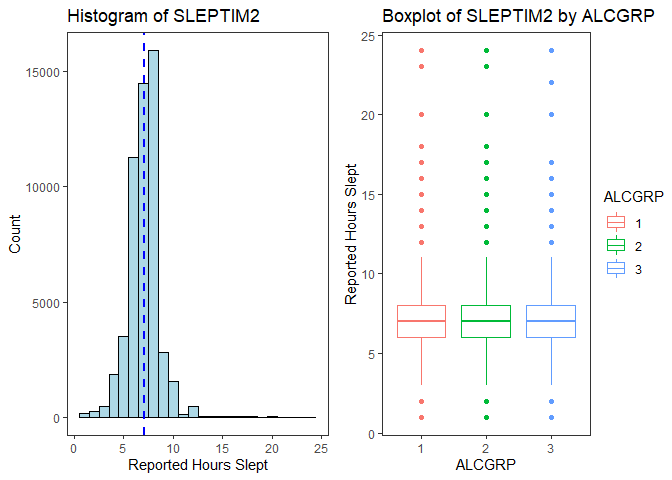
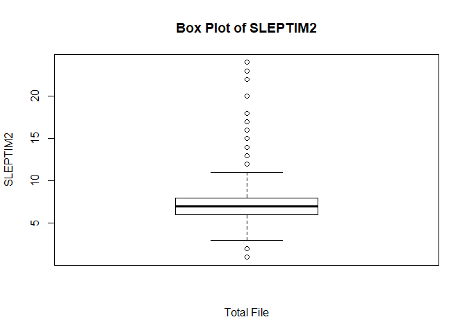
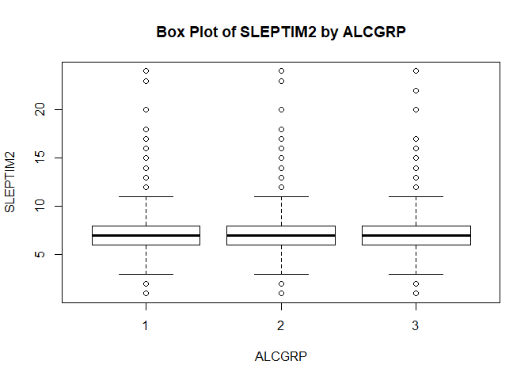

Sample Descriptive Analysis Using Publicly Available Healthcare Data
================
Paul G. Smith
10/29/2019

  - [Sample Descriptive Analysis Using Publicly Available Healthcare
    Data](#sample-descriptive-analysis-using-publicly-available-healthcare-data)
      - [Purpose of this Analysis](#purpose-of-this-analysis)
      - [What is the Behavioral Risk Factor Surveillance System
        (BRFSS):](#what-is-the-behavioral-risk-factor-surveillance-system-brfss)
      - [Hypotheses Used as Foundation for Descriptive
        Analysis](#hypotheses-used-as-foundation-for-descriptive-analysis)
          - [Hypothesis to Demonstrate Continuous Outcome
            Variable](#hypothesis-to-demonstrate-continuous-outcome-variable)
          - [Hypothesis to Demonstrate Categorical Outcome
            Variable](#hypothesis-to-demonstrate-categorical-outcome-variable)
      - [Products Used and Produced in this Sample Descriptive
        Analysis](#products-used-and-produced-in-this-sample-descriptive-analysis)
          - [BRFSS Codebook for 2018](#brfss-codebook-for-2018)
          - [Data Dictionary](#data-dictionary)
          - [BRFSS Dataset](#brfss-dataset)
          - [Population Subset, Exposure Variables, Outcome Variables,
            and Covariate Used in this Descriptive
            Analysis](#population-subset-exposure-variables-outcome-variables-and-covariate-used-in-this-descriptive-analysis)
          - [Descriptive Analysis in R](#descriptive-analysis-in-r)
          - [Final Table 1 for Categorical Outcome
            Variable](#final-table-1-for-categorical-outcome-variable)
          - [Final Table 1 for Continuous Outcome
            Variable](#final-table-1-for-continuous-outcome-variable)
      - [Data Import and Prepartion in
        R](#data-import-and-prepartion-in-r)
      - [Data Reduction in R](#data-reduction-in-r)
      - [Create Additional Variables](#create-additional-variables)
      - [Initial Check of Key Exposure and Outcome Variables in
        R](#initial-check-of-key-exposure-and-outcome-variables-in-r)
      - [Calculation of Frequencies (Categorical
        Variables)](#calculation-of-frequencies-categorical-variables)
      - [Calculation of Means, and Standard Deviations (Continuous
        Variables)](#calculation-of-means-and-standard-deviations-continuous-variables)
      - [Chi Square Significance Testing of Categorical Variables With
        More Than Two
        Values](#chi-square-significance-testing-of-categorical-variables-with-more-than-two-values)
      - [T Tests for Categorical Variables with Only Two
        Values](#t-tests-for-categorical-variables-with-only-two-values)
      - [ANOVA Testing of Continuous
        Variables](#anova-testing-of-continuous-variables)
      - [Final Table 1 for Categorical
        Hypothesis](#final-table-1-for-categorical-hypothesis)
      - [Final Table 1 for Continuous
        Hypothesis](#final-table-1-for-continuous-hypothesis)

# Sample Descriptive Analysis Using Publicly Available Healthcare Data

## Purpose of this Analysis

The purpose of this analysis is to demonstrate the decisions,
documentation, and R code necessary to perform a **Descriptive
Analysis** in R using a publically and freely available dataset.

The initial dataset selected is the **Behavioral Risk Factor
Surveillance System (BRFSS) Survey for 2018.** This is the most recent
results dataset available at the time of this analysis.

## What is the Behavioral Risk Factor Surveillance System (BRFSS):

The BRFSS is the nation’s premier system of health-related telephone
surveys that collect state data about U.S. residents regarding their
health-related risk behaviors, chronic health conditions, and use of
preventive services.

The [**BRFSS
Survey**](https://www.cdc.gov/brfss/data_documentation/index.htm) ia a
large anonymous phone survey conducted **every year** through a state
and federal collaboration and with
[**NHANES**](https://www.cdc.gov/nchs/nhanes/index.htm) represents the
main US risk factor Surveillance.

**The objective of the BRFSSis to collect uniform state-specific data on
health risk behaviors, chronic diseases and conditions, access to health
care, and use of preventive health services related to the leading
causes of death and disability in the United States.** Factors assessed
by the BRFSS include tobacco use, health care coverage, HIV/AIDS
knowledge or prevention, physical activity, and fruit and vegetable
consumption. Data are collected from a random sample of adults (one per
household) through a telephone survey.

This analysis makes use of the 2018 BRFSS core data set. Key
documentation from the CDC, used to document, understand, and interpret
these data include the following:

  - [**2018 BRFSS Overview CDC pdf icon\[PDF – 298
    KB\]**](https://www.cdc.gov/brfss/annual_data/2018/pdf/overview-2018-508.pdf)
    Provides information on the background, design, data collection and
    processing, and the statistical and analytical issues for the
    combined landline and cell phone data set.

  - [**2018 BRFSS Codebook CDC pdf icon\[PDF – 10
    MB\]**](https://www.cdc.gov/brfss/annual_data/2018/pdf/codebook18_llcp-v2-508.pdf)
    Codebook for the file showing variable name, location, and frequency
    of values for all reporting areas combined for the combined landline
    and cell phone data set.

  - [**Calculated Variables in Data Files CDC pdf icon\[PDF – 1.91
    MB\]**](https://www.cdc.gov/brfss/annual_data/2018/pdf/2018-calculated-variables-version4-508.pdf)

  - [**2018 Summary Data Quality Report with Response Rates CDC pdf
    icon\[PDF – 2.19
    MB\]**](https://www.cdc.gov/brfss/annual_data/2018/pdf/2018-sdqr-508.pdf)

  - [**Complex Sampling Weights and Preparing Module Data for Analysis
    CDC pdf icon\[PDF – 564
    KB\]**](https://www.cdc.gov/brfss/annual_data/2018/pdf/Complex-Smple-Weights-Prep-Module-Data-Analysis-2018-508.pdf)
    An explanation of the need to use complex sampling weights and
    instructions for preparing a module data set for analysis.

## Hypotheses Used as Foundation for Descriptive Analysis

Two hypotheses were formulated to demonstate using R to conduct a
descriptive analyis using both a categorical and continuous outcome
variable. A descriptive analysis typically takes a single dataset and
provides the documentation and description of a set of variables,
usually in preparation for a subsequent analysis of that data set (the
actual hypothesis testing). A hypothesis is not actually **required**
for the descriptive analyis, but in this case the reason for a
hypothesis is to aid in the selection of a subset of variables from the
BRFSS survey. The dataset includes information on 274 variables
collected for over 400,000 individuals. A hypothesis in this case allows
us to develop a **smaller dataset containing only those selection,
exposure, and potential confounding variables**.

### Hypothesis to Demonstrate Continuous Outcome Variable

To demonstrate a descriptive analysis with a categorical outcome
variable the following hypothesis was tested: **Increased drinking
behavior leads to reduced sleep time in veterans.**

### Hypothesis to Demonstrate Categorical Outcome Variable

To demonstrate a descriptive analysis with a categorical outcome
variable the following hypothesis was tested: **Increased drinking
behavior leads to greater likelihood of athsma in veterans.**

## Products Used and Produced in this Sample Descriptive Analysis

### BRFSS Codebook for 2018

### Data Dictionary

### BRFSS Dataset

### Population Subset, Exposure Variables, Outcome Variables, and Covariate Used in this Descriptive Analysis

### Descriptive Analysis in R

### Final Table 1 for Categorical Outcome Variable

### Final Table 1 for Continuous Outcome Variable

## Data Import and Prepartion in R

To build my initial dataset for these analyses, I selected and
downloaded the BRFF data in SAS XPT format. This format is more compact
and also contains additional variables calculated by the CDC. For more
information, please see my [**Data Dictionary with Confounders \[XLSX -
33KB\]**](documentation/Data_Dictionary_with_Confounders.xlsx) for this
project and note the values in the source field and values (BRFSS, SAS).

``` r
# Read in the inital downloaded BRFSS dataset in SAS XPT format
source("100_read in BRFSS XPT.R", echo = TRUE)
```

    ## 
    ## > library(foreign)
    ## 
    ## > BRFSS_a <- read.xport("./data/LLCP2018.xpt")
    ## 
    ## > colnames(BRFSS_a)
    ##   [1] "X_STATE"   "FMONTH"    "IDATE"     "IMONTH"    "IDAY"     
    ##   [6] "IYEAR"     "DISPCODE"  "SEQNO"     "X_PSU"     "CTELENM1" 
    ##  [11] "PVTRESD1"  "COLGHOUS"  "STATERE1"  "CELLFON4"  "LADULT"   
    ##  [16] "NUMADULT"  "NUMMEN"    "NUMWOMEN"  "SAFETIME"  "CTELNUM1" 
    ##  [21] "CELLFON5"  "CADULT"    "PVTRESD3"  "CCLGHOUS"  "CSTATE1"  
    ##  [26] "LANDLINE"  "HHADULT"   "GENHLTH"   "PHYSHLTH"  "MENTHLTH" 
    ##  [31] "POORHLTH"  "HLTHPLN1"  "PERSDOC2"  "MEDCOST"   "CHECKUP1" 
    ##  [36] "EXERANY2"  "SLEPTIM1"  "CVDINFR4"  "CVDCRHD4"  "CVDSTRK3" 
    ##  [41] "ASTHMA3"   "ASTHNOW"   "CHCSCNCR"  "CHCOCNCR"  "CHCCOPD1" 
    ##  [46] "HAVARTH3"  "ADDEPEV2"  "CHCKDNY1"  "DIABETE3"  "DIABAGE2" 
    ##  [51] "LASTDEN4"  "RMVTETH4"  "SEX1"      "MARITAL"   "EDUCA"    
    ##  [56] "RENTHOM1"  "NUMHHOL3"  "NUMPHON3"  "CPDEMO1B"  "VETERAN3" 
    ##  [61] "EMPLOY1"   "CHILDREN"  "INCOME2"   "WEIGHT2"   "HEIGHT3"  
    ##  [66] "PREGNANT"  "DEAF"      "BLIND"     "DECIDE"    "DIFFWALK" 
    ##  [71] "DIFFDRES"  "DIFFALON"  "SMOKE100"  "SMOKDAY2"  "STOPSMK2" 
    ##  [76] "LASTSMK2"  "USENOW3"   "ALCDAY5"   "AVEDRNK2"  "DRNK3GE5" 
    ##  [81] "MAXDRNKS"  "FLUSHOT6"  "FLSHTMY2"  "IMFVPLAC"  "PNEUVAC4" 
    ##  [86] "FALL12MN"  "FALLINJ3"  "SEATBELT"  "DRNKDRI2"  "HADMAM"   
    ##  [91] "HOWLONG"   "HADPAP2"   "LASTPAP2"  "HPVTEST"   "HPLSTTST" 
    ##  [96] "HADHYST2"  "PCPSAAD3"  "PCPSADI1"  "PCPSARE1"  "PSATEST1" 
    ## [101] "PSATIME"   "PCPSARS1"  "BLDSTOOL"  "LSTBLDS3"  "HADSIGM3" 
    ## [106] "HADSGCO1"  "LASTSIG3"  "HIVTST6"   "HIVTSTD3"  "HIVRISK5" 
    ## [111] "PDIABTST"  "PREDIAB1"  "INSULIN"   "BLDSUGAR"  "FEETCHK3" 
    ## [116] "DOCTDIAB"  "CHKHEMO3"  "FEETCHK"   "EYEEXAM1"  "DIABEYE"  
    ## [121] "DIABEDU"   "MEDICARE"  "HLTHCVR1"  "DELAYME1"  "DLYOTHER" 
    ## [126] "NOCOV121"  "LSTCOVRG"  "DRVISITS"  "MEDSCOS1"  "CARERCVD" 
    ## [131] "MEDBILL1"  "CIMEMLOS"  "CDHOUSE"   "CDASSIST"  "CDHELP"   
    ## [136] "CDSOCIAL"  "CDDISCUS"  "CAREGIV1"  "CRGVREL2"  "CRGVLNG1" 
    ## [141] "CRGVHRS1"  "CRGVPRB2"  "CRGVPERS"  "CRGVHOUS"  "CRGVMST3" 
    ## [146] "CRGVEXPT"  "ECIGARET"  "ECIGNOW"   "MARIJAN1"  "USEMRJN2" 
    ## [151] "RSNMRJN1"  "ADSLEEP"   "SLEPDAY1"  "SLEPSNO2"  "SLEPBRTH" 
    ## [156] "ADPLEAS1"  "ADDOWN1"   "FEELNERV"  "STOPWORY"  "COPDCOGH" 
    ## [161] "COPDFLEM"  "COPDBRTH"  "COPDBTST"  "COPDSMOK"  "INDORTAN" 
    ## [166] "NUMBURN3"  "SUNPRTCT"  "WKDAYOUT"  "WKENDOUT"  "LCSFIRST" 
    ## [171] "LCSLAST"   "LCSNUMCG"  "LCSCTSCN"  "CNCRDIFF"  "CNCRAGE"  
    ## [176] "CNCRTYP1"  "CSRVTRT2"  "CSRVDOC1"  "CSRVSUM"   "CSRVRTRN" 
    ## [181] "CSRVINST"  "CSRVINSR"  "CSRVDEIN"  "CSRVCLIN"  "CSRVPAIN" 
    ## [186] "CSRVCTL1"  "PCPSADE1"  "PCDMDEC1"  "PROFEXAM"  "LENGEXAM" 
    ## [191] "HPVADVC2"  "HPVADSHT"  "TETANUS1"  "SHINGLE2"  "SOMALE"   
    ## [196] "SOFEMALE"  "TRNSGNDR"  "RCSGENDR"  "RCSRLTN2"  "CASTHDX2" 
    ## [201] "CASTHNO2"  "QSTVER"    "QSTLANG"   "X_METSTAT" "X_URBSTAT"
    ## [206] "MSCODE"    "X_STSTR"   "X_STRWT"   "X_RAWRAKE" "X_WT2RAKE"
    ## [211] "X_IMPRACE" "X_CHISPNC" "X_CRACE1"  "X_CPRACE"  "X_CLLCPWT"
    ## [216] "X_DUALUSE" "X_DUALCOR" "X_LLCPWT2" "X_LLCPWT"  "X_RFHLTH" 
    ## [221] "X_PHYS14D" "X_MENT14D" "X_HCVU651" "X_TOTINDA" "X_MICHD"  
    ## [226] "X_LTASTH1" "X_CASTHM1" "X_ASTHMS1" "X_DRDXAR1" "X_EXTETH3"
    ## [231] "X_ALTETH3" "X_DENVST3" "X_PRACE1"  "X_MRACE1"  "X_HISPANC"
    ## [236] "X_RACE"    "X_RACEG21" "X_RACEGR3" "X_RACE_G1" "X_AGEG5YR"
    ## [241] "X_AGE65YR" "X_AGE80"   "X_AGE_G"   "HTIN4"     "HTM4"     
    ## [246] "WTKG3"     "X_BMI5"    "X_BMI5CAT" "X_RFBMI5"  "X_CHLDCNT"
    ## [251] "X_EDUCAG"  "X_INCOMG"  "X_SMOKER3" "X_RFSMOK3" "DRNKANY5" 
    ## [256] "DROCDY3_"  "X_RFBING5" "X_DRNKWEK" "X_RFDRHV6" "X_FLSHOT6"
    ## [261] "X_PNEUMO3" "X_RFSEAT2" "X_RFSEAT3" "X_DRNKDRV" "X_RFMAM21"
    ## [266] "X_MAM5022" "X_RFPAP34" "X_RFPSA22" "X_RFBLDS3" "X_COL10YR"
    ## [271] "X_HFOB3YR" "X_FS5YR"   "X_FOBTFS"  "X_CRCREC"  "X_AIDTST3"

## Data Reduction in R

Then select a subset of varables (17) to keep for these analyses. And
reduce the data set by elimnating cases that did not provide valid
responses to select questions. Before starting data reduction, look at
the number of records imported from the SAS file. There is data on
**437,436 cases or rows (nrow) in the initial dataset**.

Next apply exclusion to remove (1) non veterans, (2) cases with no
drinking data in ALCDAY5, (3) cases with no sleep data in SLEPTIM1, and
(4) no valid asthma data. There are **52,984 cases (rows) in the final
data set**.


``` r
# Keep data on all cases (rows) but only keep 17 variables
source("105_Keep vars.R", echo = TRUE)
```

    ## 
    ## > BRFSSVarList <- c("VETERAN3", "ALCDAY5", "SLEPTIM1", 
    ## +     "ASTHMA3", "X_AGE_G", "SMOKE100", "SMOKDAY2", "SEX1", "X_HISPANC", 
    ## +     "X_MRACE1", "M ..." ... [TRUNCATED] 
    ## 
    ## > BRFSS_b <- BRFSS_a[BRFSSVarList]
    ## 
    ## > colnames(BRFSS_b)
    ##  [1] "VETERAN3"  "ALCDAY5"   "SLEPTIM1"  "ASTHMA3"   "X_AGE_G"  
    ##  [6] "SMOKE100"  "SMOKDAY2"  "SEX1"      "X_HISPANC" "X_MRACE1" 
    ## [11] "MARITAL"   "GENHLTH"   "HLTHPLN1"  "EDUCA"     "INCOME2"  
    ## [16] "X_BMI5CAT" "EXERANY2" 
    ## 
    ## > nrow(BRFSS_b)
    ## [1] 437436

``` r
source("110_Apply exclusions.R", echo = TRUE)
```

    ## 
    ## > nrow(BRFSS_b)
    ## [1] 437436
    ## 
    ## > BRFSS_c <- subset(BRFSS_b, VETERAN3 == 1)
    ## 
    ## > nrow(BRFSS_c)
    ## [1] 56054
    ## 
    ## > BRFSS_d <- subset(BRFSS_c, ALCDAY5 < 777 | ALCDAY5 == 
    ## +     888)
    ## 
    ## > nrow(BRFSS_d)
    ## [1] 53662
    ## 
    ## > BRFSS_e <- subset(BRFSS_d, SLEPTIM1 < 77)
    ## 
    ## > nrow(BRFSS_e)
    ## [1] 53144
    ## 
    ## > BRFSS_f <- subset(BRFSS_e, ASTHMA3 < 7)
    ## 
    ## > nrow(BRFSS_f)
    ## [1] 52984

Note in the code results above that the data file at this point has been
reduced.

  - FROM initial set: **437,436 records and 275 variables**
  - TO BRFSS\_f: **52,984 records and 17 variables**

## Create Additional Variables

Next, additional variables were created and coded in R for the
population subset (veterans), the exposure variables, and outcome
variables.

  - The variable used to subset the veteran population (VETERAN3) exists
    in the BRFSS dataset. This variable was used in the data reduction
    code above.

  - Three new outcome variables (ALCGRP, DRKWEEKLY, and DRKMONTHLY) were
    derived from one in the original BRFSS dataset (ALCDAY5).

Recall, that we are demonstrating techniques and procedures in R for
both a categorical and continuous variable using two separate
hypotheses.

  - As a result, there are two main outcome variables (categorical -
    ASTHMA3, continuous - SLEPTIM1).

Potential confounding variables were also identified, created, and
coded. These variables were selected and derived after a review of the
BRFSS codebook.

  - 15 potential cofounders were selected from the initial BRFSS data
    set.

These variables were created in three distinct steps in the R code.

1.  First, the alcohol (exposure variables) were created.
2.  Next, the outcome variables were created.
3.  Finally, all of the categorical variables were created

R **table** commands were used to verify proper derivation and coding of
the variables.

``` r
source("115_Make alcohol variables.R", echo = TRUE)
```

    ## 
    ## > BRFSS_g <- BRFSS_f
    ## 
    ## > BRFSS_g$ALCGRP <- 9
    ## 
    ## > BRFSS_g$ALCGRP[BRFSS_g$ALCDAY5 < 200] <- 3
    ## 
    ## > BRFSS_g$ALCGRP[BRFSS_g$ALCDAY5 >= 200 & BRFSS_g$ALCDAY5 < 
    ## +     777] <- 2
    ## 
    ## > BRFSS_g$ALCGRP[BRFSS_g$ALCDAY5 == 888] <- 1
    ## 
    ## > table(BRFSS_g$ALCGRP, BRFSS_g$ALCDAY5)
    ##    
    ##       101   102   103   104   105   106   107   201   202   203   204
    ##   1     0     0     0     0     0     0     0     0     0     0     0
    ##   2     0     0     0     0     0     0     0  3996  2962  1622  1453
    ##   3  2373  1908  1359   668   660   236  1631     0     0     0     0
    ##    
    ##       205   206   207   208   209   210   211   212   213   214   215
    ##   1     0     0     0     0     0     0     0     0     0     0     0
    ##   2  1330   567   345   407    27  1070     6   231    12    83   961
    ##   3     0     0     0     0     0     0     0     0     0     0     0
    ##    
    ##       216   217   218   219   220   221   222   223   224   225   226
    ##   1     0     0     0     0     0     0     0     0     0     0     0
    ##   2    37    17    42     3   996    29    24    13    45   531    23
    ##   3     0     0     0     0     0     0     0     0     0     0     0
    ##    
    ##       227   228   229   230   888
    ##   1     0     0     0     0 23418
    ##   2    49   166    57  3627     0
    ##   3     0     0     0     0     0
    ## 
    ## > BRFSS_g$DRKMONTHLY <- 0
    ## 
    ## > BRFSS_g$DRKMONTHLY[BRFSS_g$ALCGRP == 2] <- 1
    ## 
    ## > table(BRFSS_g$ALCGRP, BRFSS_g$DRKMONTHLY)
    ##    
    ##         0     1
    ##   1 23418     0
    ##   2     0 20731
    ##   3  8835     0
    ## 
    ## > BRFSS_g$DRKWEEKLY <- 0
    ## 
    ## > BRFSS_g$DRKWEEKLY[BRFSS_g$ALCGRP == 1] <- 1
    ## 
    ## > table(BRFSS_g$ALCGRP, BRFSS_g$DRKWEEKLY)
    ##    
    ##         0     1
    ##   1     0 23418
    ##   2 20731     0
    ##   3  8835     0

``` r
source("120_Make outcome variables.R", echo = TRUE)
```

    ## 
    ## > BRFSS_h <- BRFSS_g
    ## 
    ## > BRFSS_h$SLEPTIM2 <- NA
    ## 
    ## > BRFSS_h$SLEPTIM2[!is.na(BRFSS_h$SLEPTIM1) & BRFSS_h$SLEPTIM1 != 
    ## +     77 & BRFSS_h$SLEPTIM1 != 99] <- BRFSS_h$SLEPTIM1
    ## 
    ## > table(BRFSS_h$SLEPTIM1, BRFSS_h$SLEPTIM2)
    ##     
    ##          1     2     3     4     5     6     7     8     9    10    11
    ##   1    144     0     0     0     0     0     0     0     0     0     0
    ##   2      0   226     0     0     0     0     0     0     0     0     0
    ##   3      0     0   477     0     0     0     0     0     0     0     0
    ##   4      0     0     0  1843     0     0     0     0     0     0     0
    ##   5      0     0     0     0  3518     0     0     0     0     0     0
    ##   6      0     0     0     0     0 11260     0     0     0     0     0
    ##   7      0     0     0     0     0     0 14470     0     0     0     0
    ##   8      0     0     0     0     0     0     0 15904     0     0     0
    ##   9      0     0     0     0     0     0     0     0  2804     0     0
    ##   10     0     0     0     0     0     0     0     0     0  1566     0
    ##   11     0     0     0     0     0     0     0     0     0     0   104
    ##   12     0     0     0     0     0     0     0     0     0     0     0
    ##   13     0     0     0     0     0     0     0     0     0     0     0
    ##   14     0     0     0     0     0     0     0     0     0     0     0
    ##   15     0     0     0     0     0     0     0     0     0     0     0
    ##   16     0     0     0     0     0     0     0     0     0     0     0
    ##   17     0     0     0     0     0     0     0     0     0     0     0
    ##   18     0     0     0     0     0     0     0     0     0     0     0
    ##   20     0     0     0     0     0     0     0     0     0     0     0
    ##   22     0     0     0     0     0     0     0     0     0     0     0
    ##   23     0     0     0     0     0     0     0     0     0     0     0
    ##   24     0     0     0     0     0     0     0     0     0     0     0
    ##     
    ##         12    13    14    15    16    17    18    20    22    23    24
    ##   1      0     0     0     0     0     0     0     0     0     0     0
    ##   2      0     0     0     0     0     0     0     0     0     0     0
    ##   3      0     0     0     0     0     0     0     0     0     0     0
    ##   4      0     0     0     0     0     0     0     0     0     0     0
    ##   5      0     0     0     0     0     0     0     0     0     0     0
    ##   6      0     0     0     0     0     0     0     0     0     0     0
    ##   7      0     0     0     0     0     0     0     0     0     0     0
    ##   8      0     0     0     0     0     0     0     0     0     0     0
    ##   9      0     0     0     0     0     0     0     0     0     0     0
    ##   10     0     0     0     0     0     0     0     0     0     0     0
    ##   11     0     0     0     0     0     0     0     0     0     0     0
    ##   12   467     0     0     0     0     0     0     0     0     0     0
    ##   13     0    18     0     0     0     0     0     0     0     0     0
    ##   14     0     0    39     0     0     0     0     0     0     0     0
    ##   15     0     0     0    41     0     0     0     0     0     0     0
    ##   16     0     0     0     0    41     0     0     0     0     0     0
    ##   17     0     0     0     0     0     7     0     0     0     0     0
    ##   18     0     0     0     0     0     0    29     0     0     0     0
    ##   20     0     0     0     0     0     0     0    16     0     0     0
    ##   22     0     0     0     0     0     0     0     0     2     0     0
    ##   23     0     0     0     0     0     0     0     0     0     4     0
    ##   24     0     0     0     0     0     0     0     0     0     0     4
    ## 
    ## > BRFSS_h$ASTHMA4 <- 9
    ## 
    ## > BRFSS_h$ASTHMA4[BRFSS_h$ASTHMA3 == 1] <- 1
    ## 
    ## > BRFSS_h$ASTHMA4[BRFSS_h$ASTHMA3 == 2] <- 0
    ## 
    ## > table(BRFSS_h$ASTHMA3, BRFSS_h$ASTHMA4)
    ##    
    ##         0     1
    ##   1     0  5298
    ##   2 47686     0

``` r
source("125_Make categorical variables.R", echo = TRUE)
```

    ## 
    ## > BRFSS_i <- BRFSS_h
    ## 
    ## > BRFSS_i$AGE2 <- 0
    ## 
    ## > BRFSS_i$AGE3 <- 0
    ## 
    ## > BRFSS_i$AGE4 <- 0
    ## 
    ## > BRFSS_i$AGE5 <- 0
    ## 
    ## > BRFSS_i$AGE6 <- 0
    ## 
    ## > BRFSS_i$AGE2[BRFSS_i$X_AGE_G == 2] <- 1
    ## 
    ## > table(BRFSS_i$X_AGE_G, BRFSS_i$AGE2)
    ##    
    ##         0     1
    ##   1  1090     0
    ##   2     0  2947
    ##   3  3560     0
    ##   4  6152     0
    ##   5  8783     0
    ##   6 30452     0
    ## 
    ## > BRFSS_i$AGE3[BRFSS_i$X_AGE_G == 3] <- 1
    ## 
    ## > table(BRFSS_i$X_AGE_G, BRFSS_i$AGE3)
    ##    
    ##         0     1
    ##   1  1090     0
    ##   2  2947     0
    ##   3     0  3560
    ##   4  6152     0
    ##   5  8783     0
    ##   6 30452     0
    ## 
    ## > BRFSS_i$AGE4[BRFSS_i$X_AGE_G == 4] <- 1
    ## 
    ## > table(BRFSS_i$X_AGE_G, BRFSS_i$AGE4)
    ##    
    ##         0     1
    ##   1  1090     0
    ##   2  2947     0
    ##   3  3560     0
    ##   4     0  6152
    ##   5  8783     0
    ##   6 30452     0
    ## 
    ## > BRFSS_i$AGE5[BRFSS_i$X_AGE_G == 5] <- 1
    ## 
    ## > table(BRFSS_i$X_AGE_G, BRFSS_i$AGE5)
    ##    
    ##         0     1
    ##   1  1090     0
    ##   2  2947     0
    ##   3  3560     0
    ##   4  6152     0
    ##   5     0  8783
    ##   6 30452     0
    ## 
    ## > BRFSS_i$AGE6[BRFSS_i$X_AGE_G == 6] <- 1
    ## 
    ## > table(BRFSS_i$X_AGE_G, BRFSS_i$AGE6)
    ##    
    ##         0     1
    ##   1  1090     0
    ##   2  2947     0
    ##   3  3560     0
    ##   4  6152     0
    ##   5  8783     0
    ##   6     0 30452
    ## 
    ## > BRFSS_i$NEVERSMK <- 0
    ## 
    ## > BRFSS_i$NEVERSMK[BRFSS_i$SMOKE100 == 2] <- 1
    ## 
    ## > table(BRFSS_i$SMOKE100, BRFSS_i$NEVERSMK)
    ##    
    ##         0     1
    ##   1 31298     0
    ##   2     0 21414
    ##   7   242     0
    ##   9    30     0
    ## 
    ## > BRFSS_i$SMOKGRP <- 9
    ## 
    ## > BRFSS_i$SMOKGRP[BRFSS_i$SMOKDAY2 == 1 | BRFSS_i$SMOKDAY2 == 
    ## +     2] <- 1
    ## 
    ## > BRFSS_i$SMOKGRP[BRFSS_i$SMOKDAY2 == 3 | BRFSS_i$NEVERSMK == 
    ## +     1] <- 2
    ## 
    ## > table(BRFSS_i$SMOKGRP, BRFSS_i$SMOKDAY2)
    ##    
    ##         1     2     3     7     9
    ##   1  5886  1968     0     0     0
    ##   2     0     0 23406     0     0
    ##   9     0     0     0    20    18
    ## 
    ## > table(BRFSS_i$SMOKGRP, BRFSS_i$SMOKE100)
    ##    
    ##         1     2     7     9
    ##   1  7854     0     0     0
    ##   2 23406 21414     0     0
    ##   9    38     0   242    30
    ## 
    ## > BRFSS_i$SMOKER <- 0
    ## 
    ## > BRFSS_i$SMOKER[BRFSS_i$SMOKGRP == 1] <- 1
    ## 
    ## > table(BRFSS_i$SMOKGRP, BRFSS_i$SMOKER)
    ##    
    ##         0     1
    ##   1     0  7854
    ##   2 44820     0
    ##   9   310     0
    ## 
    ## > BRFSS_i$SEX <- 9
    ## 
    ## > BRFSS_i$SEX[BRFSS_i$SEX1 == 1] <- 1
    ## 
    ## > BRFSS_i$SEX[BRFSS_i$SEX1 == 2] <- 2
    ## 
    ## > BRFSS_i$MALE <- 0
    ## 
    ## > BRFSS_i$MALE[BRFSS_i$SEX == 1] <- 1
    ## 
    ## > table(BRFSS_i$MALE, BRFSS_i$SEX)
    ##    
    ##         1     2     9
    ##   0     0  5075   104
    ##   1 47805     0     0
    ## 
    ## > BRFSS_i$HISPANIC <- 0
    ## 
    ## > BRFSS_i$HISPANIC[BRFSS_i$X_HISPANC == 1] <- 1
    ## 
    ## > table(BRFSS_i$HISPANIC, BRFSS_i$X_HISPANC)
    ##    
    ##         1     2     9
    ##   0     0 50162   589
    ##   1  2233     0     0
    ## 
    ## > BRFSS_i$RACEGRP <- 9
    ## 
    ## > BRFSS_i$RACEGRP[BRFSS_i$X_MRACE1 == 1] <- 1
    ## 
    ## > BRFSS_i$RACEGRP[BRFSS_i$X_MRACE1 == 2] <- 2
    ## 
    ## > BRFSS_i$RACEGRP[BRFSS_i$X_MRACE1 == 3] <- 3
    ## 
    ## > BRFSS_i$RACEGRP[BRFSS_i$X_MRACE1 == 4] <- 4
    ## 
    ## > BRFSS_i$RACEGRP[BRFSS_i$X_MRACE1 == 5] <- 5
    ## 
    ## > BRFSS_i$RACEGRP[BRFSS_i$X_MRACE1 == 6 | BRFSS_i$X_MRACE1 == 
    ## +     7] <- 6
    ## 
    ## > table(BRFSS_i$RACEGRP, BRFSS_i$X_MRACE1)
    ##    
    ##         1     2     3     4     5     6     7    77    99
    ##   1 43844     0     0     0     0     0     0     0     0
    ##   2     0  4019     0     0     0     0     0     0     0
    ##   3     0     0  1049     0     0     0     0     0     0
    ##   4     0     0     0   582     0     0     0     0     0
    ##   5     0     0     0     0   320     0     0     0     0
    ##   6     0     0     0     0     0   858  1304     0     0
    ##   9     0     0     0     0     0     0     0   195   813
    ## 
    ## > BRFSS_i$BLACK <- 0
    ## 
    ## > BRFSS_i$ASIAN <- 0
    ## 
    ## > BRFSS_i$OTHRACE <- 0
    ## 
    ## > BRFSS_i$BLACK[BRFSS_i$RACEGRP == 2] <- 1
    ## 
    ## > table(BRFSS_i$RACEGRP, BRFSS_i$BLACK)
    ##    
    ##         0     1
    ##   1 43844     0
    ##   2     0  4019
    ##   3  1049     0
    ##   4   582     0
    ##   5   320     0
    ##   6  2162     0
    ##   9  1008     0
    ## 
    ## > BRFSS_i$ASIAN[BRFSS_i$RACEGRP == 4] <- 1
    ## 
    ## > table(BRFSS_i$RACEGRP, BRFSS_i$ASIAN)
    ##    
    ##         0     1
    ##   1 43844     0
    ##   2  4019     0
    ##   3  1049     0
    ##   4     0   582
    ##   5   320     0
    ##   6  2162     0
    ##   9  1008     0
    ## 
    ## > BRFSS_i$OTHRACE[BRFSS_i$RACEGRP == 3 | BRFSS_i$RACEGRP == 
    ## +     5 | BRFSS_i$RACEGRP == 6 | BRFSS_i$RACEGRP == 7] <- 1
    ## 
    ## > table(BRFSS_i$RACEGRP, BRFSS_i$OTHRACE)
    ##    
    ##         0     1
    ##   1 43844     0
    ##   2  4019     0
    ##   3     0  1049
    ##   4   582     0
    ##   5     0   320
    ##   6     0  2162
    ##   9  1008     0
    ## 
    ## > BRFSS_i$MARGRP <- 9
    ## 
    ## > BRFSS_i$MARGRP[BRFSS_i$MARITAL == 1 | BRFSS_i$MARITAL == 
    ## +     5] <- 1
    ## 
    ## > BRFSS_i$MARGRP[BRFSS_i$MARITAL == 2 | BRFSS_i$MARITAL == 
    ## +     3] <- 2
    ## 
    ## > BRFSS_i$MARGRP[BRFSS_i$MARITAL == 4] <- 3
    ## 
    ## > table(BRFSS_i$MARGRP, BRFSS_i$MARITAL)
    ##    
    ##         1     2     3     4     5     6     9
    ##   1 31147     0     0     0  4929     0     0
    ##   2     0  8280  6461     0     0     0     0
    ##   3     0     0     0   941     0     0     0
    ##   9     0     0     0     0     0   984   242
    ## 
    ## > BRFSS_i$NEVERMAR <- 0
    ## 
    ## > BRFSS_i$FORMERMAR <- 0
    ## 
    ## > BRFSS_i$NEVERMAR[BRFSS_i$MARGRP == 3] <- 1
    ## 
    ## > table(BRFSS_i$MARGRP, BRFSS_i$NEVERMAR)
    ##    
    ##         0     1
    ##   1 36076     0
    ##   2 14741     0
    ##   3     0   941
    ##   9  1226     0
    ## 
    ## > BRFSS_i$FORMERMAR[BRFSS_i$MARGRP == 2] <- 1
    ## 
    ## > table(BRFSS_i$MARGRP, BRFSS_i$FORMERMAR)
    ##    
    ##         0     1
    ##   1 36076     0
    ##   2     0 14741
    ##   3   941     0
    ##   9  1226     0
    ## 
    ## > BRFSS_i$GENHLTH2 <- 9
    ## 
    ## > BRFSS_i$GENHLTH2[BRFSS_i$GENHLTH == 1] <- 1
    ## 
    ## > BRFSS_i$GENHLTH2[BRFSS_i$GENHLTH == 2] <- 2
    ## 
    ## > BRFSS_i$GENHLTH2[BRFSS_i$GENHLTH == 3] <- 3
    ## 
    ## > BRFSS_i$GENHLTH2[BRFSS_i$GENHLTH == 4] <- 4
    ## 
    ## > BRFSS_i$GENHLTH2[BRFSS_i$GENHLTH == 5] <- 5
    ## 
    ## > table(BRFSS_i$GENHLTH2, BRFSS_i$GENHLTH)
    ##    
    ##         1     2     3     4     5     7     9
    ##   1  7850     0     0     0     0     0     0
    ##   2     0 16288     0     0     0     0     0
    ##   3     0     0 17561     0     0     0     0
    ##   4     0     0     0  7943     0     0     0
    ##   5     0     0     0     0  3207     0     0
    ##   9     0     0     0     0     0    92    43
    ## 
    ## > BRFSS_i$FAIRHLTH <- 0
    ## 
    ## > BRFSS_i$POORHLTH <- 0
    ## 
    ## > BRFSS_i$FAIRHLTH[BRFSS_i$GENHLTH2 == 4] <- 1
    ## 
    ## > table(BRFSS_i$FAIRHLTH, BRFSS_i$GENHLTH2)
    ##    
    ##         1     2     3     4     5     9
    ##   0  7850 16288 17561     0  3207   135
    ##   1     0     0     0  7943     0     0
    ## 
    ## > BRFSS_i$POORHLTH[BRFSS_i$GENHLTH2 == 5] <- 1
    ## 
    ## > table(BRFSS_i$POORHLTH, BRFSS_i$GENHLTH2)
    ##    
    ##         1     2     3     4     5     9
    ##   0  7850 16288 17561  7943     0   135
    ##   1     0     0     0     0  3207     0
    ## 
    ## > BRFSS_i$HLTHPLN2 <- 9
    ## 
    ## > BRFSS_i$HLTHPLN2[BRFSS_i$HLTHPLN1 == 1] <- 1
    ## 
    ## > BRFSS_i$HLTHPLN2[BRFSS_i$HLTHPLN1 == 2] <- 2
    ## 
    ## > table(BRFSS_i$HLTHPLN1, BRFSS_i$HLTHPLN2)
    ##    
    ##         1     2     9
    ##   1 50609     0     0
    ##   2     0  2218     0
    ##   7     0     0    93
    ##   9     0     0    64
    ## 
    ## > BRFSS_i$NOPLAN <- 0
    ## 
    ## > BRFSS_i$NOPLAN[BRFSS_i$HLTHPLN2 == 2] <- 1
    ## 
    ## > table(BRFSS_i$NOPLAN, BRFSS_i$HLTHPLN2)
    ##    
    ##         1     2     9
    ##   0 50609     0   157
    ##   1     0  2218     0
    ## 
    ## > BRFSS_i$EDGROUP <- 9
    ## 
    ## > BRFSS_i$EDGROUP[BRFSS_i$EDUCA == 1 | BRFSS_i$EDUCA == 
    ## +     2 | BRFSS_i$EDUCA == 3] <- 1
    ## 
    ## > BRFSS_i$EDGROUP[BRFSS_i$EDUCA == 4] <- 2
    ## 
    ## > BRFSS_i$EDGROUP[BRFSS_i$EDUCA == 5] <- 3
    ## 
    ## > BRFSS_i$EDGROUP[BRFSS_i$EDUCA == 6] <- 4
    ## 
    ## > table(BRFSS_i$EDGROUP, BRFSS_i$EDUCA)
    ##    
    ##         1     2     3     4     5     6     9
    ##   1    24   514  1370     0     0     0     0
    ##   2     0     0     0 14025     0     0     0
    ##   3     0     0     0     0 16603     0     0
    ##   4     0     0     0     0     0 20339     0
    ##   9     0     0     0     0     0     0   109
    ## 
    ## > BRFSS_i$LOWED <- 0
    ## 
    ## > BRFSS_i$SOMECOLL <- 0
    ## 
    ## > BRFSS_i$LOWED[BRFSS_i$EDGROUP == 1 | BRFSS_i$EDGROUP == 
    ## +     2] <- 1
    ## 
    ## > table(BRFSS_i$LOWED, BRFSS_i$EDGROUP)
    ##    
    ##         1     2     3     4     9
    ##   0     0     0 16603 20339   109
    ##   1  1908 14025     0     0     0
    ## 
    ## > BRFSS_i$SOMECOLL[BRFSS_i$EDGROUP == 3] <- 1
    ## 
    ## > table(BRFSS_i$SOMECOLL, BRFSS_i$EDGROUP)
    ##    
    ##         1     2     3     4     9
    ##   0  1908 14025     0 20339   109
    ##   1     0     0 16603     0     0
    ## 
    ## > BRFSS_i$INCOME3 <- BRFSS_i$INCOME2
    ## 
    ## > BRFSS_i$INCOME3[BRFSS_i$INCOME2 >= 77] <- 9
    ## 
    ## > table(BRFSS_i$INCOME2, BRFSS_i$INCOME3)
    ##     
    ##          1     2     3     4     5     6     7     8     9
    ##   1    920     0     0     0     0     0     0     0     0
    ##   2      0  1720     0     0     0     0     0     0     0
    ##   3      0     0  2411     0     0     0     0     0     0
    ##   4      0     0     0  3776     0     0     0     0     0
    ##   5      0     0     0     0  5258     0     0     0     0
    ##   6      0     0     0     0     0  7560     0     0     0
    ##   7      0     0     0     0     0     0  8824     0     0
    ##   8      0     0     0     0     0     0     0 15935     0
    ##   77     0     0     0     0     0     0     0     0  2199
    ##   99     0     0     0     0     0     0     0     0  4377
    ## 
    ## > BRFSS_i$INC1 <- 0
    ## 
    ## > BRFSS_i$INC2 <- 0
    ## 
    ## > BRFSS_i$INC3 <- 0
    ## 
    ## > BRFSS_i$INC4 <- 0
    ## 
    ## > BRFSS_i$INC5 <- 0
    ## 
    ## > BRFSS_i$INC6 <- 0
    ## 
    ## > BRFSS_i$INC7 <- 0
    ## 
    ## > BRFSS_i$INC1[BRFSS_i$INCOME3 == 1] <- 1
    ## 
    ## > table(BRFSS_i$INC1, BRFSS_i$INCOME3)
    ##    
    ##         1     2     3     4     5     6     7     8     9
    ##   0     0  1720  2411  3776  5258  7560  8824 15935  6576
    ##   1   920     0     0     0     0     0     0     0     0
    ## 
    ## > BRFSS_i$INC2[BRFSS_i$INCOME3 == 2] <- 1
    ## 
    ## > table(BRFSS_i$INC2, BRFSS_i$INCOME3)
    ##    
    ##         1     2     3     4     5     6     7     8     9
    ##   0   920     0  2411  3776  5258  7560  8824 15935  6576
    ##   1     0  1720     0     0     0     0     0     0     0
    ## 
    ## > BRFSS_i$INC3[BRFSS_i$INCOME3 == 3] <- 1
    ## 
    ## > table(BRFSS_i$INC3, BRFSS_i$INCOME3)
    ##    
    ##         1     2     3     4     5     6     7     8     9
    ##   0   920  1720     0  3776  5258  7560  8824 15935  6576
    ##   1     0     0  2411     0     0     0     0     0     0
    ## 
    ## > BRFSS_i$INC4[BRFSS_i$INCOME3 == 4] <- 1
    ## 
    ## > table(BRFSS_i$INC4, BRFSS_i$INCOME3)
    ##    
    ##         1     2     3     4     5     6     7     8     9
    ##   0   920  1720  2411     0  5258  7560  8824 15935  6576
    ##   1     0     0     0  3776     0     0     0     0     0
    ## 
    ## > BRFSS_i$INC5[BRFSS_i$INCOME3 == 5] <- 1
    ## 
    ## > table(BRFSS_i$INC5, BRFSS_i$INCOME3)
    ##    
    ##         1     2     3     4     5     6     7     8     9
    ##   0   920  1720  2411  3776     0  7560  8824 15935  6576
    ##   1     0     0     0     0  5258     0     0     0     0
    ## 
    ## > BRFSS_i$INC6[BRFSS_i$INCOME3 == 6] <- 1
    ## 
    ## > table(BRFSS_i$INC6, BRFSS_i$INCOME3)
    ##    
    ##         1     2     3     4     5     6     7     8     9
    ##   0   920  1720  2411  3776  5258     0  8824 15935  6576
    ##   1     0     0     0     0     0  7560     0     0     0
    ## 
    ## > BRFSS_i$INC7[BRFSS_i$INCOME3 == 7] <- 1
    ## 
    ## > table(BRFSS_i$INC7, BRFSS_i$INCOME3)
    ##    
    ##         1     2     3     4     5     6     7     8     9
    ##   0   920  1720  2411  3776  5258  7560     0 15935  6576
    ##   1     0     0     0     0     0     0  8824     0     0
    ## 
    ## > BRFSS_i$BMICAT <- 9
    ## 
    ## > BRFSS_i$BMICAT[BRFSS_i$X_BMI5CAT == 1] <- 1
    ## 
    ## > BRFSS_i$BMICAT[BRFSS_i$X_BMI5CAT == 2] <- 2
    ## 
    ## > BRFSS_i$BMICAT[BRFSS_i$X_BMI5CAT == 3] <- 3
    ## 
    ## > BRFSS_i$BMICAT[BRFSS_i$X_BMI5CAT == 4] <- 4
    ## 
    ## > table(BRFSS_i$BMICAT, BRFSS_i$X_BMI5CAT)
    ##    
    ##         1     2     3     4
    ##   1   475     0     0     0
    ##   2     0 12493     0     0
    ##   3     0     0 22206     0
    ##   4     0     0     0 16669
    ##   9     0     0     0     0
    ## 
    ## > BRFSS_i$UNDWT <- 0
    ## 
    ## > BRFSS_i$OVWT <- 0
    ## 
    ## > BRFSS_i$OBESE <- 0
    ## 
    ## > BRFSS_i$UNDWT[BRFSS_i$BMICAT == 1] <- 1
    ## 
    ## > table(BRFSS_i$UNDWT, BRFSS_i$BMICAT)
    ##    
    ##         1     2     3     4     9
    ##   0     0 12493 22206 16669  1141
    ##   1   475     0     0     0     0
    ## 
    ## > BRFSS_i$OVWT[BRFSS_i$BMICAT == 3] <- 1
    ## 
    ## > table(BRFSS_i$OVWT, BRFSS_i$BMICAT)
    ##    
    ##         1     2     3     4     9
    ##   0   475 12493     0 16669  1141
    ##   1     0     0 22206     0     0
    ## 
    ## > BRFSS_i$OBESE[BRFSS_i$BMICAT == 4] <- 1
    ## 
    ## > table(BRFSS_i$OBESE, BRFSS_i$BMICAT)
    ##    
    ##         1     2     3     4     9
    ##   0   475 12493 22206     0  1141
    ##   1     0     0     0 16669     0
    ## 
    ## > BRFSS_i$EXERANY3 <- 9
    ## 
    ## > BRFSS_i$EXERANY3[BRFSS_i$EXERANY2 == 1] <- 1
    ## 
    ## > BRFSS_i$EXERANY3[BRFSS_i$EXERANY2 == 2] <- 2
    ## 
    ## > table(BRFSS_i$EXERANY3, BRFSS_i$EXERANY2)
    ##    
    ##         1     2     7     9
    ##   1 39839     0     0     0
    ##   2     0 13062     0     0
    ##   9     0     0    62    21
    ## 
    ## > BRFSS_i$NOEXER <- 0
    ## 
    ## > BRFSS_i$NOEXER[BRFSS_i$EXERANY3 == 2] <- 1
    ## 
    ## > table(BRFSS_i$NOEXER, BRFSS_i$EXERANY3)
    ##    
    ##         1     2     9
    ##   0 39839     0    83
    ##   1     0 13062     0
    ## 
    ## > nrow(BRFSS_i)
    ## [1] 52984

At this point the dataset has been finalized for the Descriptive
Analysis. To facilitate these subsequent analyses, the dataset is saved
in CSV format. The subsequent analyses, will only need to load this
final version of the data.

``` r
source("190_Write out analytic.R", echo = TRUE)
```

    ## 
    ## > write.csv(BRFSS_i, file = "./data/analytic.csv")

## Initial Check of Key Exposure and Outcome Variables in R

``` r
source("200_Check asthma.R", echo = TRUE)
```

    ## 
    ## > analytic <- read.csv(file = "./data/analytic.csv", 
    ## +     header = TRUE, sep = ",")
    ## 
    ## > AsthmaFreq <- table(analytic$ASTHMA4)
    ## 
    ## > AsthmaFreq
    ## 
    ##     0     1 
    ## 47686  5298 
    ## 
    ## > write.csv(AsthmaFreq, file = "./data/AsthmaFreq.csv")
    ## 
    ## > PropAsthma <- sum(analytic$ASTHMA4)/(length(analytic$ASTHMA4))
    ## 
    ## > PropAsthma
    ## [1] 0.09999245
    ## 
    ## > AsthmaAlcFreq <- table(analytic$ASTHMA4, analytic$ALCGRP)
    ## 
    ## > AsthmaAlcFreq
    ##    
    ##         1     2     3
    ##   0 20861 18778  8047
    ##   1  2557  1953   788
    ## 
    ## > write.csv(AsthmaAlcFreq, file = "./data/AsthmaAlcFreq.csv")

``` r
source("205_Check sleep duration.R", echo = TRUE)
```

    ## 
    ## > analytic <- read.csv(file = "./data/analytic.csv", 
    ## +     header = TRUE, sep = ",")
    ## 
    ## > summary(analytic$SLEPTIM2)
    ##    Min. 1st Qu.  Median    Mean 3rd Qu.    Max. 
    ##   1.000   6.000   7.000   7.058   8.000  24.000 
    ## 
    ## > hist(analytic$SLEPTIM2, main = "Histogram of SLEPTIM2", 
    ## +     xlab = "Class SLEPTIM2", ylab = "Frequency", xlim = c(0, 
    ## +         15), ylim = c(0,  .... [TRUNCATED]

<!-- -->

    ## 
    ## > boxplot(analytic$SLEPTIM2, main = "Box Plot of SLEPTIM2", 
    ## +     xlab = "Total File", ylab = "SLEPTIM2")

<!-- -->

    ## 
    ## > boxplot(SLEPTIM2 ~ ALCGRP, data = analytic, main = "Box Plot of SLEPTIM2 by ALCGRP", 
    ## +     xlab = "ALCGRP", ylab = "SLEPTIM2")

<!-- -->

## Calculation of Frequencies (Categorical Variables)

Next, frequencies for the exposure and categorical outcome variables
were produced in R code.

These calculations were processed in three distinct steps in the R code.

1.  First, the overall frequencies for the exposure and confounders were
    run.
2.  Next, the frequencies for the categorical outcomes ASTHMA were run.
3.  Finally, the frequencies for the categorical outcome NOASTHMA were
    run.

Macros were created in the R code to produce CVS files for most of the
frequency outcome data. These CSV files aided in the final assembly of
an MS EXCEL Table 1.

Note: These CSV files appear in separate subdirectories within the main
data directory **(./data)**.

``` r
source("210_Table 1 overall frequencies.R", echo = TRUE)
```

    ## 
    ## > analytic <- read.csv(file = "./data/analytic.csv", 
    ## +     header = TRUE, sep = ",")
    ## 
    ## > AsthmaFreq <- table(analytic$ASTHMA4)
    ## 
    ## > AsthmaFreq
    ## 
    ##     0     1 
    ## 47686  5298 
    ## 
    ## > write.csv(AsthmaFreq, file = "./data/overall/AsthmaFreq.csv")
    ## 
    ## > AlcFreq <- table(analytic$ALCGRP)
    ## 
    ## > AlcFreq
    ## 
    ##     1     2     3 
    ## 23418 20731  8835 
    ## 
    ## > write.csv(AlcFreq, file = "./data/overall/AlcFreq.csv")
    ## 
    ## > library(gtools)
    ## 
    ## > FreqTbl <- defmacro(OutputTable, InputVar, CSVTable, 
    ## +     expr = {
    ## +         OutputTable <- table(InputVar)
    ## +         write.csv(OutputTable, file  .... [TRUNCATED] 
    ## 
    ## > FreqTbl(AlcFreq, analytic$ALCGRP, "Alc")
    ## 
    ## > FreqTbl(AgeFreq, analytic$X_AGE_G, "Age")
    ## 
    ## > FreqTbl(SexFreq, analytic$SEX, "Sex")
    ## 
    ## > FreqTbl(HispFreq, analytic$X_HISPANC, "Hisp")
    ## 
    ## > FreqTbl(RaceFreq, analytic$RACEGRP, "Race")
    ## 
    ## > FreqTbl(MaritalFreq, analytic$MARGRP, "Mar")
    ## 
    ## > FreqTbl(EdFreq, analytic$EDGROUP, "Ed")
    ## 
    ## > FreqTbl(IncFreq, analytic$INCOME3, "Inc")
    ## 
    ## > FreqTbl(BMIFreq, analytic$BMICAT, "BMI")
    ## 
    ## > FreqTbl(SmokeFreq, analytic$SMOKGRP, "Smok")
    ## 
    ## > FreqTbl(ExerFreq, analytic$EXERANY3, "Exer")
    ## 
    ## > FreqTbl(HlthPlanFreq, analytic$HLTHPLN2, "HlthPln")
    ## 
    ## > FreqTbl(GenHlthFreq, analytic$GENHLTH2, "GenHlth")

``` r
source("215_Table 1 asthma frequencies.R", echo = TRUE)
```

    ## 
    ## > analytic <- read.csv(file = "./data/analytic.csv", 
    ## +     header = TRUE, sep = ",")
    ## 
    ## > asthmaonly <- subset(analytic, ASTHMA4 == 1)
    ## 
    ## > table(asthmaonly$ASTHMA4)
    ## 
    ##    1 
    ## 5298 
    ## 
    ## > nrow(asthmaonly)
    ## [1] 5298
    ## 
    ## > AsthmaFreq <- table(asthmaonly$ASTHMA4)
    ## 
    ## > AsthmaFreq
    ## 
    ##    1 
    ## 5298 
    ## 
    ## > write.csv(AsthmaFreq, file = "./data/asthma/Asthma.csv")
    ## 
    ## > library(gtools)
    ## 
    ## > FreqTbl <- defmacro(OutputTable, InputVar, CSVTable, 
    ## +     expr = {
    ## +         OutputTable <- table(InputVar)
    ## +         write.csv(OutputTable, file  .... [TRUNCATED] 
    ## 
    ## > FreqTbl(AlcGrpFreq, asthmaonly$ALCGRP, "Alc")
    ## 
    ## > FreqTbl(AgeGrpFreq, asthmaonly$X_AGE_G, "Age")
    ## 
    ## > FreqTbl(SexFreq, asthmaonly$SEX, "Sex")
    ## 
    ## > FreqTbl(HispFreq, asthmaonly$X_HISPANC, "Hisp")
    ## 
    ## > FreqTbl(RaceFreq, asthmaonly$RACEGRP, "Race")
    ## 
    ## > FreqTbl(MaritalFreq, asthmaonly$MARGRP, "Mar")
    ## 
    ## > FreqTbl(EdFreq, asthmaonly$EDGROUP, "Ed")
    ## 
    ## > FreqTbl(IncFreq, asthmaonly$INCOME3, "Inc")
    ## 
    ## > FreqTbl(BMIFreq, asthmaonly$BMICAT, "BMI")
    ## 
    ## > FreqTbl(SmokeFreq, asthmaonly$SMOKGRP, "Smok")
    ## 
    ## > FreqTbl(ExerFreq, asthmaonly$EXERANY3, "Exer")
    ## 
    ## > FreqTbl(HlthPlanFreq, asthmaonly$HLTHPLN2, "HlthPln")
    ## 
    ## > FreqTbl(GenHlthFreq, asthmaonly$GENHLTH2, "GenHlth")

``` r
source("220_Table 1 no asthma frequencies.R", echo = TRUE)
```

    ## 
    ## > analytic <- read.csv(file = "./data/analytic.csv", 
    ## +     header = TRUE, sep = ",")
    ## 
    ## > noasthmaonly <- subset(analytic, ASTHMA4 != 1)
    ## 
    ## > table(noasthmaonly$ASTHMA4)
    ## 
    ##     0 
    ## 47686 
    ## 
    ## > nrow(noasthmaonly)
    ## [1] 47686
    ## 
    ## > AsthmaFreq <- table(noasthmaonly$ASTHMA4)
    ## 
    ## > AsthmaFreq
    ## 
    ##     0 
    ## 47686 
    ## 
    ## > write.csv(AsthmaFreq, file = "./data/noasthma/Asthma.csv")
    ## 
    ## > library(gtools)
    ## 
    ## > FreqTbl <- defmacro(OutputTable, InputVar, CSVTable, 
    ## +     expr = {
    ## +         OutputTable <- table(InputVar)
    ## +         write.csv(OutputTable, file  .... [TRUNCATED] 
    ## 
    ## > FreqTbl(AlcGrpFreq, noasthmaonly$ALCGRP, "Alc")
    ## 
    ## > FreqTbl(AgeGrpFreq, noasthmaonly$X_AGE_G, "Age")
    ## 
    ## > FreqTbl(SexFreq, noasthmaonly$SEX, "Sex")
    ## 
    ## > FreqTbl(HispFreq, noasthmaonly$X_HISPANC, "Hisp")
    ## 
    ## > FreqTbl(RaceFreq, noasthmaonly$RACEGRP, "Race")
    ## 
    ## > FreqTbl(MaritalFreq, noasthmaonly$MARGRP, "Mar")
    ## 
    ## > FreqTbl(EdFreq, noasthmaonly$EDGROUP, "Ed")
    ## 
    ## > FreqTbl(IncFreq, noasthmaonly$INCOME3, "Inc")
    ## 
    ## > FreqTbl(BMIFreq, noasthmaonly$BMICAT, "BMI")
    ## 
    ## > FreqTbl(SmokeFreq, noasthmaonly$SMOKGRP, "Smok")
    ## 
    ## > FreqTbl(ExerFreq, noasthmaonly$EXERANY3, "Exer")
    ## 
    ## > FreqTbl(HlthPlanFreq, noasthmaonly$HLTHPLN2, "HlthPln")
    ## 
    ## > FreqTbl(GenHlthFreq, noasthmaonly$GENHLTH2, "GenHlth")

## Calculation of Means, and Standard Deviations (Continuous Variables)

Means and Standard Deviations were calculated for all continuous
variables,

``` r
source("225_Table 1 means and sds.R", echo = TRUE)
```

    ## 
    ## > analytic <- read.csv(file = "./data/analytic.csv", 
    ## +     header = TRUE, sep = ",")
    ## 
    ## > mean(analytic$SLEPTIM2)
    ## [1] 7.057961
    ## 
    ## > sd(analytic$SLEPTIM2)
    ## [1] 1.583223
    ## 
    ## > library(plyr)
    ## 
    ## > ddply(analytic, ~ALCGRP, summarise, mean = mean(SLEPTIM2), 
    ## +     sd = sd(SLEPTIM2))
    ##   ALCGRP     mean       sd
    ## 1      1 7.087241 1.715748
    ## 2      2 7.021080 1.473709
    ## 3      3 7.066893 1.458872
    ## 
    ## > library(gtools)
    ## 
    ## > SumTbl <- defmacro(OutputTable, GroupVar, CSVTable, 
    ## +     expr = {
    ## +         OutputTable <- ddply(analytic, ~GroupVar, summarise, 
    ## +             me .... [TRUNCATED] 
    ## 
    ## > SumTbl(AstGrpSum, analytic$ASTHMA4, "Ast")
    ## 
    ## > SumTbl(AlcGrpSum, analytic$ALCGRP, "Alc")
    ## 
    ## > SumTbl(AgeGrpSum, analytic$X_AGE_G, "Age")
    ## 
    ## > SumTbl(SexSum, analytic$SEX, "Sex")
    ## 
    ## > SumTbl(HispSum, analytic$X_HISPANC, "Hisp")
    ## 
    ## > SumTbl(RaceSum, analytic$RACEGRP, "Race")
    ## 
    ## > SumTbl(MaritalSum, analytic$MARGRP, "Mar")
    ## 
    ## > SumTbl(EdSum, analytic$EDGROUP, "Ed")
    ## 
    ## > SumTbl(IncSum, analytic$INCOME3, "Inc")
    ## 
    ## > SumTbl(BMISum, analytic$BMICAT, "BMI")
    ## 
    ## > SumTbl(SmokeSum, analytic$SMOKGRP, "Smok")
    ## 
    ## > SumTbl(ExerSum, analytic$EXERANY3, "Exer")
    ## 
    ## > SumTbl(HlthPlanSum, analytic$HLTHPLN2, "HlthPln")
    ## 
    ## > SumTbl(GenHlthSum, analytic$GENHLTH2, "GenHlth")

## Chi Square Significance Testing of Categorical Variables With More Than Two Values

Significance Testing for the categorical variables (categorical
exposures and outcomes). Chi square testing was required for cases where
the categorical exposure variable had more than two values.

``` r
source("230_Table 1 chi squares.R", echo = TRUE)
```

    ## 
    ## > analytic <- read.csv(file = "./data/analytic.csv", 
    ## +     header = TRUE, sep = ",")
    ## 
    ## > library(MASS)
    ## 
    ## > AlcTbl = table(analytic$ASTHMA4, analytic$ALCGRP)
    ## 
    ## > chisq.test(AlcTbl)
    ## 
    ##  Pearson's Chi-squared test
    ## 
    ## data:  AlcTbl
    ## X-squared = 41.177, df = 2, p-value = 1.145e-09
    ## 
    ## 
    ## > library(gtools)
    ## 
    ## > ChiTest <- defmacro(VarName, TblName, expr = {
    ## +     TblName = table(analytic$ASTHMA4, analytic$VarName)
    ## +     chisq.test(TblName)
    ## + })
    ## 
    ## > ChiTest(ALCGRP, AlcTbl)
    ## 
    ##  Pearson's Chi-squared test
    ## 
    ## data:  AlcTbl
    ## X-squared = 41.177, df = 2, p-value = 1.145e-09
    ## 
    ## 
    ## > ChiTest(X_AGE_G, AgeTbl)
    ## 
    ##  Pearson's Chi-squared test
    ## 
    ## data:  AgeTbl
    ## X-squared = 127.35, df = 5, p-value < 2.2e-16
    ## 
    ## 
    ## > ChiTest(SEX, SexTbl)
    ## 
    ##  Pearson's Chi-squared test
    ## 
    ## data:  SexTbl
    ## X-squared = 230.57, df = 2, p-value < 2.2e-16
    ## 
    ## 
    ## > ChiTest(X_HISPANC, HispTbl)
    ## 
    ##  Pearson's Chi-squared test
    ## 
    ## data:  HispTbl
    ## X-squared = 22.593, df = 2, p-value = 1.241e-05
    ## 
    ## 
    ## > ChiTest(RACEGRP, RaceTbl)
    ## 
    ##  Pearson's Chi-squared test
    ## 
    ## data:  RaceTbl
    ## X-squared = 132.99, df = 6, p-value < 2.2e-16
    ## 
    ## 
    ## > ChiTest(MARGRP, MarTbl)
    ## 
    ##  Pearson's Chi-squared test
    ## 
    ## data:  MarTbl
    ## X-squared = 76.711, df = 3, p-value < 2.2e-16
    ## 
    ## 
    ## > ChiTest(EDGROUP, EdTbl)
    ## 
    ##  Pearson's Chi-squared test
    ## 
    ## data:  EdTbl
    ## X-squared = 49.911, df = 4, p-value = 3.768e-10
    ## 
    ## 
    ## > ChiTest(INCOME3, IncTbl)
    ## 
    ##  Pearson's Chi-squared test
    ## 
    ## data:  IncTbl
    ## X-squared = 162.21, df = 8, p-value < 2.2e-16
    ## 
    ## 
    ## > ChiTest(BMICAT, BMITbl)
    ## 
    ##  Pearson's Chi-squared test
    ## 
    ## data:  BMITbl
    ## X-squared = 223.18, df = 4, p-value < 2.2e-16
    ## 
    ## 
    ## > ChiTest(SMOKGRP, SmokTbl)
    ## 
    ##  Pearson's Chi-squared test
    ## 
    ## data:  SmokTbl
    ## X-squared = 42.948, df = 2, p-value = 4.721e-10
    ## 
    ## 
    ## > ChiTest(EXERANY3, ExerTbl)
    ## 
    ##  Pearson's Chi-squared test
    ## 
    ## data:  ExerTbl
    ## X-squared = 75.838, df = 2, p-value < 2.2e-16
    ## 
    ## 
    ## > ChiTest(HLTHPLN2, HlthPlnTbl)
    ## 
    ##  Pearson's Chi-squared test
    ## 
    ## data:  HlthPlnTbl
    ## X-squared = 0.90767, df = 2, p-value = 0.6352
    ## 
    ## 
    ## > ChiTest(GENHLTH2, GenHlthTbl)
    ## 
    ##  Pearson's Chi-squared test
    ## 
    ## data:  GenHlthTbl
    ## X-squared = 826.09, df = 5, p-value < 2.2e-16

## T Tests for Categorical Variables with Only Two Values

Significance Testing for the categorical variables (categorical
exposures and outcomes). T-tests were required for cases where the
categorical exposure variable had only two values.

``` r
source("235_Table 1 ttests.R", echo = TRUE)
```

    ## 
    ## > analytic <- read.csv(file = "./data/analytic.csv", 
    ## +     header = TRUE, sep = ",")
    ## 
    ## > t.test(analytic$SLEPTIM2 ~ analytic$ASTHMA4)
    ## 
    ##  Welch Two Sample t-test
    ## 
    ## data:  analytic$SLEPTIM2 by analytic$ASTHMA4
    ## t = 9.2114, df = 6197.8, p-value < 2.2e-16
    ## alternative hypothesis: true difference in means is not equal to 0
    ## 95 percent confidence interval:
    ##  0.1873881 0.2887107
    ## sample estimates:
    ## mean in group 0 mean in group 1 
    ##        7.081764        6.843715

## ANOVA Testing of Continuous Variables

Significance Testing for the continuous variables (categorical exposures
and outcomes).

``` r
source("240_Table 1 ANOVAs.R", echo = TRUE)
```

    ## 
    ## > analytic <- read.csv(file = "./data/analytic.csv", 
    ## +     header = TRUE, sep = ",")
    ## 
    ## > AlcANOVA <- lm(formula = SLEPTIM2 ~ ALCGRP, data = analytic)
    ## 
    ## > summary(AlcANOVA)
    ## 
    ## Call:
    ## lm(formula = SLEPTIM2 ~ ALCGRP, data = analytic)
    ## 
    ## Residuals:
    ##    Min     1Q Median     3Q    Max 
    ## -6.074 -1.052 -0.052  0.948 16.969 
    ## 
    ## Coefficients:
    ##              Estimate Std. Error t value Pr(>|t|)    
    ## (Intercept)  7.095020   0.017645 402.104   <2e-16 ***
    ## ALCGRP      -0.021486   0.009421  -2.281   0.0226 *  
    ## ---
    ## Signif. codes:  0 '***' 0.001 '**' 0.01 '*' 0.05 '.' 0.1 ' ' 1
    ## 
    ## Residual standard error: 1.583 on 52982 degrees of freedom
    ## Multiple R-squared:  9.816e-05,  Adjusted R-squared:  7.929e-05 
    ## F-statistic: 5.201 on 1 and 52982 DF,  p-value: 0.02257
    ## 
    ## 
    ## > library(gtools)
    ## 
    ## > ANOVATest <- defmacro(VarName, TblName, expr = {
    ## +     TblName <- lm(formula = SLEPTIM2 ~ VarName, data = analytic)
    ## +     summary(TblName)
    ## + })
    ## 
    ## > ANOVATest(ALCGRP, AlcANOVA)
    ## 
    ## Call:
    ## lm(formula = SLEPTIM2 ~ ALCGRP, data = analytic)
    ## 
    ## Residuals:
    ##    Min     1Q Median     3Q    Max 
    ## -6.074 -1.052 -0.052  0.948 16.969 
    ## 
    ## Coefficients:
    ##              Estimate Std. Error t value Pr(>|t|)    
    ## (Intercept)  7.095020   0.017645 402.104   <2e-16 ***
    ## ALCGRP      -0.021486   0.009421  -2.281   0.0226 *  
    ## ---
    ## Signif. codes:  0 '***' 0.001 '**' 0.01 '*' 0.05 '.' 0.1 ' ' 1
    ## 
    ## Residual standard error: 1.583 on 52982 degrees of freedom
    ## Multiple R-squared:  9.816e-05,  Adjusted R-squared:  7.929e-05 
    ## F-statistic: 5.201 on 1 and 52982 DF,  p-value: 0.02257
    ## 
    ## 
    ## > ANOVATest(ASTHMA4, AstANOVA)
    ## 
    ## Call:
    ## lm(formula = SLEPTIM2 ~ ASTHMA4, data = analytic)
    ## 
    ## Residuals:
    ##     Min      1Q  Median      3Q     Max 
    ## -6.0818 -1.0818 -0.0818  0.9182 16.9182 
    ## 
    ## Coefficients:
    ##              Estimate Std. Error t value Pr(>|t|)    
    ## (Intercept)  7.081764   0.007243  977.76   <2e-16 ***
    ## ASTHMA4     -0.238049   0.022905  -10.39   <2e-16 ***
    ## ---
    ## Signif. codes:  0 '***' 0.001 '**' 0.01 '*' 0.05 '.' 0.1 ' ' 1
    ## 
    ## Residual standard error: 1.582 on 52982 degrees of freedom
    ## Multiple R-squared:  0.002035,   Adjusted R-squared:  0.002016 
    ## F-statistic:   108 on 1 and 52982 DF,  p-value: < 2.2e-16
    ## 
    ## 
    ## > ANOVATest(X_AGE_G, AgeANOVA)
    ## 
    ## Call:
    ## lm(formula = SLEPTIM2 ~ X_AGE_G, data = analytic)
    ## 
    ## Residuals:
    ##     Min      1Q  Median      3Q     Max 
    ## -6.2830 -1.0397 -0.0397  0.7170 17.9335 
    ## 
    ## Coefficients:
    ##             Estimate Std. Error t value Pr(>|t|)    
    ## (Intercept)  5.82316    0.02645  220.15   <2e-16 ***
    ## X_AGE_G      0.24331    0.00504   48.27   <2e-16 ***
    ## ---
    ## Signif. codes:  0 '***' 0.001 '**' 0.01 '*' 0.05 '.' 0.1 ' ' 1
    ## 
    ## Residual standard error: 1.55 on 52982 degrees of freedom
    ## Multiple R-squared:  0.04213,    Adjusted R-squared:  0.04211 
    ## F-statistic:  2330 on 1 and 52982 DF,  p-value: < 2.2e-16
    ## 
    ## 
    ## > ANOVATest(SEX, SexANOVA)
    ## 
    ## Call:
    ## lm(formula = SLEPTIM2 ~ SEX, data = analytic)
    ## 
    ## Residuals:
    ##     Min      1Q  Median      3Q     Max 
    ## -6.0636 -1.0636 -0.0636  0.9364 16.9873 
    ## 
    ## Coefficients:
    ##             Estimate Std. Error t value Pr(>|t|)    
    ## (Intercept)  7.11461    0.01808 393.490  < 2e-16 ***
    ## SEX         -0.05097    0.01504  -3.388 0.000704 ***
    ## ---
    ## Signif. codes:  0 '***' 0.001 '**' 0.01 '*' 0.05 '.' 0.1 ' ' 1
    ## 
    ## Residual standard error: 1.583 on 52982 degrees of freedom
    ## Multiple R-squared:  0.0002166,  Adjusted R-squared:  0.0001977 
    ## F-statistic: 11.48 on 1 and 52982 DF,  p-value: 0.0007045
    ## 
    ## 
    ## > ANOVATest(X_HISPANC, HispANOVA)
    ## 
    ## Call:
    ## lm(formula = SLEPTIM2 ~ X_HISPANC, data = analytic)
    ## 
    ## Residuals:
    ##     Min      1Q  Median      3Q     Max 
    ## -6.0571 -1.0571 -0.0571  0.9429 16.9659 
    ## 
    ## Coefficients:
    ##             Estimate Std. Error t value Pr(>|t|)    
    ## (Intercept) 7.011085   0.019546 358.693   <2e-16 ***
    ## X_HISPANC   0.023027   0.008988   2.562   0.0104 *  
    ## ---
    ## Signif. codes:  0 '***' 0.001 '**' 0.01 '*' 0.05 '.' 0.1 ' ' 1
    ## 
    ## Residual standard error: 1.583 on 52982 degrees of freedom
    ## Multiple R-squared:  0.0001239,  Adjusted R-squared:  0.000105 
    ## F-statistic: 6.564 on 1 and 52982 DF,  p-value: 0.01041
    ## 
    ## 
    ## > ANOVATest(RACEGRP, RaceANOVA)
    ## 
    ## Call:
    ## lm(formula = SLEPTIM2 ~ RACEGRP, data = analytic)
    ## 
    ## Residuals:
    ##     Min      1Q  Median      3Q     Max 
    ## -6.0861 -1.0861 -0.0861  0.9139 17.3390 
    ## 
    ## Coefficients:
    ##              Estimate Std. Error t value Pr(>|t|)    
    ## (Intercept)  7.139198   0.009745  732.63   <2e-16 ***
    ## RACEGRP     -0.053138   0.004521  -11.75   <2e-16 ***
    ## ---
    ## Signif. codes:  0 '***' 0.001 '**' 0.01 '*' 0.05 '.' 0.1 ' ' 1
    ## 
    ## Residual standard error: 1.581 on 52982 degrees of freedom
    ## Multiple R-squared:  0.002601,   Adjusted R-squared:  0.002582 
    ## F-statistic: 138.2 on 1 and 52982 DF,  p-value: < 2.2e-16
    ## 
    ## 
    ## > ANOVATest(MARGRP, MarANOVA)
    ## 
    ## Call:
    ## lm(formula = SLEPTIM2 ~ MARGRP, data = analytic)
    ## 
    ## Residuals:
    ##     Min      1Q  Median      3Q     Max 
    ## -6.0724 -1.0724 -0.0724  0.9276 16.9565 
    ## 
    ## Coefficients:
    ##              Estimate Std. Error t value Pr(>|t|)    
    ## (Intercept)  7.101360   0.010699 663.763  < 2e-16 ***
    ## MARGRP      -0.028955   0.005468  -5.295 1.19e-07 ***
    ## ---
    ## Signif. codes:  0 '***' 0.001 '**' 0.01 '*' 0.05 '.' 0.1 ' ' 1
    ## 
    ## Residual standard error: 1.583 on 52982 degrees of freedom
    ## Multiple R-squared:  0.0005289,  Adjusted R-squared:  0.0005101 
    ## F-statistic: 28.04 on 1 and 52982 DF,  p-value: 1.194e-07
    ## 
    ## 
    ## > ANOVATest(EDGROUP, EdANOVA)
    ## 
    ## Call:
    ## lm(formula = SLEPTIM2 ~ EDGROUP, data = analytic)
    ## 
    ## Residuals:
    ##     Min      1Q  Median      3Q     Max 
    ## -6.1229 -1.0573 -0.0573  0.9427 16.9646 
    ## 
    ## Coefficients:
    ##             Estimate Std. Error t value Pr(>|t|)    
    ## (Intercept) 7.024490   0.023672 296.748   <2e-16 ***
    ## EDGROUP     0.010940   0.007403   1.478    0.139    
    ## ---
    ## Signif. codes:  0 '***' 0.001 '**' 0.01 '*' 0.05 '.' 0.1 ' ' 1
    ## 
    ## Residual standard error: 1.583 on 52982 degrees of freedom
    ## Multiple R-squared:  4.121e-05,  Adjusted R-squared:  2.234e-05 
    ## F-statistic: 2.184 on 1 and 52982 DF,  p-value: 0.1395
    ## 
    ## 
    ## > ANOVATest(INCOME3, IncANOVA)
    ## 
    ## Call:
    ## lm(formula = SLEPTIM2 ~ INCOME3, data = analytic)
    ## 
    ## Residuals:
    ##     Min      1Q  Median      3Q     Max 
    ## -6.0891 -1.0511 -0.0638  0.9362 16.9997 
    ## 
    ## Coefficients:
    ##             Estimate Std. Error t value Pr(>|t|)    
    ## (Intercept) 6.974970   0.023708  294.21  < 2e-16 ***
    ## INCOME3     0.012686   0.003466    3.66 0.000253 ***
    ## ---
    ## Signif. codes:  0 '***' 0.001 '**' 0.01 '*' 0.05 '.' 0.1 ' ' 1
    ## 
    ## Residual standard error: 1.583 on 52978 degrees of freedom
    ##   (4 observations deleted due to missingness)
    ## Multiple R-squared:  0.0002528,  Adjusted R-squared:  0.0002339 
    ## F-statistic: 13.39 on 1 and 52978 DF,  p-value: 0.0002527
    ## 
    ## 
    ## > ANOVATest(BMICAT, BMIANOVA)
    ## 
    ## Call:
    ## lm(formula = SLEPTIM2 ~ BMICAT, data = analytic)
    ## 
    ## Residuals:
    ##    Min     1Q Median     3Q    Max 
    ## -6.185 -1.069 -0.069  0.931 17.280 
    ## 
    ## Coefficients:
    ##              Estimate Std. Error t value Pr(>|t|)    
    ## (Intercept)  7.243478   0.020244 357.802   <2e-16 ***
    ## BMICAT      -0.058154   0.005969  -9.742   <2e-16 ***
    ## ---
    ## Signif. codes:  0 '***' 0.001 '**' 0.01 '*' 0.05 '.' 0.1 ' ' 1
    ## 
    ## Residual standard error: 1.582 on 52982 degrees of freedom
    ## Multiple R-squared:  0.001788,   Adjusted R-squared:  0.001769 
    ## F-statistic: 94.91 on 1 and 52982 DF,  p-value: < 2.2e-16
    ## 
    ## 
    ## > ANOVATest(SMOKGRP, SmokANOVA)
    ## 
    ## Call:
    ## lm(formula = SLEPTIM2 ~ SMOKGRP, data = analytic)
    ## 
    ## Residuals:
    ##     Min      1Q  Median      3Q     Max 
    ## -6.0715 -1.0715 -0.0715  0.9285 16.9285 
    ## 
    ## Coefficients:
    ##             Estimate Std. Error t value Pr(>|t|)    
    ## (Intercept)  6.81975    0.02113  322.79   <2e-16 ***
    ## SMOKGRP      0.12585    0.01056   11.92   <2e-16 ***
    ## ---
    ## Signif. codes:  0 '***' 0.001 '**' 0.01 '*' 0.05 '.' 0.1 ' ' 1
    ## 
    ## Residual standard error: 1.581 on 52982 degrees of freedom
    ## Multiple R-squared:  0.002676,   Adjusted R-squared:  0.002657 
    ## F-statistic: 142.1 on 1 and 52982 DF,  p-value: < 2.2e-16
    ## 
    ## 
    ## > ANOVATest(EXERANY3, ExerANOVA)
    ## 
    ## Call:
    ## lm(formula = SLEPTIM2 ~ EXERANY3, data = analytic)
    ## 
    ## Residuals:
    ##     Min      1Q  Median      3Q     Max 
    ## -6.5581 -1.0412 -0.0412  0.9588 16.9588 
    ## 
    ## Coefficients:
    ##             Estimate Std. Error t value Pr(>|t|)    
    ## (Intercept)  6.97661    0.01776 392.888  < 2e-16 ***
    ## EXERANY3     0.06461    0.01300   4.969 6.75e-07 ***
    ## ---
    ## Signif. codes:  0 '***' 0.001 '**' 0.01 '*' 0.05 '.' 0.1 ' ' 1
    ## 
    ## Residual standard error: 1.583 on 52982 degrees of freedom
    ## Multiple R-squared:  0.0004658,  Adjusted R-squared:  0.0004469 
    ## F-statistic: 24.69 on 1 and 52982 DF,  p-value: 6.753e-07
    ## 
    ## 
    ## > ANOVATest(HLTHPLN2, HlthPlnANOVA)
    ## 
    ## Call:
    ## lm(formula = SLEPTIM2 ~ HLTHPLN2, data = analytic)
    ## 
    ## Residuals:
    ##     Min      1Q  Median      3Q     Max 
    ## -6.0611 -1.0611 -0.0611  0.9389 16.9864 
    ## 
    ## Coefficients:
    ##             Estimate Std. Error t value Pr(>|t|)    
    ## (Intercept)  7.10853    0.01684 422.055   <2e-16 ***
    ## HLTHPLN2    -0.04746    0.01443  -3.289    0.001 ** 
    ## ---
    ## Signif. codes:  0 '***' 0.001 '**' 0.01 '*' 0.05 '.' 0.1 ' ' 1
    ## 
    ## Residual standard error: 1.583 on 52982 degrees of freedom
    ## Multiple R-squared:  0.0002042,  Adjusted R-squared:  0.0001853 
    ## F-statistic: 10.82 on 1 and 52982 DF,  p-value: 0.001004
    ## 
    ## 
    ## > ANOVATest(GENHLTH2, GenHlthANOVA)
    ## 
    ## Call:
    ## lm(formula = SLEPTIM2 ~ GENHLTH2, data = analytic)
    ## 
    ## Residuals:
    ##     Min      1Q  Median      3Q     Max 
    ## -6.1275 -1.0448 -0.0448  0.9552 16.9965 
    ## 
    ## Coefficients:
    ##             Estimate Std. Error t value Pr(>|t|)    
    ## (Intercept)  7.16881    0.01767 405.608   <2e-16 ***
    ## GENHLTH2    -0.04132    0.00607  -6.808    1e-11 ***
    ## ---
    ## Signif. codes:  0 '***' 0.001 '**' 0.01 '*' 0.05 '.' 0.1 ' ' 1
    ## 
    ## Residual standard error: 1.583 on 52982 degrees of freedom
    ## Multiple R-squared:  0.000874,   Adjusted R-squared:  0.0008552 
    ## F-statistic: 46.35 on 1 and 52982 DF,  p-value: 1.001e-11

## Final Table 1 for Categorical Hypothesis

## Final Table 1 for Continuous Hypothesis
